==========================================
NextThought Client Quick Start Guide
==========================================

You've just partnered with NextThought and are ready to get started. Where do you begin?

**In this guide we will take you through a brief explanation of your new site and how to create a course and add content. We will also provide a checklist to visit before you go live.**

Let's get started!

Your Site
---------------------

Your Project Manager should have already walked you through the basics of your new site, but let's take another look.

When your clients first arrive at your URL, they will view your **login page**.

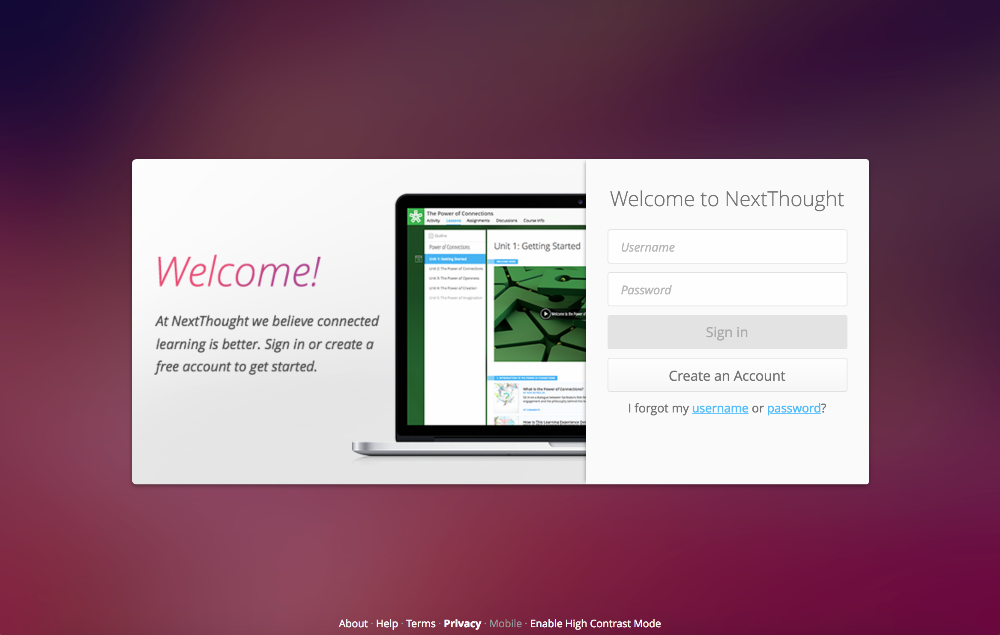

After your clients log into your site, they will land on the **homepage**. From this page they can click "+Add" to view the catalog and add a new course or training. 

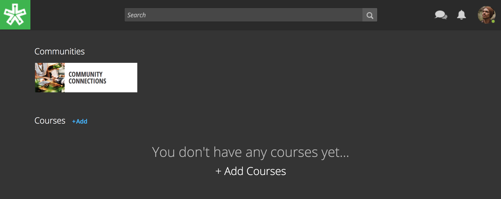

Once the **course** has been added, it will appear on their homepage. Clicking on it will launch the course.

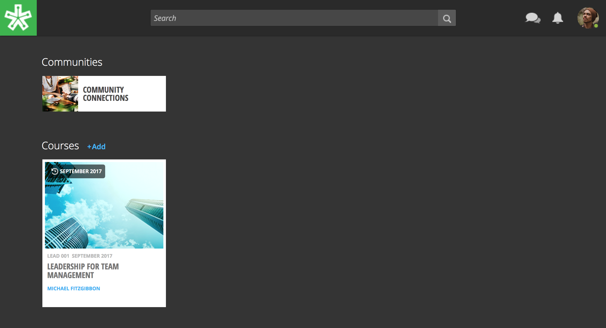

You will also see a **community** on the homepage. Think of the community as a public meeting room or forum for users to gather and discuss trends, hot topics, best practices, ask questions, and more. Click on the community to view it.

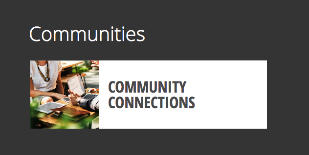

.. note:: Find out more about communities here: https://help.nextthought.com/guide/part4.html#connect-on-the-community-page

Your Tools
---------------------

Now, if NextThought added you as an "Admin," you will have administrative access to your site. You can view your **admin dashboard** detailing analytics about the site, as well as create new courses. 

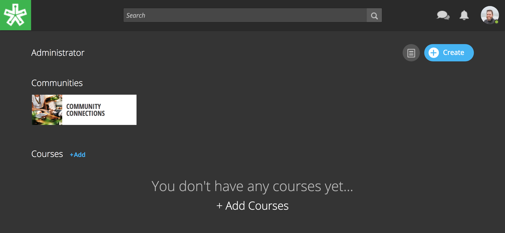

See this dashboard here? Click on the first icon to view your dashboard. Click on the second icon to create a new course. Did you know you can also grant users admin access to help you manage your site?

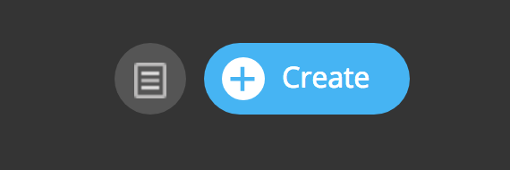

.. note:: Find out more about your admin tools here: https://help.nextthought.com/adminguide/admindash.html

Create a Course
---------------------

Let's create your first course. Start by clicking the blue "+ Create" button in the upper right-hand corner of your homepage. Click "Course" in the dropdown.

Click on the "Blank" creation type. Click "Continue."

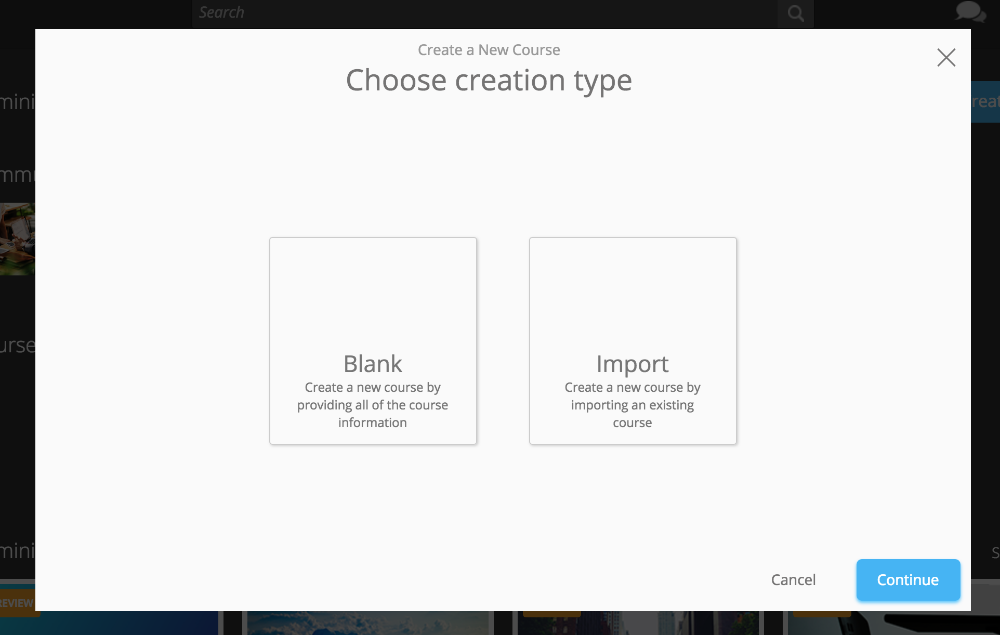

Fill out the course title, ID, and desciption. Please note that you can edit these fields later. Click "Continue."

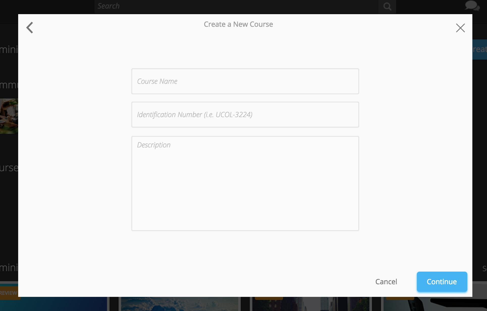

Now, you've landed on your Course Info page within the newly created course. Scroll through the page and click "Edit" as needed to edit a field. You can also add instructor access from this page. 

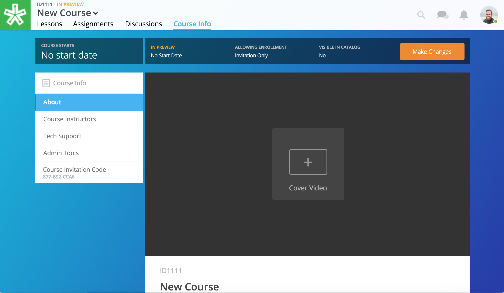

Don't forget to check your course settings by clicking on the "Make Changes" button in the upper right-hand corner! We will talk more about this in the **Launch and Go Live!** section below.

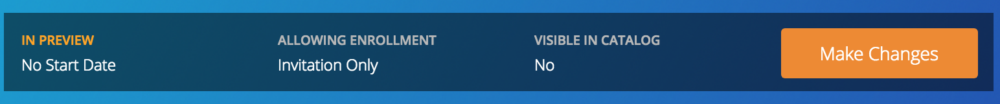

.. note:: Learn more about course creation here: https://help.nextthought.com/adminguide/createcourse.html

Add Course Content
---------------------

From your Course Info page, click on over to the "Lessons" page. In the bottom right-hand corner, click "Start Editing."

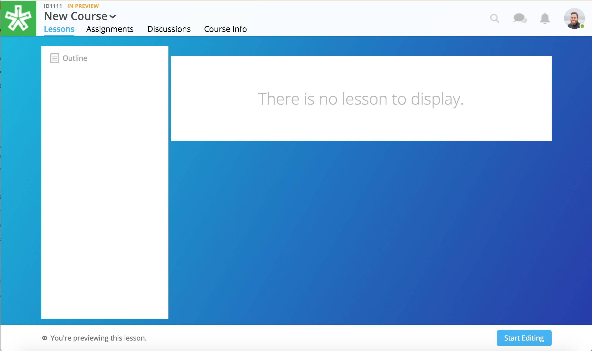

Now, click "+Add Unit" in the bottom left-hand corner. Type in a unit name, and press the "Enter" key.

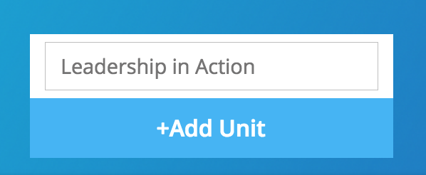

Click "+Add Lesson." Type in the lesson name, and press the "Enter" key.

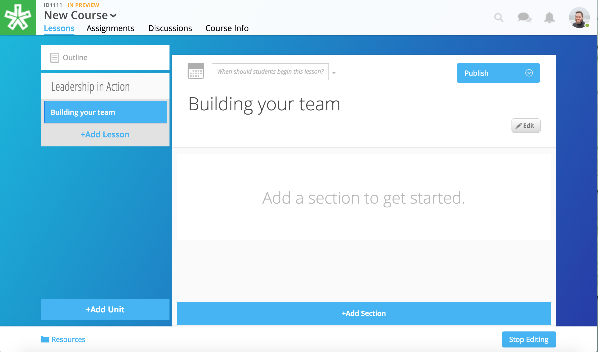

Click "+Add Section." Type in a section name. Click "Add to Lesson."

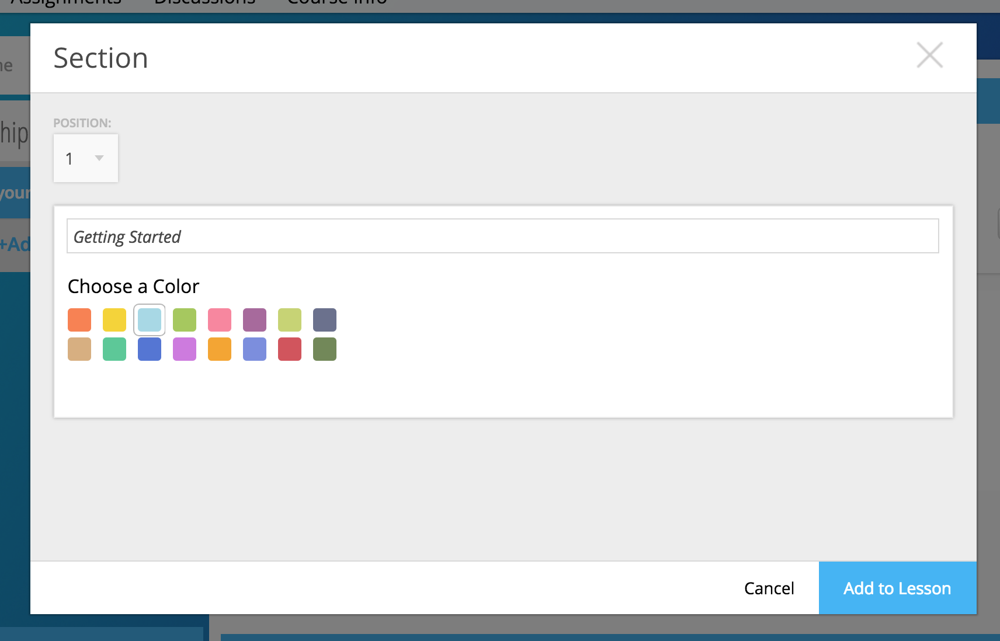

Click "+Add Content" to begin adding content to your course.

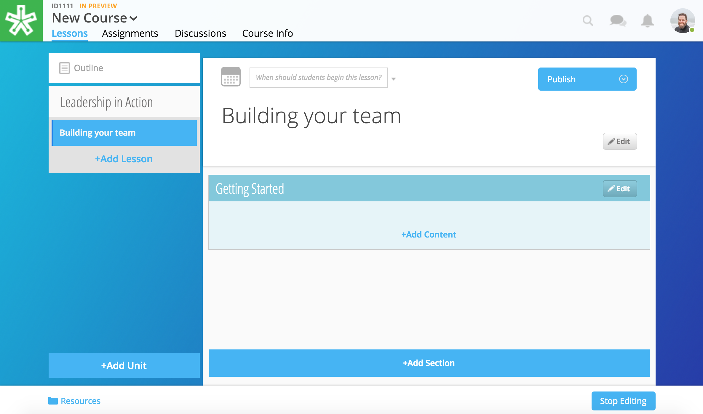

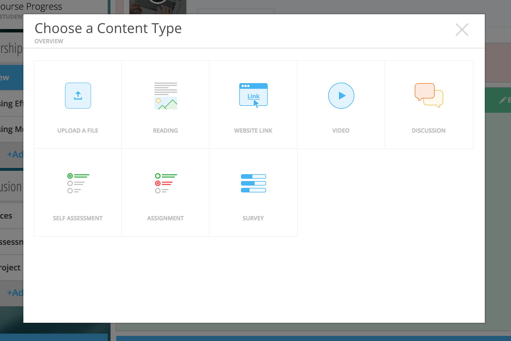

Once you've built out an entire lesson, don't forget to publish or schedule your lesson so it's visible! The publish button can be found in the upper right-hand corner of the lesson in Edit Mode.

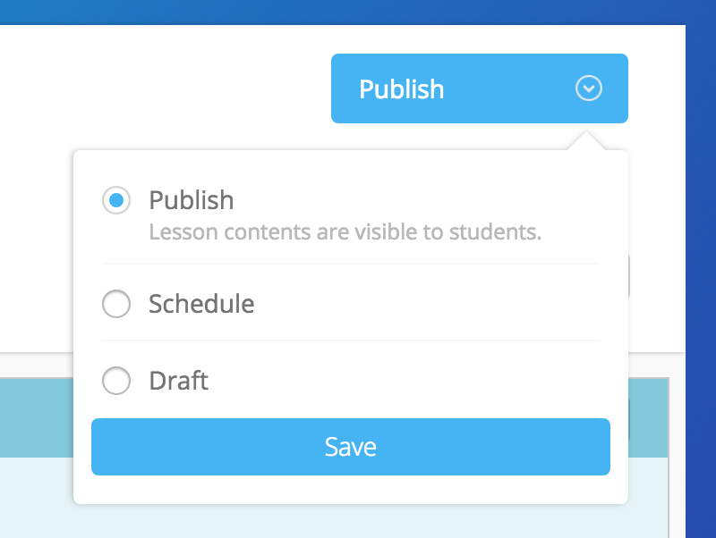

.. note:: Learn more about building your course and adding content here: https://help.nextthought.com/editorguide/index.html

Launch and Go Live!
----------------------

You're ready to launch the site and begin marketing your courses.

Before you do, use this checklist to see if you're ready:

- Your site is branded with your logo in the upper left-hand corner.
- The community on the homepage has a name and image. 
- Click into the course you want to launch and make sure you see the lessons you expect to see while previewing the course.
- Check that your courses are set to the right visibility. Click into each course from the homepage. Click on the "Course Info" page. Check the start date. Now, click on the "Make Changes" button. Check the visibility and preview settings. 

  - **Visible in Catalog:** This toggle allows you to place the course in the catalog publicly ("On"), or keep the course private ("Off"). If a course is private, users will only enroll using a redemption code. Private courses will be by invitation only.
  - **Preview Mode On:** This option sets the course to course preview mode, meaning that users can only view Course Info but cannot view course content.
  - **Preview Mode Off:** This option allows the course to be fully available to users.
  - **Based on Start Date:** This option sets the course to be in course preview mode until the defined start date and time, at which time it will then become fully available to users.
  
  

**If you've done the items above, and checked with your Project Manager, CONGRATULATIONS! You're ready to launch!**
