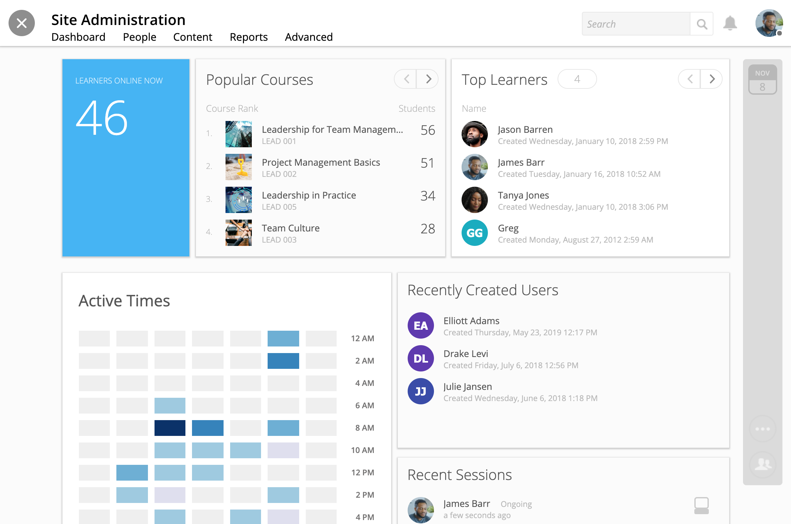

====================
Your Admin Dashboard
====================

Your admin dashboard offers you a snapshot of what's happening on your site. 

To navigate to your dashboard, click on the Admin Panel in the upper right-hand corner of your homepage.

.. image:: images/adminpanel.png

Your Dashboard
==============

Your dashboard tab opens by default within the suite of admin tools. 

The dashboard offers visual analytics of

- Learners Online Now
- Popular Courses
- Top Learners
- Recently Created Users
- Recent Sessions
- Active Times
- Most Popular Times
- Daily Activity

