===============================
Community Creation and Editing
===============================

This guide will walk you through creating and editing a site community.

The site community offers a space for site-wide collaboration and engagement. Site communities can be exclusive or public, and allow members to post topics and comment on others’ posts. Members can also share notes from their courses to the site community page.

.. note:: Community creation is editing is reserved solely for the site admin role.

Create a Community
==========================================

**To create a new community:**

1. Click on the "Create" button in the upper right-hand corner of your admin account.

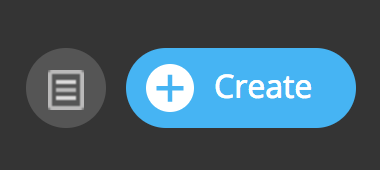

2. Select "Create a Community" in the dropdown menu.

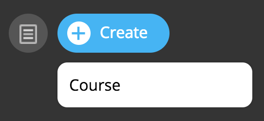
   
3. Type a community name, and toggle Auto-Subscribe. (You can edit
   this later.)  Auto-Subscribe will automatically join all individuals
   that create an account on the site. Please note that learners already
   on the site will have to be manually added.

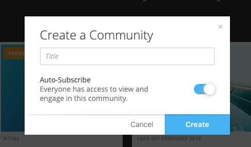

4. Click “Create.”

Site Community Name and Description
==========================================

You can edit the community name and description of any existing community on your site.

To edit the name or description:

1. Click into the community.
2. Click the “Edit” button under the community name.
3. Click into the “Title” field to edit the title.
4. Click into the “Description” field to add or edit the description.
5. The description will display below the name of the community within the community page.

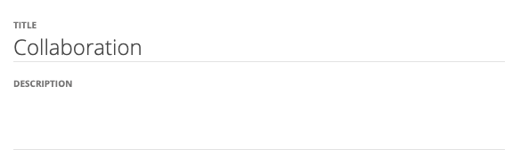

6. Click “Save.”

Site Community Channels
==========================================

Channels offer community organization and allow separate focused spaces for collaboration. To create a new channel:

1. Click into the community.
2. Click the “Edit” button under the community name.
3. Click “Create a New Channel.”
4. Type a new title and description.
5. Note that the All Activity channel will remain by default.

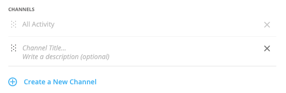

6. Click “Save.”

Site Community Auto-Join New Users
==========================================

Channels allow auto-joining of learners on the site upon account creation. Please note that previous learners will not automatically join unless manually added. See Site Community Membership to learn more.

To toggle Auto-Join:

1. Click into the community.
2. Click the “Edit” button under the community name.
3. Click the toggle “Auto-Join New Users” to desired state.

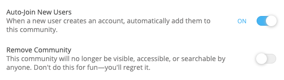

4. Click “Save.”

Site Community Image
==========================================

Change the main image or background image for your community. To add or edit images:

1. Click into the community.
2. Click the “Edit” button under the community name.
3. Click on the “Edit” button for either the main (front) image or background (back) image.

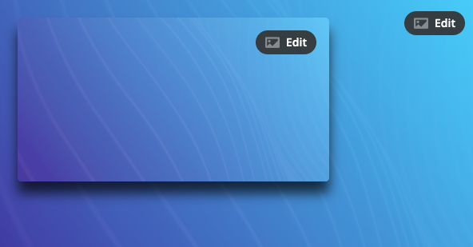

4. Choose image, solid, or gradient.

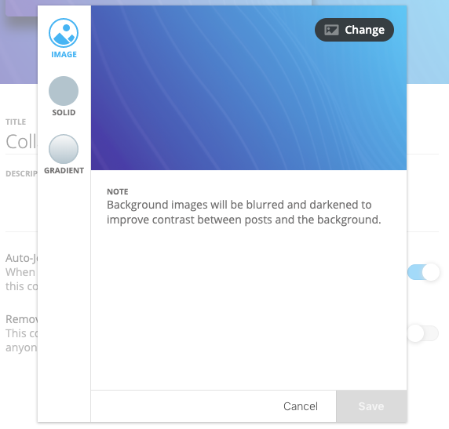

5. Make selections or upload your image after selecting “Change.”
6. Click “Save.”

Site Community Membership
==========================================

Manage site community membership by adding or removing individuals, or adding or removing everyone.

To edit membership:

1. Click into the community.
2. Click “Manage Members.”
3. In this window, you can add and remove learners from the site community.

Search for an individual, and click on their name to add them to the community.

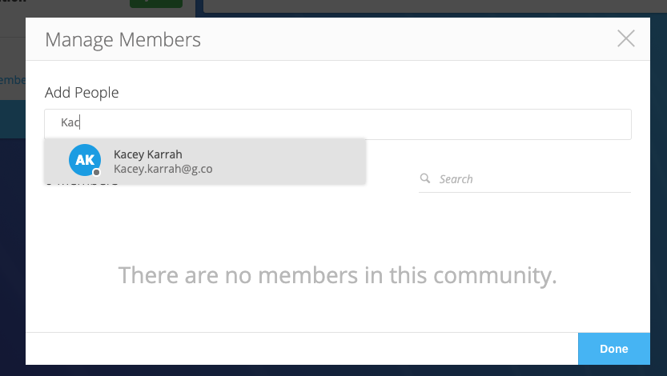

Click into the search field and select “Everyone” to add all site learners to the community.

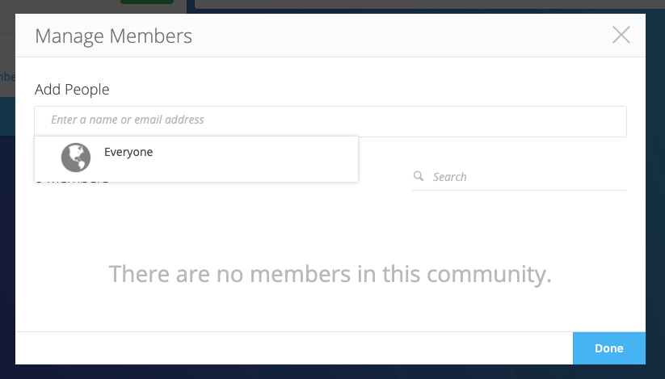

Check their name in the list and select “Remove” to remove a member.

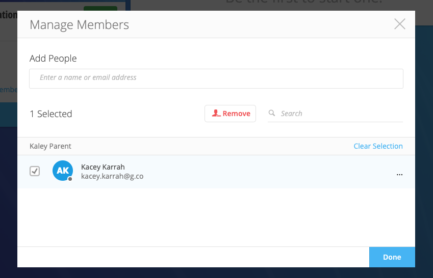

Click on the ellipsis next to the number of members to “Remove All Members” from the community.

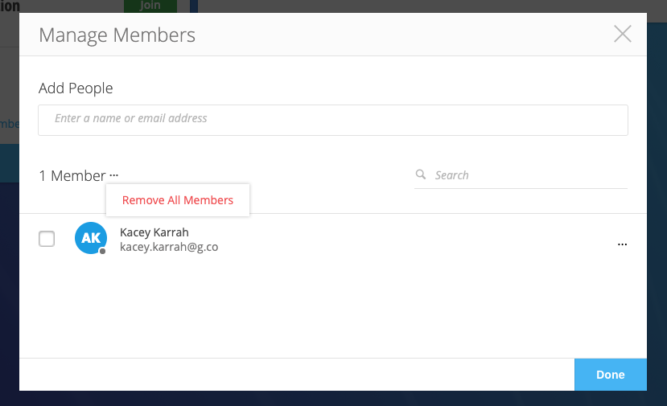
