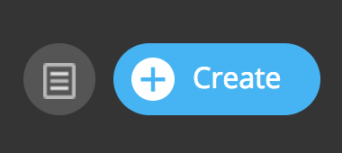
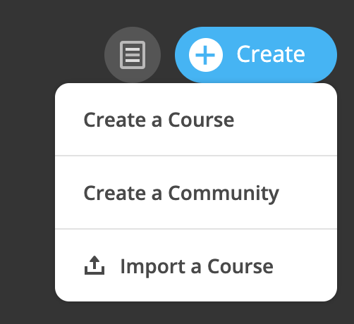

=================
Create a Course
=================

To create a new course:

1. Click on the "Create" button in the upper right-hand corner of your admin account.

2. Select "Course" in the dropdown menu.

3. Select "Blank" and "Continue" to create a new course.

4. Now, add the course title, a course ID, and a description. Click "Continue." 

.. note:: You can come back to edit these fields at any time.

5. Click through the tabs and fill out each as needed. Click "Save" if you make any changes. 

- **Day & Time:** This displays days and times that users should be online or in-person to meet. You can leave this empty if you do not wish to specify.
   
- **Course Dates:** The course dates display when the course starts and ends. The start date informs users when to begin participating in the course, and the end date notifies users of when the course should be completed or is no longer active.

6. Review your **Course Settings**.

   
- The **public toggle** allows the course to be either public or private. Private courses will not display in the course catalog and are by invitation only. Private courses must be "redeemed" with a course code. Preview allows anyone to enroll in the course that creates an account on the site.
   
- The **preview toggle** allows the course to be in "Preview Mode" before it officially starts. This means that when a user enrolls in the course and clicks on the course from their homepage, they will only see course information, and will not be able to see any course content or discussions until the course officially starts. 
   
.. note:: **Tip:** Enable Preview Mode if you wish to begin marketing the course and enrolling users while still building your course.

7. Once you have created your course, click on the "x" in the upper right-hand corner to close out of the course options. Now you can find your course on your homepage under "Administered Courses." 

.. note:: Please see "Edit a Course" in the Admin Guide to edit any of the fields mentioned above, or to add course facilitators.
