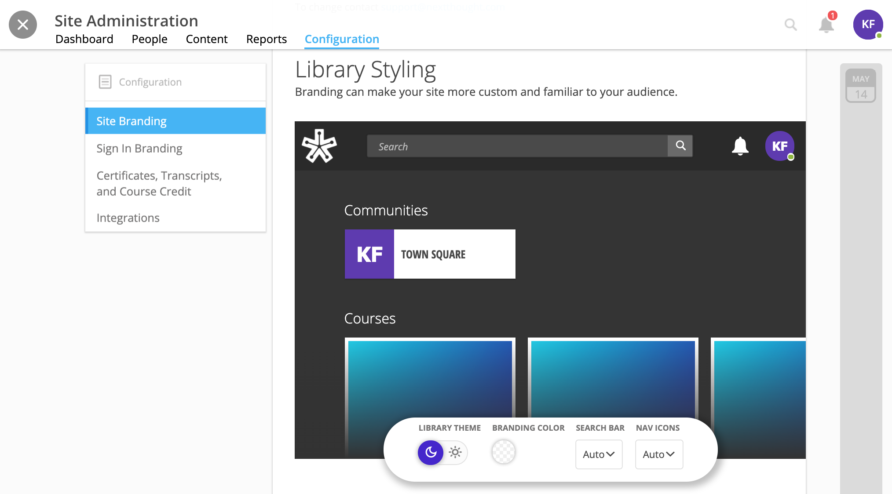
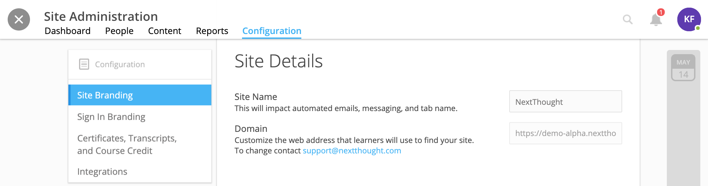
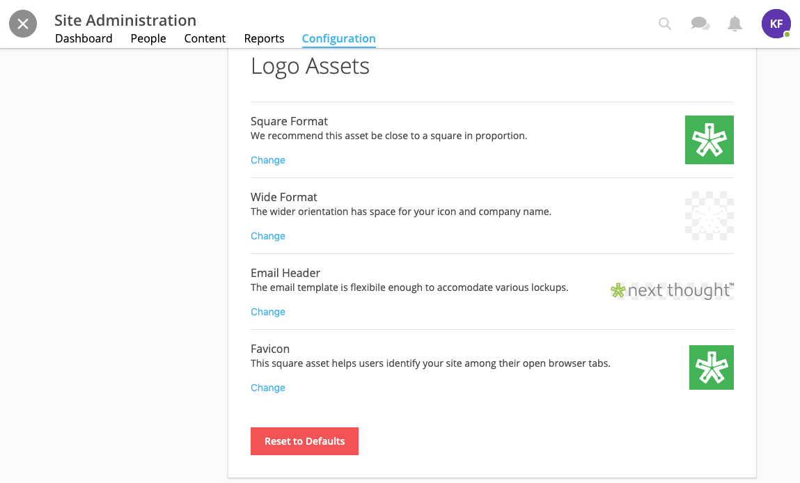
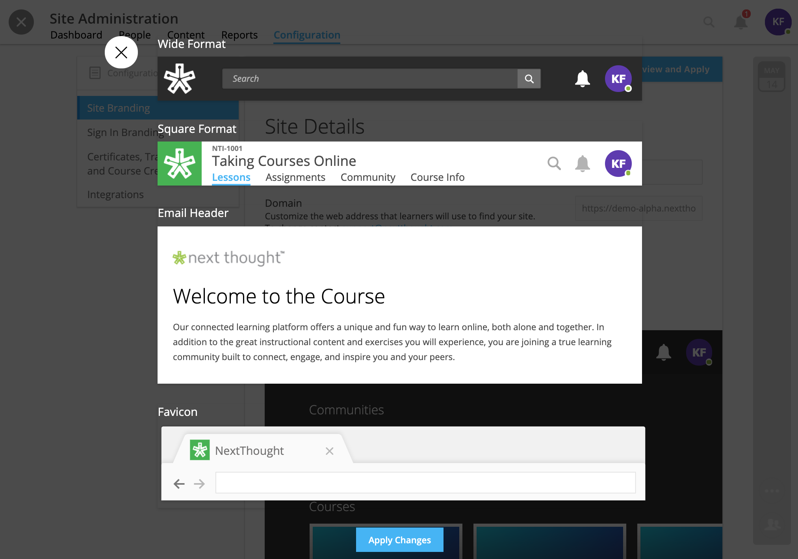
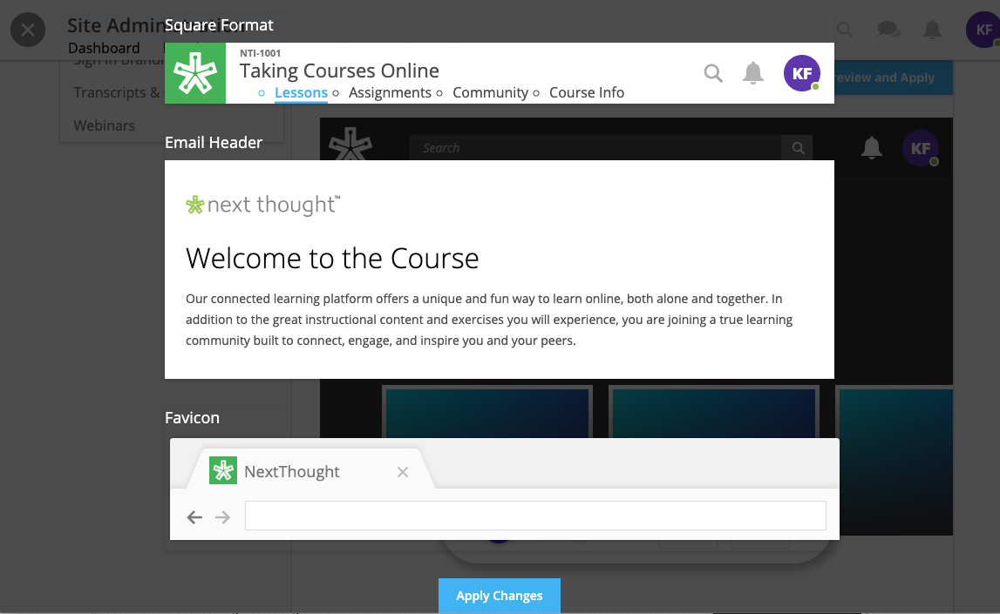
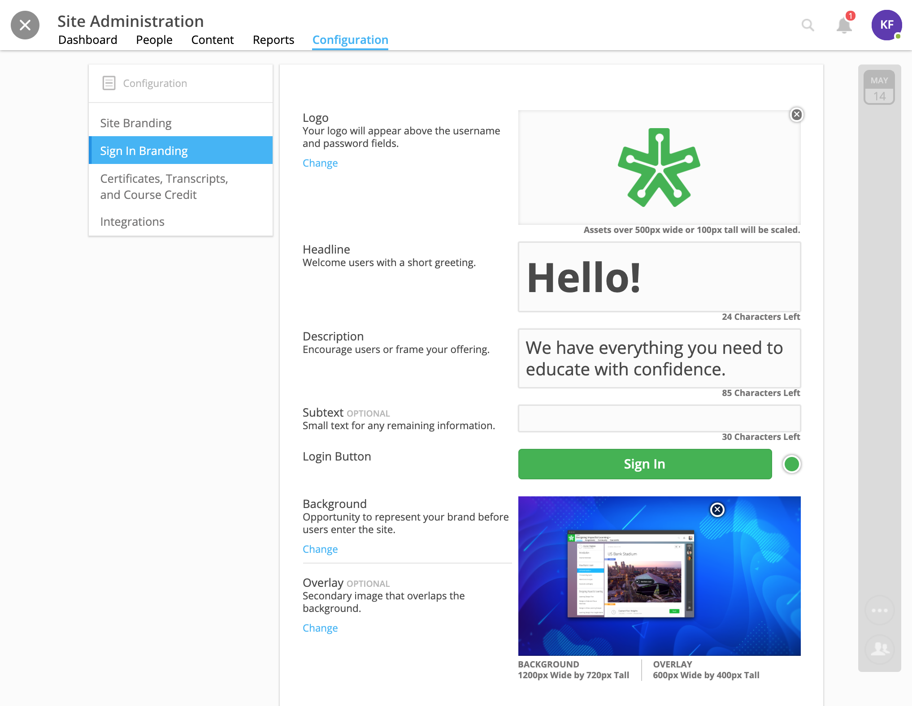
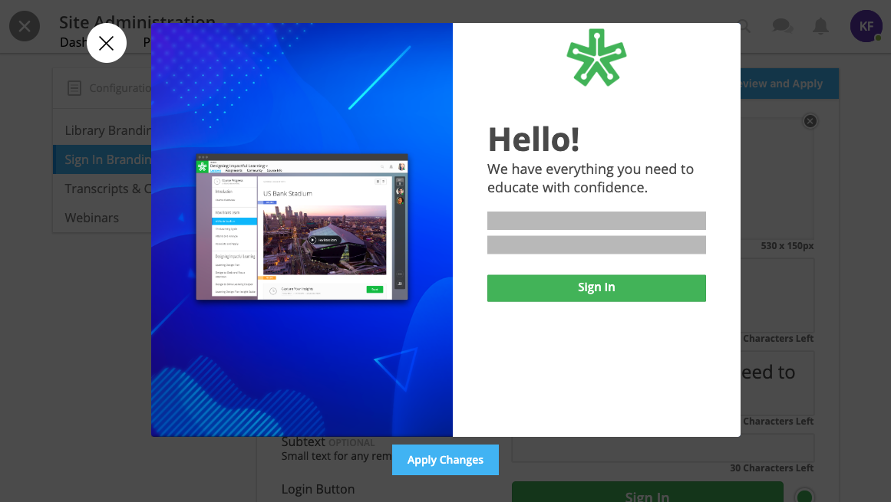

========================================
Customize Site Branding and Login Page
========================================

Customize your site to your brand.

Within the “Configuration” tab of the admin tools, site admin can update the

- Library Theme (dark/light)
- Site Branding Color 
- Search and Navigation Icon Theme
- Site Name
- Logo Assets
- Email Header
- Favicon
- Sign In Logo
- Sign In Headline, Description, and Subtext
- Login Button Color
- Login Button Imagery

Library Branding
==================

To add and update the library, go to the site administration tools in the upper right-hand corner on your homepage. Click on the “Configuration” tab, and select the “**Library Branding**” subtab to the left.

The **Library Styling** menu allows you to change the **Library Theme** from light (nearly white background) to dark (black background). The **Branding Color** can be changed to any hex color and changes the color of the top navigational bar (when on home screen). **Search Bar** and **Navigation Icons** can also be changed to the light or dark theme.

The **Site Details** menu allows you to change the site name. The site name displays across the platform within emails as well as reports.

The **Logo Assets** menu allows you to change your **Site Logo** (either in a square or wider format) that appears in the upper left-hand corner, your **Email Header** that appears in all emails from the platform, and the **Favicon** that appears within your browser’s tab.

To apply any changes you’ve made, click the “Preview and Apply” button in the upper right-hand corner. This button will only appear if changes have occurred. 

Review your changes and click “Apply Changes.” To return to the previous state before your updates, click “Cancel.” To reset the branding to default, click “Reset to Defaults” at the bottom of the menus.

Sign In Branding
==================

To add and update the sign in page, go to the site administration tools in the upper right-hand corner on your homepage. Click on the “Configuration” tab, and select the “**Sign In Branding**” subtab to the left.

To update or add your **logo**, click on the “Change” button under “Logo” and choose your file.

To update the **headline, description, or subtext** (optional), click into the text field and edit.

To update the **Login Button color**, click on the color gradient and choose either the color or define the hex color.

To change the **Background or Overlay**, click on the “Change” button and select your file.

To apply any changes you’ve made, click the “Preview and Apply” button in the upper right-hand corner. This button will only appear if changes have occurred. Review your changes and click “Apply Changes.” To return to the previous state before your updates, click “Cancel.” To reset the branding to default, click “Reset to Defaults” at the bottom of the menus.

