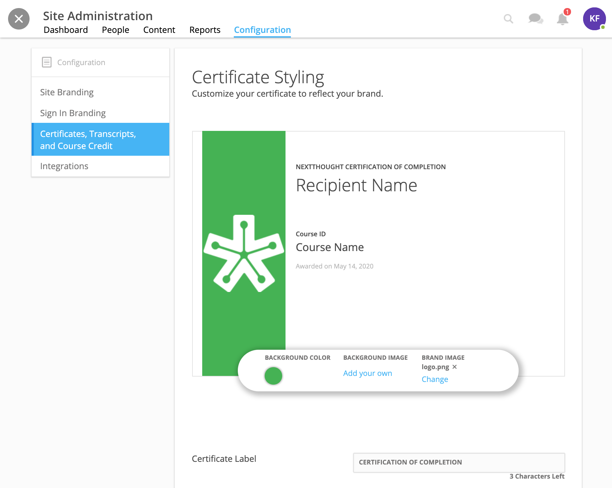
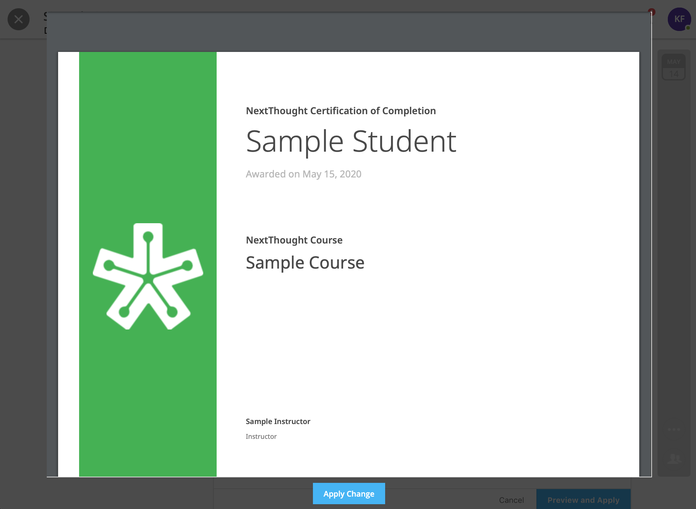

=========================================
Customize Course Completion Certificate
=========================================

Customize your course completion certificate for your site.

Custom Certificate
===================

To customize the completion certificate,

1. Click on your Admin Panel
2. Click on the Configuration tab.
3. Click on the “Certificates, Transcripts, and Course Credit” subtab to the left.

Here you can choose the background/gradient color or add a background image, as well as add your brand logo.

You can also change the label name of the certificate.

.. note:: The “Site Name” will appear before the label. You can change the “Site Name” under the Site Branding subtab to the left.

.. note:: If your site already has a custom branded certificate, you will be able to view the certificate, but be unable to change it. Please contact Support or your Project Manager if changes need to be made.

To apply any changes you’ve made, click the “Preview and Apply” button. This button will only appear if changes have occurred. 

Review your changes and click “Apply Changes.” 

