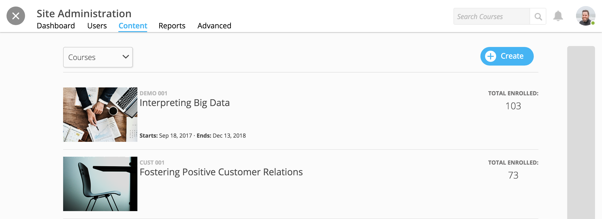
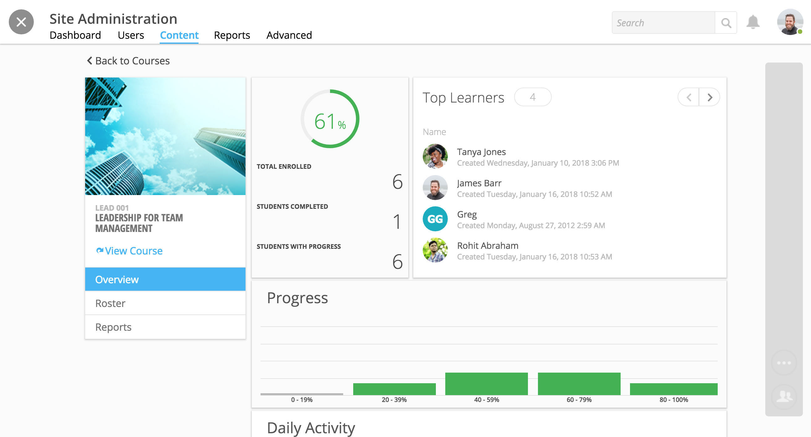
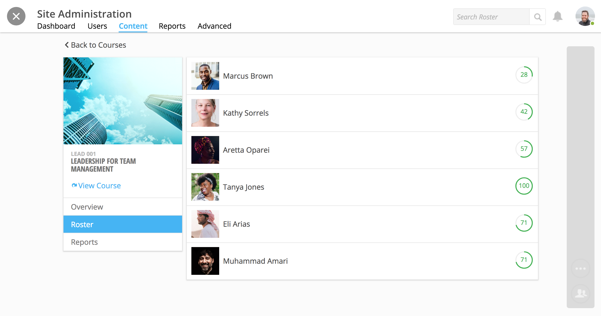
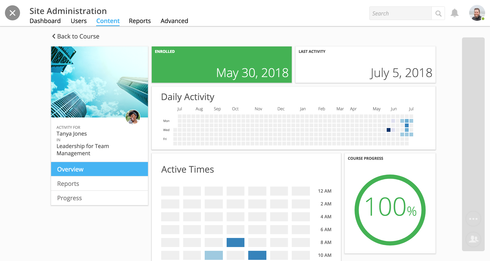
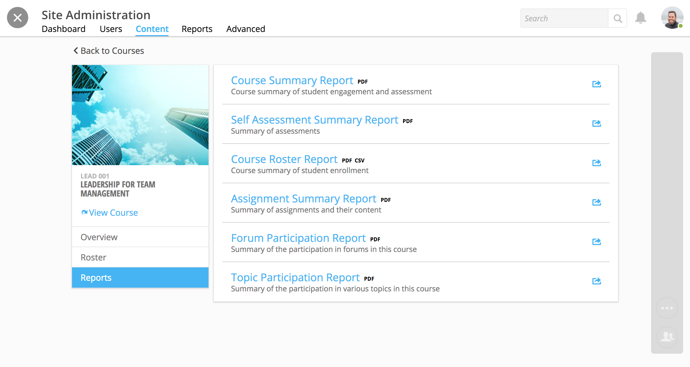

=================
Manage a Course
=================

Manage a course from your admin tools. View and search all courses in one place, view enrollments and course activity, rosters, and reports. 

.. warning: If you would like to edit course information, facilitators, credit, or more, please see "Course Creation and Setup" here: https://help.nextthought.com/adminguide/createcourse.html

View and Search all Courses
============================

View and search all your courses within your admin tools. 

1. On your homepage, click on the admin toolbar icon in the upper right-hand corner.

.. image:: images/adminbutton2.png

2. Click on the "Content" tab.

The **Content Tab** offers a list of all courses on the site. Click in the "Search Courses" field in the upper right-hand corner to find a course. Begin typing in the title of the course to see search results. Click on a course to manage.

Once you select a course, you can view three tabs:

- Overview
- Roster
- Reports

Course Overview
=============================================

The **Overview tab** is the default view once you select a course in your admin tools.

Widgets include:

- Enrollment
- Learner Progress
- Top Learners
- Daily Activity
- Active Times
- Most Popular Time

Course Roster
===================

The **Roster tab** allows you to:

- View a list of enrolled learners
- View learner progress
- Access detailed learner reports pertaining to the course

Click on a learner within the course to view their

- Activity
- Active Times
- Progress
- Reports

.. note:: Selecting a learner inside your course roster will only offer information on the learner pertaining to the course. If you want to view learner site activity and progress, you will need to navigate to your admin tool's Users tab. See more information here: https://help.nextthought.com/adminguide/managesiteusers.html

Course Reports
=================

The **Reports tab** allows you to view:

- Course Summary Report
- Self Assessment Summary Report
- Course Roster Report
- Assignment Summary Report
- Forum Participation Report
- Top Participation Report

Select a report to view, download, or print.

