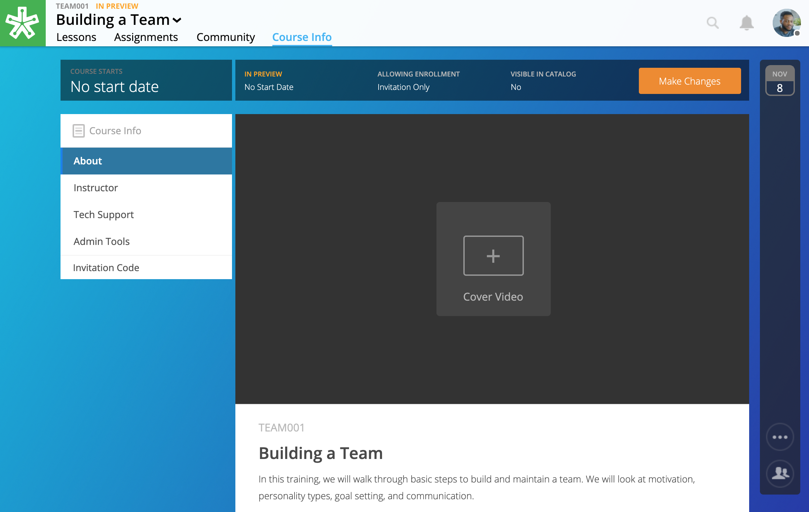
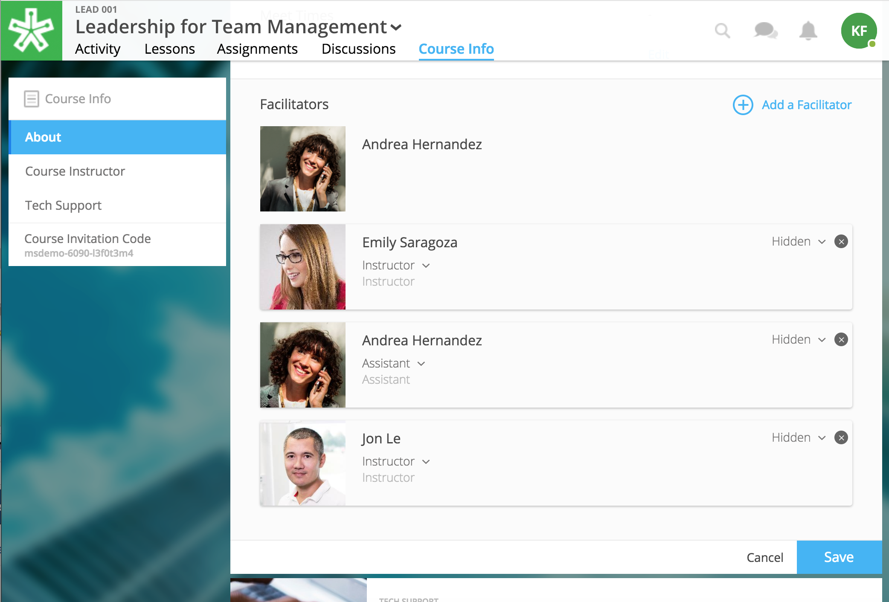
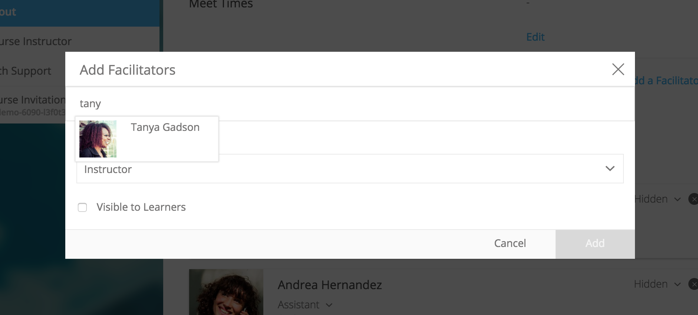

=================
Manage a Course
=================

Manage a course from your admin tools. View and search all courses in one place, view enrollments and course activity, course rosters, and reports. You can also edit course information and manage course facilitators.

View and Search all Courses
============================

View and search all your courses within your admin tools. 

1. On your homepage, click on the admin toolbar icon in the upper right-hand corner.

.. image:: images/adminbutton2.png

2. Click on the "Courses" tab.

The **Courses Tab** offers a list of all courses on the site. Click in the "Search Courses" field in the upper right-hand corner to find a course. Begin typing in the title of the course and click enter to search.

.. image:: images/admincourses.png

Review Course Activity, Roster, and Reports
=============================================

Within the "Courses" tab, select a course in order to view:

- Total Enrollments
- Daily Activity
- Active Times
- Most Popular Time
- Course Roster
- Course Reports

.. image:: images/admincourse.png

Edit Course Information
========================

Opening a course allows you to edit all course information, add course tags, and manage facilitators.

To open a course,

1. Navigate to your homepage.
2. Find the course under "Administered Courses." If you have many courses, you may need to click "See All" to view others.
3. Click on the course.
4. Click on the "Course Info" tab.

From this tab, you can edit, add, or update:

- Course Video
- ID
- Title
- Description and Tags
- Assets
- Prerequisites
- Start Date
- End Date
- Meet Times
- Facilitators

You can also review your enrollment code here.

To edit a field, click the "Edit" button. Make your changes and be sure to click "Save" to submit your changes.

Manage Course Facilitators
===========================

Manage course facilitators from the Course Info tab within a course.

To add, edit, or remove course facilitators, click on the "Edit" button within the "Facilitators" section of the Course Info tab.

Manage Current Facilitators
----------------------------

Once you select "Edit," course facilitators will display. Manage current facilitators using the role dropdown, or remove them entirely using the "x" button. 

Toggle visibility using the dropdown menu. **Visible** allows their name to be visibly mentioned as a course facilitator when users view the course. **Hidden** facilitators will not be visibly mentioned as a course facilitator when users view the course.

Add a Facilitator
-------------------

To add a course facilitator,

1. Click the "+ Add a Facilitator" button.

2. Begin typing the name of the facilitator in the "Add users" field. Select the user from the search hits. 

.. note:: The user must have already created an account on the site. You can only search current members of the site.

3. Assign a role:

- **Instructor:** Editing and Managing. An instructor can create the course outline, create and place content, and manage the course (view student discussions, assignments, and reports). The instructor acts as both **editor** and **assistant** as defined below.
- **Editor:** Editing only. An editor can create the course outline as well as create and place content. They cannot manage the course or view student activity or work.
- **Assistant:** Managing only. An assistant can manage the course, but cannot create the course outline or content.

.. note:: These assigned "roles" will not be visible to the user.

4. Choose visibility.

- **Visible:** Allows their name to be visibly mentioned as a course facilitator when users view the course. 
- **Hidden:** Facilitators will not be visibly mentioned as a course facilitator when users view the course.

5. Click "Add."
6. Scroll down the list of facilitators and click "Save."

