==================
Manage Site Users
==================

Search, view, and manage all site users within your admin tools. View learner activity, award credit, view transcripts and reports, and more.

1. On your homepage, click on the admin tools icon in the upper right-hand corner.

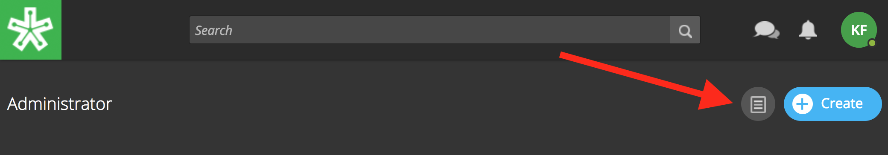

2. Click on the "People" tab.

The **People Tab** offers a list of all users on the site. Click in the "Search Learners" field in the upper right-hand corner to find an learner. Begin typing a name to view results.

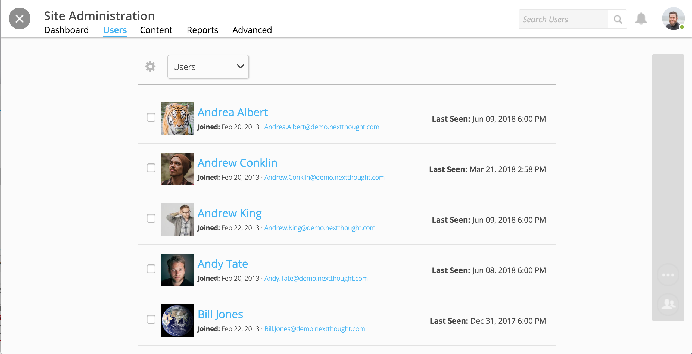

Manage Site Admin
=================

**Site admins** have access to admin tools, can create courses, manage site courses and learners, view reports, award credit, integrate with other services, and invite people to join the platform.

**To add a site admin:**

1. Select your "People" tab in the admin tools.
2. Search for a site user in the upper right-hand corner, and select the check box next to the user's name.
3. Click "Change Role."

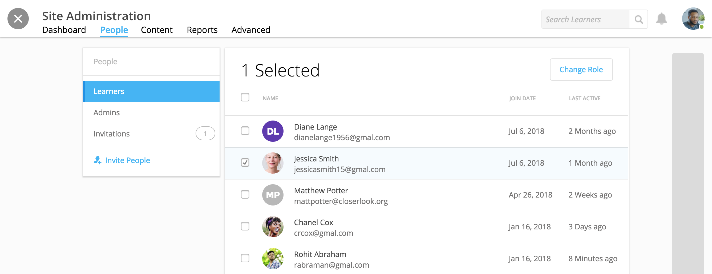

4. Select "Administrator."
5. Select "Save."

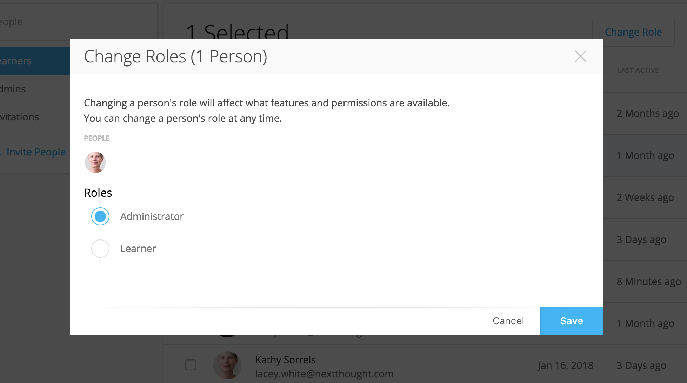

If you want to invite an individual to the platform as an admin that does not yet have an account, see the "Invite User to Platform" directions below.

.. note:: If currently logged in, a new admin may need to refresh their browser to view their admin tools. 

**To remove a site admin:**

1. Select your "People" tab in the admin tools.
2. Select the "Admins" view.
3. Search for the admin in the upper right-hand corner, and select the check box next to the admin's name.
4. Click "Change Role."
5. Select "Learner."
6. Select "Save."

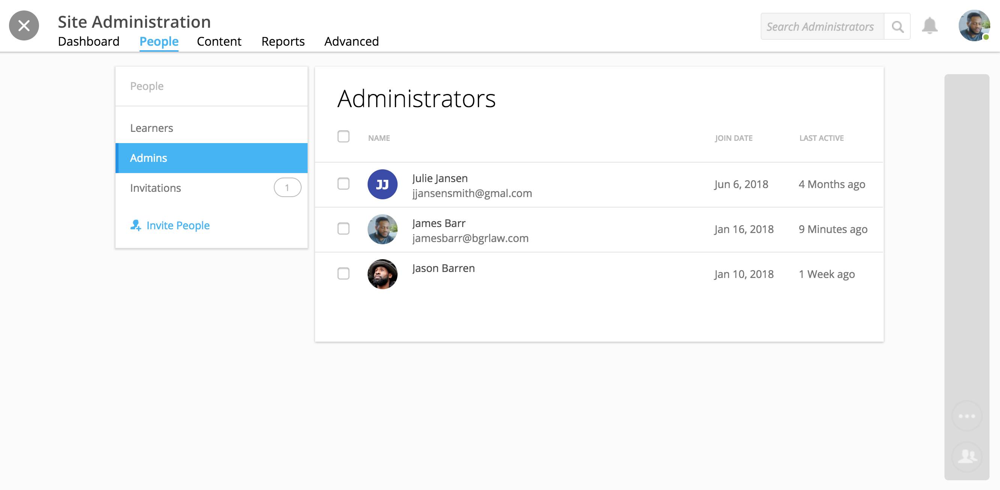

Invite User to the Platform
============================

Administrators can invite learners or admins to the platform. 

**To invite learners and admins to the platform:**

1. Visit the "People" tab.
2. Select "Invite People."

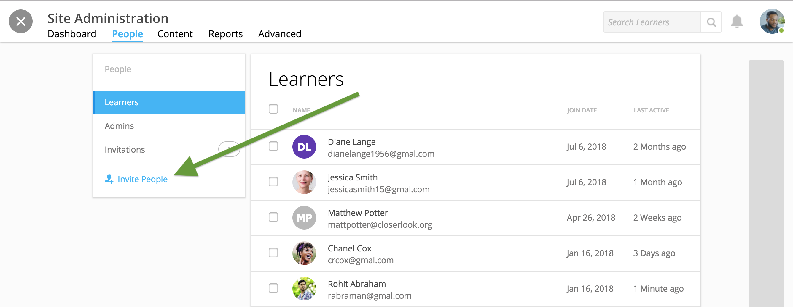

3. Add the email address(es) and assign a role.

.. note:: If you assign an individual as an "Administrator," they will immediately have admin access upon account creation.

4. Write a personal message.
5. Click "Send."

NextThought will send your message along with a link to create an account.

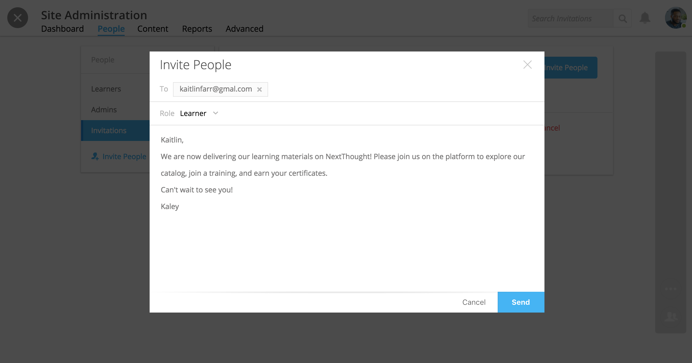

**To view invitation statuses:**

1. Visit the "People" tab.
2. Select "Invitations."

Here you can view the invite date and status of all those invited to the platform. 

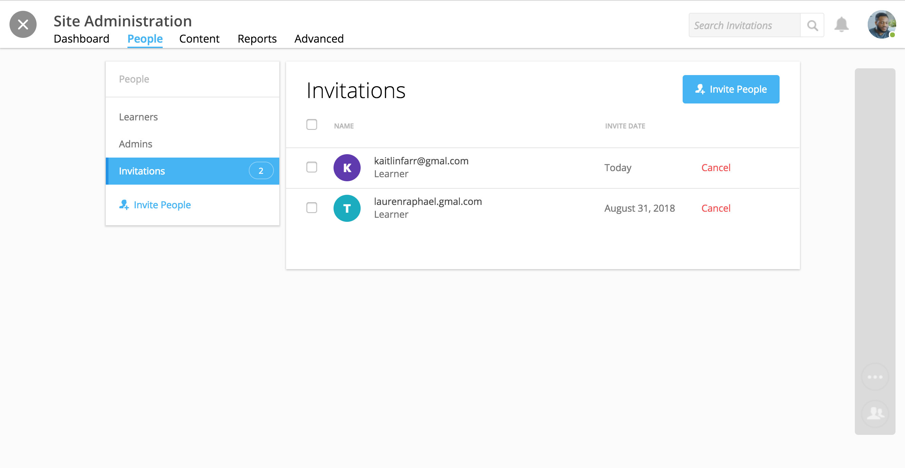

Learner Overview
=================

**Select a learner** in the "Users" tab in order to view:

- Joined Date
- Last Login
- Daily Activity
- Active Times
- Recent Sessions
- Most Popular Time

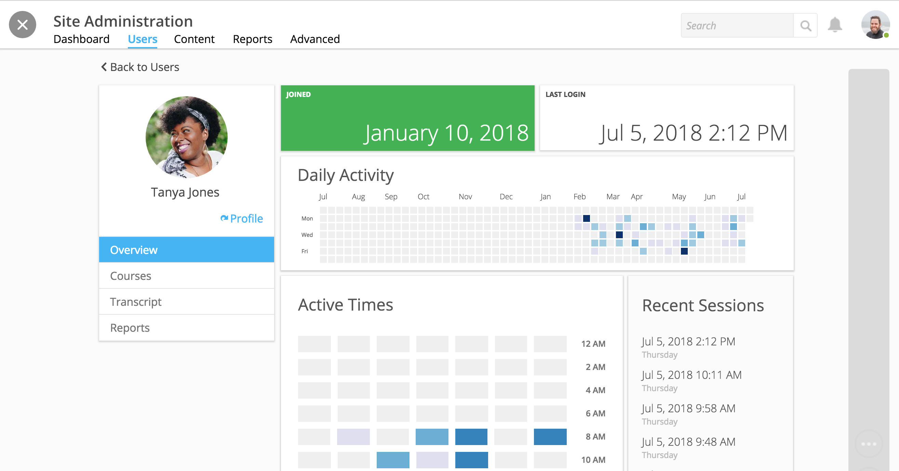

Navigate to the Courses, Transcript, or Reports tab for more information regarding the user's activity across courses and to award credit.

Learner Courses
======================

A learner's "Courses" tab lists all courses in which the learner is enrolled and displays learner progress.

1. Select a learner in the "Users" tab.
2. Select the "Courses" tab.

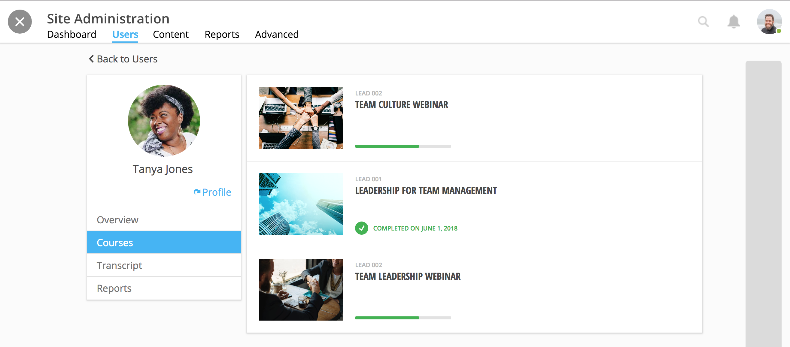

Select a course to filter the learner's activity to only the course.

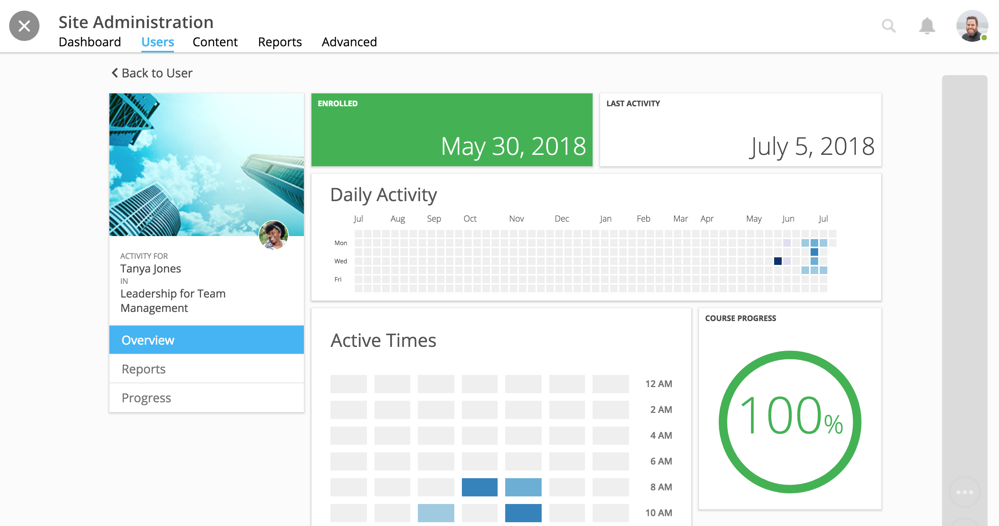

Select the "Reports" tab to view the course's Student Participation Report for the selected learner. Or, select the "Progress" tab to view completion progress through the course activity by activity.

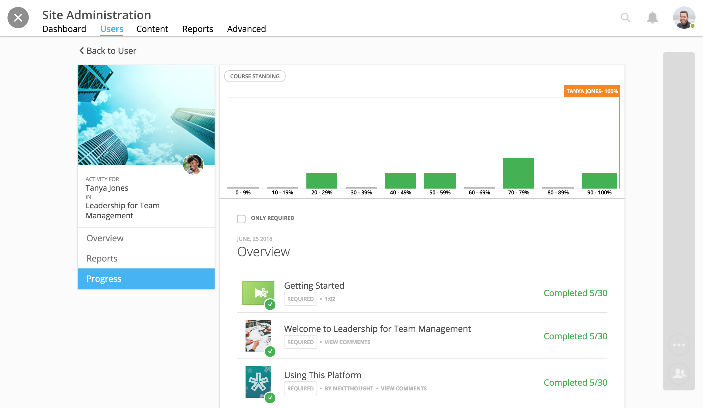

Learner Transcripts and Credit
===============================

A learner's "Transcript" tab displays the learner's credit across the site. Filter and download the transcript, as well as award manual credit.

1. Select a learner in the "Users" tab.
2. Select the "Transcripts" tab.

.. image:: images/learnertranscript.png

.. note:: Please note, the current filter is applied in downloaded transcripts. Please make sure you have the view you wish to filter before selecting "Download Transcript."

**To award credit,**

1. Click on the "Add Credit" icon.
2. Fill out Title, Issuer, Description.
3. Add an award date and credit amount.
4. Select "Add."

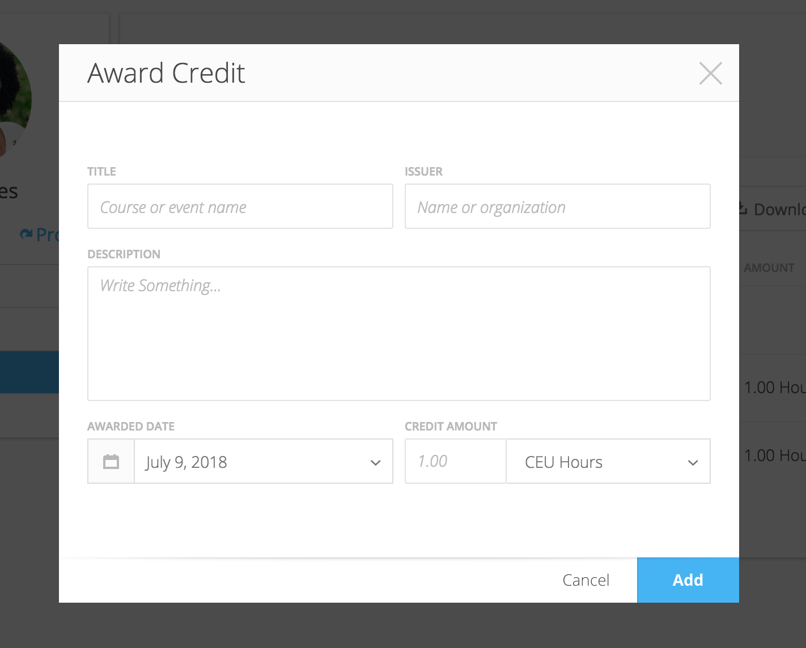

The credit should now be listed in the learner's transcript. You can edit or delete credit by clicking on the gear icon and selecting "Edit" or "Delete." Learners can view their transcript from within their profile.

.. note:: Please note, course completion can also award credit. If you'd like to automatically award credit for course completion, please see the Course Creation and Setup guide here: https://help.nextthought.com/adminguide/createcourse.html

Learner Reports
================

A learner's "Reports" tab allows access to the learner's course participation reports. Reports can be downloaded, saved, or printed.

1. Select a learner in the "Users" tab.
2. Select the "Reports" tab.
3. Select "Student Participation Report."
4. Select a course.

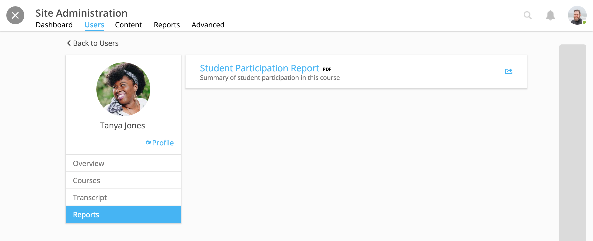

Add and Remove Group Members
=============================

Site admins have the ability to add site users to a group.

After going into the Contacts and selecting “Create a Group,” you will be presented with a window to type a group name, and automatically add group members across the site. Select “Create” to create the group.

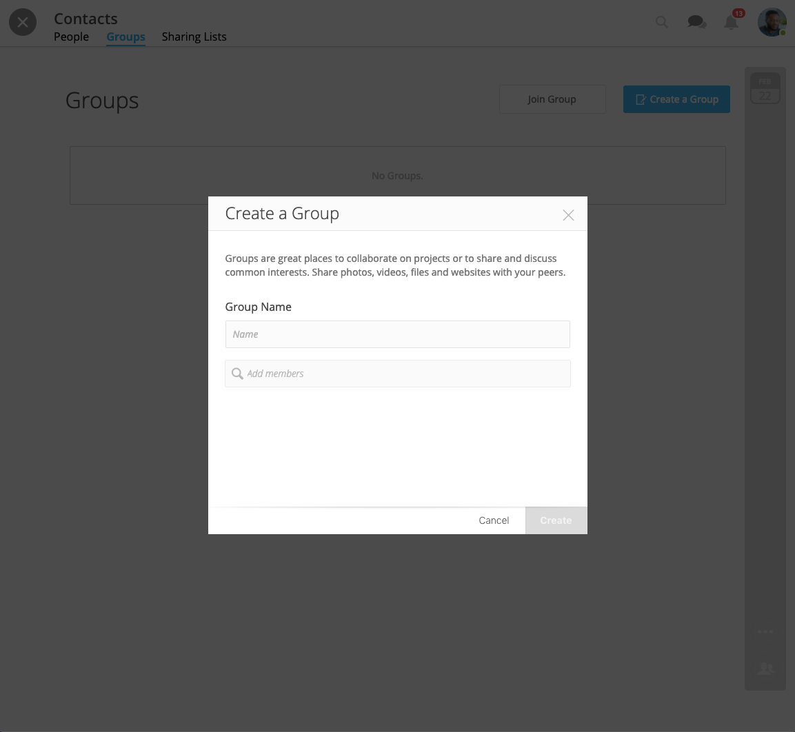

You can also choose to edit a group, and add or remove group members. Click “Save” to save your changes.

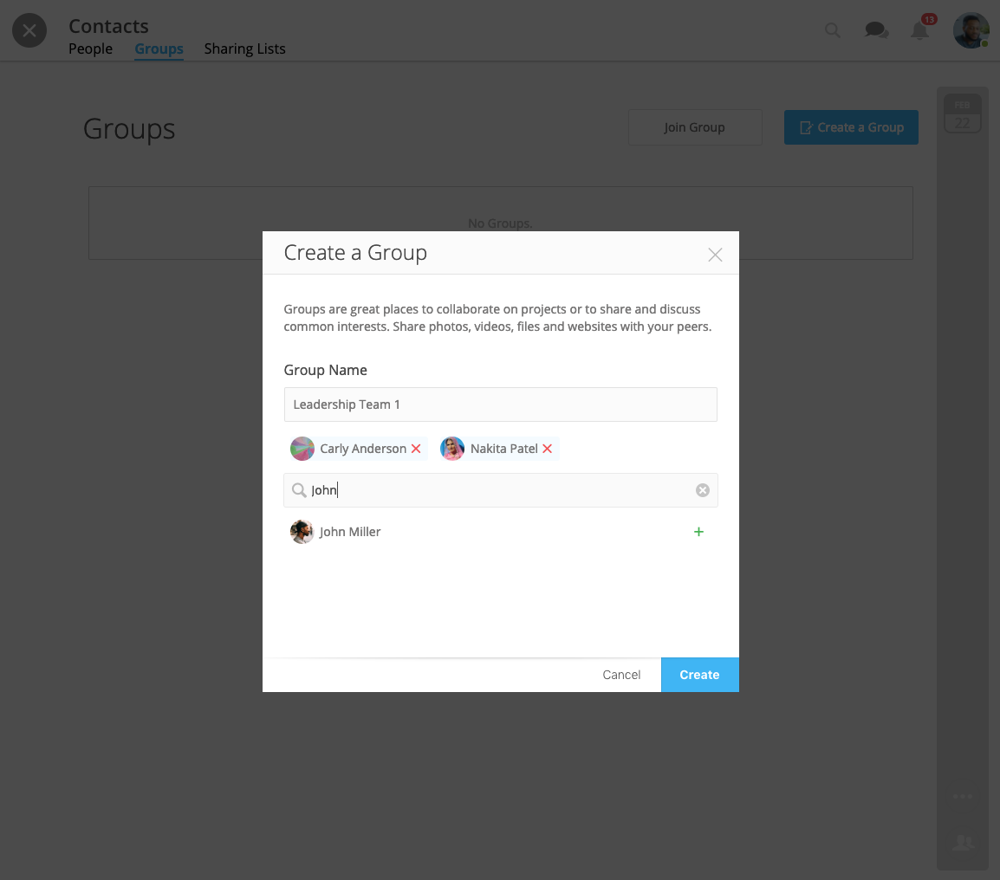