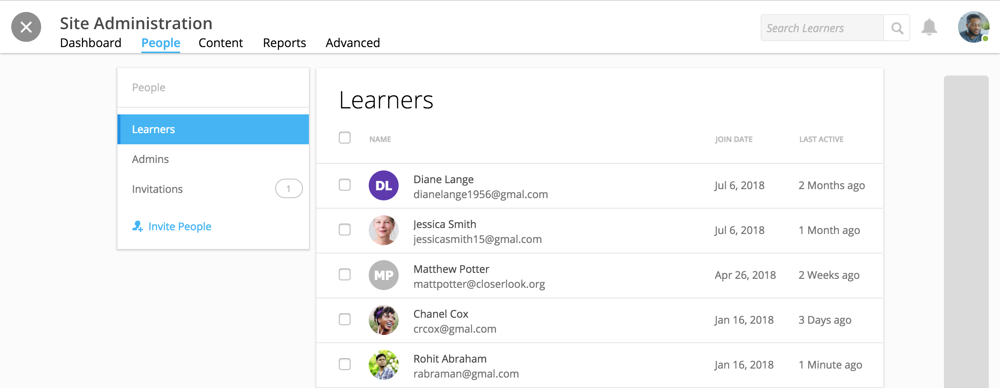
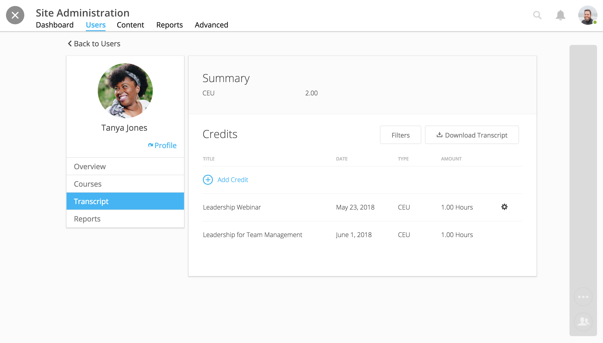

==================
Manage Site Users
==================

Search, view, and manage all site users within your admin tools. View learner activity, award credit, view transcripts and reports, and more.

1. On your homepage, click on the admin tools icon in the upper right-hand corner.

.. image:: images/adminbutton2.png

2. Click on the "Users" tab.

The **Users Tab** offers a list of all users on the site. Click in the "Search Users" field in the upper right-hand corner to find an learner. Begin typing a name to view results.

Manage Site Admin
=================

Site admins have access to admin tools, can manage site courses and learners, and award credit.

**To add a site admin:**

1. Select your "Users" tab in the admin tools.
2. Search for a site user in the upper right-hand corner, and select the check box next to the user's name.
3. Click the gear icon and "Set as Admin."
4. Confirm your selection.

.. image:: images/setasadmin.png

.. note:: If currently logged in, a new admin may need to refresh their browser to view their admin tools.

**To remove a site admin:**

1. Select your "Users" tab in the admin tools.
2. Select the dropdown, and select "Site Admins."
3. Click "Remove as site admin" text under the admin you'd like to revoke admin access.
4. Confirm removal.

Learner Overview
=================

**Select a learner** in the "Users" tab in order to view:

- Joined Date
- Last Login
- Daily Activity
- Active Times
- Recent Sessions
- Most Popular Time

Navigate to the Courses, Transcript, or Reports tab for more information regarding the user's activity across courses and to award credit.

Learner Courses
======================

A learner's "Courses" tab lists all courses in which the learner is enrolled and displays learner progress.

1. Select a learner in the "Users" tab.
2. Select the "Courses" tab.

Select a course to filter the learner's activity to only the course.

.. image:: images/learnercourseact.png

Select the "Reports" tab to view the course's Student Participation Report for the selected learner. Or, select the "Progress" tab to view completion progress through the course activity by activity.

.. image:: images/learnercoursepro.png

Learner Transcripts and Credit
===============================

A learner's "Transcript" tab displays the learner's credit across the site. Filter and download the transcript, as well as award manual credit.

1. Select a learner in the "Users" tab.
2. Select the "Transcripts" tab.

.. note:: Please note, the current filter is applied in downloaded transcripts. Please make sure you have the view you wish to filter before selecting "Download Transcript."

**To award credit,**

1. Click on the "Add Credit" icon.
2. Fill out Title, Issuer, Description.
3. Add an award date and credit amount.
4. Select "Add."

.. image:: images/awardcred.png

The credit should now be listed in the learner's transcript. You can edit or delete credit by clicking on the gear icon and selecting "Edit" or "Delete." Learners can view their transcript from within their profile.

.. note:: Please note, course completion can also award credit. If you'd like to automatically award credit for course completion, please see the Course Creation and Setup guide here: https://help.nextthought.com/adminguide/createcourse.html

Learner Reports
================

A learner's "Reports" tab allows access to the learner's course participation reports. Reports can be downloaded, saved, or printed.

1. Select a learner in the "Users" tab.
2. Select the "Reports" tab.
3. Select "Student Participation Report."
4. Select a course.

.. image:: images/learnerreporttab.png

