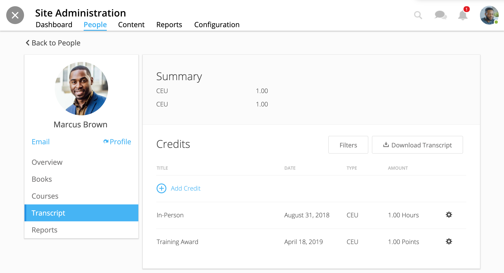
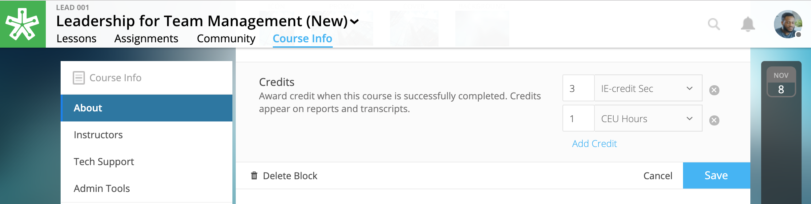

-------------------
Manage Site Credit
-------------------

Create credit types to award for course completion. You can also award credit manually for any occasion.

.. note:: Learn more about how learners interact with progress, certificates, and credit within the User Guide: https://help.nextthought.com/userguide/Progress_Certs_Credit.html

Create Credit Options
---------------------

**To create site-wide course credit options,**

1. Click on the Admin Panel in the upper right-hand corner of your homepage.
2. Click on the “Configuration” tab.
3. Click on the “Certificates, Transcripts, and Course Credit” subtab.
4. Scroll down to Credit Types.

   - **NEW:** Click “Add New Type” to define credit for the site. Type in type and units. This is now selectable for instructors to add to courses.
   - **EDIT:** You can remove a credit type by selecting the “x” button or you can select a current type and edit it.

Manually Award Credit
---------------------

**To manually award a learner with credit,**

1. Click on the Admin Panel in the upper right-hand corner of your homepage.
2. Click on the “People” tab.
3. Select a user.
4. Click the “Transcript” tab.
5. Click “Add Credit.”
6. Fill in information and click “Save.”

   
Offer Course Credit
--------------------

**To assign a credit type to a course,**

Course instructors, course editors, as well as Site Admin can assign credit to a course.

1. Click into your course.
2. Navigate to the “Course Info” page.
3. Scroll to the “Credits” section.
4. Click “Edit.”
5. Use the dropdown to select an existing credit type and unit, or "Add Credit."
6. Define the amount of credit.

.. note:: Credit will be awarded when the user has completed the course as defined by completion of required materials. Upon course completion, the user can “View Certificate” to view their completion certificate and credit. They can also view their certificates within their profile. To learn how to set up courses for progress, certificates, and credit, view the **Course Creation and Setup** section of the Admin Guide: https://help.nextthought.com/adminguide/createcourse.html