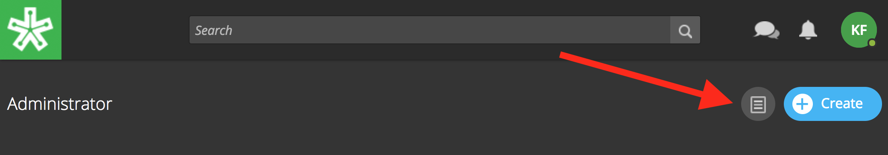

====================
View Site Reports
====================

View course reports within the admin tools. Available reports include the "Course Summary Report," the "Self Assessment Summary Report," the "Course Roster Report," and the "User Enrollment Report."

Download reports for offline viewing or documentation. 

To view reports, 

1. On your homepage, click on the admin toolbar icon in the upper right-hand corner.

2. Click on the "Reports" tab.

.. image:: images/adminreports.png

Course Summary Report
======================

This report presents data reviewing student enrollment, self-assessment participation, assignment submission, student activity, discussion participation, video and resource usage.

1. Click on Course Summary Report.

.. image:: images/adminreports.png

2. Select a course to view its report.

3. View report online or use the download button in the upper right-hand corner.

Self Assessment Summary Report
===============================

This report presents data on student participation within self-assessments both by assessment and by student. It also includes information on individual student engagement with each self-assessment.

Course Roster Report
=====================

This report lists all users enrolled in the course and the date and time in which they enrolled.

User Enrollment Report
=======================

This report lists all courses a user is enrolled in and the date the user enrolled.

