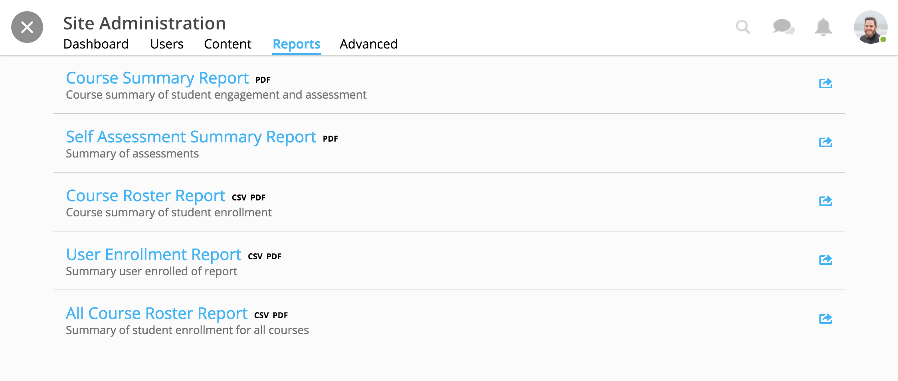

====================
View Site Reports
====================

View course reports within the admin tools. Available reports include the "Course Summary Report," the "Self Assessment Summary Report," the "Course Roster Report," the "User Enrollment Report," and the "All Course Roster Report."

Download reports for offline viewing or documentation. 

To view reports, 

1. On your homepage, click on the admin toolbar icon in the upper right-hand corner.

.. image:: images/adminbutton2.png

2. Click on the "Reports" tab.

.. note:: Reports display the format available for download in black text to the right of the title. Formats available include PDF and CSV. CSVs can be opened as a spreadsheet for customization.

Course Summary Report
======================

This report presents data reviewing student enrollment, self-assessment participation, assignment submission, student activity, discussion participation, video and resource usage.

1. Click on the Course Summary Report.
2. Select a course to view its report.
3. View report online or use the download button in the upper right-hand corner.

.. image:: images/coursesummaryreport.png

Self Assessment Summary Report
===============================

This report presents data on student participation within self-assessments both by assessment and by student. It also includes information on individual student engagement with each self-assessment.

1. Click on the Self Assessment Summary Report.
2. Select a course to view its report.
3. View report online or use the download button in the upper right-hand corner.

Course Roster Report
=====================

This report lists all users enrolled in the course, the date and time in which they enrolled, as well as their progress.

1. Click on the Course Roster Report.
2. Select a course to view its report.
3. View report online or use the download button in the upper right-hand corner.

User Enrollment Report
=======================

This report lists all courses a user is enrolled in, the date the user enrolled, and course progress.

1. Click on the User Enrollment Report.
2. Select a learner.
3. View report online or use the download button in the upper right-hand corner.

All Course Roster Report
==========================

This report includes enrollment information across the site in each course. Each report lists all users enrolled in the course, the date and time in which they enrolled, as well as progress.

1. Click on the All Course Roster Report.
2. View report online or use the download button in the upper right-hand corner.

