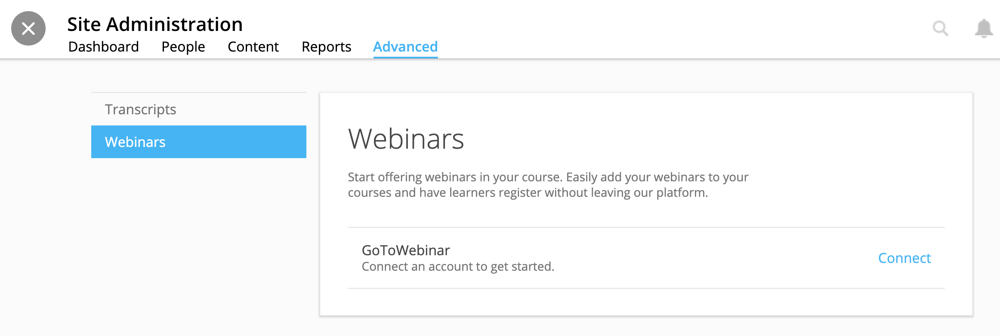
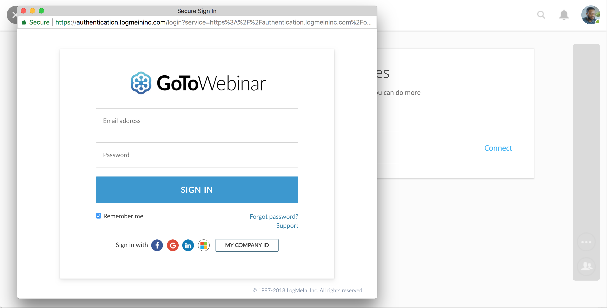
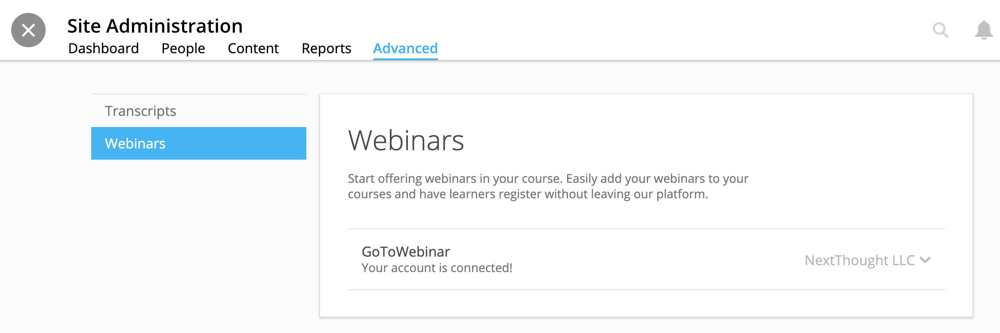

========================
GoToWebinar Integration
========================

NextThought integrates with GoToWebinar to allow learners to view, register, and join webinars from their Lessons page. Admin can integrate their site with their GoToWebinar account and site admin, instructors, editors can add a webinar to their Lessons page.

Integrating with GoToWebinar
==============================

Before attempting to integrate with GoToWebinar, please make sure you have a GoToWebinar account.

1. While logged in with an admin account, navigate to your Site Admin Tools from the homescreen.
2. Click on the “Advanced” tab.
3. Click on the “Integrations” section.
4. Click on the blue “Connect” link next to GoToWebinar.

5. You will then be asked to log into GoToWebinar, or, if already logged in, you will be asked “Allow Access” to NextThought.

6. Once you are connected your GoToWebinar name will display where the blue connect button used to be. You have now successfully linked your site to the GoToWebinar account.

.. note:: Please see the Editor Guide for more information about adding a webinar to a course and learner registration. https://help.nextthought.com/editorguide/webinars.html