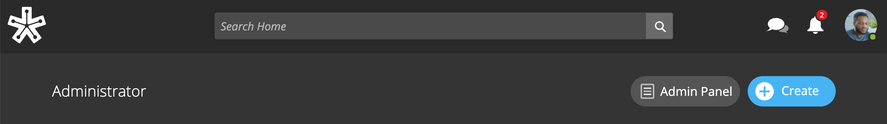
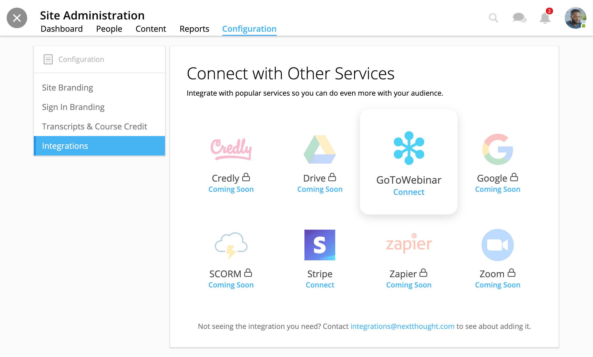
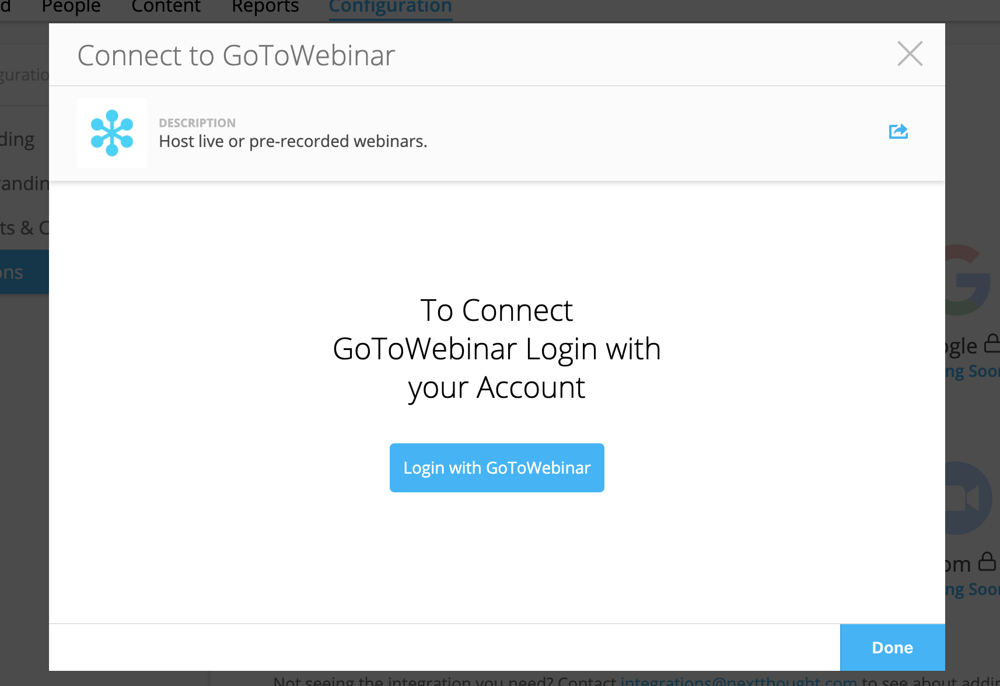
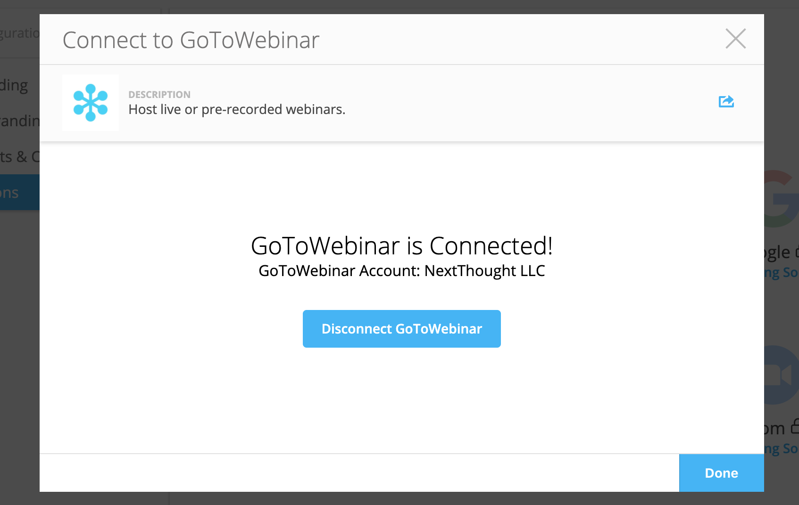

========================
GoToWebinar Integration
========================

NextThought integrates with GoToWebinar to allow learners to view, register, and join webinars from their Lessons page. Admin can integrate their site with their GoToWebinar account and site admin, instructors, editors can add a webinar to their Lessons page.

Integrating with GoToWebinar
==============================

Before attempting to integrate with GoToWebinar, please make sure you have a GoToWebinar account.

1. While logged in with an admin account, navigate to your Site Admin Panel from the homescreen.

2. Click on the “Configuration” tab.
3. Click on the “Integrations” left-panel section.
4. Click on the “GoToWebinar” icon.

5. You will then be asked to log into GoToWebinar, or, if already logged in, you will automatically connect to NextThought once clicking the login button.

6. Once you are connected, your GoToWebinar window will display the account name.

.. note:: Please see the Editor Guide for more information about adding a webinar to a course and learner registration. https://help.nextthought.com/editorguide/webinars.html