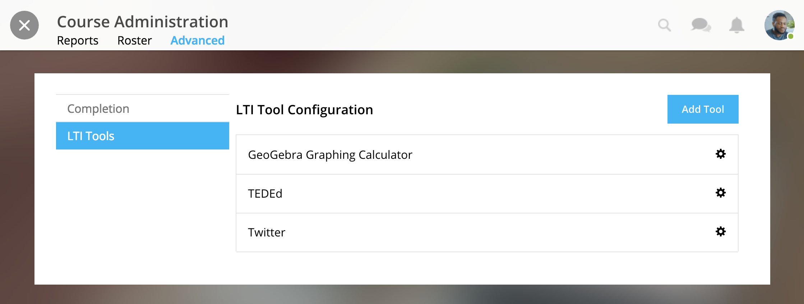
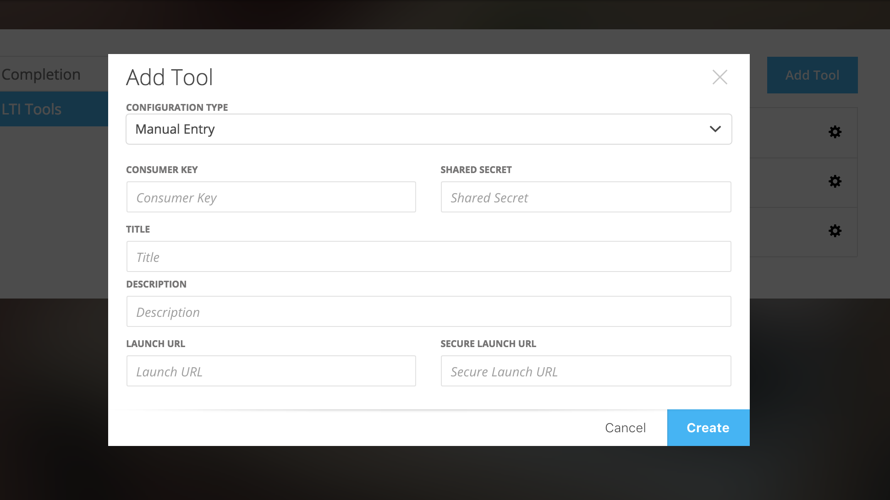

================
LTI Tools
================

NextThought's courses support LTI (Learning Tools Interoperability) tools. LTI tools allow integration of outside LMS applications, services, and widgets into lessons and courses. Once LTI tools are set up, they can be placed into the lesson.

Add LTI Tool 
==============

**To Integrate LTI Tool with Course:**

1. In the course, click on the “Course Info” tab.
2. In the sidebar, click “Admin Tools.”
3. Under “Admin Tools” find the “Advanced” option and click “View Now.”
4. Click the option “LTI Tools.”

To add new LTI Tools click the “Add Tool” button. Now, choose whether to add the tools through a manual entry, by URL, or by copying and pasting a XML code. These can be found at the LTI tools' source.

For a manual entry, you will need:

- Consumer Key (if needed)
- Shared Secret (if needed)
- The Title
- The Description
- The Launch URL or Secure Launch URL

For URL, you will need:

- Consumer Key (if needed)
- Shared Secret (if needed)
- The Tool Configuration URL

By XML, you will need:

- Consumer Key (if needed)
- Shared Secret (if needed)
- The XML Code

**To add a LTI Tool to a lesson:**

1. Navigate to the “Lessons” tab.
2. Click “Start Editing” in the bottom right-hand corner.
3. Click “+Add Content” within a section.
4. Click the LTI Tool and click the “Select” button.
5. Follow any LTI prompts.
6. Modify the title, author, and description.
7. Click "Add to lesson."

Remove LTI Tool
===================

To remove a tool from your Lessons page while in Edit Mode, simply click on the "x" icon next to the tool.

Delete or Edit LTI Tool
========================

1. In the course, click on the “Course Info” tab.
2. In the sidebar, click “Admin Tools.”
3. Under “Admin Tools” find the “Advanced” option and click “View Now.”
4. Click the option “LTI Tools.”
5. Click the gear icon next the the tool you want to modify and follow the prompts.

.. image:: images/LTIdeleteedit.png

