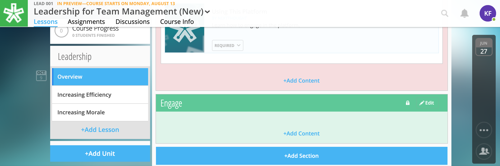
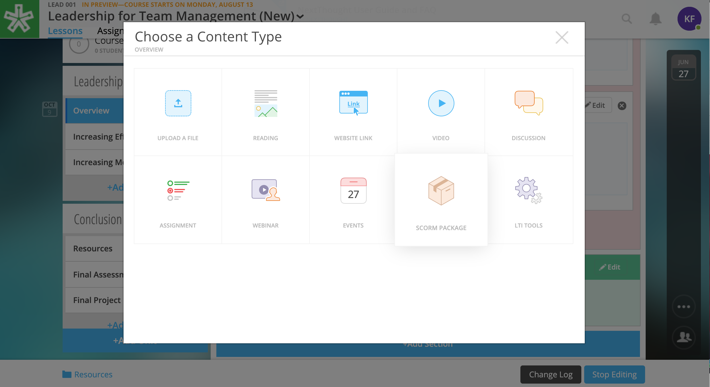
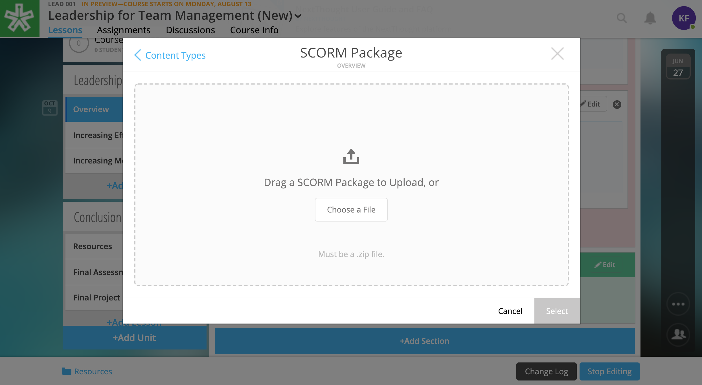
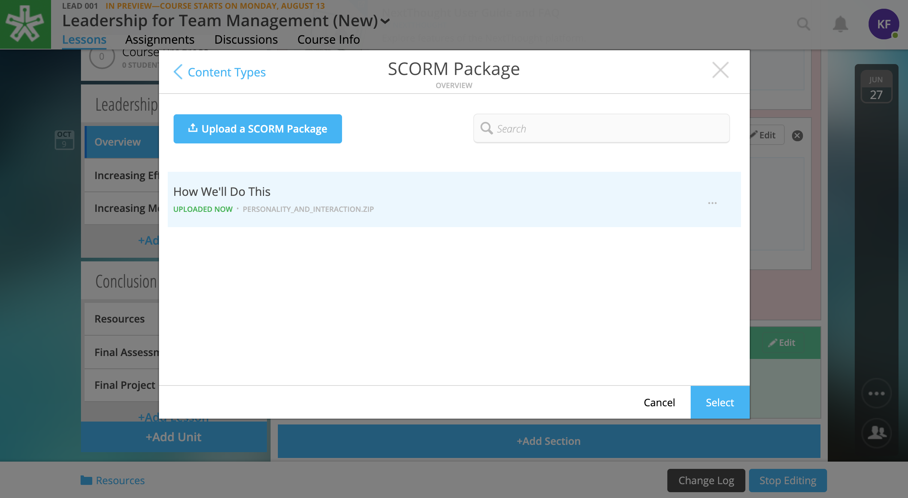
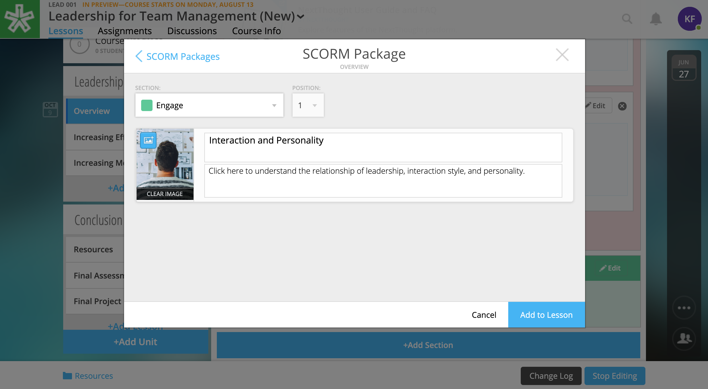

======================
SCORM
======================

SCORM packages can be offered on the NextThought platform as a lesson activity.

.. note:: Please contact your Project Manager if you're interested in adding SCORM capability to your site.

Add SCORM Package as a Lesson Activity
========================================

**To add a SCORM activity:**

1. Click on “+Add Content.”

2. Click on “SCORM Package.”

3. Drag and drop a SCORM package file, or select “Upload a SCORM Package.”

4. Select a SCORM package from your computer.
5. Select the SCORM package you’d like to add to a lesson.

6. Add a title, description, and thumbnail, and click “Add to Lesson.”

Delete SCORM Package
=====================
   
**To permanently delete SCORM package from a course:**

1. Navigate to the "Lessons" tab.
2. Click on the "Start Editing" button in the bottom right-hand corner.
3. Click "Add Content" in any section.

   .. image:: images/SCORMDeleteAdd.png
   
4. Select "SCORM Package."

   .. image:: images/SCORMDeleteSelect.png

5. Select the " . . . " to the right of the file name.
6. Select "Delete."

   .. image:: images/SCORMDelete.png

**To remove SCORM activity from a lesson:**

1. Navigate to the "Lessons" tab.
2. Click on the "Start Editing" button in the bottom right-hand corner.
3. Click on the "x" button on the content.

   .. image:: images/SCORMRemove.png

4. Confirm removal.

.. note:: Removing content from your lesson will not necessarily delete it permanently from your course. All types, with the exception of an external link, will remain in your course resources ready for placement in a lesson even if removed from a lesson.

