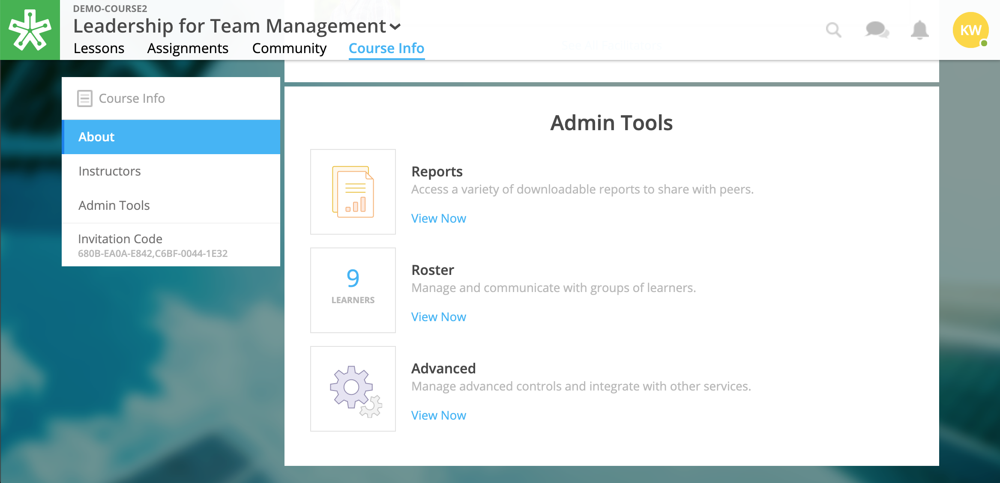
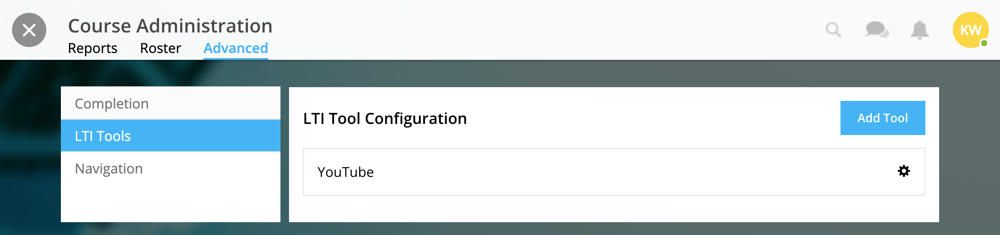
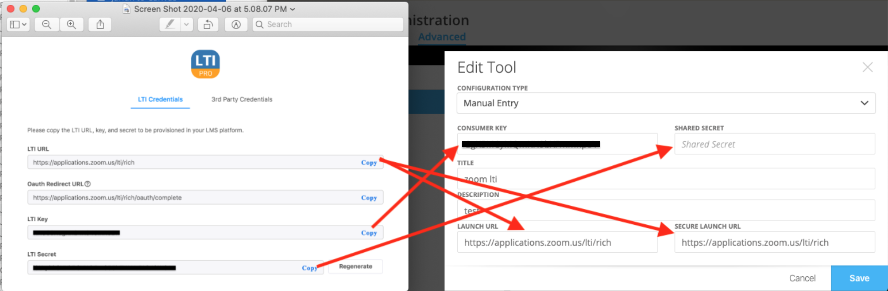
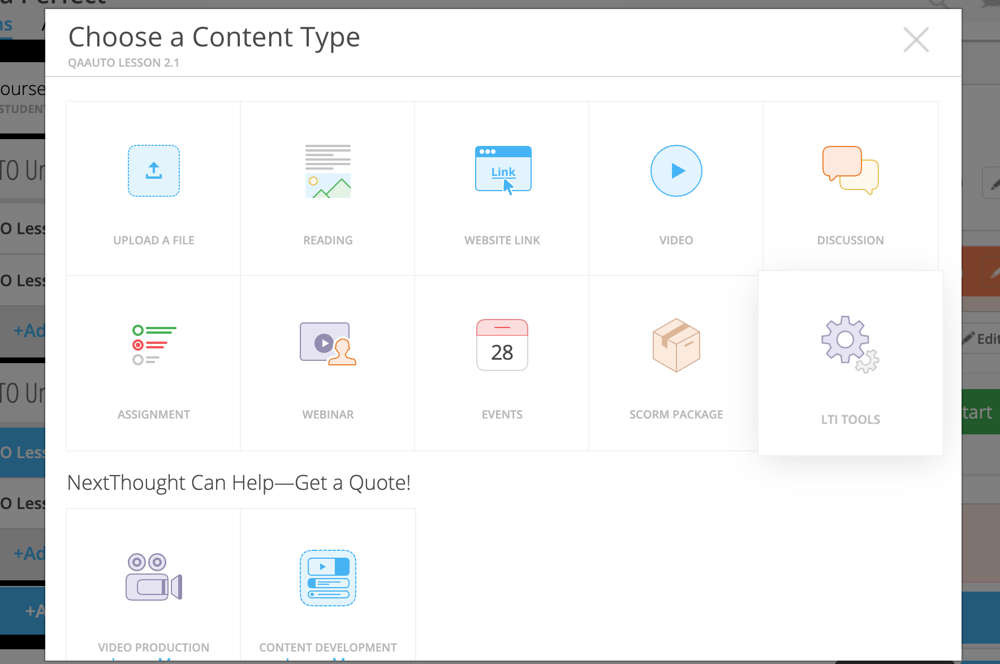
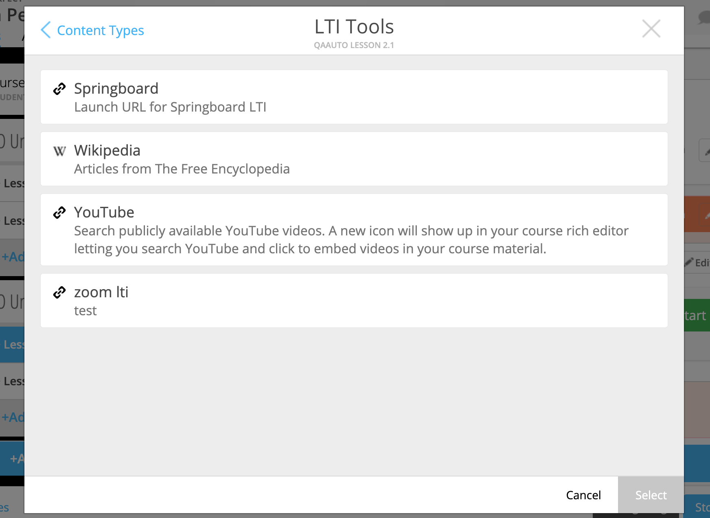
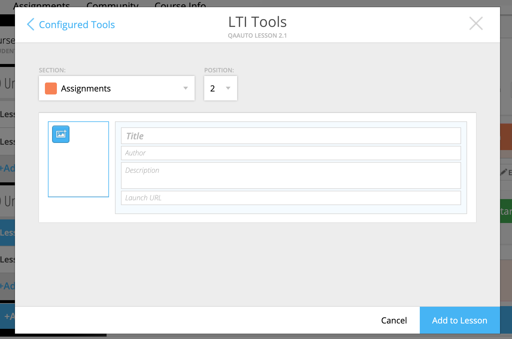
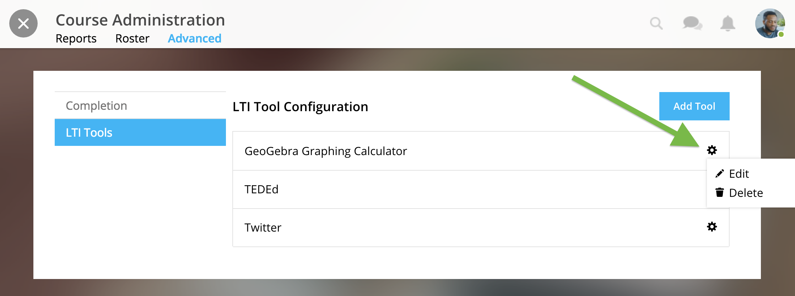

================
Zoom LTI
================

NextThought's courses support LTI (Learning Tools Interoperability) tools. LTI tools allow integration of outside LMS applications, services, and widgets into lessons and courses. Once LTI tools are set up, they can be placed into the lesson.

.. note:: If you do not wish to follow the steps below, but would still like to link learners to register and join a Zoom meeting, please instead add the zoom invite URL as a "link" instead.

This page walks you through setting up a Zoom LTI within the NextThought platform.

LTI Pro Gives instructors the following functionality:

- Schedule and manage meetings
- Start or join meetings
- View upcoming meetings
- View and manage previous meetings and recordings
- Auto-provision a Zoom License for instructors

LTI Pro gives learners the following functionality:

- View upcoming meetings
- Join meetings
- View previous meetings and recordings

STEP 1: Obtain Zoom LTI Credentials
=====================================

First, navigate to https://zoomappdocs.docs.stoplight.io/lti-pro-v2/welcome/getting-started to install the LTI Pro app by Zoom. This step will help you attain information needed to configure zoom in NextThought.

.. warning:: You must have a Zoom account and be in an admin role in order to set up the LTI.

STEP 2: Register Zoom LTI Tool in NextThought
==============================================

1. In your course, click on the “Course Info” tab.
2. In the sidebar, click “Admin Tools.”
3. Under “Admin Tools” find the “Advanced” option and click “View Now.”

4. Click the option “LTI Tools.”

5. Click "Add Tool" and choose "Manual Entry" and and enter the corresponding information obtained from Step 1.
	LTI URL →  Launch URL and Secure Launch URL
	LTI Key → Consumer Key
	LTI Secret → Shared Secret

STEP 3: Add Zoom LTI Tool to a Lesson
======================================

**To add a LTI Tool to a lesson:**

1. Navigate to the “Lessons” tab.
2. Click “Start Editing” in the bottom right-hand corner.
3. Click “+Add Content” within a section.
4. Click the LTI Tool and click the “Select” button.

5. Select the Zoom LTI tool and click "Select."

6. Modify the thumbnail, title, author, and description.

7. Click "Add to lesson."

STEP 4: Schedule a Zoom Meeting 
==================================

View the LTI Zoom tool placed within your lesson within Step 3.

When signed in a facilitator or admin, you'll see the "Schedule a New Meeting" button. Select the button and fill in the desired information.

.. image:: images/

From the learner view, they will have the option to view upcoming meetings and join.

.. image:: images/

Delete or Edit LTI Tool
========================

1. In the course, click on the “Course Info” tab.
2. In the sidebar, click “Admin Tools.”
3. Under “Admin Tools” find the “Advanced” option and click “View Now.”
4. Click the option “LTI Tools.”
5. Click the gear icon next the the tool you want to modify and follow the prompts.

