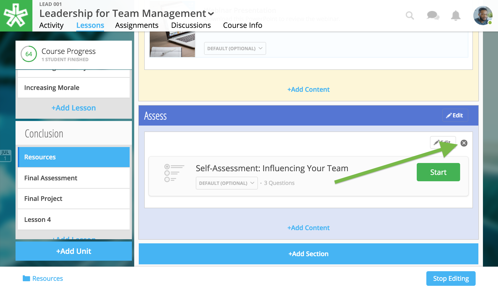

======================
Self Assessments
======================

Authoring Tools coming soon!

Self-assessments are only for self-evaluation. Learners can take a self-assessment multiple times, and solutions are available to view after each attempt. No formalized grade is posted for self-assessments.

Add Self-Assessment
=====================

.. note:: In order to add a self-assessment to your course, your project manager will need to upload it to your course files. Please reach out to your project manager for further instruction.

Once your project manager has informed you that your assessment is available in your course files, follow the steps below to select and place it into a lesson:

1. While in Edit Mode, click on “+Add Content” in the section you want to edit.

   .. image:: images/addcontentselfassess.png

   .. warning:: Please note: if you don’t see the “+Add Content” banner, you need to first add a section to the lesson page (see the above section on Adding Sections to Lessons). 

2. Select “Self Assessment” in the “Choose a content type” window.
   
   .. image:: images/contentassessment.png

3. Select the self-assessment.

   .. image:: images/selectassessment.png

4. Click the “Select” button in the lower right-hand corner.

5. Confirm your selection and position within the lesson.

   .. image:: images/confirmassesssment.png
   
6. Click “Add to Lesson” to place your self-assessment in the course.

Edit Self-Assessment
=======================

**To edit the position of the self assessment:**

1. Click on the “Edit” button next to the self-assessment you want to
change.

   .. image:: images/editselfassessment.png
 
2. In the popup window for a self-assessment, you can change

   -  The section where the self-assessment is placed
   -  The relative position of the self-assessment within the section
   -  Delete the self-assessment (Please note: if you delete the
   self-assessment, you cannot undo this deletion. It is a permanent
   action.)
   
   .. image:: images/editassessmentflyout.png

3.  Click “Save” to save your changes.

 
.. note:: To edit the self assessment content or title, please contact your project manager.
 
Delete Self-Assessment
==========================

To remove self-assessments from a lesson, simply select the "x" icon to the right of the content on the Lessons page. Then, confirm deletion.

