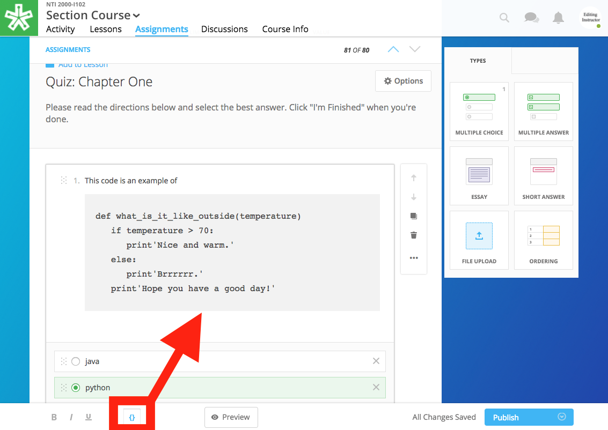
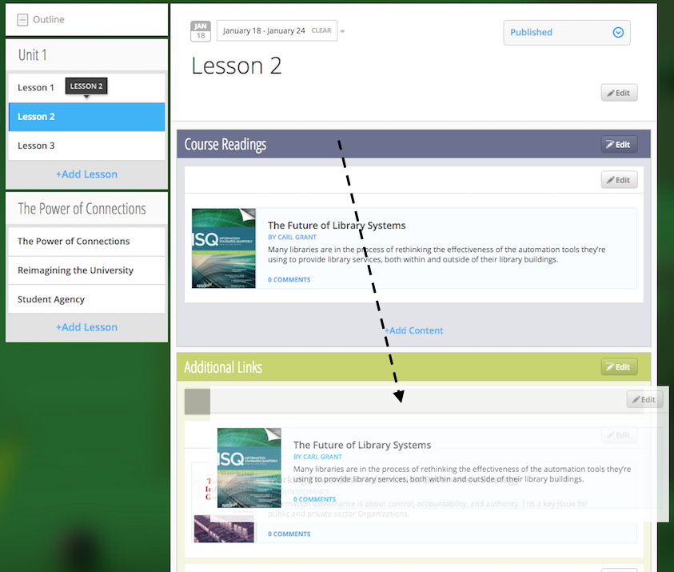
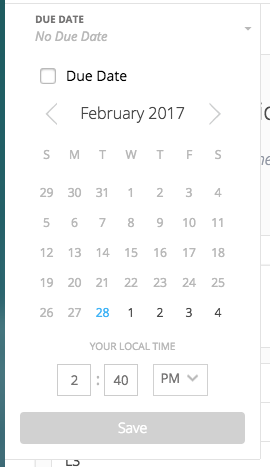

.. _create-an-assignment:

=============
 Assignments
=============

The assignment authoring tool allows you to create an assignment for
your course and place it within a lesson. Add an assignment to a lesson
to assess your learners’ knowledge of the material they are learning.

 |image75|

There are several options available for customizing an assignment. This
allows you to create a unique assignment tailored to your needs.

-  **Question Types:** 

   - multiple choice
   - multiple answer
   - short answer
   - essay
   - file upload
   - ordering
   
-  **Other Features** 

   - Due date
   - Time limit
   - Value
   - Auto grade
   - Randomize question order
   - Randomize answer order
   - question bank
   - submission cut-off

Create an Assignment
====================

The following steps will guide you through the process of creating an
assignment. 

Below are the steps for assignment creation. Each step is explored in
full below.

#. Locate “Create” assignment button
#. Assign the due date, time limit, and point value (optional)
#. Title your assignment and write a description
#. Add, edit, and order questions
#. Explore assignment “Options” (optional)
#. Publish or schedule your assignment
#. Add assignment to a lesson

Step 1: Locate “Create” assignment button
-----------------------------------------

Locate the button to begin a new assignment.

There are two options to begin a new assignment:

- **Assignments Page:**

  1. To begin creating an assignment, first enter the course in which you’d like to place the assignment and view the assignments page.

  2. While viewing the assignments subtab, click on the blue button titled "Create."
   
  3. After you click this button, a new assignment template will open.

- **Lessons Page (Edit Mode):**

    |image78|

   1. While viewing your lessons page in Edit mode, select a lesson and view a section within the lesson.
   
   2. Click the “+Add content” button at the bottom of the section.
   
   3. Then, select “Assignments.”
   
   4. In the assignment edit popup window that opens, select the blue
      “Create Assignment” button. Creating an assignment from this
      view will add the assignment to this specific section in the
      course upon creation.

Step 2: Assign the due date, time limit, and point value
--------------------------------------------------------

Decide upon the essential elements of the assignment. Please note, these
categories are optional.

 |image79|

Below are the descriptions for each option:

Due Date
~~~~~~~~

The due date defines the date and time the assignment should be completed by.

  |image80|

.. note:: **How it works:** In the Lessons Page and Assignments Page,
          the assignment due date will display next to the
          assignment’s title. Once the assignment is past the due
          date, learners will still be able to take it, but the
          assignment will be marked as late upon submission. (To
          restrict access to the assignment based on the due date, see
          Step 5.) Once the due date passes, the solutions to each
          question will display after the learner submits his or her
          assignment.

.. note:: **If not selected:** If no due date is selected, the
          assignment will be marked as “Available” and learners are
          welcome to take the assignment when convenient.

Time Limit
~~~~~~~~~~

Adding a time limit to the assignment will alert the learner upon
opening the assignment that he or she only has a defined amount of
time to complete the assignment once started.

 |image81|
 
|
 
 |image82|
 
|

.. note:: **How it works:** The time limit will be displayed next to
          the assignment’s name on the Lessons or Assignments tab, and
          when the assignment is selected, the learner will first be
          alerted to how much time they have to take the assignment
          and that once started the timer will not stop. Once the
          learner begins the assignment, a countdown clock will
          display at all times in the upper right-hand corner. The
          timer will continue until the learner submits his or her
          assignment. Once the timer reaches 0 when counting down from
          the allotted time, the timer will then count up displaying
          how many seconds/minutes/hours the assignment is over
          time. In other words, the learner will be able to interact
          with the assignment past the time limit, although the
          assignment will be marked as over time upon learner
          submission.

.. note:: **If not selected:** If a time is not allotted to complete
          the assignment, a learner is welcome to work on it as long
          as needed without being penalized for time.

Value
~~~~~

The value allows you to assign the amount of points the assignment is
worth. This point value will display in bold font to the right of the
assignment's title in learner’s Lessons page and the Assignments tab.
 
.. note:: **How it works:** The assignment's total value will display
          next to the name of the assignment on the Lessons View and
          Assignments View. In their Assignments View, their grade
          will be listed as [Earned Points/Total Points]. If you
          choose to set the assignment to autograde, the total points
          will determine the value of each question.
 
.. note:: **If not selected:** If a point value is not assigned, no
          point value will display. An instructor can still assign a
          grade once the assignment is submitted by learners.

.. warning:: Please note, in order for the assignment to autograde,
             you must assign a point value and also click on the
             “Options” button and check the “Enable Auto Grading”
             box. This means, when the learner takes the assignment,
             the assignment will be checked for correctness and
             assigned a visible grade for the learner’s work. We will
             explore this option more in Step 5 below. Also, if you
             are using the Grade Predictor feature, you must assign a
             point value.

Step 3: Title your assignment and write a description
-----------------------------------------------------

Add a title and description by typing in the
appropriately labeled fields.

The learners will see the title of the assignment within their lesson
and within the assignment’s tab. The description will display once the
learner opens the assignment and may be used for further explanation or
instructions regarding the assignment.

Step 4: Add and Edit Questions
------------------------------

 |image85|

Add Questions
~~~~~~~~~~~~~

Add questions to your assignment by clicking on a question from
under the “Types” panel on the right and dragging a question type into
the correct placement within your assignment, or click once on a
question type to place the question at the end of your assignment. You
may reorder these questions after placed.

Edit Questions
~~~~~~~~~~~~~~

Once you have added a question type, you will need to add text.
Most questions will have a field for the question text and a field for
the answer text (with the exception of the essay type and file upload types). 
To edit any field, click in the field and begin
to type. On most question types, you can add extra solution
possibilities by clicking on “Add a choice.”

To learn more, see Question Types.

 |image86|

.. warning:: Please note, if you add a Short Answer question type,
             your answer text must exactly match the spelling of your
             learner’s solution for the question to be marked correct.

Add Code Block
~~~~~~~~~~~~~~

While in the description field or question text field, click on the
brackets at the bottom of the window to initiate a code block. Click
in the code block and begin typing.

When editing:

When published:

Order Questions
~~~~~~~~~~~~~~~

To reorder your assignment’s questions, click on the dotted box
in the upper left-hand corner of the question and drag your question
into place, or select the up or down arrow to the right of your question
to move it one place at a time.

You may also reorder the answers within the question itself. To do so,
click on the dotted box icon to the left of your solution and drag the
answer to the preferred location within the solution set and drop your
answer into place.

Duplicate Questions
~~~~~~~~~~~~~~~~~~~

 |image88|
 
Duplicate the question to create a second identical question
within your assignment to edit as needed. Click the square icon to the
right of your question to duplicate the question.

Delete Questions
~~~~~~~~~~~~~~~~

 |image89|
 
Click the trash can icon to delete the question entirely from
your assignment. If you’ve made a mistake by deleting the question, you
will have a small “undo” menu that appears momentarily at the bottom
left to restore the question.

Step 5: Explore assignment “Options”
------------------------------------

The Options tool allows you to choose who can see the assignment, if
your assignment is auto graded, if ordering of questions or answers is
randomized, and if you’d like to set a max limit of questions that
present to the learner.

To view and edit advanced settings, click the “Options” button to the
right of the assignment’s title. Below is a description of each option:

Assign to Option
~~~~~~~~~~~~~~~~

This option allows you to select who can view the assignment.

 |image91|

.. note:: **How it works:** You can make an assignment visible to
          either “Everyone” or “For Credit Only.” If it’s assigned to
          “For Credit Only” only learners that are taking the course
          for credit may see the assignment and interact with it.

Grading Option
~~~~~~~~~~~~~~

By enabling auto grading, the assignment will be automatically graded
according to the answers you’ve marked as correct.  You must have an
assignment value set in order to auto grade. (See Step 2 regarding
value.)

 |image92|

.. warning:: **How it works:** Each question will share an equal
	     amount of points counting toward the total value of the
	     assignment. (Although, NextThought can set up an assignment to grade
	     with different point values per question. Please contact NextThought
	     if you are interested.)

After the learner submits his or her
assignment, each question will be marked as correct or incorrect and
display the learner’s score based on number of correct answers and how
much each question is worth. The instructor will also be able to view
the learner’s score and answers.

.. warning:: Please note, that if you have added a file upload or
             essay question type, auto grading will no longer be
             available to you since neither of these types can be
             automatically graded. Also note that all assignments will
             be “auto-assessed” regardless if they are
             auto-graded. Auto-assessed means that each question upon
             submission will be marked with either “Correct” or
             “Incorrect.”

If you plan to edit an assignment to autograde that wasn’t previously
autograded, or if you plan to edit or delete the point value associated
with an autograded assignment, please see “Editing Point Values and
Autograde Option” within the section titled "Edit or Delete an
Assignment" for more details.

Randomize Ordering
~~~~~~~~~~~~~~~~~~

Selecting randomize will help ensure that each
learner have a unique quiz while still displaying each question and
solution.

 |image93|

**Randomize Question Order:**

Selecting this option will randomize the order in which the questions
are presented to each learner.

**Randomize Answer Order:**

Selecting this option will randomize the order in which the answers are
presented to each learner.

**Max Limit:**

 |image94|
 
Setting a max limit of questions allows a designated amount
of questions from a larger set of questions to be randomly selected and
assigned to learners. Learners will only be able to see and interact
with their unique set of questions.

In other words, if you have 40 questions for the assignment, and you set
a max limit of 10 questions, each learner will have 10 questions
randomly selected and presented to them from the 40 possible questions
on their assignment. These 10 questions will make up that learner’s
unique assignment.

**Late Submissions**

Course Instructors can restrict submissions to an assignment by due
date and offer a grace period or timeframe for their assignments. A
grace period grants an extended submission timeframe to an assignment
beyond the due date.

After the due date, the learner can still view the assignment, but the
assignment will not allow submissions.

**To restrict submissions or add a grace period:**

1. While creating/editing assignment, add a due date.
2. Select the “Options” button.
3. Navigate down to the bottom section labeled “Late Submissions.”
4. Select the dropdown.

   - **To Restrict Access Based on Due Date:** Select "Never Allow" to
     restrict submissions to only before due date.
   - **To Restrict Access with Grace Period:** Select the "Allow
     within Grace Period" to allow submissions only past the due date
     by a defined amount of time. Then, define the amount of time
     you'd like to allow.

5. Click the “Done” button to save your changes.

.. image:: images/restrictedsub.png

The grace period is not disclosed to the learner. If the learner tries
to submit the assignment after the due date or grace period, a warning
window will appear stating that the assignment is past due and cannot
be submitted.

Adding Multiple Attempts
~~~~~~~~~~~~~~~~~~~~~~~~

To set the number of attempts, select the “Options” button while editing an assignment, and scroll down.

.. note:: Both a value and passing score must be defined in order to add multiple attempts.

Choose between one attempt, multiple attempts, or unlimited attempts.

.. image:: images/multisubs1.png

To select a range between two and twenty attempts, select the middle dropdown option.

Select a value to set the desired number of attempts. 

.. image:: images/MultiSubs3.png

To learn more about this feature, click here!
https://help.nextthought.com/editorguide/assignment.html#adding-multiple-attempts

Step 6: Publish or schedule your assignment
-------------------------------------------

Once you have completed creating your assignment, the last step is to
publish the assignment and place it in a lesson. 

**Publish:**

Click on the “Publish” button at the bottom right-hand corner of your
assignment. This will open a new window displaying the options
“Publish,” “Schedule,” and “Draft” (the current state it’s in). If you
want to publish your assignment and make it available right away, click
“Publish” and then “Save.”

**Schedule:**

If you’d like the assignment to be scheduled to become available,
click “Schedule” and select the day and enter a time for it to become
available for learners. Before this date and time, learners will only
be able to see the title of the assignment and the date it becomes
available. They will not be able to view the assignment’s
contents. Once the assignment becomes available (or if it was
immediately published) the learner may take the assignment.

If you aren’t quite finished with the assignment, that’s okay. You can
leave it as is without publishing it and return to it later. It will be
saved as a draft. For instructions about returning to an assignment, see
the section "Edit or Delete an Assignment."

Step 7: Add assignment to a lesson
----------------------------------

There are two ways in which to add assignments to your lesson.

While Viewing your Assignment
~~~~~~~~~~~~~~~~~~~~~~~~~~~~~

While viewing your assignment, you can add your assignment to a lesson.

#. Above the title of the assignment, click on the blue text that “Add
   to Lesson.” A new sharing window will appear that lists where the
   assignment is currently placed, and lists the current lessons, both
   drafted and published. |image97|
#. Now select the lesson you’d like to place the assignment in by
   clicking “Add to lesson.” When you select this, a pop up menu will
   allow you to select a section within the lesson to place the
   assignment. |image98|
#. Select the section(s) in which you’d like to place the assignment.
   The lesson will now be listed at the top of the sharing window.  |image99|
#. Now, click “Done.”

.. note:: You will notice that “Add to Lesson” has been replaced with
          the name of the lesson in which the assignment is shared
          to. Click on this again to add or remove the assignment from
          a lesson. You can also add it to multiple lessons.

While Viewing a Lesson
~~~~~~~~~~~~~~~~~~~~~~

While viewing a lesson, you can add your assignment to a lesson.

#. Click on the “Edit” at the top right-hand corner of the lesson. This
   will enter the editing mode. 
   
#. Now, find the section in which you’d like to place the assignment and
   click “+Add Content.” (This text appears at the bottom of each
   section within a lesson while in Edit Mode.) This will open the
   content menu. |image100|
   
#. In the content menu, select “Assignment.” |image101|

#. Next, find your assignment within the list of assignments, click on
   it, and then click “Select” in the bottom right-hand corner.

   .. warning:: If you do not see your assignment, you may not have
                set it to be published. Return to your assignment and
                publish the assignment. Please see the section "Edit
                or Delete an Assignment" to find out how to return to
                your assignment.

 |image102|

5. Now select “Add to Lesson” in the bottom right-hand corner to add it
   to your lesson.

 |image103|

.. note:: Please note, if you do not place an assignment in a lesson,
          published assignments can still be viewed by learners within
          their Assignments tab.

Edit or Delete an Assignment
============================

You can return to an assignment to complete it, make necessary changes,
or delete the assignment entirely.

To return to an assignment to edit or delete it:

#. Click on the Assignments tab and view the Assignments subtab. This
   will list all assignments in your course both published and drafts.
   
#. Now, click the blue text “Edit” to the right of the assignment’s name
   to view it in editing mode.

 |image104|

Editing Assignments
-------------------

Depending on the state your assignment is in some editing options may be
limited. Use the descriptions below to understand your limitations:

1. **If the assignment is in draft currently (or scheduled for a
   future date), you are not limited to the edits you can make.**

  As you edit the assignment, your edits will be saved automatically as
  you go. Please make sure you are finished editing your assignment before
  the scheduled date at which point the assignment will be “published” and
  viewable.

2. **If the assignment is published, but no learner has yet interacted
   with it, you are not limited to the edits you can make; however,
   you will be required to save some types of edits manually instead
   of the application saving changes automatically as you go.**

  Any edits to published questions (or adding new questions) will open the
  question in a new pop-up window. Once you have made changes to that
  question and are satisfied with its presentation, click the “Save”
  button to publish the new version of the question at once and continue
  editing.

  |image105|

  Other edits such as toggling different Options, moving the order of the
  questions, deleting questions, adding a time limit, as well as adding a
  due date will be saved automatically when the change occurs.

3. **If the assignment is published, but learners have begun the
   assignment, you will be limited in the edits you can make.**

  In this scenario, only minor changes can be made such as textual changes
  in question or answer text or in the assignment title and description.
  You may also assign a new value to the question, select a new answer, or
  assign a new due date or scheduled date. 

  (Please note, if the assignment
  is set to autograde and you assign a new value to the assignment, the
  assignment will be regraded according to the new value for those
  learners who have already taken the assignment. Also, if you assign a
  different solution than previously selected, the assignment will regrade
  and reassess accordingly for those who have already submitted their
  assignment.)

  If you need to make larger changes such as adding a question, deleting a
  question, and toggling different Options, you will receive an error
  message in the bottom right-hand corner and will be prompted to Reset
  learner assignments in order to save the changes. Resetting the
  assignment will clear all learner submissions and learners will have to
  retake the updated assignment.

4. **If the assignment was not created using our authoring tools,**
   the assignment will be referred to as a “Legacy Assignment” and is
   limited to two types of edits, point value and autograde changes,
   regardless if learners have begun the assignment or not. You can
   add, delete, or edit point values, and you have the option to turn
   autograde on or off by clicking the “Options” button and selecting
   the enable autograde option. Please see “Editing Point Values and
   Autograde Option” below for more details. |image106|

Editing Point Values and Autograde Option
-----------------------------------------

Within all assignments, regardless if learners have begun the assignment
or not, you have the option to add, delete, or edit point values, and
turn autograding on or off. Please click “Edit” next to the assignment’s
name in your Assignments tab to enter Edit Mode. The point value is
located in the upper right-hand corner, and the autograde option is
listed within the “Options” button.

FAQ when editing autograde and point values:

-  There are some assignment types that can't be autograded (such as an
   essay). If this type of question exists within the assignment, it
   will not allow you to select autograde, although you are still
   welcome to add a point value.
-  If you choose autograde, all previously completed assignments should
   now autograde according to the point value you just defined.
-  If you choose autograde, all assignments taken after will also be
   autograded accordingly.
-  If you turn off autograde on an assignment that was previously
   autograded, any learner’s assignment that was autograded will remain
   graded. In other words, their grade will not be deleted.
-  If you define a NEW point value with autograde already selected, the
   assignments will RE-AUTOGRADE according to the new point value (both
   previously completed assignments and assignments completed after the
   change).
-  If the assignment is MANUALLY GRADED by the professor, the manual
   grade will OVERRIDE any autograde settings for that learner’s
   assignment. In other words, if a learner’s assignment was graded by
   the professor and given “90 points” and then set to autograde, the
   “90” points will persist even if the autograde function would grade
   the learner differently.
   
Adding Multiple Attempts
------------------------

To set the number of attempts, select the “Options” button while editing an assignment, and scroll down.

.. note:: Both a value and passing score must be defined in order to add multiple attempts.

Choose between one attempt, multiple attempts, or unlimited attempts.

.. image:: images/multisubs1.png

To select a range between two and twenty attempts, select the middle dropdown option.

Select a value to set the desired number of attempts. 

.. image:: images/MultiSubs3.png

**Assignment Completion:**

Successful completion of an assignment can be defined as:

- **Submission Only** (Once the learner submits the assignment, the
  assignment is marked as complete.)
- **Passing Score** (The learner must gain a passing score.)
- **Excused** (If the facilitator excuses the assignment, the
  assignment will be marked as complete despite any other parameters.)
- **No Submit Grade** (A no submit assignment type cannot have
  multiple attempts. For no submit assignments, adding a grade will
  act as a “submission.”)

Multiple attempts can be added in order to allow the learner multiple
attempts to gain a passing score, and thus multiple attempts for
successful completion of the assignment. The displayed score on the
assignment will be the highest score achieved of all attempts. Once
the learner achieves the passing score or above, no more attempts will
be allowed.

If the instructor resets the assignment, all attempts will be regained, but previous scores and progress will be deleted.

**Learner View:**

**(Autograde)** If after a submission of multiple attempts the learner
 does not receive a passing score, the learner will receive a grade,
 be alerted that they didn’t meet the requirements to pass, and will
 see how many attempts remain along with a “Try Again” option. The
 learner will not be able to see correctness of each question nor will
 they see the “Show Solution” option.

.. .. image:: images/MultiSubs4.png

**(Manual Grade)** After a submission of multiple attempts, the
 learner will receive a confirmation of submission message, be alerted
 that the score is pending, and will see how many attempts remain
 along with a “Try Again” option. The learner will not be able to see
 correctness of each question nor will they see the “Show Solution”
 option.

**(After Passing Score is Achieved)** After the learner submits and
 gains a passing score or higher, they will see a passing score
 message, along with the assignment grade. They will also be able to
 see correctness of questions and the “Show Solution” option. No more
 attempts will be offered.

**Instructor View:**

When viewing a learner’s assignment, the instructor can use the
submission drop down to view the submitted answers on a certain date.

Only a single score field exists for each learner and assignment, and
thus an instructor should record for the learner the highest score
they’ve achieved. If auto-graded, the best score of all submissions
will display.

Adding feedback to a submission will only display on the specific submission. 

Deleting Assignments
--------------------

To delete an assignment: 

1. View the assignment in editing mode. 

2. Select the publish button at the bottom right. (If learners have
   begun taking the assignment, you will first be presented a Reset
   button. You will need to reset learner progress before proceeding.)

3. Now, click the “delete” button. A window will now appear to confirm deletion.

 |image108|

Copying or Sharing a Question to Another Assignment
===================================================

Overview
--------

The question sharing features allows you to take one question from an
assignment and place it into another assignment. This can be useful when
creating cumulative tests: perhaps you’d like to take one question from
each quiz in the course and create a test from those questions.

Terms:

-  **Share:** Sharing a question refers to the same question being 
   "shared" over multiple assignments. By sharing, any edits to the
   question, regardless of location, will apply the edit to all
   locations.
-  **Copy:** After you share a question, you have the option to “detach” the
   question from other locations so that question edits are not shared
   across locations. Detaching a shared question essentially makes a
   “copy” of the question and places it in a new location. 

Before we get started, please note:

-  **Editing:** When you edit a shared question/answer, on either
   assignment, it will edit the question/answer set in both places.
-  **Editing Limitations:** You might be limited to what you
   can edit on the question if an assignment it was shared with has been taken. 
   For example, if a quiz and cumulative exam share a question,
   and the learners have taken the quiz, then from within the exam you
   will only be able to select a different solution (e.g., from “A” to
   “B”), or make minor text edits. You will not be allowed to delete
   solutions or reorder solutions. (If you do choose to select a new
   solution, the previously taken assignment will regrade according to
   the new solution in the question).
-  **Copy vs. Share:** If you wish to only make a copy of the question and
   place it in another assignment (and not “share” the question to where
   edits will affect both places), you do have the option to “detach”
   the shared question once you’ve placed it into another assignment. We
   will go over this below.

Sharing and copying a question:
-------------------------------

You can share a question between multiple assignments.

1. Navigate to the Assignments tab, and click on the Assignments subtab.
Now, click “Edit” to the far right of the assignment’s name. This will
open the assignment editing mode.

2. Now, find the menu to the right of a question, and select the
ellipsis symbol. Select “Share with Other Assignments” to open the
question sharing window.

 |image109|

3. The sharing window will display the assignments the question is
currently shared in, and also all available assignments. By default, the
current assignment the question is contained in will be listed in the
“Shared To” list.

 |image110|

4. Select “Add to Assignment” to the right of the assignment in
which you’d like to add the question. When you add a question to an
assignment, the question will be added to the end of the assignment.
(You can rearrange the questions within the assignment itself.) The
assignment will now be added to the “Shared To” list.

 |image111|

5. Click “Done” to exit the sharing window. Notice the question now
displays “Shared” to indicate that it is a question being shared to
another assignment.

|image112|

If you choose to, you can detach the
shared question from each other by hovering over the question and
selecting the text that appears “Detach from Other Assignments.”

If you choose to detach a question, the question functions as a copy
and you are free to make edits without it affecting the same question
in another assignment.

 |image113|

Edit an Assignment
------------------

Below are descriptions how to change the position of the assignment,
and the assignment dates. More advanced editing options can be found
in “Create an Assignment.”

Change Placement
~~~~~~~~~~~~~~~~

1. Click on the “Edit” button next to the assignment you want to change.

   |image61|
 
2. In the popup window for an assignment, you can change

   - The section where the assignment is placed
   - The relative position of the assignment within the section
   - Delete the assignment (Please note: if you delete an assignment,
     you cannot undo this deletion. It is a permanent action.)

3. Click “Save” to save your changes.

   |image62|

.. note:: Work with your NextThought Project Manager if you need to
           change the title of an assignment in your course.

Change Assignment Dates
~~~~~~~~~~~~~~~~~~~~~~~

Assignments can be made available at your discretion, and you also have
the ability to change the due date for the assignment.

There are three locations where you can change assignment dates:

1. **Lessons View (Edit Mode)**

While viewing a lesson in edit mode, click on the assignment date
dropdown under the assignment name.

 |image66|

2. **Assignments View**

Within the assignments page, view the assignments tab. Now, click on
the assignment date dropdown under the assignment name.

 |image67|

3. **Assignment Editing View**

Within the assignments page, view the assignments tab. Now, select the
“Edit” button off to the right-hand side of the assignment name. This
will take you to the editing view for the assignment.

|image68|

  - Due Date: Find the Due Date flyout in the upper left-hand
    corner. Click on it to open the flyout. Select “Due Date” to assign
    a due date. Then, select a calendar date and enter a time. Click
    “Save” to save the due date.

    |image69|
   
  - Publish State Flyout: Find the Publish State Flyout in the bottom
    right-hand corner. It will display the current publish state. Click
    on the button to change the publish state.

    |image70|

.. warning:: Deleting the assignment is a non-recoverable action.

.. note:: To learn more about the assignment editing view, see Part
           III regarding assignment authoring.

Publish States
~~~~~~~~~~~~~~

There are four options within the Assignment date dropdown and flyouts,
including three publish states and a due date option:

 |image71|

 |image72|

#. **Publish (publish state)**

Selecting this option allows you to publish the assignment immediately.
In other words, learners will be able to begin taking the assignment as
soon as the assignment is published.

2. **Schedule (publish state)**

Scheduling the assignment allows you to choose the date and time that
the assignment becomes available for learners to view and take. Before
this date, the assignment title can be seen within the lessons and
assignments view, but the learner will not be able to click into it to
view questions.

3. **Draft (publish state)**

If not already selected, this option sends the assignment back into
draft mode. This allows the instructor to continue editing the
assignment. While an assignment is in this state, learners will not be
able to see the assignment.

.. warning:: This state is only available for authored
             assignments. Learn more in Part III Create an Assignment.

4. **Due Date (due date)**

Choose the month, date, year and time that the assignment is due.
Assignments are still available once the due date passes, but will be
marked as late in the gradebook if completed after the date has passed.

.. warning:: If an assignment has already been taken by a learner, you
             will have to “Reset Assignment” to access the publish
             states and change them.

 |image73|

 |image74|

.. |image61| image:: images/image22.png
.. |image62| image:: images/image74.png
.. |MoveContentDraqg.png| image:: images/image38.png

.. |Screen Shot 2016-01-12 at 10.27.47 PM.png| image:: images/image10.png
.. |image66| image:: images/image78.png
.. |image67| image:: images/image88.png
.. |image68| image:: images/image85.png

.. |image70| image:: images/image32.png
.. |image71| image:: images/image32.png
.. |image72| image:: images/image65.png
.. |image73| image:: images/image66.png
.. |image74| image:: images/image73.png

.. |image86| image:: images/image42.png

