=====================
Content Basics
=====================

In this guide we will walk you through the basics of adding, editing, moving, and deleting content in your course. This is meant to be a quick overview. If you are needing detailed instructions regarding specific content, please continue to the specific content-named instructions following this page.

Supported Types
================

Add a variety of content types to make your course more dynamic.

Below is different types of content you can add to your lesson:

- Computer Files (PDFs, slides, and other materials)
- Readings
- External Links
- Videos (Kaltura, Vimeo, YouTube)
- Discussions
- Self Assessments
- Assignments
- Surveys
- Webinars 
- LTI Tools
- SCORM Packages
- Events

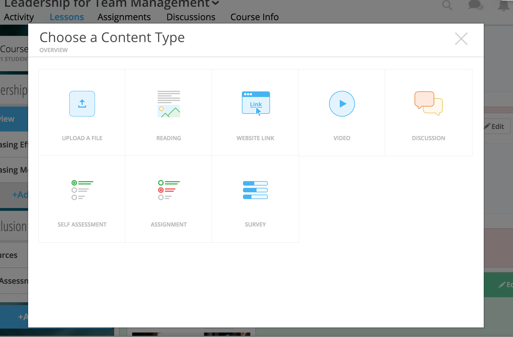

.. note:: Other options are available through our content development team! If you don't see what you want here, be sure to ask NextThought about other supported content!

Add Content
================

Adding content to your course essentially follows the same few steps with the exception of more extensive tools such as uploading files and building readings and assignments.

.. note:: Before adding content, make sure you've already build your course outline (units, lessons, sections). If you haven't done so, please visit https://help.nextthought.com/editorguide/course.html.

**To begin adding content to your course,**

1. Navigate to the "Lessons" tab.
2. Click on the "Start Editing" button in the bottom right-hand corner.

   .. note:: If you do not see this button, you are not in an Instructor, Editor, or Admin account.
   
3. Within the section you want to add content, click "Add Content."

   .. image:: images/addcontentbutton.png

4. Select the content type, fill out required information, follow prompts, and "Add to Lesson."

   .. image:: images/contenttypes.png

For more information regarding specific content types and adding them to your course, please continue to the specific content-named instructions following this page.

Require Content
================

Require certain activities in your course to track learner progress and award credit and certificates. 

.. note:: See more regarding credit here https://help.nextthought.com/editorguide/setup.html#course-credit and certificates here https://help.nextthought.com/editorguide/setup.html#advanced-completion-and-certificates.

By default, when content is placed in a lesson, it is “optional.” While in Edit Mode, instructors, editors, and assistants can mark certain course materials as “Required" by clicking on the dropdown menu on the content piece itself on the Lessons page. You must be in Edit Mode to view this dropdown menu.

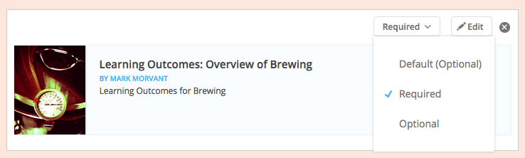

When a resource is marked as “Required,” a label will appear next to the content on the Lessons page.

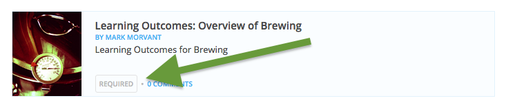

Move Content
================

You can move content two ways:

Edit Flyout Menu
------------------

1. Navigate to the "Lessons" tab.
2. Click on the "Start Editing" button in the bottom right-hand corner.
3. Click "Edit" on the content you'd like to move.

   .. image:: images/editcontentflyout.png

4. Use the position dropdown(s) to move from section to section or the placement within a section.

   .. image:: images/moveposition.png

.. note:: You cannot move content from lesson to lesson. If you'd like to do so, please remove it from the current lesson, and reselect the content from your course resources.
		  

Drag and Drop
--------------

1. Navigate to the "Lessons" tab.
2. Click on the "Start Editing" button in the bottom right-hand corner.
3. Click and hold the content piece you'd like to move.
4. Drag and drop it into a new place.

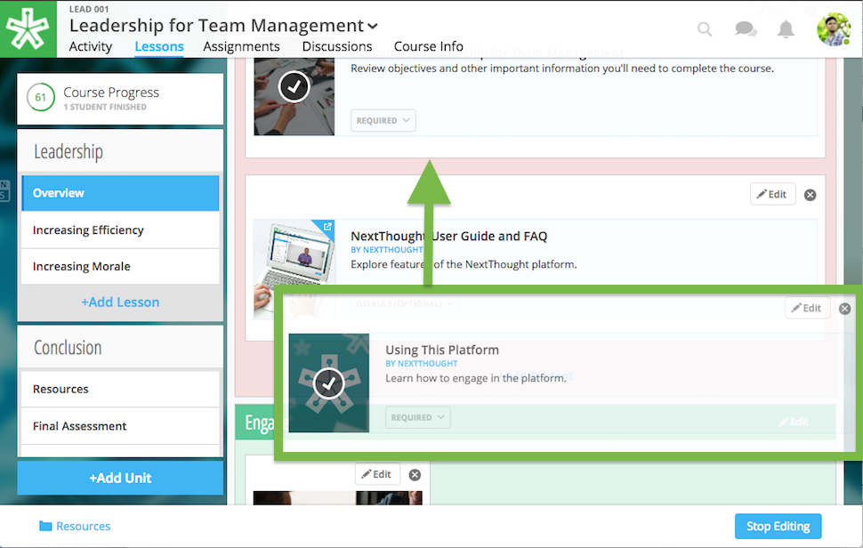

Edit Content
===============

You can edit your course content at any time throughout the duration of your course. Assignments, self assessments, and surveys may have some limitations depending if learners have already begun taking one.

You can edit:

- Thumbnail
- Title
- Author
- Description
- Required Status
- Platform-created content (readings and assignments)

**Edit the thumbnail, title, author, and description:**

1. Navigate to the "Lessons" tab.
2. Click on the "Start Editing" button in the bottom right-hand corner.
3. Click "Edit" on the content.
4. Edit fields of interest.
5. Click "Save."

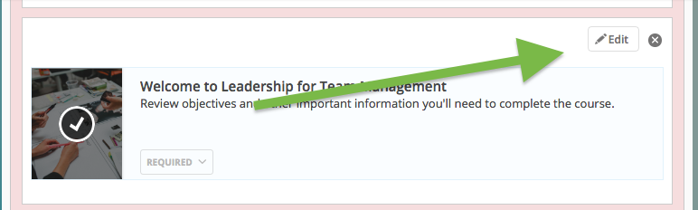

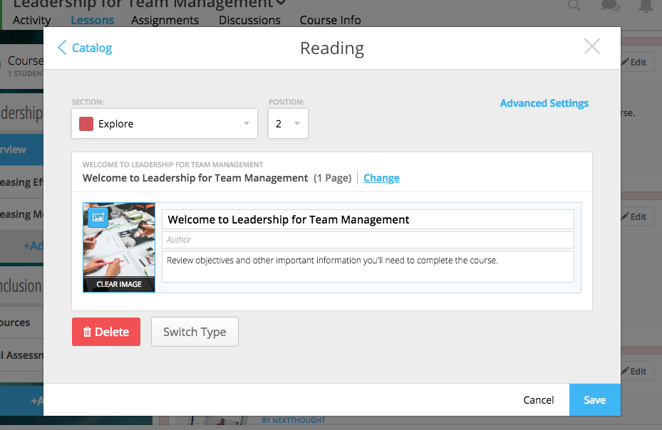

**Edit the required status:**

1. Navigate to the "Lessons" tab.
2. Click on the "Start Editing" button in the bottom right-hand corner.
3. Select the required dropdown, and select the new status. 

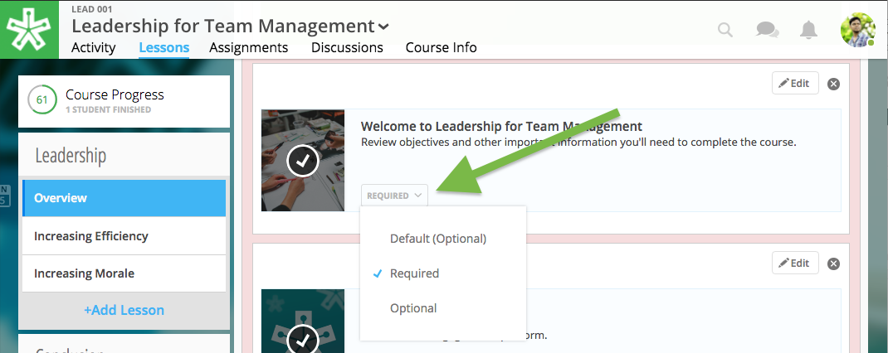

.. note:: Please note, you cannot require a discussion at this time. 

**Edit an assignment:**

1. Navigate to the "Assignments" tab.
2. Select the "Assignments" subtab.
3. Select "Edit" next the the assignment title.
4. Make needed changes. (Edits will save automatically. See exception below.)

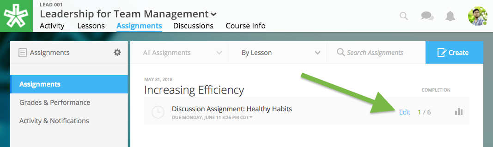

.. warning:: For assignments which have learner activity, you will be prompted to save as you make edits. Please note that some options may not allow modification after learners have begun. You may be prompted to reset the assignment in order to apply certain changes.

**Edit a reading:**

1. Navigate to the "Lessons" tab.
2. Click on the "Start Editing" button in the bottom right-hand corner.
3. Click on the "Resources" folder in the bottom left-hand corner.
4. Select "Edit."
5. Make needed changes. (Edits will save automatically. See exception below.)

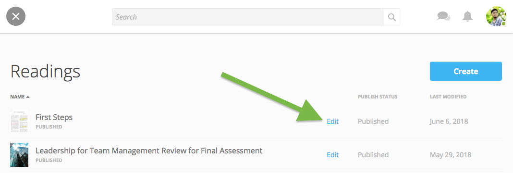

.. warning:: If the reading has already been published, you will need to save your edits manually. To do so, select the "Publish Changes" button in the bottom right-hand corner. Select "Publish" to apply changes.

   .. image:: images/publishchanges.png

Delete Content
================

There are two ways to delete content. You can simply remove content from your Lessons page, which will not delete the content from your course resources. Or, you can delete content permanently from your course.

Remove Content from Lessons
---------------------------

Removing content from your lesson will not necessarily delete it permanently from your course. All types, with the exception of an external link, will remain in your course resources ready for placement in a lesson even if removed from a lesson.

**To remove content from your lesson:**

1. Navigate to the "Lessons" tab.
2. Click on the "Start Editing" button in the bottom right-hand corner.
3. Select the "x" button in the upper right-hand corner of the content.
4. Click "OK" in the warning popup.

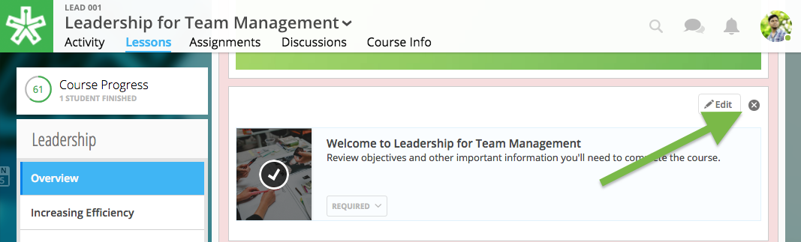

Delete Content from Course
---------------------------

Deleting content from a course is not recoverable. 

**To permanently delete readings and assignments:**

1. Enter reading or assignment editing mode (see "Edit Content" instructions above).
2. Select the publish state button in the bottom right-hand corner.
3. Select "Delete."
4. Confirm deletion.

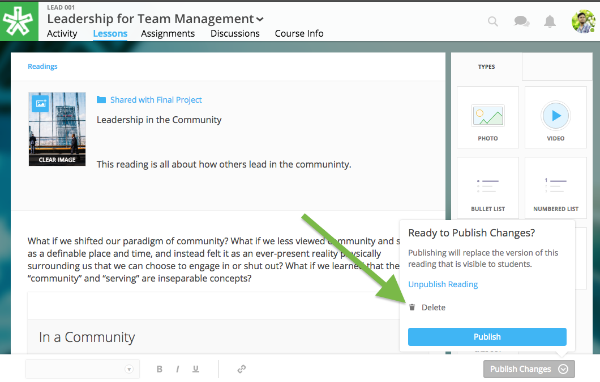

.. warning:: If an assignment has learner submissions, you will need to first reset the assignment before deletion. You must be an instructor or assistant to do so.

**To permanently delete files:**

1. Navigate to the "Lessons" tab.
2. Click on the "Start Editing" button in the bottom right-hand corner.
3. Click "Add Content" in any section.
4. Select "Upload a File."
5. Select "Choose File."
6. Click on the file.
7. Click "Delete" in the menu above.
8. Confirm deletion.

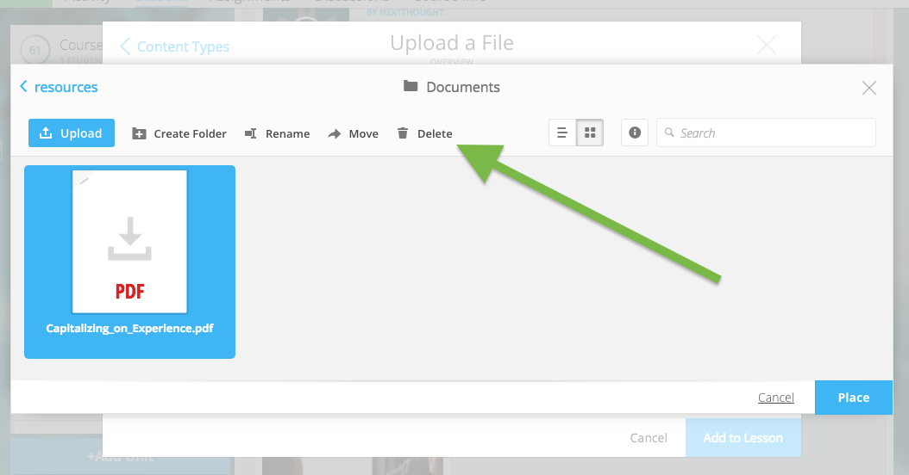

**To permanently delete videos:**

1. Navigate to the "Lessons" tab.
2. Click on the "Start Editing" button in the bottom right-hand corner.
3. Click "Add Content" in any section.
4. Select "Video" in resource selector.
5. Hover over the video and select "Edit."
6. Scroll down and select "Delete."
7. Confirm deletion.
8. Cancel out of the resources selector.

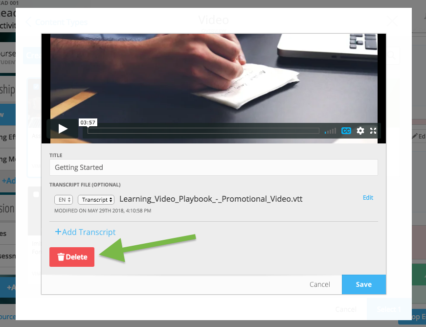

**To permanently delete discussions:**

1. Navigate to the "Discussions" tab.
2. Select and open the discussion.
3. Click "Delete."
4. Confirm deletion.

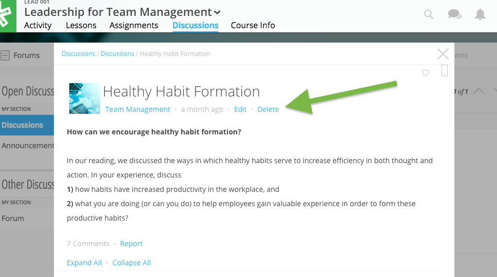

.. warning:: You may not have permission to delete all discussions. 

**To permanently delete links, simply remove link from your Lesson's page.**

