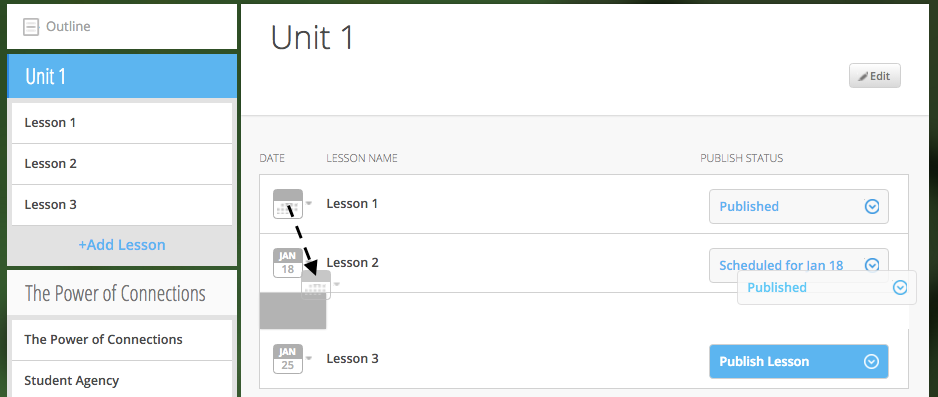
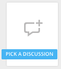

============================
Add and Edit Course Content
============================

Add a variety of content types to make your course more dynamic.

Below is different types of content you can add to your lesson:

-  Readings
-  PDFs, Slides, and Other Downloadable Materials
-  Files from your Computer
-  Videos (From Kaltura, Vimeo, YouTube, Storyline, and others)
-  Video Transcripts
-  Assignments
-  Self-Assessments
-  Discussion Forums
-  External Links
-  Surveys
-  Timelines
-  Images and Video Reels

**You can add content from four different sources.**

-  **Add Content from within the NextThought Application:**

   -  Content created by our NextThought team can be added to the platform
   for placement in a lesson. Content developed or designed by
   NextThought includes readings, videos, discussions, timelines,
   surveys, self-assessments, and assignments. Contact your Project
   Manager to add interactive content to your course.

-  **Add Content from your Computer:**

   -  You can also upload almost any type of file into a lesson including
   Microsoft Office files, PDFs, Images, Zip files, and more.

   .. note::  Most of these file types will be downloadable for students from the application, however, if your file is a PDF, it can be viewed within the platform itself and will allow notes.

-  **Link to Content:**

   -  You can add URL links to your lesson. When a student clicks on this
   type of content, it will open a new tab in their browser window.

-  **Author your own Content:**

    -  NextThought allows you to create your own course assignments (see “Create an Assignment”) as well as in-application readings (see “Create a Reading”)!

Add a File from your Computer
---------------------------------

File uploads are content files that you upload from your computer into
lessons within your course. You can upload most any file, including:

-  Microsoft Office files (Word, Powerpoint, Excel, etc.)
-  PDFs
-  Images (.jpg, .gif, .png)
-  Zip files
-  And others such as .xml, .odt, .rtf, .epub, .mp4, .txt

.. note:: Please note: Only PDFs will display within the application itself. Students can read PDF files within the course and add comments and notes. All other file types will have to be downloaded by students for off-platform viewing. Students will need the appropriate software to open the file.

In order to add content to a section from your computer, follow the
steps below:

#. While in Edit Mode, click on “+Add Content” in the section you want to edit.

   .. warning:: Please note: if you don’t see “+Add Content” you need to first add a section to the lesson page (see the above section on Adding sections to lessons). 

|AddContent.png|

2. In the “Choose a content type” popup, click on “ Upload a File.”

 |Screen Shot 2016-01-08 at 10.14.37 AM.png|

3. Add a file one of two ways: |Screen Shot 2016-01-12 at 9.38.08
   PM.png|

   - Click on the “Choose File” button and browsing your computer file manager for the desired file. Select your file.
   
   - Click and drag a file  from anywhere on your computer to the uploader. 

4. Once you’ve uploaded your file, select the file. Click “Place” to
   choose the file for your lesson. 
5. Add information that students can see about the file.

   - File title (required)
   - File author (optional)
   - File description (optional)
   - File thumbnail image (optional)

   .. note::  You can change the thumbnail image displayed for the file by clicking on the default image, then browsing your computer file manager for the desired image. |UploadFile.png|

6. Click “Add to Lesson” to save your edits and place the file in your
   course.

Add a URL/External Link
-----------------------------

Adding an external link to your course places that site within the
context of your lesson, and allows students to quickly navigate to an
external page. You can link to any valid URL from within your lessons.
Links open in a new tab within your browsing window.

#. While in Edit Mode, click on “+Add Content” in the section you want to edit.
   |AddContent.png|

   .. warning:: Please note: if you don’t see “+Add Content,” you need to first add a section to the lesson page (see the above section on Adding Sections to Lessons). 

 |image38|

2. In the “Choose a content type” popup, click on “External Link.”

3. Add information that students can see about the URL.

   - Link URL (required)
   - Link title (required)
   - Link author (optional)
   - Link description (optional)
   - Link thumbnail image

   .. note::  You can change the thumbnail image displayed for the link by clicking on the default image, then browsing your computer file manager for the desired image. 

4. Click “Add to Lesson” to place your link in the course.

   |AddLink.png|

Add a Video
----------------

You can add a video to your course using the URL or your Project Manager can upload it to your course files. 

Upload and Add Video by URL
^^^^^^^^^^^^^^^^^^^^^^^^^^^^^^^^
Follow the steps below to upload videos to your course files using their URL.

1. Click on “+Add Content” in the section you want to edit.

 |AddContent.png|

   .. warning:: Please note: if you don’t see the “+Add Content,” you need to first add a section to the lesson page (see the above section on Adding Sections to Lessons). 

2. In the “Choose a content type” popup, click on “Pick a Video.”

    |Screen Shot 2016-04-20 at 2.27.42 PM.png|
	
3. Select "Create Video" in the upper left-hand corner.

4. Paste the video link into the URL field.

5. Click "Done."

6. Add a title and (optional) add a transcript using a .vtt file. 

   .. image:: images/videoedit.png

7. Click "Save."

8. Select the video in the catalog. (Your video should already be selected.)

9. After selecting your videos, click the “Select” button in the lower right-hand corner. 
   
   .. note::  Please note: the number of videos you have selected will display in the Select button.

10. After you have selected your videos, confirm your video selections, and place them in the order you want them to appear in your lesson. 

 |image42|

11. Click “Add to Lesson” to place your video(s) in your course.

.. note::  When you select multiple videos at one time, they will appear grouped in the video player. Add the videos one at a time if you want them to appear as individual videos in the lesson.

Add Video by Project Manager
^^^^^^^^^^^^^^^^^^^^^^^^^^^^^^
Once your video is available to you in your course files, follow the steps below to select and place a video
into a lesson.

#. Click on “+Add Content” in the section you want to edit.

 |AddContent.png|

   .. warning:: Please note: if you don’t see the “+Add Content,” you need to first add a section to the lesson page (see the above section on Adding Sections to Lessons). 

2. In the “Choose a content type” popup, click on “Pick a Video.”

    |Screen Shot 2016-04-20 at 2.27.42 PM.png|

3. Select the video or videos you want to add to your lesson by clicking on
   each.

4. After selecting your videos, click the “Select” button in the lower right-hand corner. 
   
   .. note::  Please note: the number of videos you have selected will display in the Select button.

5. After you have selected your videos, confirm your video selections,
   and place them in the order you want them to appear in your lesson. 

 |image42|

6. Click “Add to Lesson” to place your video(s) in your course.

.. note::  When you select multiple videos at one time, they will appear grouped in the video player. Add the videos one at a time if you want them to appear as individual videos in the lesson.

Add a Discussion
----------------------

In order to add a course discussion to your lessons page, your Project
Manager will first need to create and upload it to your course files.
Once your discussion is available to you in your course files, follow
the steps below to select and place it in a lesson.

.. note::  Participation in a discussion can be set up as a required, graded activity. If you are interested in graded discussions, contact your Project Manager.

#. While in Edit Mode, click on “+Add Content” in the section you want to edit.
   |AddContent.png|

.. warning:: Please note: if you don’t see the “+Add Content” banner, you need to first add a section to the lesson page (see the above section on Adding Sections to Lessons).

2. In the “Choose a content type” popup, click on “Pick a Discussion.”

   |Screen Shot 2016-04-20 at 3.40.00 PM.png|

3. Select the discussion you want to add to your lesson by clicking on
   the discussion. 
   
4. After selecting your discussion,  click the “Add to Lesson” button in
   the lower right-hand corner.
   
5. The popup will allow you to change information that students can see
   about the discussion

   - Section that contains the discussion
   - Position of the discussion within the section
   - Discussion title
   - Discussion thumbnail image

.. note::  You can change the thumbnail image displayed for the discussion by clicking on the default image, then browsing your computer file manager for the desired image.

 |image46|

6. Click “Add to Lesson” to place your discussion in the course.

Add a Self-Assessment
----------------------------

Self-assessments are quizzes that students can take for their own
self-evaluation. As a self-check, no grades are posted to the
gradebook. Students can take a self-assessment multiple times, and
solutions are available to view after each attempt.

In order to add a self-assessment to your course, your Project Manager
will need to upload it to your course files. Once your assessment is
available to you in your course files, follow the steps below to select
and place it into a lesson.

#. While in Edit Mode, click on “+Add Content” in the section you want to edit.
   |AddContent.png|

.. warning:: Please note: if you don’t see the “+Add Content” banner, you need to first add a section to the lesson page (see the above section on Adding Sections to Lessons). 

2. In the “Choose a content type” popup, click on “Self Assessment.”
   
   |Screen Shot 2016-04-20 at 4.53.05 PM.png|

3. Select the self-assessment you want to add to your lesson by clicking on it.

4. After selecting your self-assessment, click the “Select” button in
   the lower right-hand corner.

5. After you have selected your self-assessment, the popup will prompt
   you to confirm your selection, and place it in the appropriate
   section and position within the lesson.
   
6. Click “Add to Lesson” to place your self-assessment in the course.

Add an Assignment
----------------------

Adding assignments to your course allows the course to be assessed and
graded. You can create your own assignments (See “PART III: Create an
Assignment”)  or contact your Project Manager to create an assignment
and add it to your course files.

Question Types:

Descriptions for each question type can be found within “Part I: Supported Content: Question Types.”

-  Multiple Choice
-  Multiple Answer
-  Ordering
-  Word Bank/Matching
-  Mathematical Notation
-  Short Answer
-  Essay
-  File Upload
-  Discussion
-  Participation Points
-  FEATURE: Timed
-  FEATURE: Randomization
-  FEATURE: Question Bank
-  FEATURE: Gradebook Entry

Both creating an assignment as well as having a Project Manager create your
assignment places the assignment within your course files. To place
the assignment in a section, follow the steps below:

#. While in Edit Mode, click on “+Add Content” in the section you want to edit.

 |AddContent.png|

.. warning:: Please note: if you don’t see the “+Add Content” banner, you need to first add a section to the lesson page (see the above section on Adding Sections to Lessons).

2. In the “Choose a content type” popup, click on “Assignments.” 

   |Screen Shot 2016-04-21 at 2.42.10 PM.png|

3. Select the assignment you want to add to your lesson by
   clicking on it.

4. After selecting your assignment, click the “Select” button in the
   lower right-hand corner.

 |SelectAssignment.png|

5. After you have selected your assignment, confirm your selection, and
   place it in the appropriate section and position within the lesson.
   |AssignmentConfirm.png|
   
6. Click “Add to Lesson” to place your assignment in the course.

Edit Course Content
============================================

The information added to your content, such as title, description, and
due date, can be edited or changed. In th is section, we will go over
where to find the editing tools and the options that are available.

Edit a Reading
-------------------

1. Within the lesson, click the “Edit” button for the reading you want to
change.

 |EditContent.png|

2. In the popup window, you can change:

   -  The section where the reading is placed
   -  The relative position of the reading within the section
   -  Change the file that is uploaded and displayed
   -  Reading title (required information)
   -  Reading author (optional)
   -  Reading description (optional)
   -  Reading thumbnail image
   -  You can remove a reading from its section, but you cannot undo this deletion. It
   is a permanent action. (Please note: the reading itself will still be
   available for placement from within your course files.)

3. Click “Save” to save your changes.  

 |image54|

Edit a Link (URL)
---------------------

1. Click on the “Edit” button next to the link you want to change.

 |image55|

2. In the Edit popup window, for a link you can change

   -  The section where the link is placed
   -  The relative position of the link within the section
   -  The link URL
   -  Link title (required information)
   -  Link author (optional)
   -  Link description (optional)
   -  Link thumbnail image
   -  You can also delete the link. (Please note: if you delete a link, you cannot undo this deletion. It is a permanent action.)

3. Click “Save” to save your changes.   |image56|

Edit a Video
-----------------

Change the Position or Delete from Lesson
^^^^^^^^^^^^^^^^^^^^^^^^^^^^^^^^^^^^^^^^^

1. Click on the “Edit” button next to the video you want to change. 

2. In the popup window for a video you can change

   -  The section where the video player is placed
   -  The relative position of the video player within the section
   -  The order of the videos within the player
   -  Add additional videos
   -  Delete videos from the carousel
   -  You can also delete the video carousel. (Please note: if you delete the carousel, you can not undo this deletion. It is a permanent action.)
   
    |image57|

3. Click “Save” to save your changes.

 
Edit the Title, Transcript, or Delete from Course Files
^^^^^^^^^^^^^^^^^^^^^^^^^^^^^^^^^^^^^^^^^^^^^^^^^^^^^^^^^^

1. From within a section, click "+Add Content."

2. Select "Pick a Video."

3. Hover over the video you wish to change, and click the "Edit" button that appears.

4. Edit the title in the title field, change the transcript and choose the language, or delete the video.

   .. image:: images/videoedit.png

5. Click "Save."

Edit a Discussion
-----------------------

1. Click on the “Edit” button next to the discussion you want to change. 

2. In the popup window for a discussion, you can change

   -  The section where the discussion is placed
   -  The relative position of the discussion within the section
   -  The discussion title
   -  The discussion thumbnail image
   -  Delete the discussion

3. Click “Save” to save your changes.

 |image58|

Edit a Self-Assessment
-----------------------------

1. Click on the “Edit” button next to the self-assessment you want to
change.

 |image59|
 
2. In the popup window for a self-assessment, you can change

   -  The section where the self-assessment is placed
   -  The relative position of the self-assessment within the section
   -  Delete the self-assessment (Please note: if you delete the
   self-assessment, you cannot undo this deletion. It is a permanent
   action.)

3.  Click “Save” to save your changes.

.. note::  Work with your NextThought Project Manager if you need to change the title of a self-assessment in your course.

 |image60| 

Move Content in a Lesson
-------------------------------

There are two ways to move content:

-  **Lessons View:** Content can be moved within the lessons view into
   another section or within the same section. 

   1. Click and hold on the content tile that you want to move.
   
   2. Drag the item to the desired position within the section, or drag into a different section.

 |MoveContentDraqg.png|

-  **Edit Popup:** You can also move content from the editing popup.

   1. Within the lesson, click the “Edit” button for the content you want
   to change. 

 |EditContent.png|

   In the popup window,

   -  Use the position dropdown to select a new position within the section.
   
   -  Use the section dropdown to  move the lesson to another section.

 |Screen Shot 2016-01-12 at 10.27.47 PM.png|

   2.  Click “Save.

.. warning:: You cannot move content to another lesson or unit.

Edit an Assignment
-----------------------

Below are descriptions how to change the position of the assignment, and the assignment dates. More advanced editing options can be found in Part III in the section titled “Create an Assignment.”

Change Placement
^^^^^^^^^^^^^^^^^^^

1. Click on the “Edit” button next to the assignment you want to change.
 |image61|
 
2. In the popup window for an assignment, you can change

   -  The section where the assignment is placed
   -  The relative position of the assignment within the section
   -  Delete the assignment (Please note: if you delete an assignment, you cannot undo this deletion. It is a permanent action.)

3. Click “Save” to save your changes.

 |image62|

.. note::  Work with your NextThought Project Manager if you need to change the title of an assignment in your course. 

Change Assignment Dates
^^^^^^^^^^^^^^^^^^^^^^^^^^

Assignments can be made available at your discretion, and you also have
the ability to change the due date for the assignment.

There are three locations where you can change assignment dates:

1. **Lessons View (Edit Mode)**

While viewing a lesson in edit mode, click on the assignment date
dropdown under the assignment name.

 |image66|

2. **Assignments View**

Within the assignments page, view the assignments tab. Now, click on
the assignment date dropdown under the assignment name.

 |image67|

3. **Assignment Editing View**

Within the assignments page, view the assignments tab. Now, select the
“Edit” button off to the right-hand side of the assignment name. This
will take you to the editing view for the assignment.

 |image68|

   - Due Date: Find the Due Date flyout in the upper left-hand corner. Click on it to open the flyout. Select “Due Date” to assign a due date. Then, select a calendar date and enter a time. Click “Save” to save the due date.  
   |image69|
   
   -  Publish State Flyout: Find the Publish State Flyout in the bottom right-hand corner. It will display the current publish state. Click on the button to change the publish state.  
   |image70|

.. warning:: Deleting the assignment is a non-recoverable action.

.. note::  To learn more about the assignment editing view, see Part III regarding assignment authoring.

Publish States
^^^^^^^^^^^^^^^^

There are four options within the Assignment date dropdown and flyouts,
including three publish states and a due date option:

 |image71| |image72|

#. **Publish (publish state)**

Selecting this option allows you to publish the assignment immediately.
In other words, students will be able to begin taking the assignment as
soon as the assignment is published.

2. **Schedule (publish state)**

Scheduling the assignment allows you to choose the date and time that
the assignment becomes available for students to view and take. Before
this date, the assignment title can be seen within the lessons and
assignments view, but the student will not be able to click into it to
view questions.

3. **Draft (publish state)**

If not already selected, this option sends the assignment back into
draft mode. This allows the instructor to continue editing the
assignment. While an assignment is in this state, students will not be
able to see the assignment.

.. warning:: This state is only available for authored assignments. Learn more in Part III Create an Assignment.

4. **Due Date (due date)**

Choose the month, date, year and time that the assignment is due.
Assignments are still available once the due date passes, but will be
marked as late in the gradebook if completed after the date has passed.

.. warning:: If an assignment has already been taken by a student, you will have to “Reset Assignment” to access the publish states and change them.

 |image73|

 |image74|

.. |IntroScreen.png| image:: images/image21.png
.. |EditMode.png| image:: images/image8.png
.. |AddUnit.png| image:: images/image46.png

.. |MoveUnit.png| image:: images/image52.png

.. |AddLesson.png| image:: images/image92.png
.. |EditLesson.png| image:: images/image5.png
.. |LessonEditBox.png| image:: images/image60.png
.. |LessonAvailability.png| image:: images/image84.png

.. |ScheduleDate.png| image:: images/image41.png
.. |Screen Shot 2016-01-12 at 8.05.20 PM.png| image:: images/image9.png
.. |UnitSelect.png| image:: images/image20.png

.. |ContentTimeline\_Calendar.png| image:: images/image57.png

.. |EditingTimeline.png| image:: images/image51.png
.. |LessonDrag\_1.png| image:: images/image110.png

.. |LessonDrag\_OutOfOutline.png| image:: images/image113.png

.. |CourseSections\_EditMode.png| image:: images/image2.png

.. |SectionEdit.png| image:: images/image68.png

.. |SectionMoveDrag.png| image:: images/image61.png
.. |SectionPosition\_popup.png| image:: images/image98.png
.. |AddContent.png| image:: images/image19.png
.. |Screen Shot 2016-01-08 at 10.14.37 AM.png| image:: images/image122.png

.. |UploadFile.png| image:: images/image99.png
.. |image38| image:: images/image97.png
.. |AddLink.png| image:: images/image81.png
.. |Screen Shot 2016-04-20 at 2.27.42 PM.png| image:: images/image119.png

.. |image42| image:: images/image69.png

.. |Multi\_Video.png| image:: images/image6.png

.. |image46| image:: images/image16.png

.. |SelfAssessment\_Select.png| image:: images/image18.png
.. |Self\_Assess\_Confirm.png| image:: images/image121.png

.. |SelectAssignment.png| image:: images/image37.png
.. |AssignmentConfirm.png| image:: images/image94.png
.. |EditContent.png| image:: images/image4.png
.. |image54| image:: images/image106.png
.. |image55| image:: images/image93.png
.. |image56| image:: images/image117.png
.. |image57| image:: images/image36.png
.. |image58| image:: images/image47.png
.. |image59| image:: images/image35.png

.. |image61| image:: images/image22.png
.. |image62| image:: images/image74.png
.. |MoveContentDraqg.png| image:: images/image38.png
.. |MoveContent\_NewSection.png| image:: images/image11.png
.. |Screen Shot 2016-01-12 at 10.27.47 PM.png| image:: images/image10.png
.. |image66| image:: images/image78.png
.. |image67| image:: images/image88.png
.. |image68| image:: images/image85.png
.. |image69| image:: images/image25.png
.. |image70| image:: images/image32.png
.. |image71| image:: images/image32.png
.. |image72| image:: images/image65.png
.. |image73| image:: images/image66.png
.. |image74| image:: images/image73.png
