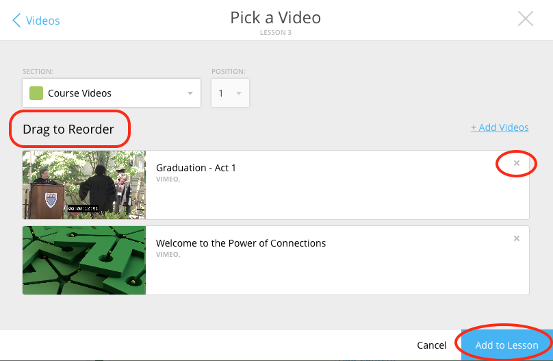

=============================
 Add and Edit Course Content
=============================

Add a variety of content types to make your course more dynamic.

Below is different types of content you can add to your lesson:

-  Readings
-  PDFs, Slides, and Other Downloadable Materials
-  Files from your Computer
-  Videos (From Kaltura, Vimeo, YouTube, Storyline, and others)
-  Video Transcripts
-  Assignments
-  Self-Assessments
-  Discussion Forums
-  External Links
-  Surveys
-  Timelines
-  Images and Video Reels

Edit Course Content
===================

The information added to your content, such as title, description, and
due date, can be edited or changed. In th is section, we will go over
where to find the editing tools and the options that are available.

Move Content in a Lesson
------------------------

There are two ways to move content:

-  **Lessons View:** Content can be moved within the lessons view into
   another section or within the same section. 

   1. Click and hold on the content tile that you want to move.
   
   2. Drag the item to the desired position within the section, or drag into a different section.

 |MoveContentDraqg.png|

-  **Edit Popup:** You can also move content from the editing popup.

   1. Within the lesson, click the “Edit” button for the content you want
   to change. 

 |EditContent.png|

   In the popup window,

   -  Use the position dropdown to select a new position within the section.
   
   -  Use the section dropdown to  move the lesson to another section. 

 |Screen Shot 2016-01-12 at 10.27.47 PM.png|

   2.  Click “Save.

.. warning:: You cannot move content to another lesson or unit.

.. |IntroScreen.png| image:: images/image21.png
.. |EditMode.png| image:: images/image8.png
.. |AddUnit.png| image:: images/image46.png
.. |Screen Shot 2016-01-12 at 1.51.39 PM.png| image:: images/image17.png
.. |UnitEditBox.png| image:: images/image30.png
.. |MoveUnit.png| image:: images/image52.png
.. |UnitPositionPopup.png| image:: images/image108.png
.. |AddLesson.png| image:: images/image92.png

.. |LessonEditBox.png| image:: images/image60.png

.. |Schedule\_Outline.png| image:: images/image49.png
.. |SchedulingLessons.png| image:: images/image86.png
.. |ScheduleDate.png| image:: images/image41.png
.. |Screen Shot 2016-01-12 at 8.05.20 PM.png| image:: images/image9.png
.. |UnitSelect.png| image:: images/image20.png
.. |Availabilty\_Unit.png| image:: images/image39.png
.. |ContentTimeline\_Calendar.png| image:: images/image57.png
.. |ContentTimeline\_Lesson.png| image:: images/image116.png
.. |ContentTimeline\_Location.png| image:: images/image12.png
.. |EditingTimeline.png| image:: images/image51.png
.. |LessonDrag\_1.png| image:: images/image110.png
.. |LessonMovePopup.png| image:: images/image14.png
.. |LessonDrag\_Unit.png| image:: images/image120.png
.. |LessonDrag\_IntoOUtline.png| image:: images/image118.png
.. |LessonDrag\_OutOfOutline.png| image:: images/image113.png
.. |CourseSections\_ViewMode.png| image:: images/image31.png

.. |AddSection.png| image:: images/image105.png
.. |SectionEdit.png| image:: images/image68.png
.. |SectionEditButton.png| image:: images/image50.png
.. |SectionEdit.png| image:: images/image90.png
.. |SectionMoveDrag.png| image:: images/image61.png

.. |Screen Shot 2016-01-08 at 10.14.37 AM.png| image:: images/image122.png
.. |Screen Shot 2016-01-12 at 9.38.08 PM.png| image:: images/image62.png
.. |UploadFile.png| image:: images/image99.png

.. |AddLink.png| image:: images/image81.png
.. |Screen Shot 2016-04-20 at 2.27.42 PM.png| image:: images/image119.png
.. |VideoPicker\_Screenshot.png| image:: images/image28.png

.. |VideoCarousel.png| image:: images/image104.png
.. |Multi\_Video.png| image:: images/image6.png
.. |Screen Shot 2016-04-20 at 3.40.00 PM.png| image:: images/image55.png

.. |Screen Shot 2016-04-20 at 4.53.05 PM.png| image:: images/image111.png
.. |SelfAssessment\_Select.png| image:: images/image18.png
.. |Self\_Assess\_Confirm.png| image:: images/image121.png
.. |Screen Shot 2016-04-21 at 2.42.10 PM.png| image:: images/image13.png
.. |SelectAssignment.png| image:: images/image37.png
.. |AssignmentConfirm.png| image:: images/image94.png
.. |EditContent.png| image:: images/image4.png

.. |image55| image:: images/image93.png
.. |image56| image:: images/image117.png
.. |image57| image:: images/image36.png
.. |image58| image:: images/image47.png

.. |image60| image:: images/image95.png
.. |image61| image:: images/image22.png

.. |MoveContent\_NewSection.png| image:: images/image11.png

.. |image67| image:: images/image88.png
.. |image68| image:: images/image85.png
.. |image69| image:: images/image25.png
.. |image70| image:: images/image32.png
.. |image71| image:: images/image32.png

.. |image73| image:: images/image66.png
.. |image74| image:: images/image73.png
