===========================
Create Your Course Outline
===========================

The NextThought application allows instructors to build their own course
with our authoring tools. The authoring tools allow you a wide range of
functionality including building the course outline (lessons, units,
sections), adding course materials (readings, videos, discussions, links, files),
creating assignments, creating readings, and more.

Getting Started: Content Organization
=======================================

All NextThought courses have an organizational layout that
includes units, lessons, and sections.

.. image:: images/authoringorganization.png

-  **Unit:** A “unit” simply acts as a header for several lessons. Each unit
   contains one or more lessons. Units can be further organized into
   lessons.
-  **Lesson:** A “lesson” is the main content module for the course. When a
   learner enters a course from the homepage, they will be viewing the
   first course lesson. Lessons can be further organized into sections.
-  **Section:**  A “section” is the lowest level organization for course
   materials. Sections divide and organize materials within the lesson
   with a section header.
   
   
**Course Default View**

When you enter your course from the homepage, it opens into the Lessons View. You will be viewing the course as if you were a learner.

To modify course content, click on the “Start Editing” button in the lower right-hand corner to switch to Edit Mode.

.. note:: The Start Editing button is only available on the Lessons View. 

Course Units
=============================

Lessons are organized into units.

Each course must have at least one unit. You may want to organize your
course units by weeks, by topics, or by content types. How you structure
your course is up to you.

Add a Unit
-------------
 
1. On the Lessons View, click on the “Start Editing” button in the bottom right-hand corner.
2. Click the “+Add Unit” at the bottom of the course outline.
3. Type in a title for the unit.
4. Hit the return key to create the unit.

.. note::  While in Edit Mode, you will see all of your existing units and lessons in the course outline, including published, draft, and scheduled lessons.

Edit a Unit
--------------------

NextThought tools allow you to edit, move, and delete units as needed
after creation.

First, open the Edit Unit Flyout:

1. Select the unit you want to edit by clicking on the unit title in the course outline.
2. Now, select the “Edit” button. This opens the **Edit Unit Flyout.**
   .. image:: images/editunit.png
3. After you have made changes, click “Save” to implement your changes.

In the **Edit Unit Flyout,** you can change

-  the title of the unit,
-  the relative position of the unit in the course outline,
-  and delete the unit.
    .. warning:: Please note: if you delete a unit, you can not undo this deletion.

Move a Unit
-----------------

There are two ways to move a unit’s position:

**Course Outline:** Units can be moved within the course outline. 

1. Click and hold on the unit title that you want to move. 
2. Drag unit to the desired position in the course outline. 

**Edit Unit Flyout:** You can also move a unit in the Edit Unit Flyout.

1. Select the unit you want to edit by clicking on the unit title in the course outline.
2. Click the “Edit” button. 
   .. image:: images/editunit.png
3. In the Edit Unit Flyout, use the position dropdown to select a new unit position.
4. Click “Save” to implement your changes.

Course Lessons
================

Once you have created a unit, you can add lessons.

Lessons hold your course content and are the main content delivery
module for all courses. A lesson must be contained within a unit, and
you may have multiple lessons within a unit. Your course must have at
least one unit and one Lesson. 

Add a Lesson to a Unit
--------------------------------------

After creating your unit, add a lesson to the unit.

1. If you are in View Mode, click on the Start Editing button in the bottom right-hand corner to switch to Edit Mode. 
2. Select the unit you want to add a lesson to by clicking on the unit title in the course outline. 
3. Click on “+Add Lesson” at the bottom of the unit in the outline.
4. Type in a title for the lesson.
5. Hit the “return” key to create the lesson.

.. image:: images/addlesson.png

Edit a Lesson
-------------------

NextThought tools allow you to edit, move, and delete lessons as needed
after creation.

To open the Edit Lesson Flyout:

1. Select the lesson you want to edit by clicking on the lesson title in the course outline.
2. Click the “Edit” button to the right of the lesson title. This opens the Edit Lesson Flyout.

.. image:: images/editlesson.png

In the **Edit Lesson Flyout,** you can

-  edit the title of the lesson,
-  change the relative position of the lesson in its unit,
-  move the lesson to a different unit,
-  and delete the lesson. 
    .. warning:: Please note: if you delete a lesson, you can not undo this deletion. 

.. image:: images/editlessonflyout.png

After you have made changes, click “Save” to implement your changes.

Set the Lesson Availability
---------------------------------

The **Publish State Flyout** controls when students are able to view the
lesson and includes three states: Publish Now, Schedule, and Draft.  

- **Draft:** Lesson is visible ONLY to instructors/editors/admin and only in Edit Mode. When a lesson is created, it automatically defaults to “Draft” until the instructor changes its status.
- **Publish Now:** Immediately make lesson fully visible to students.
- **Schedule:** Schedule lesson to be fully visible to students on a certain date and time. The lesson title will appear as lighter grey text until the start date has passed. Students will see this text, but will not be able to view the lesson. Instructors will only be able to click on and view a scheduled lesson when in Edit Mode.

.. note:: Lessons can be changed between these three different states at any time.

To Publish Now or send the lesson back to Draft, simply select the
desired status in the Publish State Flyout. And click "Save."

To **schedule a lesson,** follow the instructions below:

1. Select “Schedule” in the Publish State Flyout.
2. Select the date and enter a time.
3. Click “Save.” The scheduled date will now appear in the Publish State Flyout.

Set the Lesson Time Frame
-------------------------------------------------------------------------------------------------------------------------------------------

The Lesson time frame is a calendar that learners can use to help them
stay on track for your course. 

The time frame start date appears to the left of a lesson when a mouse
or pointer hovers over a particular lesson in the course outline, or
when a lesson is selected. The start and end date is also displayed over the lesson title on the specific lesson’s page.

.. image:: images/timeframe.png

To edit the lesson time frame,

1. Click on the calendar icon within a lesson.
2. Set the Begin Date by clicking on a calendar date and adding a time.
3. Set the Finish Date by clicking the Finish Date tab and selecting a calendar date and adding a time. 
4. Click “Save.” 

.. image:: images/startenddatetimeframe.png

.. note::  Setting a start and end date does not restrict access to your lesson. Please "Schedule" your lesson to restrict access.

Move a Lesson  
-----------------

There are three ways to move a lesson:

**Course Outline:** Lessons can be moved within the course outline. 

.. image:: images/

1. Click and hold on the lesson title that you want to move.
2. Drag that lesson to the desired position in the course outline. 

**Edit Lesson Flyout:** You can also move a lesson in the Edit Lesson Flyout.
   
.. image:: images/

1. Select the lesson you want to edit by clicking on the lesson title in the course outline.
2. Click the lesson “Edit” button. 
3. In the Edit Lesson Flyout, use the position dropdown to select a new lesson position with the unit, or use the unit dropdown to move the lesson to another unit 
4. Click “Save.”

**Unit Page:** Lessons can also be moved within the unit page, either within the unit or to another unit.

.. image:: images/

   **Move the lesson within the unit:**

   1. Click and hold on the lesson title that you want to move.
   2. Drag the lesson to the desired position on the unit page.

   **Move the lesson to another unit:**  
   
   1. Click and hold on the lesson title that you want to move.
   2. Drag the lesson to the desired position in the desired unit on the course outline.

   **Move a lesson from the outline to the viewed unit.**

   1. Click and hold on the lesson title that you want to move.
   2. Drag the lesson from the outline  into a selected unit page.

Course Sections
=================

Lesson pages are further organized into sections. Sections organize your lesson with titled, colored dividers. 

.. note:: A lesson page must have at least one section to add content.

Add a Section to a Lesson
------------------------------

Before you add content to your lesson, you’ll need to add sections.

1. If you are in View Mode, click on the “Start Editing” button in the lower right-hand corner to switch to Edit Mode.  
2. Select a lesson by clicking on the lesson title in the course outline.
3. Click on “+Add Section." This will open a window to edit your section. 
4. In the editing window:

   - Type a title for the “Section name.”
   - Select a color for the section label.

5. Click “Add to Lesson” to create the section.

Edit a  Section 
---------------------

First, open the Edit Section Flyout, by clicking the section’s “Edit” button located in the section’s header.

.. image:: images/

In the Edit Section Flyout, you can

-  edit the title of the section,
-  change the relative position of the section within the lesson,
-  change the color of the section label,
-  and delete the section. 
    .. warning:: Please note: if you delete a section, you can not undo this deletion. 

.. image:: images/

After you have made changes, click “Save” to implement your changes.

Move a Section
-------------------

There are two ways to move a section:

**Lessons View:** Sections can be moved within the lessons page.

.. image:: images/

1. Click and hold on the section title that you want to move.
2. Drag section to the desired position within the lesson.

**Edit Section Flyout:** You can also move a section in the Edit Section Flyout.

1. Within the lesson, click the “Edit” button for the section you want to change. 
2. In the Edit Section Flyout, use the position dropdown to select a new section position within the lesson.
3. Click “Save” to implement your changes.

.. note::  You cannot move a section to another lesson or unit.

.. |IntroScreen.png| image:: images/image21.png
.. |EditMode.png| image:: images/image8.png
.. |AddUnit.png| image:: images/image46.png
.. |Screen Shot 2016-01-12 at 1.51.39 PM.png| image:: images/image17.png
.. |UnitEditBox.png| image:: images/image30.png
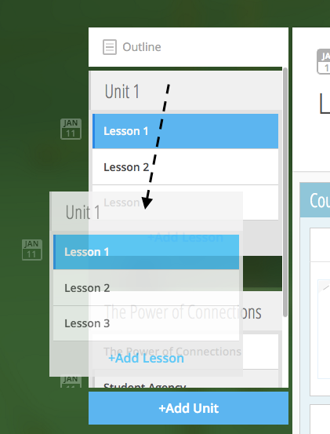
.. |UnitPositionPopup.png| image:: images/image108.png
.. |AddLesson.png| image:: images/image92.png
.. |EditLesson.png| image:: images/image5.png
.. |LessonEditBox.png| image:: images/image60.png
.. |LessonAvailability.png| image:: images/image84.png
.. |Schedule\_Outline.png| image:: images/image49.png
.. |SchedulingLessons.png| image:: images/image86.png
.. |ScheduleDate.png| image:: images/image41.png
.. |Screen Shot 2016-01-12 at 8.05.20 PM.png| image:: images/image9.png
.. |UnitSelect.png| image:: images/image20.png
.. |Availabilty\_Unit.png| image:: images/image39.png
.. |ContentTimeline\_Calendar.png| image:: images/image57.png
.. |ContentTimeline\_Lesson.png| image:: images/image116.png
.. |ContentTimeline\_Location.png| image:: images/image12.png
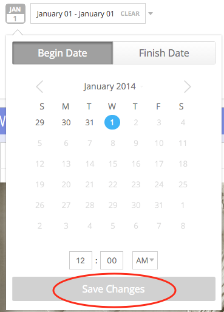
.. |LessonDrag\_1.png| image:: images/image110.png
.. |LessonMovePopup.png| image:: images/image14.png
.. |LessonDrag\_Unit.png| image:: images/image120.png
.. |LessonDrag\_IntoOUtline.png| image:: images/image118.png
.. |LessonDrag\_OutOfOutline.png| image:: images/image113.png
.. |CourseSections\_ViewMode.png| image:: images/image31.png
.. |CourseSections\_EditMode.png| image:: images/image2.png
.. |AddSection.png| image:: images/image105.png
.. |SectionEdit.png| image:: images/image68.png
.. |SectionEditButton.png| image:: images/image50.png
.. |SectionEdit.png| image:: images/image90.png
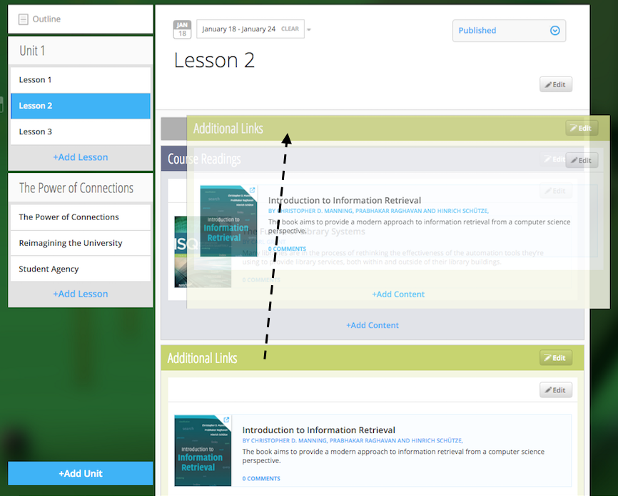
.. |SectionPosition\_popup.png| image:: images/image98.png
.. |AddContent.png| image:: images/image19.png
.. |Screen Shot 2016-01-08 at 10.14.37 AM.png| image:: images/image122.png
.. |Screen Shot 2016-01-12 at 9.38.08 PM.png| image:: images/image62.png
.. |UploadFile.png| image:: images/image99.png
.. |image38| image:: images/image97.png
.. |AddLink.png| image:: images/image81.png
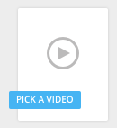
.. |VideoPicker\_Screenshot.png| image:: images/image28.png
.. |image42| image:: images/image69.png
.. |VideoCarousel.png| image:: images/image104.png
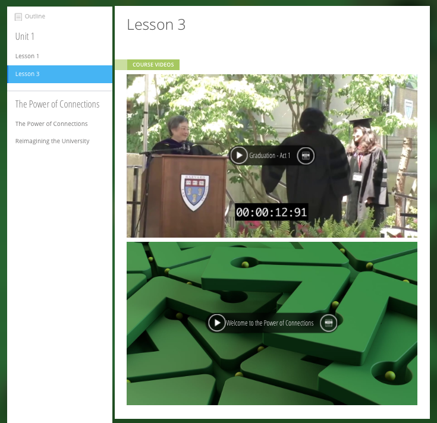
.. |Screen Shot 2016-04-20 at 3.40.00 PM.png| image:: images/image55.png
.. |image46| image:: images/image16.png
.. |Screen Shot 2016-04-20 at 4.53.05 PM.png| image:: images/image111.png
.. |SelfAssessment\_Select.png| image:: images/image18.png
.. |Self\_Assess\_Confirm.png| image:: images/image121.png
.. |Screen Shot 2016-04-21 at 2.42.10 PM.png| image:: images/image13.png
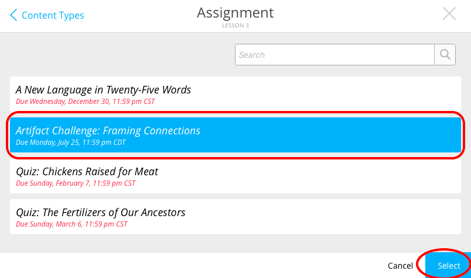
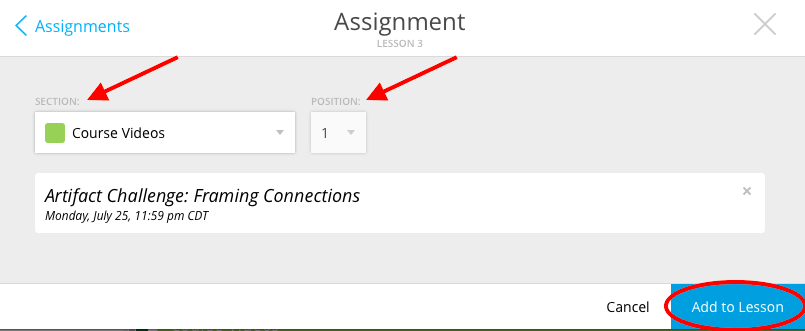
.. |EditContent.png| image:: images/image4.png
.. |image54| image:: images/image106.png
.. |image55| image:: images/image93.png
.. |image56| image:: images/image117.png
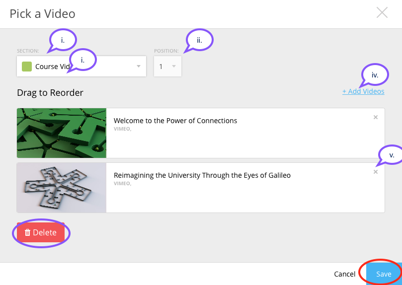
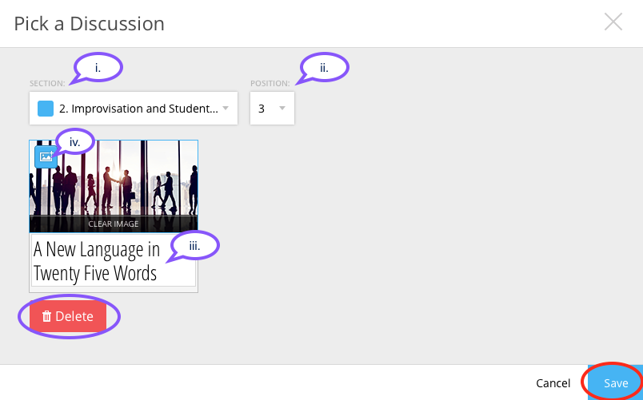
.. |image59| image:: images/image35.png
.. |image60| image:: images/image95.png
.. |image61| image:: images/image22.png
.. |image62| image:: images/image74.png
.. |MoveContentDraqg.png| image:: images/image38.png
.. |MoveContent\_NewSection.png| image:: images/image11.png
.. |Screen Shot 2016-01-12 at 10.27.47 PM.png| image:: images/image10.png
.. |image66| image:: images/image78.png
.. |image67| image:: images/image88.png
.. |image68| image:: images/image85.png
.. |image69| image:: images/image25.png
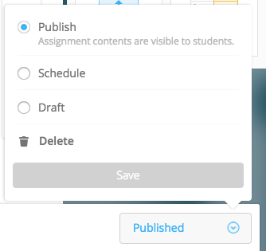

.. |image72| image:: images/image65.png
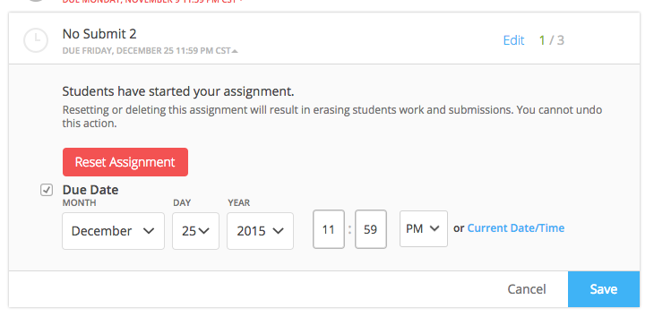
.. |image74| image:: images/image73.png
