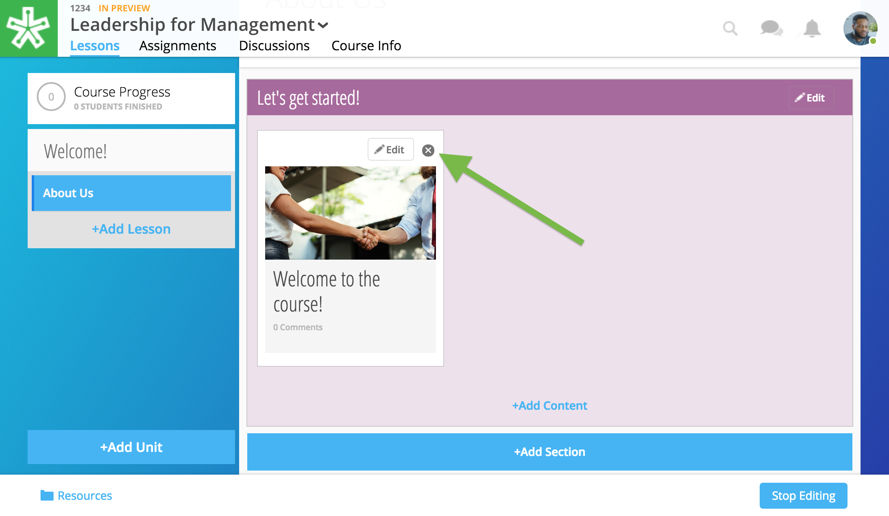

======================
Discussions
======================

Provide learners a space to meet, discuss, and engage in conversation regarding their training, program, or course. Our discussions allow a range of features including images, image markup, whiteboards, file attachments, and videos.

Create Discussion
==================

**To create a discussion:**

1. Navigate to the Discussions page.

   .. image:: images/discussionstab.png
   
2. Click on the "New Discussion" button.

   .. image:: images/newdiscussion.png

   .. note:: If you do not see this button, you may need to first select "Add Forum" on the bottom left-hand corner. Discussions are organized by Forums.

3. Add a title, tags, and your discussion prompt. You can also add a video, whiteboard, or file attachment by selecting the paper clip icon.

   .. image:: images/coursediscedit.png
   
4. Click Save.

   .. image:: images/coursediscpub.png

Add Discussion
===============

If you've already created a discussion, it currently exists only within your course's forum. Place it within a lesson to contextualize the discussion within lesson content.

.. note::  Participation in a discussion can be set up as a required, graded activity. If you are interested in graded discussions, contact NextThought.

1. Navigate to the Lessons page.
2. Click "Start Editing" in the bottom right-hand corner.
3. While in Edit Mode, click on “+Add Content” in the section you want to place the discussion.

   .. image:: images/addcontentvid.png

   .. warning:: Please note: if you don’t see the “+Add Content” banner, you need to first add a section to the lesson page (see the above section on Adding Sections to Lessons).

4. Select “Discussion” in the “Choose a content type” window.

   .. image:: images/contentdiscussion.png

5. Select the discussion you want to add to your lesson by clicking on the discussion. 

   .. image:: images/selectdiscussion.png
   
6. After selecting your discussion, click the “Add to Lesson” button in the lower right-hand corner.
   
7. Add information that learners can see about the discussion.

   - Section that contains the discussion
   - Position of the discussion within the section
   - Discussion title
   - Discussion thumbnail image
   
   .. image:: images/editflyoutdiscussion.png

   .. note::  You can change the thumbnail image displayed for the discussion by clicking on the default image, then browsing your computer file manager for the desired image.

8. Click “Add to Lesson” to place your discussion in the course.

Edit Discussion
==================

**To edit the display name or thumbnail:**

1. While in Edit Mode, click on “+Add Content” in the section you want to edit.
2. Click "Edit" on the content.

   .. image:: images/editdiscussion.png
   
3. Make necessary edits.

   -  The section where the discussion is placed
   -  The relative position of the discussion within the section
   -  The discussion title
   -  The discussion thumbnail image
   -  Delete the discussion
   
   .. image:: images/editdiscussionflyout.png

4. Click “Save” to save your changes.

**To edit the discussion content:**

1. Navigate to the Discussions page.

   .. image:: images/discusspage.png
   
2. Open the discussion you wish to edit by clicking on it.

   .. image:: images/opendiscuss.png
   
3. Select "Edit."

   .. image:: images/editdiscuss2.png
   
4. Make your edits.

   .. image:: images/discusseditmode.png
   
5. Click "Save."

Delete Discussion
=================

**To permanently delete discussion:**

1. Navigate to the Discussions page.

   .. image:: images/discusspage.png
   
2. Open the discussion you wish to edit by clicking on it.

   .. image:: images/opendiscuss.png
   
3. Select "Delete."

   .. image:: images/deletediscuss.png
   
4. Confirm deletion.

**To remove from lesson, simply click the "x" on the content item on the Lessons page.**

