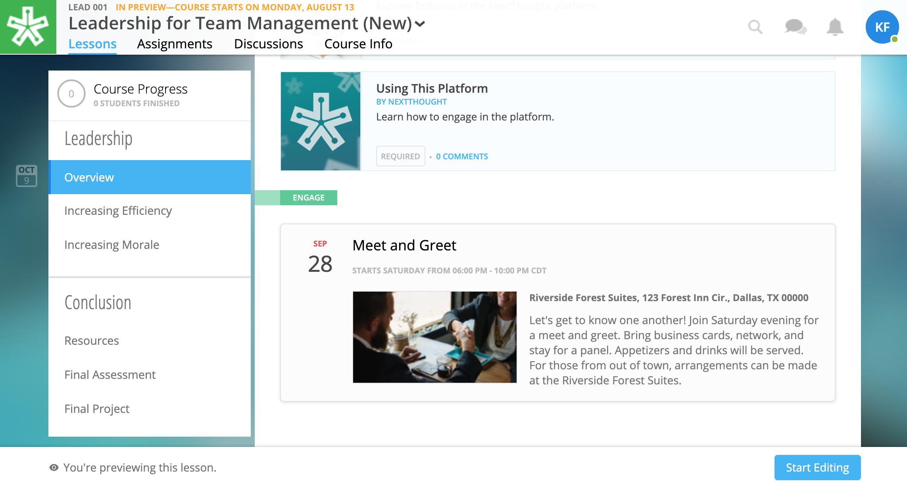

======================
Events
======================

Use Events to inform learners of upcoming in-person or online events. Events are tied to a NextThought course and display both within a Lesson and within the user's NextThought calendar. Learners can use the Calendar feature to sync events with their personal calendar app such as Google Calendar or iCal so they can always stay up-to-date with your Course's important happenings.

Add Event
=======================

1. While in Edit Mode, click on “+Add Content” in the section you want to place an event.

   .. image:: images/eventaddcontent.png

   .. warning:: Please note: if you don’t see “+Add Content,” you need to first add a section to the lesson page. 

2. Select “Event” in the “Choose a content type” window.

   .. image:: images/eventcontenttype.png
   
3. Click the "+" button to add an event.

   .. image:: images/eventadd.png

4. Add information that learners can see about the event.

   - Event title (required)
   - Event thumbnail (optional)
   - event description (optional)
   - Event location (optional)
   - Event date and time (required)
   
   .. image:: images/eventinfo.png

   .. note::  You can change the thumbnail image displayed for the event by clicking on "Add an Image", then browsing your computer file manager for the desired image. 

5. Click “Add to Lesson” to place your event in the course.

   .. image:: images/eventedit.png

   
Edit or Delete Event
======================

**To edit the event:**

1. Click on the “Edit” button next to the event you want to change.

   .. image:: images/eventlessonedit.png
   
2. Make necessary edits.

   -  Event title 
   -  Event thumbnail
   -  Event description
   -  The section where the event is placed
   -  The relative position of the event within the section
   -  Event location
   -  Event date and time
   -  You can also delete the event. (Please note: if you delete an event, you cannot undo this deletion. It is a permanent action.)

   .. image:: images/eventdelete.png

3. Click “Save.”

**To remove the event from your lesson and delete, simply select the "x" icon to the right of the content on the Lessons page. Then, confirm deletion.**

   .. image:: images/eventlessonedit.png