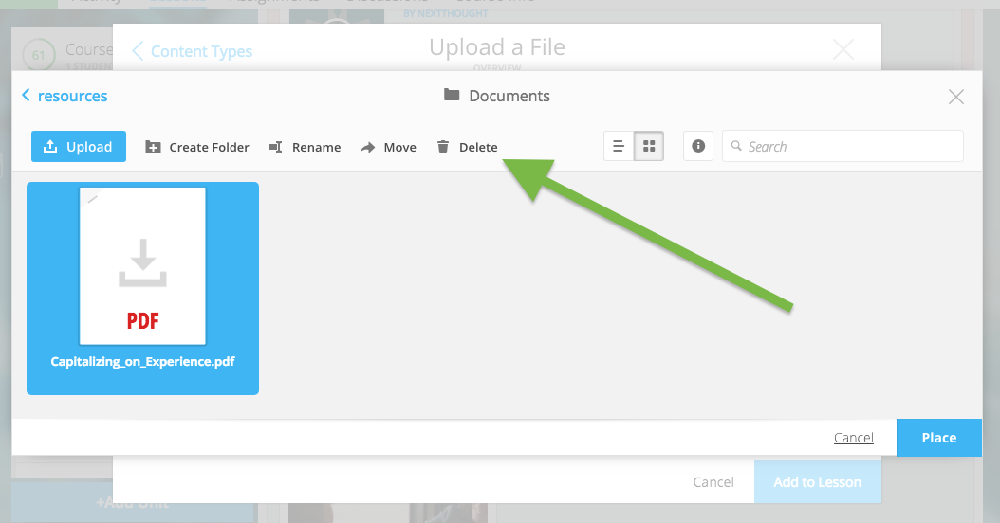

======================
Computer Files
======================

File uploads are content files that you upload from your computer into
lessons within your course. You can upload most any file, including:

-  Microsoft Office files (Word, Powerpoint, Excel, etc.)
-  PDFs
-  Images (.jpg, .gif, .png)
-  Zip files
-  And others such as .xml, .odt, .rtf, .epub, .mp4, .txt

.. note:: Please note: Only PDFs will display within the application itself. Students can read PDF files within the course and add comments and notes. All other file types will have to be downloaded by students for off-platform viewing. Students will need the appropriate software to open the file.

Add File
============

**In order to add a file to your lesson:**

1. While in Edit Mode, click on “+Add Content” in the section you want to edit.

   .. warning:: Please note: if you don’t see “+Add Content” you need to first add a section to the lesson page.

2. In the “Choose a content type” popup, select on “Upload a File.”

   .. image:: images/

3. Add a file one of two ways:

   - Click and drag a file from anywhere on your computer to the uploader. 
   
   - Click on the “Choose File” button and select the blue "Upload" button to browse your files. Select your file.
   
      .. image:: images/
   
4. Once you’ve uploaded your file, select the file. Click “Place” to choose the file for your lesson. 

      .. image:: images/
	  
5. Add information that learners can see about the file.

   - File title (required)
   - File author (optional)
   - File description (optional)
   - File thumbnail image (optional)
   
      .. image:: images/

   .. note::  You can change the thumbnail image displayed for the file by clicking on the default image, then browsing your computer file manager for the desired image. 

6. Click “Add to Lesson” to save your edits and place the file in your course.

   .. image:: images/
   
Edit File
==========

**To edit file thumbnail, title, author, or description:**

1. While in Edit Mode, click on “+Add Content” in the section you want to edit.
3. Click "Edit" on the content.
4. Edit fields of interest.
5. Click "Save."

.. image:: images/

.. image:: images/

.. note:: If you want to edit the file itself, please open the file from your computer files and edit on the appropriate software on your computer (e.g., Microsoft Word). Then, remove the old content, and upload the updated version.

Delete File
===========
   
**To permanently delete files:**

1. Navigate to the "Lessons" tab.
2. Click on the "Start Editing" button in the bottom right-hand corner.
3. Click "Add Content" in any section.
4. Select "Upload a File."
5. Select "Choose File."
6. Click on the file.
7. Click "Delete" in the menu above.
8. Confirm deletion.

