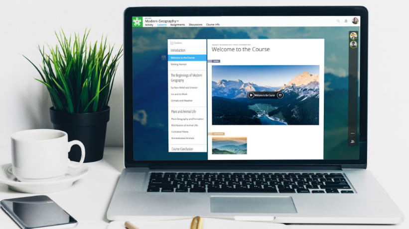

=================
Editor Guide
=================

.. toctree::
	:maxdepth: 1

	course
	assignment
	reading

Welcome to NextThought! We’re excited that you’ve chosen to partner with us in building the future of online learning.

Our platform offers a multitude of features to manage, facilitate, create, and customize your learning environment. We’re unlike any learning platform you’ve experienced before, so we want to be sure and cover all of your questions. In this guide we want to walk you through our platform: from helping you understand the types of content we support, to building an entire course! Of course, you may not need all the explanation provided, so feel free to skip around in this guide to find what you’re looking for.

If you have any questions, please do not hesitate to contact us. Typically you will have been assigned to a Project Manager to take care of any questions or concerns. If you do not know who to contact, you can always contact us at support@nextthought.com.

Enjoy your course!

The NextThought Team

