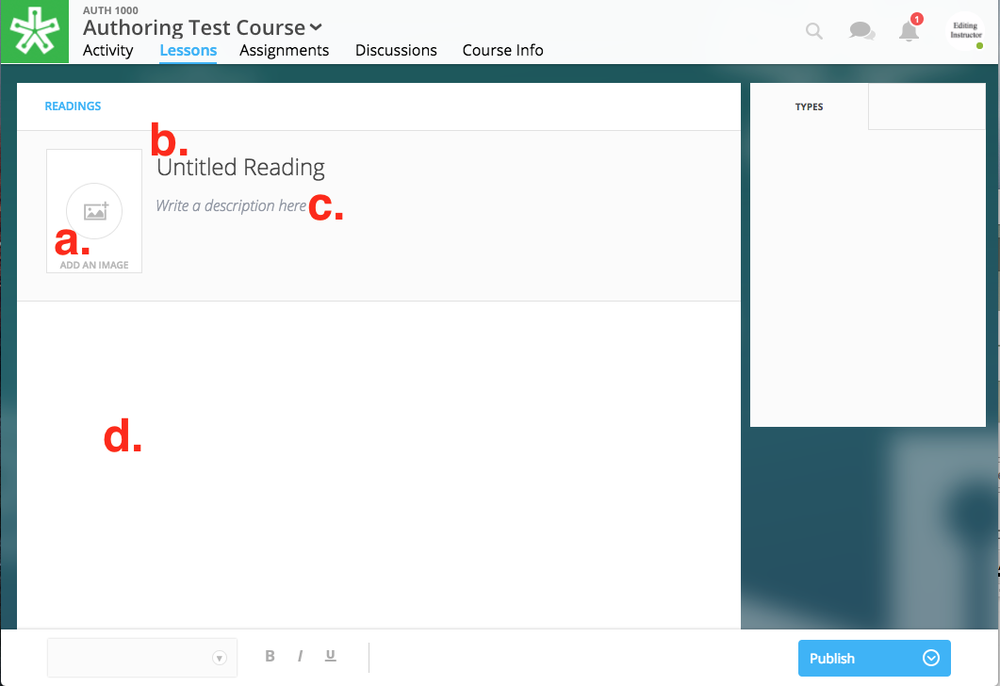

======================
Readings
======================

Our authoring tools allow you to create a reading to place within your
course lesson. Unlike an embedded text such as a PDF, an authored
reading allows students to comment inline with the text and highlight.

Create a Reading
----------------
Creating a reading allows you to offer a more dynamic experience for your learners. A reading allows learners to comment inline with their text, markup images, watch videos, and more.

Described below are two methods to create a reading. One is optimized for immediate placement in a lesson, and the other is optimized to create a reading to place later.

1. Create a Reading for Immediate Lesson Placement
^^^^^^^^^^^^^^^^^^^^^^^^^^^^^^^^^^^^^^^^^^^^^^^^^^

1. While within your course’s Lessons View, enter "Edit Mode" by clicking "Start Editing" in the bottom right-hand corner.
    
	|image114|
  
2. Navigate to the lesson in which you'd like to place your reading.
  
3. Locate the section in which you'd like to place your reading, or create a new section.
  
4. Click "+Add Content" 
  
5. Select "From Catalog" in the "Choose a content type" window.

  .. note:: In this window, you can find all of the readings created by NextThought or authored by you.
  
  |image123|
  
6. Click "Create Content" in the upper left-hand corner.
  
7. Add a title, author, and description for your course. The latter two are optional. You may also add a thumbnail to your reading by clicking on the blue thumbnail button. This is the image that will display on your lessons page.
  
8. Click "Add to Lesson." This will now navigate you into the reading editing view. 

9. Continue to Step 5 in the section below.

2. Create a Reading to Place Later
^^^^^^^^^^^^^^^^^^^^^^^^^^^^^^^^^^^

1. While within your course’s Lessons View, enter "Edit Mode" by clicking "Start Editing" in the bottom right-hand corner.
   
   |image114|

2. Select the “Resources” folder at the bottom left-hand corner.

   |image116|

3. A list view of your created readings will display. You can search for readings by name in the search field above, and view the publish state
   and the last modified date. 

   |Screen Shot 2017-03-24 at 10.36.34 AM.png|

4. Click on “Create”  in the upper right-hand corner to begin creating a new reading.

   |image119|

5. **Create your reading:** 

   .. image:: images/createnewreading.png
   
    .. image:: images/createnewreadingdescription.png

   **Reading Thumbnail**

   Click on the image to the left of the title and description to open the Resource Viewer and select or upload an image for the reading. This image can be changed before the reading is placed into a course.
  
   **Reading Title**

   This will name the reading within the Resource folder. The title can be changed before being placed into a course.

   **Reading Description**

   The description will offer a description for the reading that's viewable on the Lessons page. The description can be changed before being placed into a course.

   .. image:: images/createnewreadingtypes.png
   
   **Reading Feature Types**
   
   These "types" allow you to add features into the reading, including a numbered or bulleted list, and photos or videos. Click on a type to add it into your reading. For more details on adding a photo or video to your reading, see "Adding Additional Reading Features" below.
   
   .. image:: images/createnewreadingstyles.png
   
   **Text Headers**
   
   Choose between “Title Text,” “Section Text,” and “Paragraph Headline Text” to organize your text.
   
   **Links**
   
   Add hyperlinked text into your reading by highlighting the text in which you'd like to link and clicking the link option on your editing toolbar. Add the URL and Display Text, and click "Save."
   
   **Text Styles**
   
   Choose Bold, Italics, or Underline to emphasize text.

|
6. Select the blue “Publish” button in the bottom right-hand corner to open the publish state flyout. Then, select “Publish” in the flyout in order to publish the text and make it available for placement within a lesson, or navigate away from the reading without publishing to save it as a draft to return to later.
   
   |image122|

.. note:: Once a text is “published” you will be able to find it in the reading catalog when adding content to a lesson. In other words, “Publishing” your reading doesn’t make it instantly viewable to students. You must first place it within a lesson.

Adding Additional Reading Features
----------------------------------

While creating your reading, you will notice you can add additional feature "types" to your reading on the right-hand side of the editor. Click on any one of these features to add them to your reading.

Photo
^^^^^^

1. Click Photo type. This opens your course resources.

2.  Select an image or upload an image.

3. Click "Place" in the bottom right-hand corner. This places the image in your reading.

4. Under the image within the editor, edit the figure number (or title) and the caption. The caption is optional.

.. image:: images/createnewreadingphoto.png

Video
^^^^^^

1. Click Embed Video type.

2. Enter the link (URL) or embed code for your video into new window. Click "Done." This places the video in your reading.

3. Under the video within the editor, edit the video title and caption. The caption is optional.

.. image:: images/createnewreadingvid.png

Bulleted List
^^^^^^^^^^^^^^

1. Click on Bulleted List type.

2. Type your first bullet point text.

3. Click enter to create another bullet point. Type your text here. Repeat.

4. Enter twice to exit bullet points.

Numbered List
^^^^^^^^^^^^^^

1. Click on Numbered List type.

2. Type your first point.

3. Click enter to create #2. Type your text. Repeat.

4. Enter twice to exit numbered list.

Block Quotes
^^^^^^^^^^^^^

1. Click on Block Quote type.

2. Begin typing to the right of the line that appears within your reading.

3. Click enter to escape the block quote.

.. image:: images/blockquote.png 

Code Block
^^^^^^^^^^^

1. Click on the Code Block type.

2. Select the code you'd like to render.

3. Click out of the code block to escape.

.. image:: images/codeblock.png

Once published, it will render according to the code selected.

.. image:: images/codeblockreading.png

Move or Place a Reading
------------------------

Locate Your Reading
^^^^^^^^^^^^^^^^^^^^

You can find all readings (including NextThought created readings) within your Resource Viewer. This viewer can be found when creating a lesson. While in Edit Mode click "+Add Content" within a section to open the Resource Viewer. Then, select "From Catalog."

You can view all the readings you've created within your Resource folder. While in Edit Mode, click on the "Resources" folder in the bottom left-hand corner to open the readings.

Place Your Reading
^^^^^^^^^^^^^^^^^^^

1. In Edit Mode, navigate to the lesson and section in which you'd like to place your reading.

2. Click "+Add Content" to open the Resource Viewer.

3. Click "From Catalog" to view readings.
   
4. Select a reading and click "Select" in the bottom right-hand corner.
   .. warning:: Note that if one of the readings is faded and unclickable, it is still in "Draft." You must publish the reading in order to place it in a lesson. See "Edit a Reading" in order to learn how to return to your reading and publish it.
   
5. Edit the thumbnail, title, author, and description. 

6. Click "Add to Lesson" to add the reading to the lesson.

Edit a Reading
--------------

1. In Edit Mode, click on the Resources folder in the bottom left-hand corner.

2. Locate your reading within the list or search to find it.

3. Click "Edit" located to the far right of the reading title. 

4. Edit your reading.

5. Click "Publish Changes" to publish your changes. 
   .. note:: If you have not yet published, this button will say "Publish." Click it to publish your reading.
   
   Edit a Reading
   -------------------

   1. Within the lesson, click the “Edit” button for the reading you want to
   change.

    |EditContent.png|

   2. In the popup window, you can change:

      -  The section where the reading is placed
      -  The relative position of the reading within the section
      -  Change the file that is uploaded and displayed
      -  Reading title (required information)
      -  Reading author (optional)
      -  Reading description (optional)
      -  Reading thumbnail image
      -  You can remove a reading from its section, but you cannot undo this deletion. It
      is a permanent action. (Please note: the reading itself will still be
      available for placement from within your course files.)

   3. Click “Save” to save your changes.  

    |image54|
   

.. |image121| image:: images/image103.png

