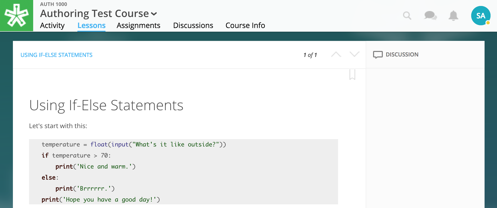

======================
Readings
======================

Our authoring tools let you create engaging readings to place within your
course lessons. Readings allow a host of features including:

- Inline discussions and notes
- Highlights
- View Definitions
- Embed videos, images, code blocks
- Image markup
- and more!

.. image:: images/

Create and Place Reading
==========================

Described below are two methods to create a reading. One is optimized for immediate placement in a lesson, and the other is optimized to create a reading to place later. 

Create and Place in Lesson
-----------------------------------

1. Navigate to the Lessons page.
2. Click "Start Editing" in the bottom right-hand corner.
3. While in Edit Mode, click on “+Add Content” in the section you'd like to place your reading.

  .. image:: images/
  
  .. warning:: Please note: if you don’t see “+Add Content,” you need to first add a section to the lesson page (see the above section on Adding Sections to Lessons). 
  
5. Select "Reading" in the "Choose a content type" window.

  .. image:: images/
  
6. Click "Create Content" in the upper left-hand corner.

  .. image:: images/
  
7. Add a title, author (optional), and description (optional) for your reading.  You may also add a thumbnail to your reading by clicking on the blue thumbnail button. This is the image that will display on your lessons page.

  .. image:: images/
  
8. Click "Add to Lesson." This will now navigate you into the reading editing view. 

  .. image:: images/

10. Create your reading. (Please see "Reading Features" below for more detail.)

  .. image:: images/

11. Select the "Publish" state button in the bottom left-hand corner. Select Publish once more.

  .. image:: images/

Create and Place Later
----------------------------------------

1. Navigate to the Lessons page.
2. Click "Start Editing" in the bottom right-hand corner.
2. Select the “Resources” folder at the bottom left-hand corner.

  .. image:: images/

  .. note:: A list view of your created readings will display. You can search for readings by name in the search field above, and view the publish state and the last modified date. 

4. Click on “Create” in the upper right-hand corner.

  .. image:: images/

5. Create your reading. (Please see "Reading Features" below for more detail.)
   
  .. image:: images/

6. Choose to publish or leave in draft.

  - Select the blue “Publish” button in the bottom right-hand corner to open the publish state flyout. Then, select “Publish” in the flyout in order to publish the text and make it available for placement within a lesson.
  - Or, navigate away from the reading without publishing to save it as a draft to return to later. You can find all drafted readings in your Resources folder.
   
  .. image:: images/

.. warning:: Publishing a reading only makes it available to place in a lesson. Learners cannot view the reading until it is placed within a lesson.

Place Reading
===================

1. Navigate to the Lessons page.
2. Click "Start Editing" in the bottom right-hand corner.
3. While in Edit Mode, click on “+Add Content” in the section you want to place the reading.

  .. image:: images/

4. Click "Reading" in the "Choose a content type" window.

  .. image:: images/

5. Select a reading and click "Select" in the bottom right-hand corner.

   .. image:: images/

   .. warning:: Note that if one of the readings is faded and unclickable, it is still in "Draft." You must publish the reading in order to place it in a lesson. See "Edit a Reading" in order to learn how to return to your reading and publish it.
   
6. Add information that learners can see about the reading.

   - Reading title (required)
   - Reading author (optional)
   - Reading description (optional)
   - Reading thumbnail image (optional)
   
   .. image:: images/

6. Click "Add to Lesson" to add the reading to the lesson.

   .. image:: images/

Reading Features
====================

Engage your learners by adding more than just text. Use our authoring tools to add images, videos, and more to your readings.

Add Text Styles
------------------------

At the bottom of your reading in edit mode is a suite of styles and organizational elements for you text. Choose between "Title," "Section Title," "Paragraph Headline," or "Body Text" to organize your information. Select "Block Quote," "Numbered List," and "Bulleted List" to emphasize points. Also choose from bold, italics, and underlined font styles.

.. image:: images/

Add Hyperlink
------------------------

1. Highlight the text in which you'd like to add a link.
2. Click the link option on your editing toolbar. 
3. Add the URL and keep or modify the display text. 
4. Click "Save."

.. image:: images/

Add Photo
------------------------

1. Click Photo type. This opens your course resources.
2. Select an image or upload an image.
3. Click "Place" in the bottom right-hand corner. This places the image in your reading.
4. Under the image within the editor, edit the figure number (or title) and the caption. The caption is optional.

Add Video
------------------------

1. Click Embed Video type.
2. Enter the link (URL) or embed code for your video into new window. Click "Done." This places the video in your reading.
3. Under the video within the editor, edit the video title and caption. The caption is optional.

Add Bulleted List
------------------------

1. Click on Bulleted List type.
2. Type your first bullet point text.
3. Click enter to create another bullet point. Type your text here. Repeat.
4. Enter twice to exit bullet points.

.. image:: images/

Add Numbered List
------------------------

1. Click on Numbered List type.
2. Type your first point.
3. Click enter to create #2. Type your text. Repeat.
4. Enter twice to exit numbered list.

.. image:: images/

Add Block Quotes
------------------------

1. Click on Block Quote type.
2. Begin typing to the right of the line that appears within your reading.
3. Click enter to escape the block quote.

Add Code Block
------------------------

1. Click on the Code Block type.
2. Select the code you'd like to render.
3. Type code.
4. Click out of the code block to escape.

.. image:: images/codeblock.png

Once published, it will render according to the code selected.

Add Call Out
------------------------

1. Click on the Call Out type.
2. Begin typing.
3. Click out of the call out to escape.

.. image:: images/

Edit Reading
================

Edit Lesson Info
-----------------

**In order to edit the thumbnail, title, author, or description:**

1. Navigate to the "Lessons" tab and to the lesson with the reading.
2. Click on the "Start Editing" button in the bottom right-hand corner.
3. Click the “Edit” button for the reading you want to change.

   .. image:: images/

4. Make changes. In the Edit Flyout, you can change:

   -  The section where the reading is placed
   -  The relative position of the reading within the section
   -  Change the file that is uploaded and displayed
   -  Reading title (required information)
   -  Reading author (optional)
   -  Reading description (optional)
   -  Reading thumbnail image
   -  You can remove a reading from its section, but you cannot undo this deletion. It is a permanent action. (Please note: the reading itself will still be available for placement from within your course files.)
   
   .. image:: images/

5. Click “Save” to save your changes.

Edit Content
-------------

**In order to edit the content of your readings:**

1. Navigate to the "Lessons" tab.
2. Click on the "Start Editing" button in the bottom right-hand corner.
3. In Edit Mode, click on the Resources folder in the bottom left-hand corner.

   .. image:: images/

4. Locate your reading within the list or search to find it.

   .. image:: images/

5. Click "Edit" located to the far right of the reading title. 

   .. image:: images/

6. Edit your reading.

7. Click "Publish Changes" to publish your changes. 

   .. image:: images/
	  
   .. note:: If you have not yet published, this button will say "Publish." Click it to publish your reading.
   
