=========================
Course Setup
=========================

When creating a new course and before learners enroll, make sure to walk through basic course setup and settings. Here, we take you through course visibility and availability, information, assets, credit, facilitators, and more.

First click into your course from your homepage. Now, select the "Course Info" view.

Your **Course Info** page includes:

- Cover Video
- Course ID
- Course Title
- Course Description
- Course Assets
- Credits
- Redemption Code
- Start Date
- End Date
- Meet Times
- Facilitators
- Completion and Certificates

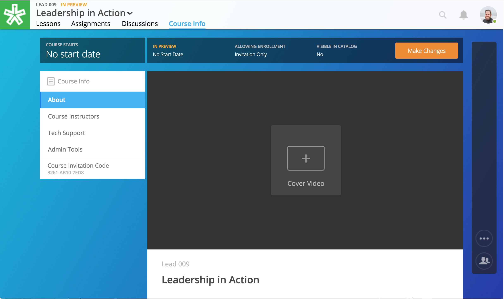

This view also allows you to manage course visibility and allows access to your admin tools.

.. note:: Site admin, instructors, and editors can all edit the Course Info page.

Course Visibility
--------------------

Control course visibility.

To get started, click on the "Make Changes" button on the course's Course Info page.

.. image:: images/makechangesbutton.png
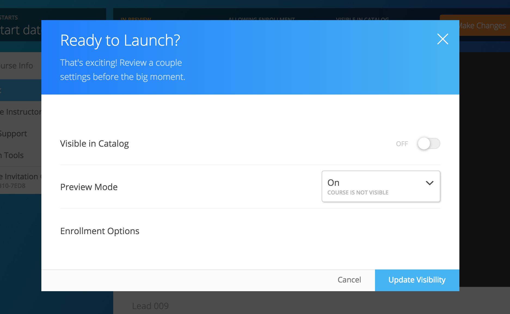

**Visible in Catalog**

The "Discoverable in Catalog" field allows you to toggle course visibility within the course catalog. 

- **Off:**
  This option will keep the course private. This means that the course will not show up in the public course catalog. No one will be able to enroll in the course unless you provide them with the course redemption code.
  
- **On:**
  This will allow the course to display in the course catalog. This means that when a site user clicks on the course catalog, the course will display and the learner can view basic course information and enroll in the course.

**Course Status**

This option defines when the course becomes available for learners to begin.

- **Draft:**
  This option makes the course invisible to learners while you create and edit your course; however, if you want to allow early enrollment, you can set the course Status to "Draft" and Discoverable to "On." This will allows learners to enroll, but the content will remain invisible.
  
- **Published:**
  This option allows the course to be fully available to users.
  
- **Publish on Start Date:**
  This option sets the course to be in course preview mode until the defined start date and time, at which time it will then become fully available to users.
  

..  note:: By default the course will be "Off" for Discoverable in Catalog and in "Draft."

**Enrollment Options**

The next tab within the Ready to Launch menu allows you to turn on or off "Open Enrollment." This option determines if the "Enroll" button is available from within the course catalog. If learners should enroll through another application instead of directly on NextThought, you can turn this option off. 

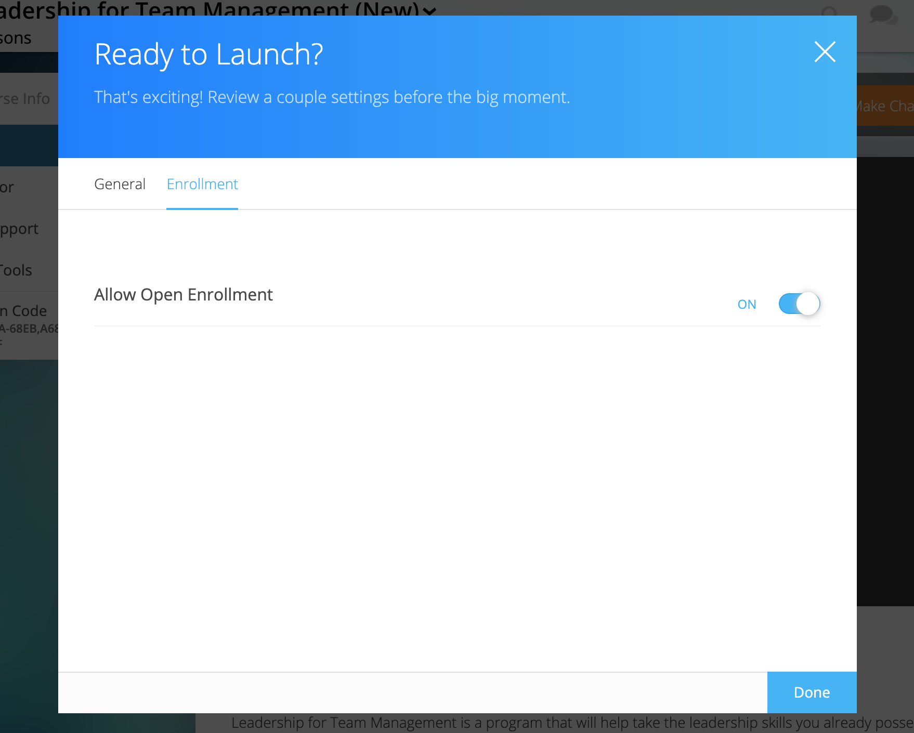

Basic Course Information
--------------------------
Basic course information includes the course ID, title, description, and tags. This information will display to learners.

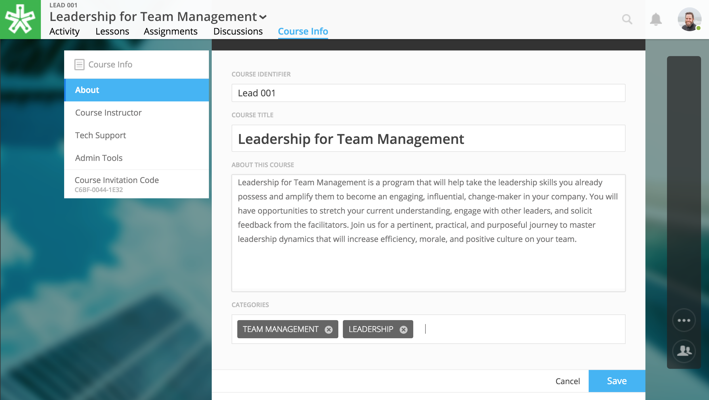

**Course Identifier**

Give your course an ID. The Course Identifier field allows you to create an organizational system for your courses. IDs can have both numbers and letters. Use this field to align with an external identification system, or create your own. 

**Course Title**

Name your course. This course title will display on learners' homepage as well as the catalog.

**About this Course**

Describe your course. This description will help learners decide if they wish to enroll in the course.

**Categories**

Tag courses with one or multiple tags (e.g., “Marketing”). These tags will create categories within the course catalog, and allow learners to browse available courses by category.

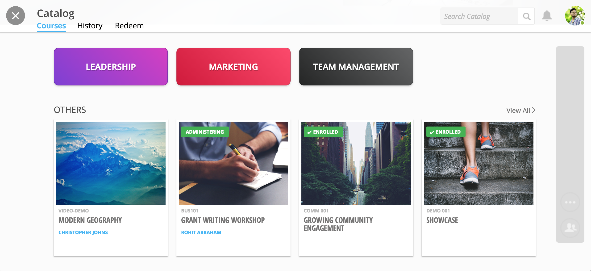

Course Assets
--------------

Upload an image to represent your course. This image will display in the course catalog, and will be in the background of your course. 

1. Click on the "Edit" button next to "Assets."

   .. image:: images/assetsstep1.png
   
2. Upload the desired image.

   .. image:: images/assetsstep2.png
   
3. Crop your image.

   .. image:: images/assetsstep3.png
   
4. Click "Continue."

5. Preview and adjust the size of each asset.

   .. image:: images/assetsstep4.png
   
6. Click "Apply Image" after all adjustments have been made.

7. Click "Done."

Course Credit
--------------

Allow learners to earn credit when they complete the course.

To assign a credit type to a course,

1. Click “Edit" next to "Credits."
2. Use the dropdown to select an existing credit type and unit, or "Add Credit."
3. Define the amount of credit.
4. Click "Save."

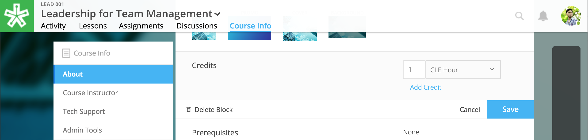

Credit will be awarded when the user has completed the course as defined by completion of required materials. Learners can see the credit they've earned within their profile.

.. warning:: Two conditions must be met for your course to automatically award credit:
            
			 - Course completion must be turned on (see **Completion and Certificates** section below). 
			 - Some course materials must be required.

.. note:: You can opt to award certificates (as well as credit) for course completion. If you allow certificates, the learner can “View Certificate” to view their completion certificate and credit. They can also view their certificates within their profile. Please see **Completion and Certificates** below.

Redemption and Invitation Codes
-------------------------------

Invite learners to enroll in your course through a redemption code. Redemption codes allow learners to enroll in private courses in the course catalog's Redeem tab.

Two types of codes exist:

- unlimited use
- user specific, one-time use

Unlimited use redemption codes can be found on the Course Info page.

**To generate an unlimited use code:**

1. Click “Edit" next to "Redemption Code."
2. Click “Create Code.”

Codes can also be deleted by clicking on the trashcan icon next to the code in edit mode. Once a code is deleted, learners can no longer use it to enroll in the course. Deleting the code will not affect current learner enrollment.

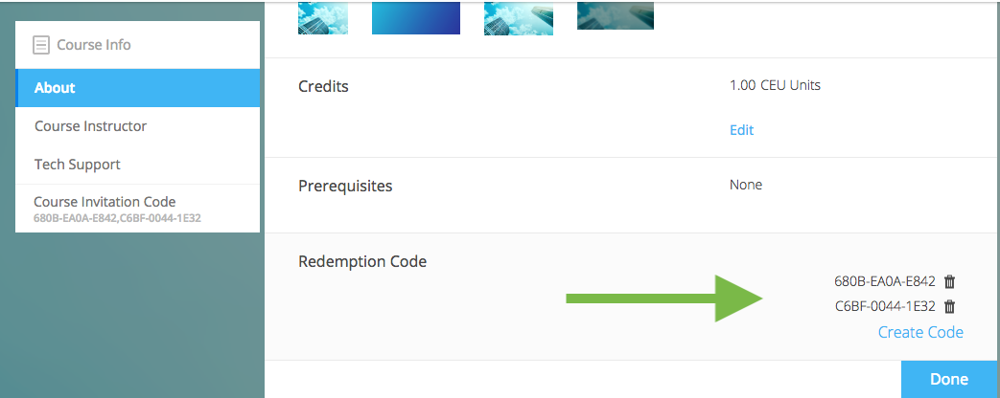

**To send a user specific code:**

1. Click on the Admin Tools tab on the Course Info page.
2. Select the Roster "View Now" text.
3. Select the "Invite" button.
4. Enter email addresses and your personal message.
5. Click "Send."

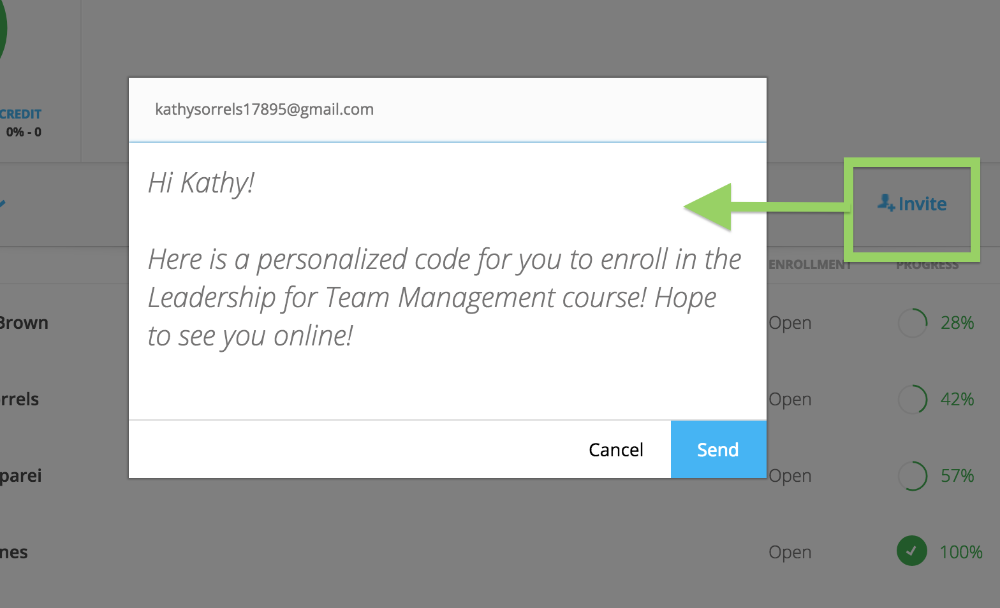

Along with your personal message, the platform will send a personalized course code (a separate code to each email) and a link to the course. When the user creates an account, they must sign up with the email you sent the invitation to in order to redeem access. 

Start and End Date
--------------------

Define when your course begins and ends. 

1. Click “Edit” next to either “Start Date” or “End Date.” 
2. Click the dropdown and select a date.
3. Set a time.
4. Click "Save." 

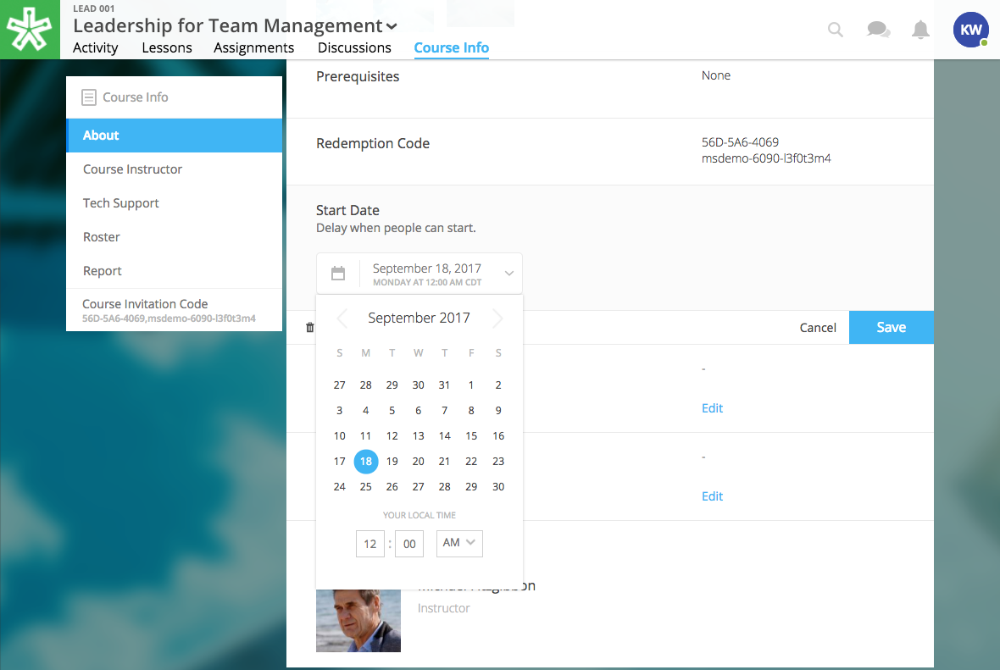

.. note:: You can use the Start Date and time to define when the course becomes available for users. See the "Course Visibility" section above.

.. note:: Setting an End Date will not revoke access to the course. The course is available indefinitely as long as a learner is enrolled. If you would like to revoke access to a course, please contact NextThought.

Meet Times
----------

Use this space to suggest times the course will meet, either online or in person. This field will not change course availability, but is an optional tool to encourage course engagement. 

1. Click "Edit" next to "Meet Times."
2. Select a day or days Sunday through Saturday.
3. Enter a timeframe.
4. Click "Save."

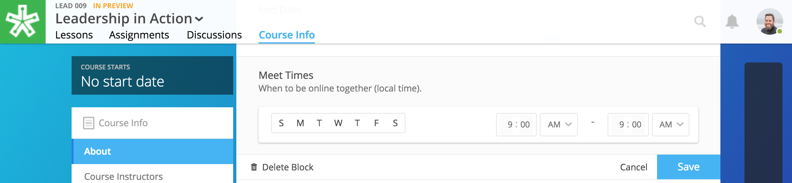

Manage Facilitators
-------------------------------

Manage your course facilitators, including Instructors, Editors, and Assistants.

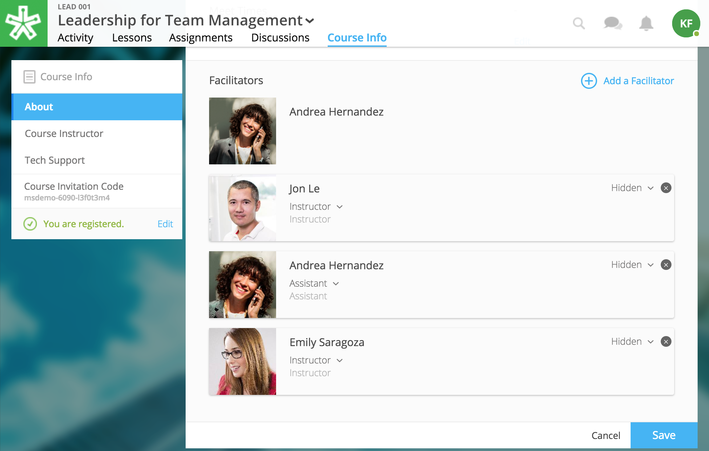

1. Click “Edit” next to "Facilitators."
2. To add a new facilitator:

   .. image:: images/coursefacilitator.png
   
   - Click “Add a Facilitator.”
   - Search user(s) by name.
   - Assign a role (see roles defined below).
   - Click “Visible to Learners” if you’d like this facilitator to show on the Course Info page and homepage.
   
3. To edit a current facilitator:

   - Locate facilitator on list.
   - Toggle “visible” or “hidden” via the dropdown.
   - Toggle role using the role dropdown.
   - Remove a facilitator by clicking the “x.""
   
4. Click "Save" within the course facilitator section to save your changes.

The current roles are as follows:

- **Course Facilitator:** The term for course roles: instructor, assistant, and editor

- **Course Instructor:** Instructor and editor 

- **Course Assistant:** Instructor role only (no editor capabilities)

- **Course Editor:** Editing only (no instructor capabilities)
   
[Advanced] Completion and Certificates
----------------------------------------

Manage course completion and certificate options with your Admin Tools.

.. image:: images/advancedadmin.png

1. Select "Admin Tools."
2. Select "View Now" under "Advanced."

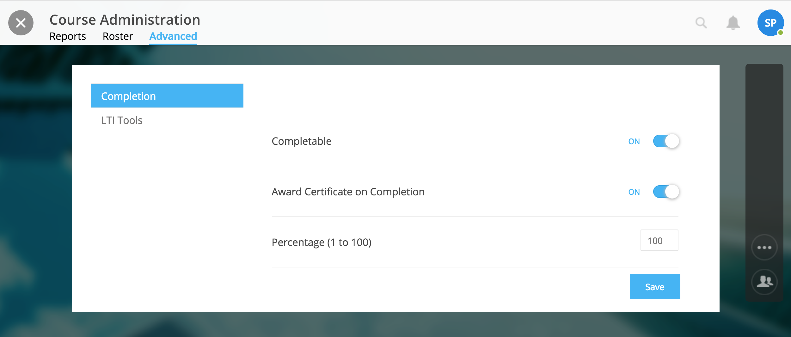

- **Completable:** Toggle "On" to allow the course to be completable. This means that once learners complete all required course materials, they will have completed the course. When turned on, learners can track their completion progress from their Lessons page, which offers a percentage of completed materials.
- **Award Certificate on Completion:** Toggle "On" to award a certificate once learners have completed the course. This means that once learners complete all required course materials, they will have the option to "View Certificate" from their Lessons page. Completion certificates are also viewable from their profile.
- **Percentage:** Define what percentage of required materials is acceptable for course completion. In other words, if you mark 10 items as required, and define **Percentage** as 50, learners only need to engage with 5 required items to complete the course.

.. note:: Please note, you have several options when customizing your course with these tools:

		  - Require materials, no certificate, no credit
		  - Require materials, award certificate, no credit
		  - Require materials, no certificate, award credit
		  - Require materials, award certificate, award credit
		  - No required materials (if you do not add required materials, no credit nor certificate can be automatically awarded)
