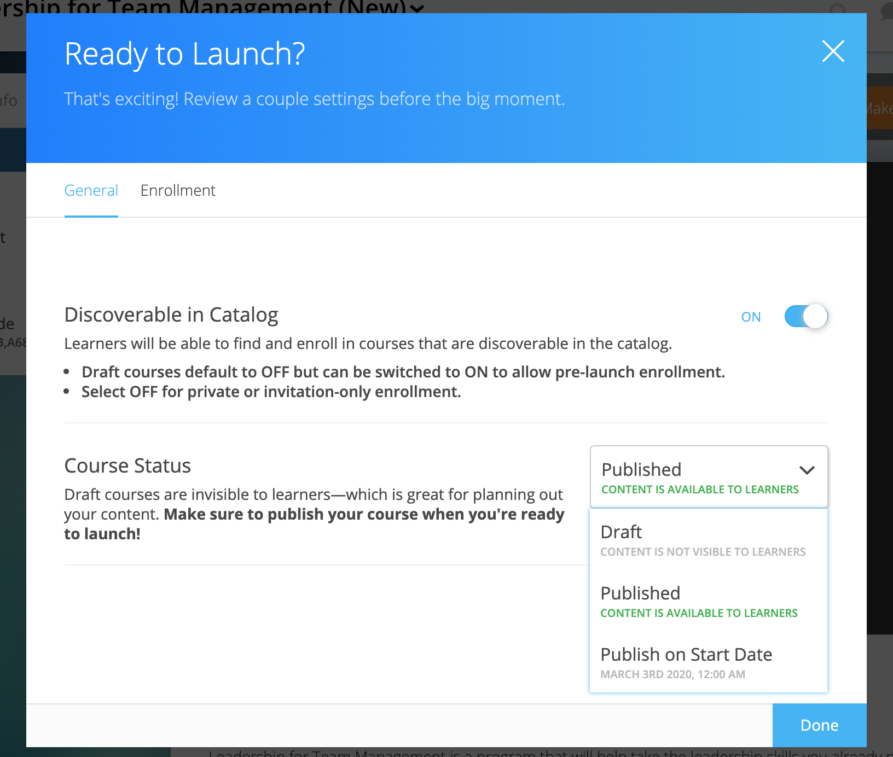

=========================
Course Setup
=========================

Make sure your course is set up correctly before you go live!

Your **Course Info** page includes:

- Cover Video
- Course ID
- Course Title
- Course Description
- Course Assets
- Credits
- Redemption Code
- Start Date
- End Date
- Meet Times
- Facilitators

.. image:: images/editcourseinfo.png

This view also allows you to manage course visibility and allows access to your admin tools.

.. note:: Site admin, instructors, and editors can all edit the Course Info page.

Course Visibility
--------------------

Control course visibility.

To get started, click on the "Make Changes" button on the course's Course Info page.

**Visible in Catalog**

The "Visible in Catalog" field allows you to toggle course visibility within the course catalog. 

- **Off:**
  This option will keep the course private. This means that the course will not show up in the public course catalog. No one will be able to enroll in the course unless you provide them with the course redemption code.
  
- **On:**
  This will allow the course to display in the course catalog. This means that when a site user clicks on the course catalog, the course will display and the learner can view basic course information and enroll in the course.

**Preview Mode**

The "Preview Mode" defines when the course becomes available for learners to begin.

- **Preview Mode On:**
  This option sets the course to course preview mode, meaning that users can only view Course Info but cannot view course content.
  
- **Preview Mode Off:**
  This option allows the course to be fully available to users.
  
- **Based on Start Date:**
  This option sets the course to be in course preview mode until the defined start date and time, at which time it will then become fully available to users.
  

..  note:: By default the course will be in **Preview Mode On** and will need to be either switched to **Preview Mode Off** or **Based on Start Date** for users to begin the course. 

Basic Course Information
--------------------------
Basic course information includes the course ID, title, description, and tags. This information will display to learners.

.. image:: images/basicinfo.png

**Course Identifier**

Give your course an ID. The Course ID field allows you to create an organizational system for your courses. IDs can have both numbers and letters. Use this field to align with an external identification system, or create your own. 

**Course Title**

Name your course. This course title will display on learners' homepage as well as the catalog.

**About this Course**

Describe your course. This description will help learners decide if they wish to enroll in the course.

**Categories**

Tag courses with one or multiple tags (e.g., “English Literature”). These tags will create categories within the course catalog, and allow learners to search available courses by category.

Course Assets
--------------

Upload an image to represent your course. This image will display in the course catalog, and will be in the background of your course. 

1. Click on the "Edit" button next to "Assets."

   .. image:: images/assetsstep1.png
   
2. Upload the desired image.

   .. image:: images/assetsstep2.png
   
3. Crop your image.

   .. image:: images/assetsstep3.png
   
4. Click "Continue."

5. Preview and adjust the size of each asset.

   .. image:: images/assetsstep4.png
   
6. Click "Apply Image" after all adjustments have been made.

7. Click "Done."

Course Credit
--------------

Allow learners to earn credit when they complete the course.

To assign a credit type to a course,

1. Click “Edit" next to "Credits."
2. Use the dropdown to select an existing credit type and unit, or "Add Credit."
3. Define the amount of credit.
4. Click "Save."

Credit will be awarded when the user has completed the course as defined by completion of required materials. Upon course completion, the user can “View Certificate” to view their completion certificate and credit. They can also view their certificates within their profile.

Start and End Date
--------------------

Define when your course begins and ends. 

1. Click “Edit” next to either “Start Date” or “End Date.” 
2. Then, click the dropdown to select a date.
3. Set a time.
4. Click "Save." 

.. image:: images/coursestarttime.png

.. note:: You can use the start date and time to define when the course becomes available for users. See the "Course Visibility" section above.

.. note:: Setting an End Date will not revoke access to the course. The course is available indefinitely as long as a learner is enrolled. If you would like to revoke access to a course, please contact NextThought.

Meet Times
----------

Use this space to suggest times the course will meet, either online or in person. This field will not change course availability, but is an optional tool to encourage course engagement. 

1. Click "Edit" next to "Meet Times."
2. Select a day or days Sunday through Saturday.
3. Enter a timeframe.
4. Click "Save."

.. image:: images/meettimes.png

Manage Facilitators
-------------------------------

Manage your course facilitators, including Instructors, Editors, and Assistants.

.. image:: images/coursefacilitator1.png

1. Click on the Course Info tab
2. Scroll to the Facilitator section
3. Click “Edit”
4. Add new facilitator:

   .. image:: images/coursefacilitator.png
   
   - Click “Add a Facilitator”
   - Search user(s) by name
   - Assign a role (Instructor, Assistant, or Editor)
   - Click “Visible to Learners” if you’d like this facilitator to show on the Course Info page and homepage 
   
5. Edit current facilitator:

   - Locate facilitator on list
   - Toggle “visible” or “hidden” via the dropdown 
   - Toggle role using the role dropdown
   - Remove a facilitator by clicking the “x”
   
6. Click "Save" within the course facilitator section to save your changes.

The current roles are as follows:

- **Course Facilitator:** The term for course roles: instructor, assistant, and editor

- **Course Instructor:** Instructor and editor 

- **Course Assistant:** Instructor role only (no editor capabilities)

- **Course Editor:** Editing only (no instructor capabilities)
   
