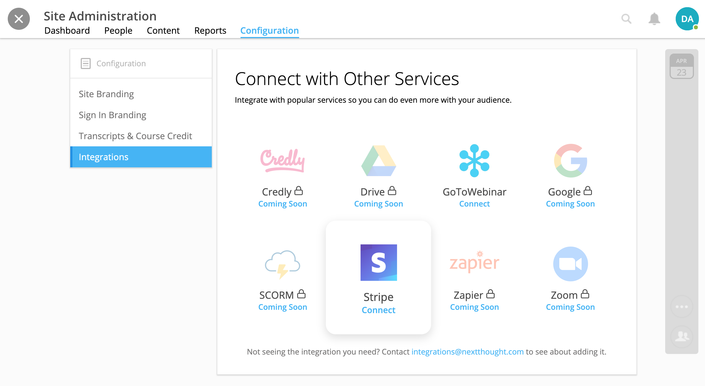
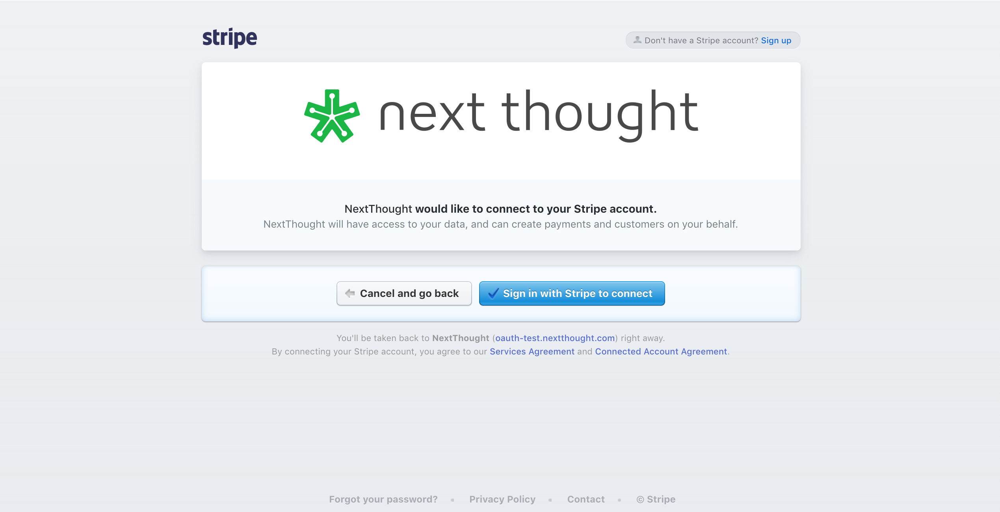
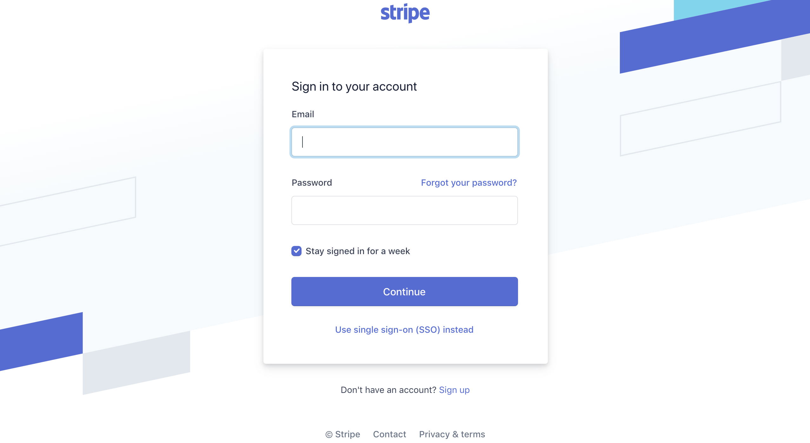
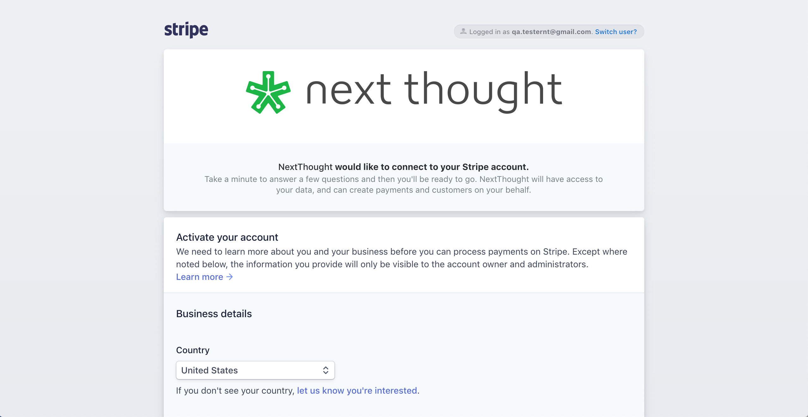
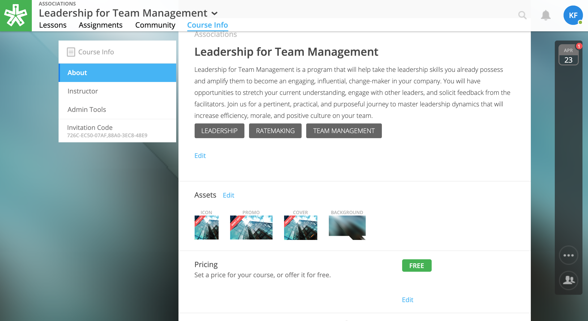
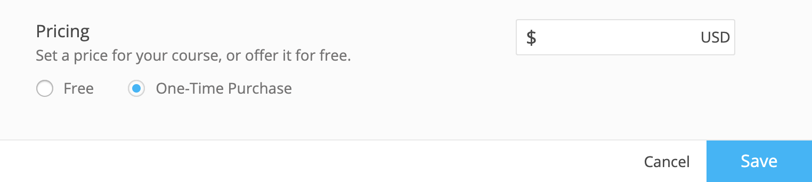
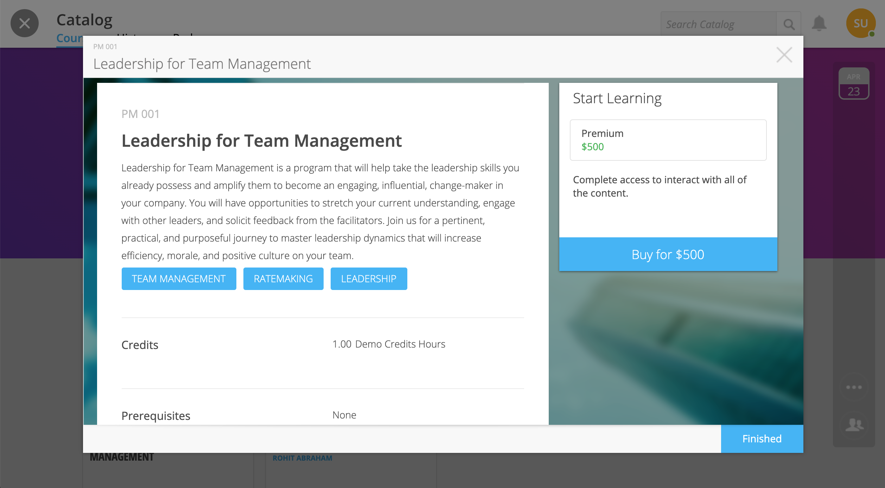
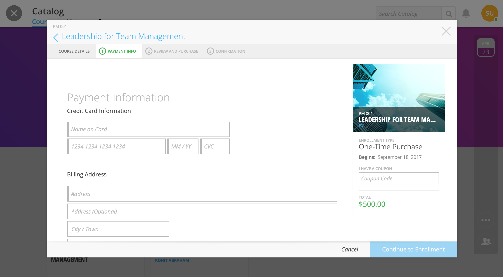

========================
Stripe Integration
========================

NextThought Site Admins can now integrate their site with Stripe, a payment processing software, to add purchasing options to courses. 

Site Integration
==================

**To Integrate Your NextThought Site with Stripe:**

1. Create a Stripe Account at https://stripe.com/.
2. Log into NextThought with your Site Admin account.
3. Navigate to the Admin Panel, Configuration subtab, Integrations.

4. Click the Stripe service to begin integration. You will be redirected to Stripe.

5. Sign in to your Stripe account.

6. Follow any prompts or further directions to integrate with NextThought. Once successfully integrated, you will be redirected back to NextThought.

Add Price to Course
=====================

**To Add a Purchasing Price to a Course:**

1. Sign into your Site Admin or Facilitator account. 
2. Navigate to the course and select the Course Info tab.
3. Scroll down to the “Pricing” section, and click “Edit.”

4. Select “One-Time Purchase.”

5. Type in the price of the course.
6. Click “Save.”

.. note:: The course must be available in the course catalog for learners to click on the course in the catalog and purchase.

Learner View of Purchasing Course
===================================

**Learner Purchasing View:**

1. Sign into your NextThought learner account.
2. Click on the “+Add” button to navigate to the Catalog.
3. Click on the course in the catalog. The price will be listed.
4. Click on the Buy button.

5. Follow the steps to purchase by filling out the form. Once the purchase is complete, learners will have immediate access to the course.

