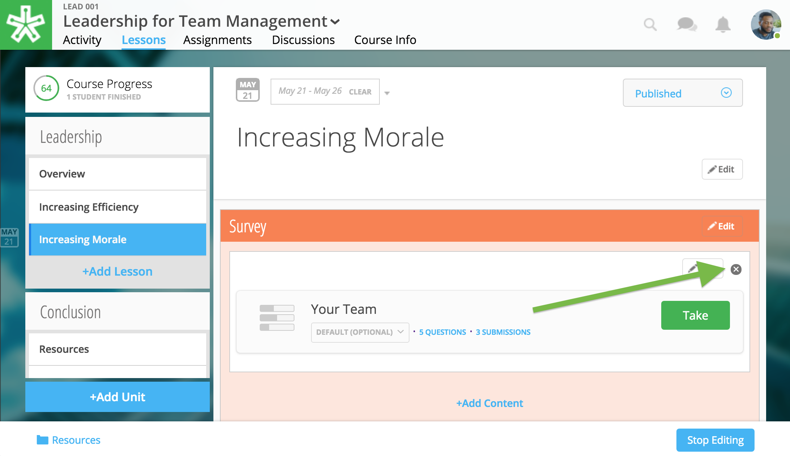

======================
Surveys
======================

Authoring Tools coming soon!

Surveys gather feedback. Results, absent of learner names, may be displayed in graphs or charts.

Add Survey
=====================

.. note:: In order to add a survey to your course, your project manager will need to upload it to your course files. Please reach out to your project manager for further instruction.

Once your project manager has informed you that your survey is available in your course files, follow the steps below to select and place it into a lesson:

1. While in Edit Mode, click on “+Add Content” in the section you want to edit.

   .. image:: images/addcontentsurvey.png

   .. warning:: Please note: if you don’t see the “+Add Content” banner, you need to first add a section to the lesson page (see the above section on Adding Sections to Lessons). 

2. Select “Survey” in the “Choose a content type” window.
   
   .. image:: images/picksurvey.png

3. Select the survey.

   .. image:: images/selectsurvey.png

4. Click the “Select” button in the lower right-hand corner.

5. Confirm your selection and position within the lesson.

   .. image:: images/confirmsurvey.png
   
6. Click “Add to Lesson” to place your survey in the course.

Edit Survey
=======================

**To edit the position of the survey:**

1. Click on the “Edit” button next to the survey you want to change.

   .. image:: images/editsurvey.png
 
2. In the popup window for a survey, you can change

   -  The section where the survey is placed
   -  The relative position of the survey within the section
   -  Delete the survey
   
   .. image:: images/editsurveyflyout.png

3.  Click “Save” to save your changes.

 
.. note:: To edit the survey content or title, please contact your project manager.
 
Delete Survey
==========================

To remove surveys from a lesson, simply select the "x" icon to the right of the content on the Lessons page. Then, confirm deletion.

