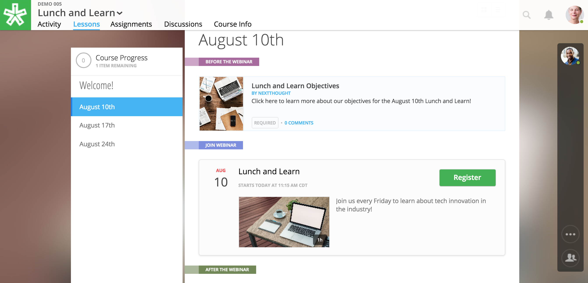
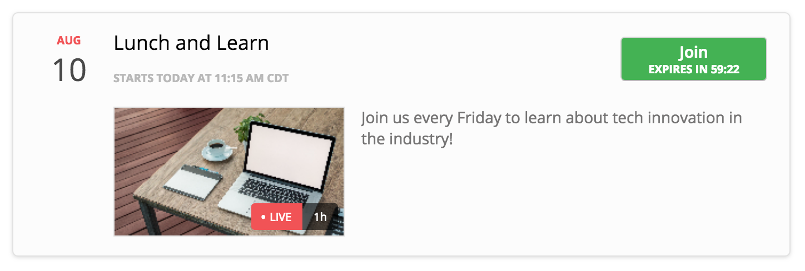

========================
GoToWebinar Integration
========================

NextThought integrates with GoToWebinar to allow learners to view, register, and join webinars from their Lessons page. Admin can integrate their site with their GoToWebinar account and site admin, instructors, editors can add a webinar to their Lessons page.

Integrating with GoToWebinar
==============================

Before attempting to integrate with GoToWebinar, please make sure you have a GoToWebinar account.

1. While logged in with an admin account, navigate to your Site Admin Tools from the homescreen.
2. Click on the “Advanced” tab.
3. Click on the “Integrations” section.
4. Click on the blue “Connect” link next to GoToWebinar.

5. You will then be asked to log into GoToWebinar, or, if already logged in, you will be asked “Allow Access” to NextThought.

.. image:: images/webinar2.2.png

6. Once you are connected your GoToWebinar name will display where the blue connect button used to be. You have now successfully linked your site to the GoToWebinar account.

.. note:: You can also link your account when adding a webinar from the new content window if you haven’t already.

Adding Webinars to Course
============================

Before adding a webinar to a Lesson, you must first have created the webinar on your GoToWebinar account. 

.. note:: Please note, if you choose a reoccurring webinar, please select the option "Participants register for individual sessions that they’ll attend." for best data integration.

1. In Edit Mode, click “Add Content” in a section.

2. Click “Webinars.”  

3. Select the webinar you wish to display, or paste a link to the webinar by selecting “Paste Link.”

4. Click on the “Add to Lesson” button.

Your webinar is now added to the Lesson. Learners can register and join the webinar from the NextThought application. Instructors will need to launch the webinar from GoToWebinar. GoToWebinar will track all of the participants that register through the NextThought application in your Registrant list. Notifications and reminders can be set up on GoToWebinar. 

Learner View and Registration
===============================

1. Before a learner can join a webinar, they must first follow the “Register” prompt on the Lessons page to register for the webinar.

2. After selecting “Register,” they will be prompted to provide the information you've required of them from the GoToWebinar settings.

.. image:: images/learnerinfo.png

3. The button that previously said “Register” will now say “Join” but will not be active until the organizer has launched the webinar.

4. When a webinar is in session, a timer will appear on the “Join” button displaying how long is left in the webinar.

5. Selecting “Join” will launch the webinar.

.. note:: Webinars can be “required” resources on the NextThought app. In order to be marked as “completed” learners must join and attend the webinar.

Edit or Delete Webinar
=========================

To remove a webinar from your Lessons page while in Edit Mode, simply click on the "x" icon next to the webinar.

.. image:: images/removewebinar.png

To delete a webinar, you must do so from your GoToWebinar account.