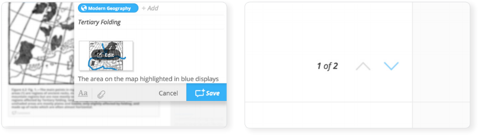
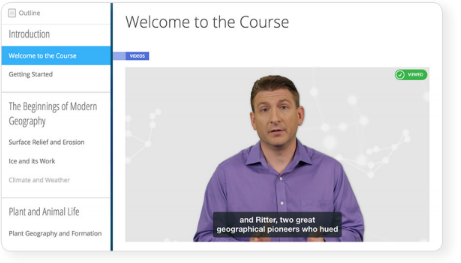
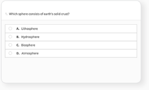
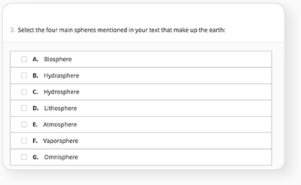
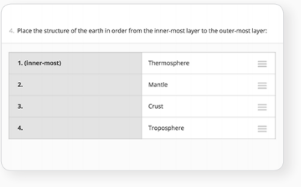
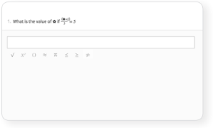
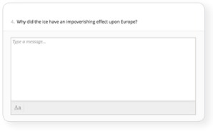
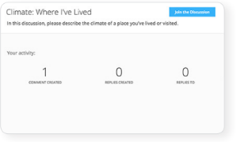
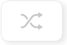
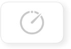

=============================================
PART I: Content, Gradebook, and Communication
=============================================

Course Organization
================================================

NextThought supports a variety of content types in order to customize
learning. All content is organized within a course in your library.  

A course is organized into five views: Activity, Lessons,
Assignments, Discussions, and Course Info.

   .. image:: images/courseOrganization.png

Access these views by first clicking on the course in your library.
Below are descriptions of each.

Activity View
---------------------------------------------------

The Activity View organizes activity within the course into a stream and
invites students to engage in the course within the activity that is
most relevant to the course schedule. The stream displays activity in
order from most recent to oldest and includes assignments, readings,
active forum posts, as well as notes currently being discussed.

   .. image:: images/activityView.png

Lessons View
---------------------------------------------------

The Lessons View contains all of the lessons or content for a course.
The Lessons View is divided into two sections: an interactive course
outline to the left modeled after the course syllabus, and the lesson
content to the right of the outline. Clicking on an individual lesson
within the outline will display all content inside of that lesson.
Typically one lesson will include brief lesson videos, a discussion,
readings, and perhaps a self-assessment or assignment.

If dates have been set for lessons, calendar dates will appear when
students or instructors hover their mouse over the lesson title in the
outline. This feature alerts the student as to when he or she is
expected to start interacting with the lesson’s material. You may also
make lessons available after a certain date to limit students’ access to
future material.

	.. image:: images/lessonsView.png

Assignments View
---------------------------------------------------

The Assignments View allows access to your Gradebook and student
assignment activity. It also enables you to view and download student
assignments and export grades.

The Assignments View is organized into three tabs: Assignments,
Grades & Performance, and Activity & Notifications.

Assignments Tab
^^^^^^^^^^^^^^^^^^^^^^^^^^^

This section contains an interactive list of assignments within the
course. Selecting an assignment allows you to see all student
submissions for that specific assignment and assign grades, offer
feedback, and reset and excuse assignments.         

    .. image:: images/assignmentsTab.png

Grades & Performance Tab
^^^^^^^^^^^^^^^^^^^^^^^^^^^

Grades & Performance displays an interactive list of all students in
your course. Selecting a student will allow you to view that student’s
submissions and grades for the course as well as assign grades.
                        

    .. image:: images/gradesPerformanceTab.png

Activity & Notifications Tab
^^^^^^^^^^^^^^^^^^^^^^^^^^^^^^^^^^

Activity & Notifications displays relevant updates about student
submissions and feedback by most recent to oldest.

.. image:: images/activityNotificationsTab.png

.. note:: Please note: These three sections also appear for students; however, their content differs from the instructor’s view.

Discussions View
---------------------------------------------------

The Discussions View contains the discussion forums for the class. Here
the students can respond to your discussion prompts or create their own
discussions. You may also post course announcements here.

    .. image:: images/discussionsView.png

Organization:
^^^^^^^^^^^^^^^^^^^^^^^^^^^^^^^^^^

There are three typical forums: “Discussions,” “Announcements,” and the
general “Forum.” “Discussions” will contain your course discussions
regarding the course material, and participation may be required.
“Announcements” is a place for the instructor to post announcements
throughout the duration of the course. The “Forum” is a place for
students to freely post about course topics.

Visibility:
^^^^^^^^^^^^^^^^^^^^^^^^^^^^^^^^^^

Your course forum may be split into sections by student enrollment
type, “Enrolled For-Credit” and “Open.” This allows you to have some
cours discussions viewable only to credit students.

Course Info View
---------------------------------------------------

The Course Info View displays basic information about your course, such
as course dates, description, and instructor information. As an
instructor, your course roster and course summary report are also
accessible here. The course roster allows you to view a list of all
students in the course, email your students, and access student reports.

   .. image:: images/courseInfoView.png

Supported Content
================================================

Below is a list of the types of content NextThought supports as well as
descriptions of each. In a later section, we will discuss how this
material is organized. Please note that supported materials are always
being updated. If you do not see the type of material you want to
support for your course, please contact NextThought.

-  Readings
-  PDFs, Slides, and Other Downloadable Materials
-  Videos (From Kaltura, Vimeo, YouTube, Storyline, and others)
-  Video Transcripts
-  Assignments and Self-Assessments
-  Discussion Forums
-  External Links
-  Surveys and Polls
-  Timelines
-  Images and Video Reels

Reading Materials                                
---------------------------------------------------

Reading materials can be hosted on the platform or embedded on the
platform through another format such as a PDF. Notes can be created
beside all types of readings.

Readings
^^^^^^^^^^^^^^^^^^^^^^^^^^^^^^^^^^^^^^^^^^^^^^^^^^^^^^^^^^^^^^^^^^^^^

For hosted text, text (such as PDF or other formats) is first sent to
NextThought and our content development team makes it into a fully
interactive format to display on the learning platform. 

You can also create your own fully interactive text to display on the platform by
using our authoring tools. Please see “Create a Reading” for more
information.

**Features:**

.. image:: images/readings.png

-  Highlight and add sharable notes to specific sections of the text.
-  Select and define words.

-  Add links, interactive footnotes, timelines, surveys and polls,
   assessment questions, videos, images, as well bibliographies
   throughout the reading.
-  Easily navigate multiple pages with paging tools.

Embedded PDFs                                                        
^^^^^^^^^^^^^^^^^^^^^^^^^^^^^^^^^^^^^^^^^^^^^^^^^^^^^^^^^^^^^^^^^^^^^

.. image:: images/embeddedPDFs.png

This type of reading displays a static PDF inside of the platform.
Students can scroll through the PDF, read, download, and print it, and
can add notes to the side of the displayed PDF.

Videos                                         
---------------------------------------------------

Videos enhance learning by introducing course lessons, demonstrating
ideas, and engaging students.

Videos can appear in a lesson or they can be included inside of other
content such as readings, discussions, or assignments. NextThought can
assist you in creating professional videos to enhance your lessons, or
we can incorporate any prerecorded YouTube, Kaltura, or Vimeo video into
your course.

.. note::  Please contact NextThought if you are interested in using our Video Team and Learning Designers to assist you in creating videos. Our Video Team works both in-studio and on location. Visit https://nextthought.com/video-services to learn more.

Transcripts
---------------------------------------------------

Video transcripts allow students to search for keywords, add
contextualized notes, and review the video’s transcript at their own
pace.

Every video can have an attached transcript, and NextThought assists
instructors in creating transcripts for videos. Transcripts appear
beside the video and offer many benefits for students. Transcripts allow
students to simultaneously watch the video and read the transcript. It
also allows students to add contextualized notes, search for keywords in
the video’s text, and jump to a specific place in the video by selecting
a section of the transcript’s text. Transcripts can also feature slides
to allow students to conveniently view the slides that correspond with
the ones in the video.

.. image:: images/transcripts2.png
    :width: 59 %

The transcript player has three views and also a gallery displaying all 
videos in the course. To play the video in full screen, split video, or
split transcript view, select the drop-down arrow displayed in the upper
panel of the player. To preview all videos within the course within the
gallery, click the icon to the left of the transcript view drop-down.

Assignments and Self-Assessments                        
---------------------------------------------------

Test students’ comprehension of the material or give them an opportunity
to test themselves with assignments and self-assessments.

Assignments and self-assessments can be added to any lesson.
Self-assessments can also be included within a reading. Each assignment 
or self-assessment can include downloadable documents, links, and
embedded videos and images. Each question can also include tips and hints 
for that question, as well as display the solution once the assignment has 
been submitted. Displaying tips, hints, and solutions are optional.

.. image:: images/assignmentsAndSelfAssessments.png

**Features:**

-  Choose from several different questions types. To see a list of
   question types supported, visit “Assignment and Self-Assessment
   Question Types.”
-  Include downloadable documents, links, or embedded videos or images.
-  Display optional  tips, hints, and solutions for each question.
-  Set assignments to grade automatically upon submission (with the
   exception of essays, uploads, graded discussions,  and participation
   points, all which require manual grading).         
-  To learn about more options and features, please see the “Create an
   Assignment” within Part III  of the manual.
   
Question Types
---------------------------------------------------

Listed below are the types of questions we support in assignments and
self-assessments. If you do not find a question type compatible with the
type of assessment you have, please contact us and we’d be happy to
assist you.

-  Multiple Choice
-  Multiple Answer
-  Ordering
-  Word Bank (Matching)
-  Mathematical Notation
-  Short Answer
-  Essay
-  File Upload
-  Discussion
-  FEATURE: Timed
-  FEATURE: Randomization
-  FEATURE: Question Bank
-  FEATURE: Gradebook Entry

Multiple Choice
^^^^^^^^^^^^^^^^^^^^^^^^^^^^^^^^^^

Allows students to select the best possible answer out of a list of solutions.

.. note::  Best to use when the answer to the question asked is a single sentence or statement.

**Multiple Answer**

Allows students to select multiple answers out of a list of solutions.

.. note::  Best to use when the answer to the question asked is potentially more than one sentence or statement.

Ordering
^^^^^^^^^^^^^^^^^^^^^^^^^^^^^^^^^^

Allows the student to arrange data and information into the appropriate order.

.. note::  Best to use when the solution requires a specific ordering of information, such as the order of steps or events.

Word Bank (Matching)
^^^^^^^^^^^^^^^^^^^^^^^^^^^^^^^^^^

.. image:: images/wordBankMatching.png

Allows students to use a word bank to match with blank spaces in statements or phrases below. The word bank can be customized to allow a response to be used multiple times.

.. note::  Best to use when answers can be left out of a statement and collected into a bank. It can also be used to match terms with definitions.

Mathematical Notation
^^^^^^^^^^^^^^^^^^^^^^^^^^^^^^^^^^

Offers students the use of mathematical characters in the response field.

.. note::  Best to use when the solution to the problem includes mathematical notation.

Short Answer
^^^^^^^^^^^^^^^^^^^^^^^^^^^^^^^^^^

.. image:: images/shortAnswer.png

Provides a text field for students to type a word or short phrase as their response.

.. note::  Best to use for questions that prompt the student to display his or her breadth of understanding and knowledge in writing. It allows for a single word or short phrase answer.

Essay
^^^^^^^^^^^^^^^^^^^^^^^^^^^^^^^^^^

Provides students with a text field to respond to questions in short sentences or several paragraphs. Responses are not limited in length.

.. note::  Best to use for questions that prompt the student to display understanding in writing. This type of response requires extensive recall and extra time to complete.

File Upload
^^^^^^^^^^^^^^^^^^^^^^^^^^^^^^^^^^

.. image:: images/fileUpload.png

Allows students to submit files directly to instructors for review. The NextThought platform will accept any specified file type.

.. note::  Best to use when the assignment requires a file by a program outside the NextThought platform. Instructors can download student files.

Discussion
^^^^^^^^^^^^^^^^^^^^^^^^^^^^^^^^^^

Prompts students to respond within course forums. The discussion is displayed within the assignment and includes student activity information.

.. note::  Best to use when participation within course discussions are not only encouraged and expected, but required and graded.

FEATURE: Randomization
^^^^^^^^^^^^^^^^^^^^^^^^^^^^^^^^^^

Most question types allow “randomization” for the questions and/or
solutions. Randomizing the questions would create a unique ordering of
the questions for each student. Randomizing the solutions would create a
unique ordering of solutions for each student.

FEATURE: Question Bank
^^^^^^^^^^^^^^^^^^^^^^^^^^^^^^^^^^

.. image:: images/questionBank.png

Allows a designated amount of questions from a larger set of questions to be randomly selected and assigned to students. For example, five different questions can be randomly assigned to a student from a bank of ten questions. The student would only see and respond to those five questions.

FEATURE: Timed Assessments
^^^^^^^^^^^^^^^^^^^^^^^^^^^^^^^^^^

Restricts the student to a designated amount of time to complete the assignment. A window will prompt the student to acknowledge that the assignment is timed. The submitted assignment will indicate to both the instructor and student if the student submitted within the allotted time.

FEATURE: Gradebook Entry
^^^^^^^^^^^^^^^^^^^^^^^^^^^^^^^^^^

.. image:: images/gradebookEntry.png

Allows the instructor to add a grade when one is needed for an activity that occurs outside the platform, or on another part of the platform. It does not require a submission within the assignment itself, but only acts as a grade entry.

Discussion Forums
---------------------------------------------------

Engage students and encourage participation and exploration of the
lesson through discussion prompts.

The course forum displays all course discussions and can be accessed from the Discussions View. Individual discussions in the forum can also be accessed directly through each lesson. This allows access to the discussion from the Lesson View itself to contextualize the discussion within readings, videos, and assessments. Discussions may also be part of a graded assignment.

**Visibility:**

Your course forum may be split into sections by enrollment type:
“Enrolled For-Credit” and “Open.” Discussions and announcements within
the enrolled section can only be viewed by you and your enrolled,
for-credit students. Open discussions and announcements can be viewed by
the general public.

**Instructor-led vs. Student-led Discussions**

Typically only instructors can create new discussion threads in the open
and enrolled course discussions and announcements. Students, however,
are able to create and post new topics in the general course “Forum.”

External Links
---------------------------------------------------

Create links for quick access to websites, research, videos, and other
content found outside the platform.

External links can be included in a lesson, reading, discussion, as well
as in an assignment or assessment. For example, an instructor may
require students to read an article written by a researcher whose work
exists on an external webpage.

Downloads
---------------------------------------------------

Provide documents for students to download, interact with, and/or print.

Downloadable documents may be included as a resource within a lesson or
can supplement other content types by adding them within assignments or
assessments, readings, and surveys and polls.

Surveys and Polls
---------------------------------------------------

Create surveys and polls to collect feedback from students.

Surveys and polls gather feedback allowing instructors to assess
opinions or comprehension. Results, absent of student names, may be
displayed in graphs or charts. Surveys can be included in lessons, and
polls may be embedded within readings or other content.

Timelines
---------------------------------------------------

Allow students to visualize and interact with events on a timeline.

The Timeline feature allows students to visualize the order of events as
they learn about and interact with them. The Timeline includes a
scrollable timeline reel with events. Above the timeline, supplementary
images and text display, corresponding with the date and event selected.

Image and Video Reels
---------------------------------------------------

Organize supplementary videos and images into a reel.

By collecting images and videos in one place within a reading, students
can easily and quickly scroll horizontally through a collection of
videos or images, clicking on them to play or enlarge.

Gradebook                                 
==========================================

The NextThought Gradebook is located within your course under the Assignments page and has
a variety of features described in detail below. The Gradebook is organized into three sections:
“Assignments,” “Grades & Performance,” and “Activity & Notifications.”

.. image:: images/gradebook.png

**Gradebook Features:**

-  Sort and search assignments
-  Filter student assignments
-  View student assignments
-  Download assignments
-  Grade student assignments
-  Offer feedback on work
-  Download student reports
-  Export grades
-  Grade Predictor
-  Course Roster
-  Contact your course
-  Create assignments

Gradebook Organization
-------------------------------------

The Gradebook is organized into three  sections:  “Assignments,” “Grades & Performance,” and “Activity and Notifications.”

Assignments Section
^^^^^^^^^^^^^^^^^^^^^^^^^^^^^

The Assignments section displays an interactive list of all assignments
in your course.

You can sort this list by lesson, due date, completion, publication
status, and creation date. Searching for a specific assignment is easy
with the search tool.

.. image:: images/sortLesson.png

Click on an assignment within the list to view specific student
activity. You can sort the list of students by name, username,
completion, score, and feedback by selecting that column’s title. You
can also filter by enrolled and open students, and search for specific
students by name by clicking the enrolled/open student dropdown.

.. image:: images/studentActivity.png

Click “View Assignment” to view or practice the assignment. If the
assignment included a file upload, a download files button will be
available to you to download all student files to your computer.

.. image:: images/viewAssignment.png

.. note:: When more than 50 students are in the course, students are filtered by page in the Gradebook. To display more students per page, click the gear icon located in the upper right-hand corner.

Grades & Performance Section
^^^^^^^^^^^^^^^^^^^^^^^^^^^^^

The Grades & Performance section displays an interactive list of all
students in your course.

This section allows you to view a detailed list of “All Students,”
“Enrolled,” or “Open.” Clicking on the column titles will sort by
student name, username, projected grade, or (if available) final grade.
You also have the option to sort students by their assignment status
(actionable items, overdue items, and ungraded items) by using the top
dropdown.

Click on the email icon to email the course or a subset of students.
Click on the download button to export course grades. We will explain
more about these features in later sections.

Clicking on a student from this view allows you to view that student’s
assignment submissions and grades. You can sort the student’s
assignments by name, completion status, score, and feedback. Grade any
assignment by clicking in the score column, and excuse or reset a grade
using the dropdown. View the student’s “Profile,” or click on “Email” to
email the student. Click on a specific assignment to view the student’s
work.

.. image:: images/studentAssign.png

.. note:: When more than 50 students are in the course, students are filtered by page in the Gradebook. To display more students per page, click the gear icon located in the upper right-hand corner.

Activity & Notifications
^^^^^^^^^^^^^^^^^^^^^^^^^^^^^

The Activity & Notification section is the go-to place to see all
important updates and notices relating to assignments.

Assignment notifications are organized by date, with the most recent
activities near the top of the stream. Clicking on a notification will
navigate you to that activity.

**Instructor Notifications Include:**

-  Student submission
-  Student feedback
-  Instructor feedback

**Student Notifications Include:**

-  New assignment
-  Overdue assignment
-  Assignment submission
-  Student feedback
-  Instructor feedback
-  New grades
-  Posted final grade

.. warning:: Please note: Due to the large amount of activity generated in instructor accounts, student submission notifications will only appear in the Activity & Notifications section of the Gradebook and will not appear in your general notifications located within the bell icon in the upper right-hand corner of your account. Students, however, will continue to receive important notifications such as feedback or an assigned grade in both streams. To learn more about the general notification stream, please visit the guide’s “Notifications” section.

Grading Assignments
-----------------------------------------------------------

Instructors may add or modify a grade, reset and excuse assignments, and
leave feedback.

Adding a Grade
^^^^^^^^^^^^^^^^^^^^^^^^^^^^^^^^^^

Grades can be added within the Student View or Assignment View.

Once you have added a grade by typing in a numerical or alphabetical value, the
grade will automatically save.

Grades can be manually or automatically assigned. If an assignment has
concrete answers (as opposed to essay questions), NextThought can enable
automatic grading. This feature would assign an automatic and viewable
grade upon completion of the assignment.

.. note::  Please note: An instructor can modify an automatic or manual grade at any time by clicking on the grade and typing in a new value.

**Student View: Grade by Student**

.. image:: images/gradeByStudent.png

This view is best to use when you would like to grade assignments by
student.

#. Navigate to the “Grades & Performance” section of your
   Gradebook.
#. Click on a student’s name.
#. Click within the “Score” column of an assignment to assign a
   numerical or alphabetical grade. You can also use the tab key or the
   arrow keys to navigate up or down to the previous or next
   assignment’s score.
   
(To view the submission before assigning a grade, continue to step 4.)

4. To view the student’s submission, click on the assignment name.
   Review the student’s response and assign a grade at the top
   right-hand corner under “Assignment Grade.”

.. note:: Please note: The instructor may set up a date and time (with a time zone) that the assignment is due.

**Assignment View: Grade by Assignment**

This view is best to use when you would like to grade students by
assignment.

#. Navigate to the “Assignments” section of your Gradebook.
#. Click on the assignment name.
#. Assign student grades for this assignment by clicking on the “Score”
   column for each student and typing in a numerical or alphabetical
   value. You can also use the tab key or the arrow keys to navigate up
   or down to the previous or next student’s score.

( To view a submission before assigning a grade, continue to step 4.)

4. To view a student’s submission, click on the student’s name. Review
   the student’s response and assign a grade at the top right-hand
   corner under “Assignment Grade.”

Resetting or Excusing a Grade
---------------------------------------------------------------------

Reset grades to allow students to retake their assignment. Excuse a
grade when the student’s score for a particular assignment should not
count against his or her course grade.

You may reset or excuse a grade in the same views that you can assign a
grade.

.. image:: images/resetExcuseGrade.png

**For example:**

#. Navigate to the “Grades & Performance” section of your
   Gradebook.
#. Click on the student’s name. 
#. Click on the dropdown menu to the far right of the assignment name
   and select “Reset Assignment” or “Excuse Grade.”
   (To review the student’s submission before resetting or excusing a
   grade, continue to step 4.)
#. (Optional) To review the student’s submission before resetting or
   excusing a grade, click on the assignment’s name and use the
   dropdown menu located under “Assignment Grade” in the upper
   right-hand corner to reset or excuse a grade.

Leaving Feedback
-----------------------------------------------------------

Both instructors and students can leave feedback on assignments. Once a student submits his or her assignment, or the assignment is
graded, a feedback option appears on the assignment for both the student
and instructor.

.. image:: images/leavingFeedback.png

**In order to leave a student feedback, follow these steps:**

#. View a student’s assignment. (To review how to open a student’s assignment, see the section titled
“Adding a Grade” above.)
#. Click the “Add a comment” textbox at the bottom of the
   assignment.
#. Type your feedback or upload a file and select “Save” to add feedback
   to the assignment. This will notify the student.

.. note::  Please note: If a student leaves you feedback on an assignment, you will be notified in the “Activity & Notifications” section of your Gradebook. To navigate to the feedback, click on the activity notification.

Grade Predictor
--------------------------------------------------------

.. image:: images/gradePredictor.png

The grade predictor displays for both students and teachers and allows
the student to estimate his or her end of the year course grade. Please
let NextThought know if you are interested in making this feature
available.

The grade predictor predicts the course grade of the student based on
the total points available and the total points earned by the student.
In other words, the grade predictor takes the student’s currently earned
points and divides by the currently available total points of
assignments. This creates a percent between 0% and 100%.

**Location:**

-  For the student, the grade predictor will be available in the
   student’s “Grade & Performance” tab under “Course Grade.”
-  For the instructor, click on the “Grades & Performance” tab.
   Students will have a “Projected Grade” column.

.. note:: For additional specifications regarding the grade predictor, please contact NextThought.

Final Grades
--------------------------------------------

Within the Gradebook, instructors can add final course grades. If you
are interested in this feature, please contact NextThought.

Assign a final grade by navigating to the Grades & Performance section
of the Gradebook. Add a number grade or a letter grade for each student
under the column titled “Grade.” Alternatively, add a final grade by
selecting a student’s name. This opens a list of the student’s course
assignments and individual grades. Enter the final grade at the top
right-hand corner under “Course Grade.” The student will receive a
notification and will be able to view his or her final grade. 

Downloading Student Files
---------------------------------------------------------

Download student files directly from your Gradebook.

When an assignment includes the option for students to upload a file,
you can download a student’s submitted file(s) by navigating to his or
her assignment and selecting the blue “Preview”  button within the
assignment download section.

You can also download all student submissions for one assignment into a
folder on your computer. In order to do so, follow the steps below:

.. image:: images/downloadingStudentFiles.png

#. Navigate to the “Assignments” section of your Gradebook.
#. Click on the assignment name.
#. To the far right of the assignment’s name is a download files button.
#. Click the download button to download student files to your computer.

.. note:: These submissions will be saved in a zip file (typically in your Downloads folder) with the assignment name and course section number. Each student submission within the zip file (“[CourseID][[Assignment Name]”) will be saved as “ [Student Username]-[Student First and Last Name]-[Title of Submission].” 

Exporting Grades
--------------------------------------------------------

Export the Gradebook into a CSV file.

**To export grades into a CSV file, follow the steps below:**

#. Navigate to the Grades & Performance section of the
   Gradebook.
#. Use the dropdown to filter by all, enrolled, or open students.
#. In the upper right-hand corner, select the download button to the
   left of the gear button.

.. note:: The file will be saved to your computer (typically in your Downloads folder) with the name “[CourseID]\_[Open/ForCredit/Full”].”

The CSV file will include columns for student username, ID number (if
available), as well as first and last name. The file will also contain
columns for each assignment and for the final grade (if applicable).
Student grades will appear in the appropriate row and column. Excused
assignments will be indicated with the word “Excused.”

Reports
------------------------------------------------

View reports to see how students are performing and engaging in your
course.

Reports can be found by the location of the activity or in the Course
Info View under the tab  titled “Roster” or “Report.” See below for
descriptions of each.

Course Summary Report
^^^^^^^^^^^^^^^^^^^^^^^^^^^^^^^^^^^^

Presents data reviewing student enrollment, self-assessment participation, assignment submission, student activity, discussion participation, video and resource usage.

#. Navigate to the Course Info View.
#. Click on the tab labeled “Report.”
#. Click on the “Course Report.”

Self-Assessment Summary Report
^^^^^^^^^^^^^^^^^^^^^^^^^^^^^^^^^^^^

.. image:: images/selfAssessmentSummaryReport.png

Presents data on student participation within self-assessments both by assessment and by student. It also includes information on individual student engagement with each self-assessment.

#. Navigate to the Course Info View.
#. Click on the tab labeled “Report.”
#. Click on the “Self-Assessment Summary Report.”

Student Participation Report
^^^^^^^^^^^^^^^^^^^^^^^^^^^^^^^^^^^^

.. image:: images/studentParticipationReport.png

Presents data reviewing a student’s forum activity, self-assessment attempts, as well as assignment submissions and grades.

#. Navigate to the Course Info View.
#. Click on the tab labeled “Roster.”
#. Click on the bar chart to the far right of the student’s name and status.
#. Click on “Student Participation Report.”

                                        

Assignment Summary Report
^^^^^^^^^^^^^^^^^^^^^^^^^^^^^^^^^^^^

Presents data regarding assignment submission and scores, as well as the distribution of answers across all questions.

#. Navigate to the Assignment View.
#. Click on the tab titled “Assignments.”
#. Hover your mouse to the right of the assignment's completion column.
#. Click the bar chart icon that appears.

Forum  Participation Report
^^^^^^^^^^^^^^^^^^^^^^^^^^^^^^^^^^^^

Presents data regarding the comments in discussions and creators of discussions.

#. Navigate to the Discussions View.
#. Within the left-hand panel, hover your mouse over the title of a forum.
#. Click on the bar chart icon that appears.

Discussion  Participation  Report
^^^^^^^^^^^^^^^^^^^^^^^^^^^^^^^^^^^^

Presents data regarding comment activity including the number of comments by week and the top commenters.

#. Navigate to the Discussions View.
#. Within the left-hand panel, click on the forum containing the discussion.
#. Hover your mouse over the title of the discussion. (Do not click into discussion.)
#. Click the bar chart icon that appears to the far right.

Course Roster
-------------------------------------------------

The course roster lists all students in your course and allows you to
email your course or access Student Participation Reports.

**Access Course Roster**

#. Click on the Course Info View in your course.
#. Click the “Roster” tab.

.. image:: images/accessCourseRoster.png

**Roster Features:**

-  Filter: Filter the view by "All Students," "Enrolled Students," or "Open
   Students"" by clicking the dropdown.
-  Sort : Click on any of the columns (e.g., “Student” or “Username”) to
   sort the students by that category.
-  Reports: Click on the bar chart to the far right of a student’s row
   to access the Student Participation Report for that student. (See
   “Reports”)
-  Email: Click the blue “Email” button to email your students. (See “Email.”)

Communication                                        
=====================================================

Connect with your students and other instructors and stay up-to-date on
important activity.

- Email a Course
- Email a Student
- Platform Notifications
- Add Contacts
- Chat
- Create a Note
- Create a Discussion
- Make an Announcement
- Connect on the Community Page
- Organize Groups

.. image:: images/communication.png

Email
-------------------------------------

Connect with your students through email.

                                        

You can send an email to your course or to an individual student through
your Gradebook or course roster.

All email correspondence have the option to allow students and
co-instructors to reply. If a student or instructor replies to an email,
the reply will be sent to the email connected to your NextThought
account. Below are instructions on how to send an email from your course
roster.         

Email a Course                                         
~~~~~~~~~~~~~~~~~~~~~~~~~~~~~~~~~~~~~~~~~~~~~~~~~~~~~~~

Email your course through your Gradebook or roster. Below is a
description of how to email your course via the course roster.

.. note:: You may also send an email via the Gradebook within the Grades & Performance tab. To start a new email, click the mailing icon at the top right-hand corner of the Gradebook and jump to Step 3 below.

Course Email via Roster:

#. To send an email to students in your course, visit the roster within
   your  “Course Info ” View. 
   
   .. image:: images/courseEmailViaRoster1.png
   
   To the right-hand side of the roster view, click on the “Email”
   button.
   
	Fill out the form:

#. Select Your Audience: Within the new window, select the group you
   would like to send an email to: All Students, Enrolled Students, or
   Open Students.
   
   .. image:: images/courseEmailViaRoster2.png
   
   
#. Select Reply Preferences: Next, check the box “Allow Replies” if you
   would like to allow students to reply to your email.
   
   .. image:: images/courseEmailViaRoster3.png
   
   .. note:: (Please note: If you select to send an email to All Students, you will be given the option to select which group of students you would like to allow to reply: All, Enrolled, or Open.)

#. Type Your Message:  Fill out the subject line of the email and then
   type your email’s message.
   
   .. image:: images/courseEmailViaRoster4.png
   
   
#. Receive a Copy:  Check the “Send Me a Copy of the Email” if you would
   like to receive a copy of your email.
   
   .. image:: images/courseEmailViaRoster5.png  
 
 
#. Copy Instructors: If you’d like for all instructors of the course to
   receive the email (and not just your students), select “Copy All
   Instructors.”
   
   .. image:: images/courseEmailViaRoster6.png

#. Once you’ve completed filling out your message and selecting your
   preferences, click the “Send Email” button at the bottom right-hand
   corner of the window.
   
   .. image:: images/courseEmailViaRoster7.png

                                        

Email a Student         
~~~~~~~~~~~~~~~~~~~~~~~~

Email a student through your Gradebook, roster, or while viewing the
student’s assignment. Below is a description of how to email a student
through the roster.

.. note:: You may also send an email via the Gradebook within the Grades & Performance tab. First, click on a student within the Grades & Performance tab. Then, below the student’s name in the top banner, click on the text titled “Email” to initiate a new email. Skip to Step 5 below.

Student Email via Roster:

#. To send an email to a specific student in your course, visit the
   roster within your “Course Info”  View.
#. Hover over a student’s name and click on the text “Email” that
   appears below the name.
   
   .. note:: To search for a student, click on the all/enrolled/open student drop-down menu within your roster. Within the drop-down menu, type the student’s name into the “search” field and press the enter key on your keyboard. Search results will display below.
   
   .. warning:: Please note: The search will only search within the filter selected in the drop-down. To change which group of students you search within, use the drop-down menu to select “All Students,” “Enrolled Students,” or “Open Students.”

#. Fill out the form:

#. Select Reply Preferences: Next, check the box “Allow Replies” if you
   would like to allow the student to reply to your email.
#. Type Your Message:  Fill out the subject line of the email and then
   type your email’s message.
#. Receive a Copy:  Check the “Send Me a Copy of the Email” if you would
   like to receive a copy of your email.
#. Copy Instructors: If you’d like for all instructors of the course to
   receive the email (and not just your students), select “Copy All
   Instructors”

5. Once you’ve completed filling out your message and selecting your
   preferences, click the “Send Email” button at the bottom right-hand
   corner of the window.

                                        

Notifications                                
---------------------------------------------

Stay up-to-date on the most important happenings within your course and
learning community.

                                        

.. image:: images/platformNotifications.png
	:align: left 
Notifications are notices of events that relates to you. New
notifications show in the upper right-hand corner of your account with a
red number marker over the bell icon. Clicking on this icon will display
all of the recent notifications you have received.

.. image:: images/showAll.png
	:align: left
Scroll to the bottom of your notifications and click “Show All” to open
the Notifications page. This page displays all of your notifications on
a timeline.
.. container:: clearer

                                        

.. raw:: html

   <h3 class="c8" id="h.4x4fh8siep9k">
	
	
Email Notifications

--------------

.. raw:: html

   </h3>

	
	
	Instructor Notifications Include:

-  Student assignment feedback
-  Tagged in a note or thought
-  Reply to your note, comment, thought
-  Reply to your (manually) created forum
-  Added as a contact
	.. warning:: Due to the large volume of participation within forums, you do not receive a notification when a student comments on a \*course\* forum unless you manually created the forum.

Student Notifications Include:

-  Instructor assignment feedback
-  Instructor note creation within course materials
-  Instructor created forum discussion
-  New grade is posted
-  Tagged in a note or thought
-  Added as a contact
-  Group or list tagged in a note or thought
-  Reply to your note, comment, thought, or created forum discussion

Once a day, notification emails will be sent out for any notifications
you’ve missed while you were logged out of the platform. These emails
contain links so you can navigate directly to any important notification
you receive while away. If ever you don’t want to be notified by email,
you can turn off this feature by clicking on your profile image and then
clicking “manage account.” Under “preferences” uncheck the box regarding
email notifications.

                                

                                        

Add Contacts                                
--------------------------------------------

Add contacts to build your learning network and connect with your
students.

                                        

You can add new contacts within your Contacts page on the platform.

#. To navigate to your Contacts page, first located the chat bar on the
   right-hand side of your account below your avatar. (If collapsed, you
   can open this bar by clicking on the chat bubble icon at the top
   right.)
#. Click on the Contacts icon at the bottom of your chat bar.
#. In the bottom left-hand corner of the Contacts page in the “Search”
   field, begin typing an individual’s name.
#. Next, hover over the individual’s name that you’d like to add as a
   contact, and select the add contact icon that appears.

.. note:: You can also add a new contact from a profile page by clicking the
“Follow” button in the top right-hand corner.

                                        

Chat                                        
--------------------------------------------

Chat with students or other instructors when they are online. Use this
feature to discuss best practices with instructors, hold virtual office
hours, or answer student questions in real time.                 

Starting a Chat                                 
~~~~~~~~~~~~~~~~~~~~~~~~~~~~~~~~~~~~~~~~~~~~~~~~

There are three ways to start a chat with an online contact.

                                        

#. Chat Bar : Click on an individual’s avatar that appears online in
   your chat bar. The chat bar is located on the right-hand side of your
   account below your avatar. (If collapsed, you can open this bar by
   clicking on the chat bubble icon at the top right.) You must have
   added an individual as a contact for them to show up as online.
#. Contacts Page: S tart a chat with an online contact from your
   Contacts page. Navigate to this page by clicking the people icon at
   the bottom of the chat panel. If a contact is online, you will see a
   chat icon with the word “chat” under the contact’s name. Click on
   this icon.
#. Profile Page: While viewing a contact’s profile page while they are
   online, click  “Message.” If the individual is currently offline, the
   Message button will appear gray.

Create a Note                                
---------------------------------------------

This is one of the most basic forms of communication on the platform.
Add a contextualized note to almost any type of content to enrich your
students’ learning.

                                        

To bring up the annotation menu within a reading:

#. Drag your cursor over a passage.
#. Click on the note icon to begin a new note.
#. Fill out the sharing field, add a title, and a message, and even add
   an attachment or whiteboard.
#. Click “Save” to save and post your note.

.. note::  Notice, by default, the note is shared with everyone in your course.
Remove this group if you wish to change your note’s audience [display
mouse hovering over the group to display the x, then click to remove].
Type in the name of the person, group, list, or community with which
you’d like to share your note, or simply leave the sharing field empty
to keep the note private.

.. note:: For most types of content , you can hover over the right margin for a
note icon to appear, and click the icon to begin a new note.

Create a Discussion or Make an Announcement                        
-------------------------------------------------------------------

Your course forum allows you to begin a discussion or make an
announcement regarding the course.

                                        

To create a new discussion or announcement:

#. Click on your course “Discussions” View at the top banner o f your
   course.
#. In the left-hand panel, click on the Forum in which you’d like to
   start a discussion.
#. Click “New Discussion.”
#. Add a title, tags, and your message, and even add a whiteboard,
   video, or file attachment.
#. Click “Save” to save your discussion and post it.

.. warning:: Your course may have enrolled-only forums.  If you’d like both open
and enrolled students to view your discussion, make sure you post in the
appropriate forum. If your course has both enrolled-only and open
forums, they should be clearly labeled as such.

Connect on the Community Page                        
-----------------------------------------------------

Our community feature offers a collaborative meeting space for groups of
individuals to interact outside the context of a text or course.

The community page offers members a space to post a topic or question
for the community to respond to, and also offers a list of community
members for easy networking and communication.

                                        

To locate your community page, navigate to your homepage and click on a
community in order to view it.

Organize Groups                        
---------------------------------------

Creating a meeting space to share best practices with a group of
instructors, or set up student groups for class projects.

The group feature allows for a collection of individuals to privately
and quickly share notes, ideas, and discussions between one another.
Creating a group also sets up a Group Page. A group page is the meeting
hub for its members. This page’s activity stream will display all notes
shared with the group across readings and other materials, and also
allows members to post a discussion directly to the group page regarding
any topic such as group meeting times, projects, and more.

.. note:: Both instructors and students can create groups.

To create a group and visit the group page:

#. Navigate to your Contacts page, and click on the tab labeled
   “Groups.”
#. Click on “Create Group.”
#. Type a group name.
#. Select “Create” to create the group.
#. Click on the created group within your Contacts Page to navigate to
   the Group Page.

.. note:: Your contacts will need this group code [focus on group code] to join
the group. Instead of clicking “Create Group” they will click “Join
Group” and enter the code. If you’ve forgotten your code, click on the
dropdown arrow next to the group name on your Contacts Page and click
“Group Code.”

.. note:: Now that you’ve created a group, you can share notes privately with
group members by creating a note and adding the group to the note in the
sharing field. See “Create a Note” to learn more.
