================
 Course Content
================

Supported Content
=================

Below is a list of the types of content NextThought supports as well as
descriptions of each. In a later section, we will discuss how this
material is organized. Please note that supported materials are always
being updated. If you do not see the type of material you want to
support for your course, please contact NextThought.

-  Readings
-  PDFs, Slides, and Other Downloadable Materials
-  Videos (From Kaltura, Vimeo, YouTube, Storyline, and others)
-  Video Transcripts
-  Assignments and Self-Assessments
-  Discussion Forums
-  External Links
-  Surveys and Polls
-  Timelines
-  Images and Video Reels
-  Webinars
-  LTI Tools

Reading Materials
=================

Reading materials can be hosted on the platform or embedded on the
platform through another format such as a PDF. Notes can be created
beside all types of readings.

Readings
--------

Create fully interactive text to display on the platform by
using our authoring tools. Please see “Create a Reading” for more
information.

**Features:**

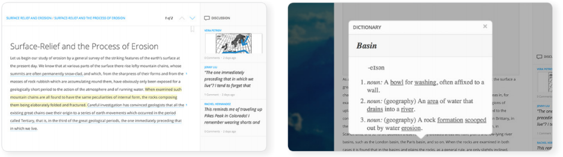

-  Highlight and add sharable notes to specific sections of the text.
-  Select and define words.

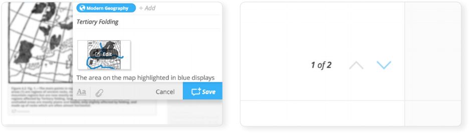
	   
- Add links, polls, assessment questions, videos, images, block
   quotes, code blocks, footnotes, timelines, and more.
- Easily navigate multiple pages with paging tools.

Embedded PDFs
-------------

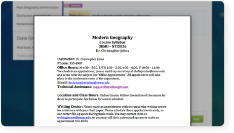

This type of reading displays a static PDF inside of the platform.
Learners can scroll through the PDF, read, download, and print it, and
can add notes to the side of the displayed PDF.

Videos
======

Videos enhance learning by introducing course lessons, demonstrating
ideas, and engaging learners.

.. image:: images/videos.png

Videos can appear in a lesson or they can be included inside of other
content such as readings, discussions, or assignments. NextThought can
assist you in creating professional videos to enhance your lessons, or
we can incorporate any prerecorded YouTube, Kaltura, or Vimeo video into
your course.

.. note:: Please contact NextThought if you are interested in using
           our Video Team and Learning Designers to assist you in
           creating videos. Our Video Team works both in-studio and on
           location. Visit https://nextthought.com/video-services to
           learn more.

Transcripts
===========

Video transcripts allow learners to search for keywords, add
contextualized notes, and review the video’s transcript at their own
pace.

Every video can have an attached transcript, and NextThought assists
instructors in creating transcripts for videos. Transcripts appear
beside the video and offer many benefits for learners. Transcripts
allow learners to simultaneously watch the video and read the
transcript. It also allows users to add contextualized notes, search
for keywords in the video’s text, and jump to a specific place in the
video by selecting a section of the transcript’s text. Transcripts can
also feature slides to allow users to conveniently view the slides
that correspond with the ones in the video.

	    
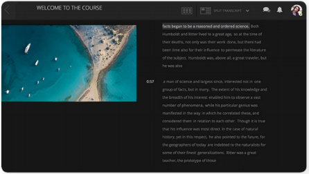

The transcript player has three views and also a gallery displaying
all videos in the course. To play the video in full screen, split
video, or split transcript view, select the dropdown arrow displayed
in the upper panel of the player. To preview all videos within the
course within the gallery, click the icon to the left of the
transcript view dropdown.

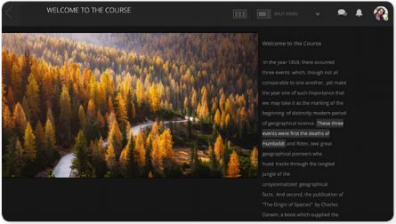

Assignments and Self-Assessments
================================

Test learners’ comprehension of the material or give them an
opportunity to test themselves with assignments and self-assessments.

Assignments and self-assessments can be added to any lesson.
Self-assessments can also be included within a reading. Each assignment 
or self-assessment can include downloadable documents, links, and
embedded videos and images. Each question can also include tips and hints 
for that question, as well as display the solution once the assignment has 
been submitted. Displaying tips, hints, and solutions are optional.

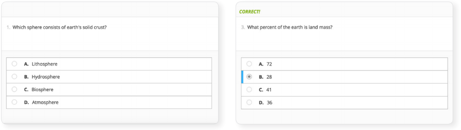

**Features:**

-  Choose from several different :ref:`question-types`. To see a list of
   question types supported, visit “Assignment and Self-Assessment
   Question Types.”
-  Include downloadable documents, links, or embedded videos or images.
-  Display optional  tips, hints, and solutions for each question.
-  Set assignments to grade automatically upon submission (with the
   exception of essays, uploads, graded discussions,  and participation
   points, all which require manual grading).         
- To learn about more options and features, please see the
   :ref:`Create an Assignment <create-an-assignment>`.
  
.. _question-types:

Question Types
==============

Listed below are the types of questions we support in assignments and
self-assessments. If you do not find a question type compatible with
the type of assessment you have, please contact us and we’d be happy
to assist you.

-  Multiple Choice
-  Multiple Answer
-  Ordering
-  Word Bank (Matching)
-  Mathematical Notation
-  Short Answer
-  Essay
-  File Upload
-  Discussion
-  FEATURE: Timed
-  FEATURE: Randomization
-  FEATURE: Question Bank
-  FEATURE: Gradebook Entry

Multiple Choice
---------------

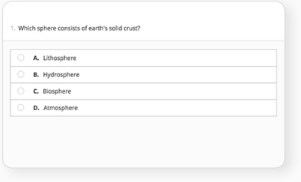

Allows learners to select the best possible answer out of a list of
solutions. **Available to editors using authoring tools.**

.. note:: Best to use when the answer to the question asked is a
           single sentence or statement.

Multiple Answer
---------------

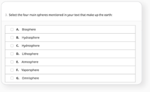

Allows learners to select multiple answers out of a list of
solutions. **Available to editors using authoring tools.**

.. note:: Best to use when the answer to the question asked is
           potentially more than one sentence or statement.

Ordering
--------

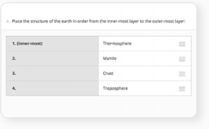

Allows the learner to arrange data and information into the
appropriate order. **Available to editors using authoring tools.**

.. note:: Best to use when the solution requires a specific ordering
           of information, such as the order of steps or events.

Word Bank (Matching)
--------------------

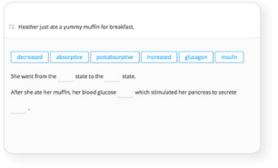

Allows learners to use a word bank to match with blank spaces in
statements or phrases below. The word bank can be customized to allow
a response to be used multiple times.

.. note:: Best to use when answers can be left out of a statement and
           collected into a bank. It can also be used to match terms
           with definitions.

Mathematical Notation
---------------------

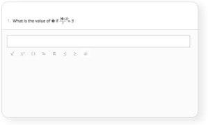

Offers learners the use of mathematical characters in the response
field.

.. note::  Best to use when the solution to the problem includes mathematical notation.

Short Answer
------------

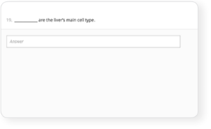

Provides a text field for learners to type a word or short phrase as
their response. **Available to editors using authoring tools.**

.. note:: Best to use for questions that prompt the learner to display
           his or her breadth of understanding and knowledge in
           writing. It allows for a single word or short phrase
           answer.

Essay
-----

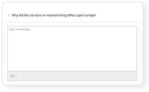

Provides learners with a text field to respond to questions in short
sentences or several paragraphs. Responses are not limited in
length. **Available to editors using authoring tools.**

.. note:: Best to use for questions that prompt the learner to display
           understanding in writing. This type of response requires
           extensive recall and extra time to complete.

File Upload
-----------

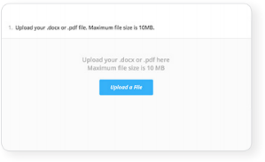

Allows learners to submit files directly to instructors for
review. The NextThought platform will accept any specified file
type. **Available to editors using authoring tools.**

.. note:: Best to use when the assignment requires a file by a program
           outside the NextThought platform. Instructors can download
           learner files.

Discussion
----------

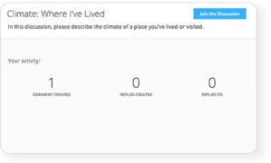

Prompts learners to respond within course forums. The discussion is
displayed within the assignment and includes learner activity
information. **Available to editors using authoring tools.**

.. note:: Best to use when participation within course discussions are
           not only encouraged and expected, but required and graded.

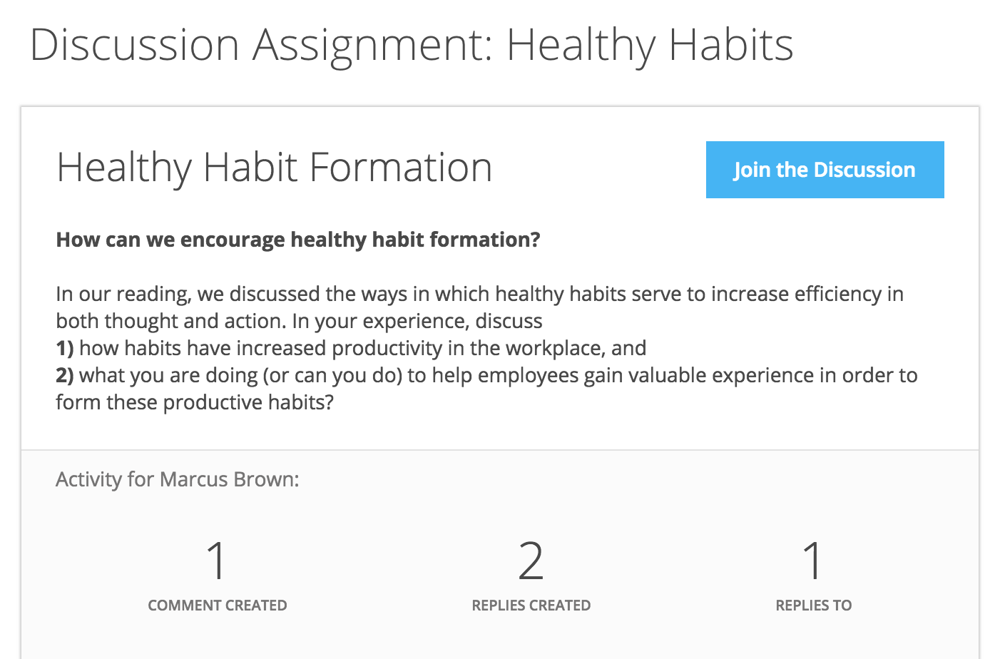

FEATURE: Randomization
----------------------

Most question types allow “randomization” for the questions and/or
solutions. Randomizing the questions would create a unique ordering of
the questions for each learner. Randomizing the solutions would create a
unique ordering of solutions for each individual.

**Available to editors using authoring tools.**

FEATURE: Question Bank
----------------------

Allows a designated amount of questions from a larger set of questions
to be randomly selected and assigned to learners. For example, five
different questions can be randomly assigned to a learner from a bank
of ten questions. The learner would only see and respond to those five
questions.

**Available to editors using authoring tools.**

FEATURE: Timed Assessments
--------------------------

Restricts the learner to a designated amount of time to complete the
assignment. A window will prompt the learner to acknowledge that the
assignment is timed. The submitted assignment will indicate to both
the instructor and learner if the learner submitted within the
allotted time.

**Available to editors using authoring tools.**

FEATURE: Gradebook Entry
------------------------

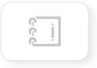

Allows the instructor to add a grade when one is needed for an
activity that occurs outside the platform, or on another part of the
platform. It does not require a submission within the assignment
itself, but only acts as a grade entry.

**Available to editors using authoring tools.**

Discussion Forums
=================

Engage learners and encourage participation and exploration of the
lesson through discussion prompts.

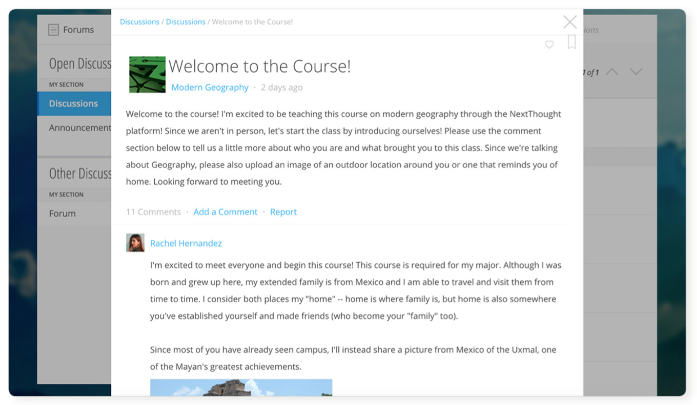

The course forum displays all course discussions and can be accessed
from the Discussions View. Individual discussions in the forum can
also be accessed directly through each lesson. This allows access to
the discussion from the Lesson View itself to contextualize the
discussion within readings, videos, and assessments. Discussions may
also be part of a graded assignment.

**Instructor-led vs. Learner-led Discussions**

Typically only instructors can create new discussion threads in the
discussions and announcements forums. Learners, however, are able to
create and post new topics in the general course “Forum.”

External Links
==============

Create links for quick access to websites, research, videos, and other
content found outside the platform.

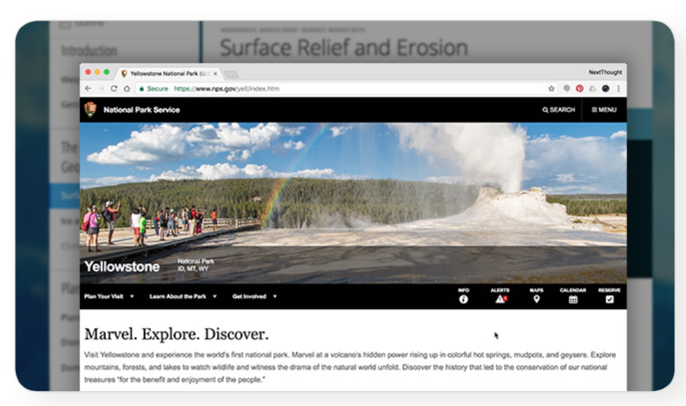

External links can be included in a lesson, reading, discussion, as well
as in an assignment or assessment. For example, an instructor may
require learners to read an article written by a researcher whose work
exists on an external webpage.

Downloads
=========

Provide documents for learners to download, interact with, and/or print.

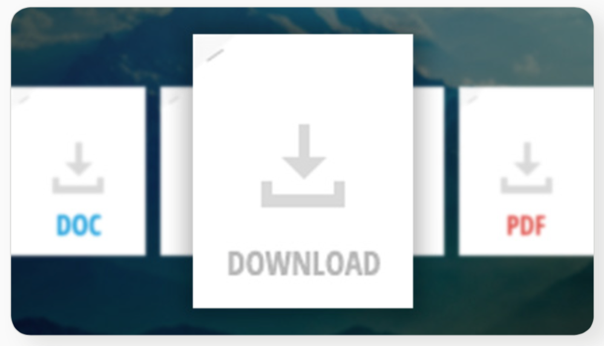

Downloadable documents may be included as a resource within a lesson or
can supplement other content types by adding them within assignments or
assessments, readings, and surveys and polls.

Surveys and Polls
=================

Create surveys and polls to collect feedback from learners.

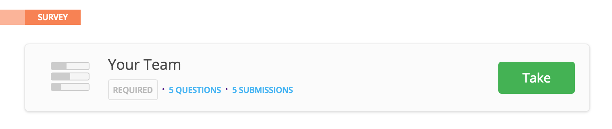

Surveys and polls gather feedback allowing instructors to assess
opinions or comprehension. Results, absent of learner names, may be
displayed in graphs or charts. A survey is a single page of
questions. A poll, on the other hand, only includes a single question
and is located in other course material such as a reading.

**Survey:**

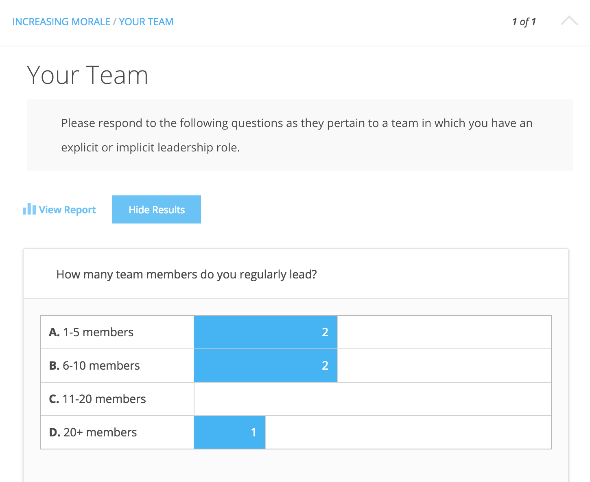

**Poll in reading:**

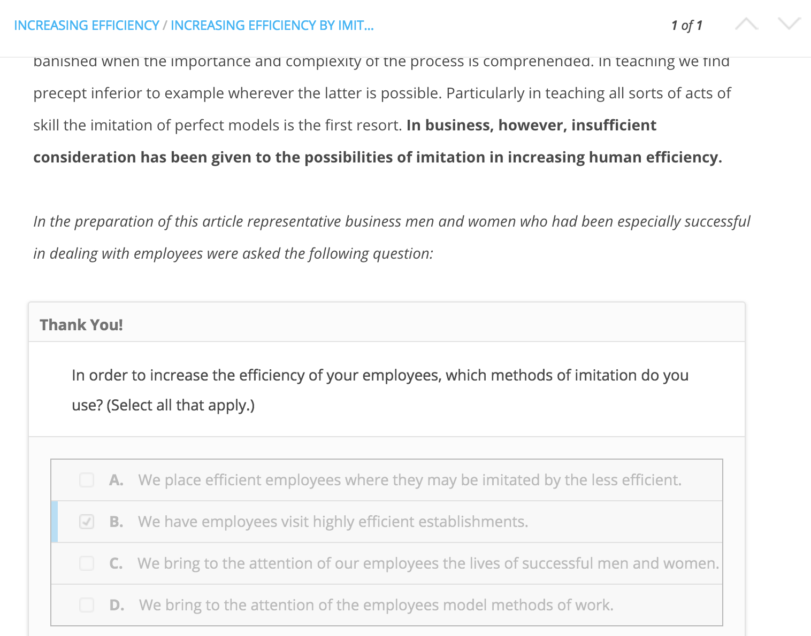

Timelines
=========

Allow learners to visualize and interact with events on a timeline.

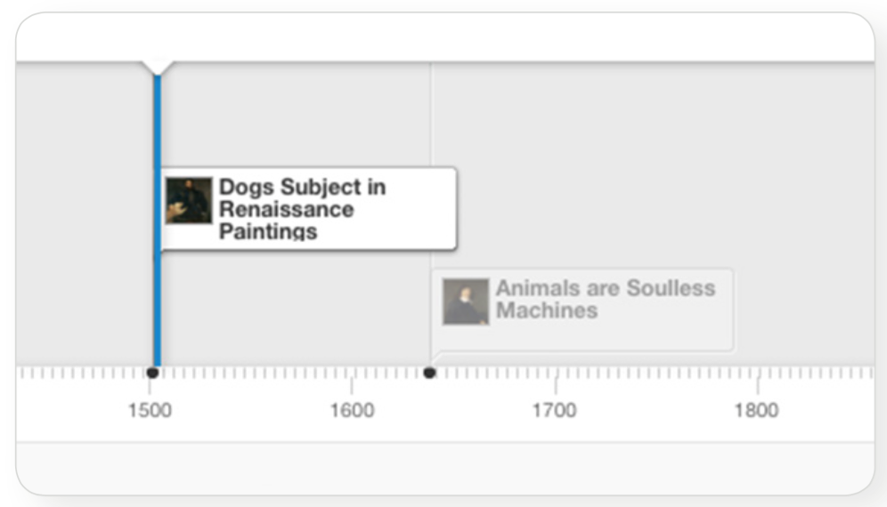

The Timeline feature allows learners to visualize the order of events as
they learn about and interact with them. The Timeline includes a
scrollable timeline reel with events. Above the timeline, supplementary
images and text display, corresponding with the date and event selected.

Image and Video Reels
=====================

Organize supplementary videos and images into a reel.

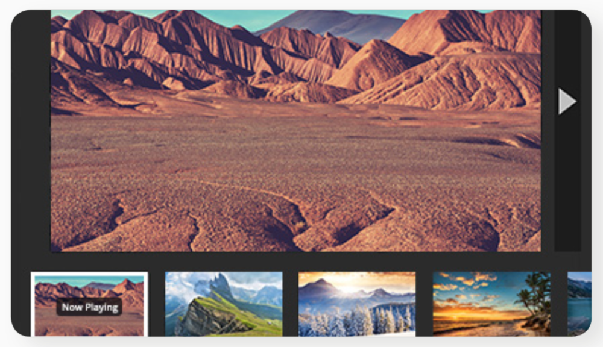

By collecting images and videos in one place within a reading, learners
can easily and quickly scroll horizontally through a collection of
videos or images, clicking on them to play or enlarge.
