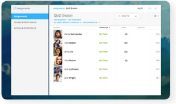
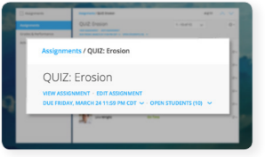
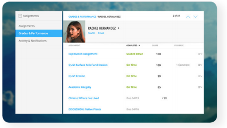
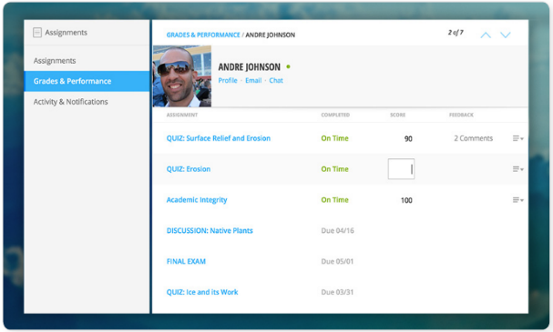
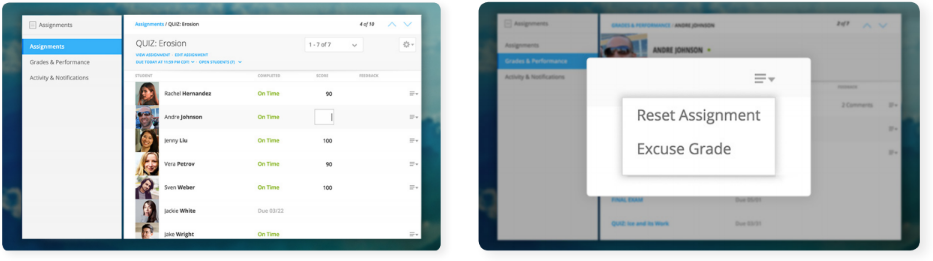
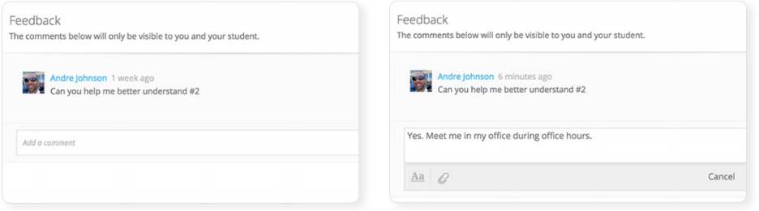
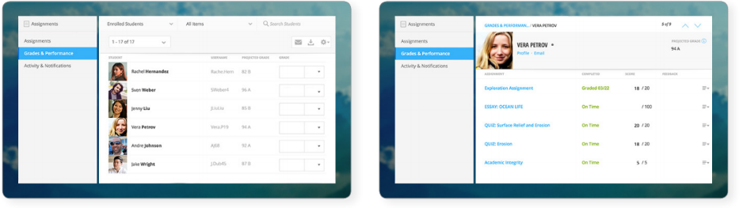
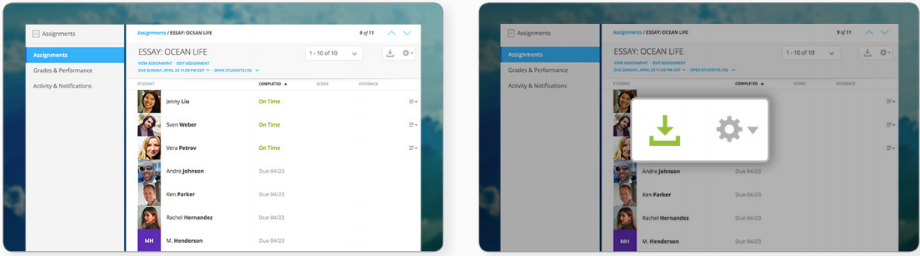
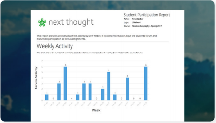
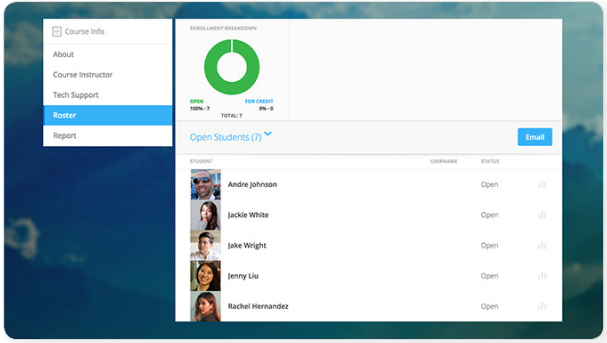

=============================================
Managing Your Course
=============================================

Gradebook                                 
==========================================

The NextThought Gradebook is located within your course under the Assignments page and has
a variety of features described in detail below. The Gradebook is organized into three sections:
“Assignments,” “Grades & Performance,” and “Activity & Notifications.”

**Gradebook Features:**

-  Sort and search assignments
-  Filter student assignments
-  View student assignments
-  Download assignments
-  Grade student assignments
-  Offer feedback on work
-  Download student reports
-  Export grades
-  Grade Predictor
-  Course Roster
-  Contact your course
-  Create assignments

Gradebook Organization
-------------------------------------

The Gradebook is organized into three  sections:  “Assignments,” “Grades & Performance,” and “Activity and Notifications.”

Assignments Section
^^^^^^^^^^^^^^^^^^^^^^^^^^^^^

The Assignments section displays an interactive list of all assignments
in your course.

.. image:: images/assignments.png

You can sort this list by lesson, due date, completion, publication
status, and creation date. Searching for a specific assignment is easy
with the search tool.

.. image:: images/sortLesson.png

Click on an assignment within the list to view specific student
activity. You can sort the list of students by name, username,
completion, score, and feedback by selecting that column’s title. You
can also filter by enrolled and open students, and search for specific
students by name by clicking the enrolled/open student dropdown.

Click “View Assignment” to view or practice the assignment. If the
assignment included a file upload, a download files button will be
available to you to download all student files to your computer.

.. note:: When more than 50 students are in the course, students are filtered by page in the Gradebook. To display more students per page, click the gear icon located in the upper right-hand corner.

Grades & Performance Section
^^^^^^^^^^^^^^^^^^^^^^^^^^^^^

The Grades & Performance section displays an interactive list of all
students in your course.

.. image:: images/gradesPerformance.png

This section allows you to view a detailed list of “All Students,”
“Enrolled,” or “Open.” Clicking on the column titles will sort by
student name, username, projected grade, or (if available) final grade.
You also have the option to sort students by their assignment status
(actionable items, overdue items, and ungraded items) by using the top
dropdown.

Click on the email icon to email the course or a subset of students.
Click on the download button to export course grades. We will explain
more about these features in later sections.

Clicking on a student from this view allows you to view that student’s
assignment submissions and grades. You can sort the student’s
assignments by name, completion status, score, and feedback. Grade any
assignment by clicking in the score column, and excuse or reset a grade
using the dropdown. View the student’s “Profile,” or click on “Email” to
email the student. Click on a specific assignment to view the student’s
work.

.. note:: When more than 50 students are in the course, students are filtered by page in the Gradebook. To display more students per page, click the gear icon located in the upper right-hand corner.

Activity & Notifications
^^^^^^^^^^^^^^^^^^^^^^^^^^^^^

The Activity & Notification section is the go-to place to see all
important updates and notices relating to assignments.

Assignment notifications are organized by date, with the most recent
activities near the top of the stream. Clicking on a notification will
navigate you to that activity.

**Instructor Notifications Include:**

-  Student submission
-  Student feedback
-  Instructor feedback

.. image:: images/instructorNotifications.png

**Student Notifications Include:**

-  New assignment
-  Overdue assignment
-  Assignment submission
-  Student feedback
-  Instructor feedback
-  New grades
-  Posted final grade

.. image:: images/studentNotifications.png

.. warning:: Please note: Due to the large amount of activity generated in instructor accounts, student submission notifications will only appear in the Activity & Notifications section of the Gradebook and will not appear in your general notifications located within the bell icon in the upper right-hand corner of your account. Students, however, will continue to receive important notifications such as feedback or an assigned grade in both streams. To learn more about the general notification stream, please visit the guide’s “Notifications” section.

Grading Assignments
-----------------------------------------------------------

Instructors may add or modify a grade, reset and excuse assignments, and
leave feedback.

Adding a Grade
^^^^^^^^^^^^^^^^^^^^^^^^^^^^^^^^^^

Grades can be added within the Student View or Assignment View.

Once you have added a grade by typing in a numerical or alphabetical value, the
grade will automatically save.

Grades can be manually or automatically assigned. If an assignment has
concrete answers (as opposed to essay questions), NextThought can enable
automatic grading. This feature would assign an automatic and viewable
grade upon completion of the assignment.

.. note::  Please note: An instructor can modify an automatic or manual grade at any time by clicking on the grade and typing in a new value.

**Student View: Grade by Student**

.. image:: images/gradeByStudent2.png
    :width: 49 %
.. image:: images/gradeByStudent3.png
    :width: 49 %

This view is best to use when you would like to grade assignments by
student.

#. Navigate to the “Grades & Performance” section of your
   Gradebook.
#. Click on a student’s name.
#. Click within the “Score” column of an assignment to assign a
   numerical or alphabetical grade. You can also use the tab key or the
   arrow keys to navigate up or down to the previous or next
   assignment’s score.
   
(To view the submission before assigning a grade, continue to step 4.)

4. To view the student’s submission, click on the assignment name.
   Review the student’s response and assign a grade at the top
   right-hand corner under “Assignment Grade.”

.. note:: Please note: The instructor may set up a date and time (with a time zone) that the assignment is due.

**Assignment View: Grade by Assignment**

This view is best to use when you would like to grade students by
assignment.

.. image:: images/gradeByAssignment.png

#. Navigate to the “Assignments” section of your Gradebook.
#. Click on the assignment name.
#. Assign student grades for this assignment by clicking on the “Score”
   column for each student and typing in a numerical or alphabetical
   value. You can also use the tab key or the arrow keys to navigate up
   or down to the previous or next student’s score.

( To view a submission before assigning a grade, continue to step 4.)

4. To view a student’s submission, click on the student’s name. Review
   the student’s response and assign a grade at the top right-hand
   corner under “Assignment Grade.”

Resetting or Excusing a Grade
---------------------------------------------------------------------

Reset grades to allow students to retake their assignment. Excuse a
grade when the student’s score for a particular assignment should not
count against his or her course grade.

You may reset or excuse a grade in the same views that you can assign a
grade.

**For example:**

#. Navigate to the “Grades & Performance” section of your
   Gradebook.
#. Click on the student’s name. 
#. Click on the dropdown menu to the far right of the assignment name
   and select “Reset Assignment” or “Excuse Grade.”
   (To review the student’s submission before resetting or excusing a
   grade, continue to step 4.)
#. (Optional) To review the student’s submission before resetting or
   excusing a grade, click on the assignment’s name and use the
   dropdown menu located under “Assignment Grade” in the upper
   right-hand corner to reset or excuse a grade.

Leaving Feedback
-----------------------------------------------------------

Both instructors and students can leave feedback on assignments. Once a student submits his or her assignment, or the assignment is
graded, a feedback option appears on the assignment for both the student
and instructor.

**In order to leave a student feedback, follow these steps:**

#. View a student’s assignment. (To review how to open a student’s assignment, see the section titled
   “Adding a Grade” above.)
#. Click the “Add a comment” textbox at the bottom of the
   assignment.
#. Type your feedback or upload a file and select “Save” to add feedback
   to the assignment. This will notify the student.

.. note::  Please note: If a student leaves you feedback on an assignment, you will be notified in the “Activity & Notifications” section of your Gradebook. To navigate to the feedback, click on the activity notification.

Grade Predictor
--------------------------------------------------------

The grade predictor displays for both students and teachers and allows
the student to estimate his or her end of the year course grade. Please
let NextThought know if you are interested in making this feature
available.

The grade predictor predicts the course grade of the student based on
the total points available and the total points earned by the student.
In other words, the grade predictor takes the student’s currently earned
points and divides by the currently available total points of
assignments. This creates a percent between 0% and 100%.

**Location:**

-  For the student, the grade predictor will be available in the
   student’s “Grade & Performance” tab under “Course Grade.”
-  For the instructor, click on the “Grades & Performance” tab.
   Students will have a “Projected Grade” column.

.. note:: For additional specifications regarding the grade predictor, please contact NextThought.

Final Grades
--------------------------------------------

Within the Gradebook, instructors can add final course grades. If you
are interested in this feature, please contact NextThought.

Assign a final grade by navigating to the Grades & Performance section
of the Gradebook. Add a number grade or a letter grade for each student
under the column titled “Grade.” Alternatively, add a final grade by
selecting a student’s name. This opens a list of the student’s course
assignments and individual grades. Enter the final grade at the top
right-hand corner under “Course Grade.” The student will receive a
notification and will be able to view his or her final grade. 

Downloading Student Files
---------------------------------------------------------

Download student files directly from your Gradebook.

When an assignment includes the option for students to upload a file,
you can download a student’s submitted file(s) by navigating to his or
her assignment and selecting the blue “Preview”  button within the
assignment download section.

You can also download all student submissions for one assignment into a
folder on your computer. In order to do so, follow the steps below:

#. Navigate to the “Assignments” section of your Gradebook.
#. Click on the assignment name.
#. To the far right of the assignment’s name is a download files button.
#. Click the download button to download student files to your computer.

.. note:: These submissions will be saved in a zip file (typically in your Downloads folder) with the assignment name and course section number. Each student submission within the zip file (“[CourseID][[Assignment Name]”) will be saved as “ [Student Username]-[Student First and Last Name]-[Title of Submission].” 

Exporting Grades
--------------------------------------------------------

Export the Gradebook into a CSV file.

.. image:: images/exportingGrades.png

**To export grades into a CSV file, follow the steps below:**

#. Navigate to the Grades & Performance section of the
   Gradebook.
#. Use the dropdown to filter by all, enrolled, or open students.
#. In the upper right-hand corner, select the download button to the
   left of the gear button.

.. note:: The file will be saved to your computer (typically in your Downloads folder) with the name “[CourseID]\_[Open/ForCredit/Full”].”

The CSV file will include columns for student username, ID number (if
available), as well as first and last name. The file will also contain
columns for each assignment and for the final grade (if applicable).
Student grades will appear in the appropriate row and column. Excused
assignments will be indicated with the word “Excused.”

Reports
------------------------------------------------

View reports to see how students are performing and engaging in your
course.

Reports can be found by the location of the activity or in the Course
Info View under the tab  titled “Roster” or “Report.” See below for
descriptions of each.

.. note:: Site-wide reports may be found in the admin tools. Please see the Admin Guide for more information.

Course Summary Report
^^^^^^^^^^^^^^^^^^^^^^^^^^^^^^^^^^^^

.. image:: images/courseSummaryReport3.png

Presents data reviewing student enrollment, self-assessment participation, assignment submission, student activity, discussion participation, video and resource usage.

#. Navigate to the Course Info View.
#. Click on the tab labeled “Report.”
#. Click on the “Course Summary Report.”

Self Assessment Summary Report
^^^^^^^^^^^^^^^^^^^^^^^^^^^^^^^^^^^^

.. image:: images/selfAssessmentSummaryReport.png

Presents data on student participation within self-assessments both by assessment and by student. It also includes information on individual student engagement with each self-assessment.

#. Navigate to the Course Info View.
#. Click on the tab labeled “Report.”
#. Click on the “Self Assessment Summary Report.”

Course Roster Report
^^^^^^^^^^^^^^^^^^^^^^

This report lists all users enrolled in the course and the date and time in which they enrolled.

#. Navigate to the Course Info View.
#. Click on the tab labeled “Report.”
#. Click on the “Course Roster Report”

Assignment Summary Report
^^^^^^^^^^^^^^^^^^^^^^^^^^^^^^^^^^^^

.. image:: images/assignmentSummaryReport.png

Presents data regarding assignment submission and scores, as well as the distribution of answers across all questions.

**Option 1**

1. Navigate to the Assignment View.
2. Click on the tab titled “Assignments.”
3. Hover your mouse to the right of the assignment's completion column.
4. Click the bar chart icon that appears.

**Option 2**

1. Navigate to the Course Info View.
2. Click on the tab labeled “Report.”
3. Click on the “Assignment Summary Report.”
4. Select the assignment.

Student Participation Report
^^^^^^^^^^^^^^^^^^^^^^^^^^^^^^^^^^^^

Presents data reviewing a student’s forum activity, self-assessment attempts, as well as assignment submissions and grades.

#. Navigate to the Course Info View.
#. Click on the tab labeled “Roster.”
#. Click on the bar chart to the far right of the student’s name and status.
#. Click on “Student Participation Report.”

                                        

Forum  Participation Report
^^^^^^^^^^^^^^^^^^^^^^^^^^^^^^^^^^^^

.. image:: images/forumParticipationReport.png

Presents data regarding the comments in discussions and creators of discussions.

#. Navigate to the Discussions View.
#. Within the left-hand panel, hover your mouse over the title of a forum.
#. Click on the bar chart icon that appears.

Discussion  Participation  Report
^^^^^^^^^^^^^^^^^^^^^^^^^^^^^^^^^^^^

.. image:: images/discussionParticipationReport.png

Presents data regarding comment activity including the number of comments by week and the top commenters.

#. Navigate to the Discussions View.
#. Within the left-hand panel, click on the forum containing the discussion.
#. Hover your mouse over the title of the discussion. (Do not click into discussion.)
#. Click the bar chart icon that appears to the far right.

Course Roster
-------------------------------------------------

The course roster lists all students in your course and allows you to
email your course or access Student Participation Reports.

**Access Course Roster**

#. Click on the Course Info View in your course.
#. Click the “Roster” tab.

**Roster Features:**

-  **Filter:** Filter the view by "All Students," "Enrolled Students," or "Open
   Students"" by clicking the dropdown.
-  **Sort:** Click on any of the columns (e.g., “Student” or “Username”) to
   sort the students by that category.
-  **Reports:** Click on the bar chart to the far right of a student’s row
   to access the Student Participation Report for that student. (See
   “Reports”)
-  **Email:** Click the blue “Email” button to email your students. (See “Email.”)