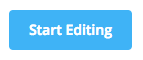
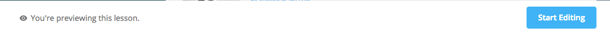
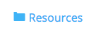
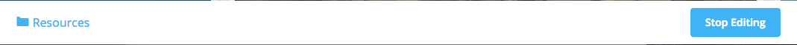
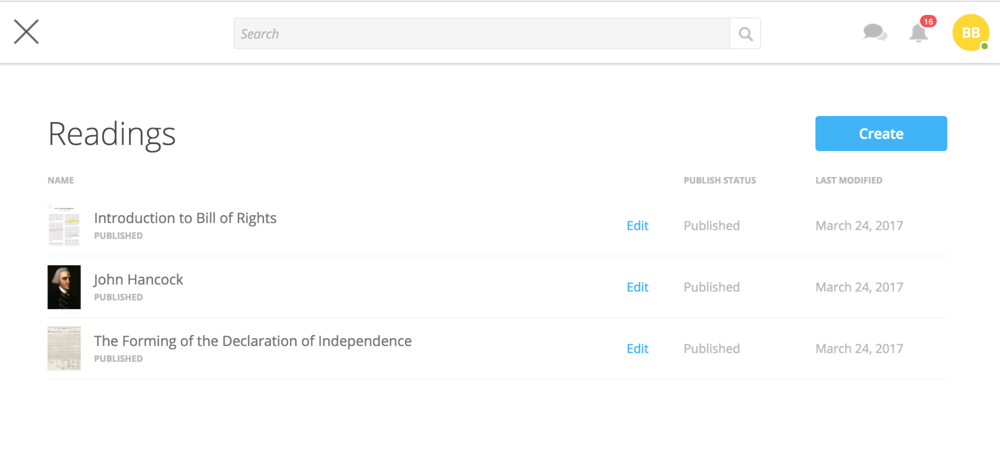
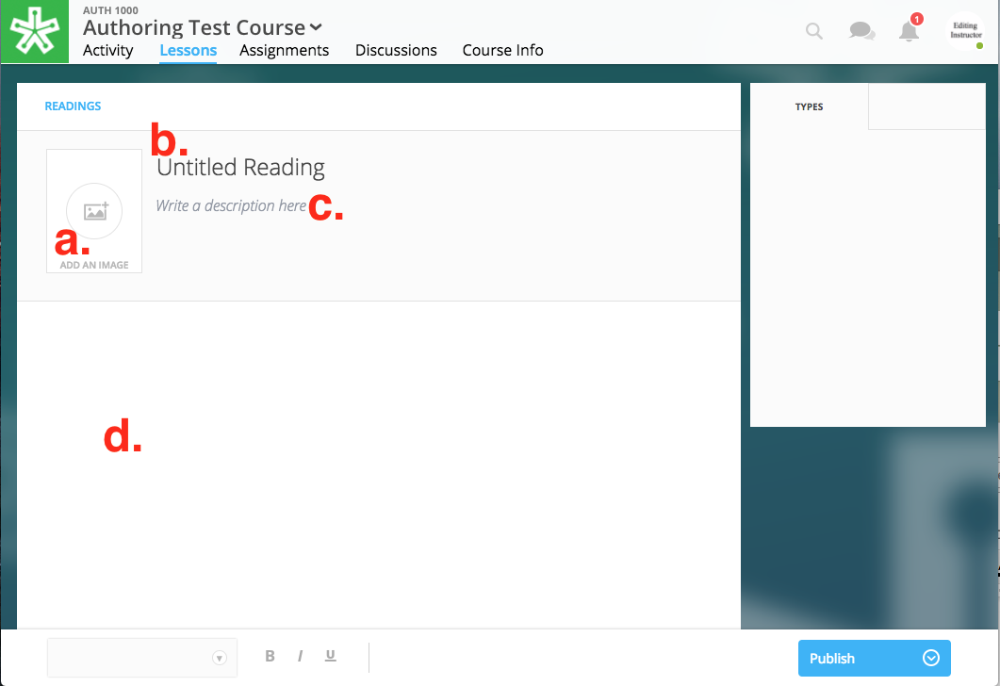
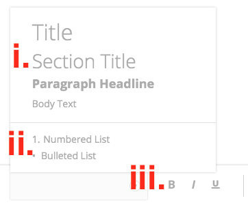
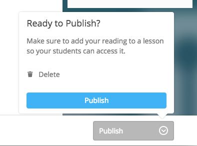

=========================
Part IV: Create a Reading
=========================

Our authoring tools allow you to create a reading to place within your
course lesson. Unlike an embedded text such as a PDF, an authored
reading allows students to comment inline with the text and highlight.

Create a Reading
----------------

In order to create a reading, follow the directions below:

 |image114|

#. While within your course’s Lessons View , enter into Edit Mode  by
   clicking on the “Start Editing”  button in the bottom right-hand
   corner within the Action Bar.

  |image115|

 |image116|

2. Now, select the “Resources”  folder at the bottom left-hand corner of
   the Action Bar.

 |image117|

3. A list view of your authored readings  will show. You can search for
   texts by name in the search field  above, and view the publish state
   and the last modified date.

 |Screen Shot 2017-03-24 at 10.36.34 AM.png|

4. Click on “Create”  in the upper right-hand corner to begin creating a
   new reading.
5. Within the editor, you can choose: |image119|

 |image120|

#. Cover Image

Click on the cover image to the left of the title and description to
open the Resource Viewer  and select or upload an image for the reading.
This image can be changed before the reading is placed into a course.

2. Title

This will name the reading within the Resource folder. The title can be
changed before being placed into a course.

3. Description

This description will offer a description for the reading. Currently,
this description only shows during edit mode. When selecting the reading
for placement in a Lesson, the description will be empty and a new one
can be written.

4. Text

Write the body of your reading’s text in this area. Note that you can
choose several different styles and formatting via the formatting menu
 below the text field:

 |image121|

#. Header Styles

Choose between “Title Text,” “Section Text,” and “Paragraph Headline
Text” to organize thoughts.

2. Lists

Choose to use a numbered or bulleted list.

3. Text Styles

Choose Bold, Italics, or Underline to emphasize text.

 |image122|

6. Select the blue “Publish”  button in the bottom right-hand corner of
   the Action Bar to open the publish state flyout. Then, select
   “Publish”  in the flyout in order to publish the text and make it
   available for placement within a Lesson.  

 |image123|

NOTE:  Once a text is “published” you will be able to find it in the
reading catalog when adding content to a Lesson. In other words,
“Publishing” your reading doesn’t make it instantly viewable to
students. You must first place it within a Lesson.

To learn more about authoring tools and placing readings within Lessons,
please visit the `Instructor’s Guide
v.2 <https://www.google.com/url?q=https://docs.google.com/document/d/1b4wSUe4Djsh1hcDPicwhdWDkzsiIEzDdrWl9CPWBAXk/edit?usp%3Dsharing&sa=D&ust=1497488599550000&usg=AFQjCNEpRvIjpe5Ka_rUK_trs1DbryVekg>`__

.. |image123| image:: images/image59.png
