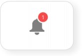
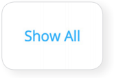

=============================================
Engaging Your Course
=============================================

Communication                                        
=====================================================

Connect with your students and other instructors and stay up-to-date on
important activity.

- Email a Course
- Email a Student
- Platform Notifications
- Add Contacts
- Chat
- Create a Note
- Create a Discussion
- Make an Announcement
- Connect on the Community Page
- Organize Groups

Email
================================================

Connect with your students through email.

You can send an email to your course or to an individual student through
your Gradebook or course roster.

All email correspondence have the option to allow students and
co-instructors to reply. If a student or instructor replies to an email,
the reply will be sent to the email connected to your NextThought
account. Below are instructions on how to send an email from your course
roster. 

Email a Course 
^^^^^^^^^^^^^^^^^^^^^^^^^^^^^^^^^^^

Email your course through your Gradebook or roster. Below is a
description of how to email your course via the course roster.

Course Email via Roster:

#.  To send an email to students in your course, visit the roster within the Course Info View. To the right-hand side of the roster, click on the “Email” button.
   
   .. image:: images/courseEmailViaRoster1.png
  

2. Within the new window, select a group to send an email to: "All Students,"
"Enrolled Students," or "Open Students."
   
   .. image:: images/courseEmailViaRoster2.png
   
   
3. Next, check the box “Allow Replies” if you would like to allow students to reply to your email.
   
   .. image:: images/courseEmailViaRoster3.png
   
   .. note:: (Please note: If you select to send an email to All Students, you will be given the option to select which group of students you would like to allow to reply: All, Enrolled, or Open.)

4. Fill out the subject line of the email and then type your email’s message.

   .. image:: images/courseEmailViaRoster4.png
   
   
5.  Check the “Send me a copy of the email” if you would like to receive a copy of your email.
   
   .. image:: images/courseEmailViaRoster5.png  
 
 
6. If you’d like for all course instructors to receive the email (and not just your students), select “Copy All Instructors.”
   
   .. image:: images/courseEmailViaRoster6.png

7. Once you’ve completed filling out your message and selecting your preferences, click the “Send Email” button at the bottom right-hand corner of the window.

   .. image:: images/courseEmailViaRoster7.png

.. note:: You may also send an email via the Gradebook within the Grades & Performance tab. To start a new email, click the mailing icon at the top right-hand corner of the Gradebook and jump to Step 2 above.

                                        

Email a Student         
~~~~~~~~~~~~~~~~~~~~~~~~

Email a student through your Gradebook, roster, or while viewing the
student’s assignment. Below is a description of how to email a student
through the roster.

Student Email via Roster:

1. To send an email to a specific student in your course, visit the roster within the Course Info View.

   .. image:: images/emailstudent1.png

2. Hover over a student’s name and click on the text “Email” that
   appears below the name.
   
   .. image:: images/emailstudent2.png
   
   .. note:: To search for a student, click on the all/enrolled/open student dropdown menu within your roster. Type the student’s name into the search field and press your keyboard’s enter key. (Please note: The roster searches within the currently selected student category.)

3. Next, check the box “Allow Replies” if you would like to allow the student to reply to your email.

   .. image:: images/emailstudent3.png

4. Fill out the subject line of the email and then type your email’s message.

   .. image:: images/emailstudent4.png

5. Check the “Send me a copy of the email” if you would like to receive a copy of your email.

   .. image:: images/emailstudent5.png

6. If you’d like for all course instructors to receive the email (and not just your students), select “Copy All Instructors.”

   .. image:: images/emailstudent6.png

7. Once you’ve completed filling out your message and selecting your preferences, click the “Send Email” button at the bottom right-hand corner of the window.

   .. image:: images/emailstudent7.png
   
.. note:: You may also send an email via the Gradebook within the Grades & Performance tab. First, click on a student within the Grades & Performance tab. Then, below the student’s name in the top banner, click on the text titled “Email” to initiate a new email. Skip to Step 3 above.

Notifications
================================================

Stay up-to-date on the most important happenings within your course and
learning community.

	
Notifications are notices of events that relates to you. New
notifications show in the upper right-hand corner of your account with a
red number marker over the bell icon. Clicking on this icon will display
all of the recent notifications you have received.

|

	
Scroll to the bottom of your notifications and click “Show All” to open
the Notifications page. This page displays all of your notifications on
a timeline.

|
|
|
	
Email Notifications
================================================

+---------------------------------------+----------------------------------------+
| **Instructor Notifications Include:** | **Student Notifications Include:**     |
+=======================================+========================================+
| Student assignment feedback           | Instructor assignment feedback         |
+---------------------------------------+----------------------------------------+
| Being tagged in a note or thought     | Instructor note creation within course |
+---------------------------------------+ materials                              |
| Posted replies to your note, comment, |                                        |
| or thought                            |                                        |
+---------------------------------------+----------------------------------------+
| Posted replies to your (manually)*    | Instructor created forum discussion    |
| created forum                         |                                        |
+---------------------------------------+----------------------------------------+
| Being added as a contact              | New grades                             |
+---------------------------------------+----------------------------------------+
|                                       | Being tagged in a note or thought      |
+---------------------------------------+----------------------------------------+
|                                       | Being tagged as part of a group or     |
|                                       | list                                   |
+---------------------------------------+----------------------------------------+
|                                       | Being added as a contact               |
+---------------------------------------+----------------------------------------+
|                                       | Posted replies to *your* note,         | 
|                                       | comment, thought, or forum discussion  |
|                                       |                                        |
+---------------------------------------+----------------------------------------+
*The table above scrolls left/right.*	

.. warning:: Due to the large volume of participation within forums, you do not receive a notification when a student comments on a course forum unless you manually created the forum.

Daily notification emails are sent out for any notifications
you’ve missed while you were logged out of the platform. These emails
contain links so you can navigate directly to any important notification
you receive while away. If ever you don’t want to be notified by email,
you can turn off this feature by clicking on your profile image and then
clicking “manage account.” Under “preferences” uncheck the box regarding
email notifications.

Add Contacts
================================================

Add contacts to build your learning network and connect with your
students.

**You can add new contacts within your Contacts page on the platform.**

#. To navigate to your Contacts page, first locate the chat bar on the
   right-hand side of your account below your profile image. *(If collapsed, you
   can open this bar by clicking on the chat bubble icon at the top
   right.)*
#. Click on the Contacts icon at the bottom of your chat bar to open the Contacts page.
#. In the bottom left-hand corner of the Contacts page in the “Search”
   field, begin typing an individual’s name.
#. Hover over the individual’s name that you’d like to add as a
   contact, and select the add contact icon that appears.

.. note:: You can also add a new contact from a profile page by clicking the “Follow” button in the top right-hand corner.

Chat
================================================

Chat with students or other instructors when they are online. Use this
feature to discuss best practices with instructors, hold virtual office
hours, or answer student questions in real time.

**There are three ways to start a chat with an online contact.**

**Chat Bar** 

Click on an individual’s profile image that appears online in your chat bar. The chat bar is located on the right-hand side of your account below your profile image. You must have added an individual as a contact for them to appear online.

|

**Contacts Page** 

Start a chat with an online contact from your Contacts page. Navigate to this page by clicking the people icon at the bottom of the chat bar. If a contact is online, you will see a chat icon with the word “chat” under the contact’s name. Click on this icon.

|

**Profile Page** 
	
While viewing a contact’s profile page, click “Message.” If the individual is currently offine, the message button will appear gray to show the contact as unavailable to chat.

|
|
|
|

.. note:: If the chat bar is collapsed, you can open it by clicking on the chat bubble icon at the top right.

Create a Note
================================================

Notes are one of the most basic forms of communication on the platform.
Add a contextualized note to almost any type of content to enrich your
students’ learning.

**To open the annotation menu within a reading:**

1. Drag your cursor over a passage.

|
|

2. Click on the note icon to begin a new note.

|
|
|
|
|
|

3. Fill out the sharing field, add a title, and a message, and even add
   an attachment or whiteboard.

|
|

4. Click “Save” to save and post your note.

|
|
|
|
|

.. note:: For most types of content , you can hover over the right margin for a note icon to appear, and click the icon to begin a new note.

**Change who your note is shared with.**

1. Notice that by default your note is shared with everyone in your course. To remove the course, hover over the course name and click the “x” that appears.

|
|
|
|
|
|

2. Leave the sharing field empty to keep the note private, or type in the name of the person, group, list, or community with which you’d like to share your note.

|
|
|
|
|
|
|
|
|

Create a Discussion or Make an Announcement
================================================

Your course forum allows you to begin a discussion or make an
announcement regarding the course.

**To create a new discussion or announcement:**

#. Click on your course Discussions View in the top banner.
#. In the left-hand panel, click on the forum in which you’d like to
   start a discussion.
#. Click “New Discussion.”
#. Add a title, tags, and your message, and even add a whiteboard,
   video, or file attachment.
#. Click “Save” to save your discussion and post it.

.. warning:: Your course may have enrolled-only forums. If you’d like both open and enrolled students to view your discussion, make sure you post in the open forum.

Connect on the Community Page
================================================

Our community feature offers a collaborative meeting space for individuals to interact outside of a course context. The community page offers members a space to post a topic or question for the community to respond to, and also offers a list of community members for easy networking and communication. 

To locate your community page, navigate to your homepage and click on a community.

Organize Groups
================================================

Create a meeting space to share best practices with a group of instructors, or set up student groups for class projects.

The group feature allows for a collection of individuals to privately and quickly share notes, ideas, and discussions between one another. Both instructors and students can create groups. Creating a group also sets up a Group page. A Group page is the meeting hub for its members. This page’s activity stream will display all notes shared with the group across readings and other materials, and also allows members to post a discussion directly to the group page regarding any topic.

**To create a group and visit the group page:**

#. Navigate to your Contacts page, and click on the tab labeled
   “Groups.”
#. At the bottom of the left-hand panel, click on “Create Group.”
#. Type a group name.
#. Select “Create” to create the group. Once the group is created, you will see a group code. Be sure to
   keep this group code to send to your contacts.
#. Click on the created group within your Contacts page to navigate to
   the Group page.

Share your code with your contacts to build group membership. If you’ve forgotten your code, click on the dropdown arrow next to the group name on your Contacts page and click “Group Code" to view and copy it. Your contacts can select “Join Group” on their Contacts page and enter the group code to become a group member.

Now that you’ve created a group, you can share notes privately with group members by creating a note and adding the group name to the sharing field. See “Create a Note" to learn more.
