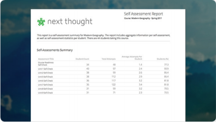

================================================
Course Progress and Reports
================================================

Course Progress and Completion
================================================

View course progress to understand how your course is progressing through required materials. You can find this tool in the upper left-hand corner of your lessons page.

**Progress** is defined by a learner completing required materials. In order for a learner to complete required materials, materials must be viewed (video, PDF, readings, etc.) or submitted (survey, self-assessment, assignments). Materials can be marked as "Required" when in Edit Mode. Learners will see the "Required" label on each required content.

Facilitator/Admin “Progress” displays

- the number of learners who have completed the course (i.e., the number of learners who have viewed/submitted all required material), 
- and the average class completion (all learner completion percentages added and divided by the number of learners).

   

Learner Progress
==================================================

Instructors, assistants, and admin have an additional, more detailed view of progress per learner. Navigate to your “Course Info” page and click on the Roster.

In the roster, the progress of each learner is presented.

Click on the progress icon to view a detailed report. The report presents a closer look at how the learner is progressing through the course item by item. The top of the report presents how the learner is performing compared to his/her colleagues. Learners are sorted into 1 of 5 categories depending on their progress. All required items are listed, and if a learner has completed that item, it is marked as completed with the date.

Completion Certificates
==========================

Once a learner “completes” the course as defined by the course progress, the learner will be able to access the “View Certificate” text in the upper left-hand corner of the Lessons page under “Course Progress.”

Clicking on this text will create a certificate for the course.

Reports
================================================

View reports to see how learners are performing and engaging in your
course.

Reports can be found by the location of the activity or in the Course
Info View under the tab titled "Admin Tools."

See below for descriptions of each.

.. note:: Site-wide reports may be found on the admin dashboard. Please see the Admin Guide for more information.

Course Summary Report
^^^^^^^^^^^^^^^^^^^^^^^^^^^^^^^^^^^^

.. image:: images/courseSummaryReport3.png

Presents data reviewing student enrollment, self-assessment participation, assignment submission, student activity, discussion participation, video and resource usage.

#. Navigate to the Course Info View.
#. Click on the tab labeled “Admin Tools."
#. Click on "View Now" under Reports.
#. Click on the “Course Summary Report.”

Self Assessment Summary Report
^^^^^^^^^^^^^^^^^^^^^^^^^^^^^^^^^^^^

Presents data on student participation within self-assessments both by assessment and by student. It also includes information on individual student engagement with each self-assessment.

#. Navigate to the Course Info View.
#. Click on the tab labeled “Admin Tools."
#. Click on "View Now" under Reports.
#. Click on the “Self Assessment Summary Report.”

Course Roster Report
^^^^^^^^^^^^^^^^^^^^^^

This report lists all users enrolled in the course and the date and time in which they enrolled. Course progress is also presented.

#. Navigate to the Course Info View.
#. Click on the tab labeled “Admin Tools."
#. Click on "View Now" under Reports.
#. Click on the “Course Roster Report”

Assignment Summary Report
^^^^^^^^^^^^^^^^^^^^^^^^^^^^^^^^^^^^

.. image:: images/assignmentSummaryReport.png
   :scale: 50 %

Presents data regarding assignment submission and scores, as well as the distribution of answers across all questions.

**Option 1**

1. Navigate to the Course Info View.
2. Click on the tab labeled “Admin Tools."
3. Click on "View Now" under Reports.
4. Click on the “Assignment Summary Report.”
5. Select the assignment.

**Option 2**

1. Navigate to the Assignment View.
2. Click on the tab titled “Assignments.”
3. Hover your mouse to the right of the assignment's completion column.
4. Click the bar chart icon that appears.

Student Participation Report
^^^^^^^^^^^^^^^^^^^^^^^^^^^^^^^^^^^^

.. image:: images/studentParticipationReport.png

Presents data reviewing a student’s forum activity, self-assessment attempts, as well as assignment submissions and grades.

#. Navigate to the Course Info View.
#. Click on the tab labeled “Admin Tools."
#. Click on "View Now" under Roster.
#. Click on the bar chart to the far right of the student’s name and status.
#. Click on “Student Participation Report.”

Forum Participation Report
^^^^^^^^^^^^^^^^^^^^^^^^^^^^^^^^^^^^

.. image:: images/forumParticipationReport.png
   :scale: 50 %

Presents data regarding the comments in discussions and creators of discussions.

#. Navigate to the Discussions View.
#. Within the left-hand panel, hover your mouse over the title of a forum.
#. Click on the bar chart icon that appears.

Discussion Participation  Report
^^^^^^^^^^^^^^^^^^^^^^^^^^^^^^^^^^^^

.. image:: images/discussionParticipationReport.png
   :scale: 50 %

Presents data regarding comment activity including the number of comments by week and the top commenters.

#. Navigate to the Discussions View.
#. Within the left-hand panel, click on the forum containing the discussion.
#. Hover your mouse over the title of the discussion. (Do not click into discussion.)
#. Click the bar chart icon that appears to the far right.

Survey Report
^^^^^^^^^^^^^^^^^

Presents the collective data gathered from survey participation. This is presented anonymously without user names.

1. Navigate to the survey on the Lessons View.
2. Click "Take" to view the survey.
3. Click "View Report."