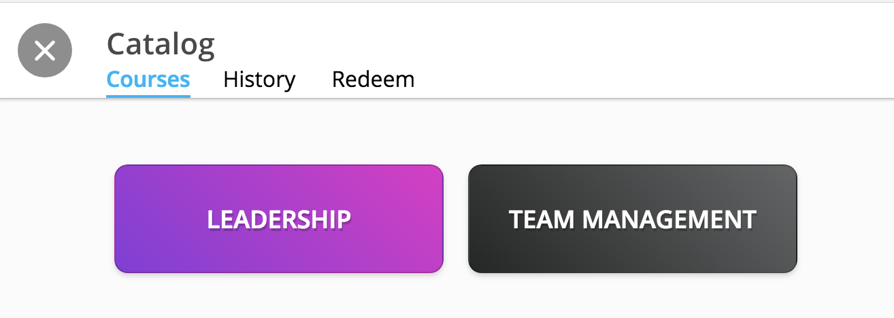
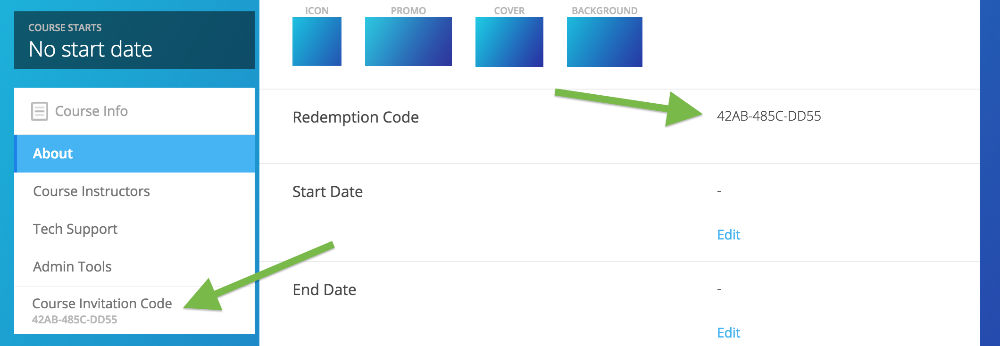

====================================
Managing Course Information
====================================

Manage basic course information and options from the Course Info View.

Course Visibility
==================

Locate the “Make Changes” button on the Course Info page.

In the new window, make desired changes. You can choose whether the course is public or private with the “Visible in Catalog” toggle. You can also set the Preview Mode:

- **Preview Mode On:** This option sets the course to course preview mode, meaning that users can only view Course Info but cannot view course content.
- **Preview Mode Off:** This option allows the course to be fully available to users.
- **Based on Start Date:** This option sets the course to be in course preview mode until the defined start date and time, at which time it will then become fully available to users.

Basic Course Information
=========================

Add a course preview video with a URL.

Locate your course title, ID, and description. Click "Edit."

Here, you can edit all fields mentioned above, and can also create and add categories to your course.

If you add a category, this will create the catagory or add the course to the existing catagory in the course catalog. This allows users to easily search and find courses based on this tag.

Course Assets
==================

Add your course image within the Course Info View.

1. Click on the "Edit" button next to "Assets."

   .. image:: images/assetsstep1.png
   
2. Upload the desired image.

   .. image:: images/assetsstep2.png
      :scale: 50 %
   
3. Crop your image.

   .. image:: images/assetsstep3.png
      :scale: 50 %
   
4. Click "Continue."

5. Preview and adjust the size of each asset.

   .. image:: images/assetsstep4.png
      :scale: 50 %
   
6. Click "Apply Image" after all adjustments have been made.

7. Click "Done."

Course Codes
==================

Course Code
^^^^^^^^^^^^^^

Locate your course code.

This unique course code allows users to enroll in the course using the "Redeem" tab in the course catalog. The code has unlimited uses.

Unique Codes
^^^^^^^^^^^^^^^^

If you wish to email personalized codes out to specific individuals, scroll down to your Roster and click "View Now."

Click the "Invite" button at the top right-hand corner.

Enter email addresses, or click "Bulk" to upload a CSV with emails. Also, type in your message. The individuals will receive your email with the message you typed as well as a course enrollment code tied to their email address. They must then create an account with their email address to gain course access.

.. note:: If the course access you prefer is not listed, please contact NextThought for more options.

Course Dates
==================

Locate course dates. These dates include Start Date, End Date, and Meet Times. Click "Edit" to the right of a field you wish to edit. Course dates will appear in the course catalog.

- **Start Date:** This date suggests to users when they should open and get started in the course. It can also determine when the course exits "Preview Mode." (See "Course Visibility" above to learn more.)
- **End Date:** This date suggests when users should be done with the course, and the course will then be "Archived." Learners can still interact with archived courses, and new learners can continue to enroll if the course is visible in the catalog or they have an enrollment code.
- **Meet Times:** Meet times allow the instructor to designate weekly dates and times learners are expected to either meet in person or online.

Course Facilitators
====================

Assign new or additional course facilitators to your course.

1. Click on the Course Info tab
2. Scroll to the Facilitator section
3. Click “Edit”
4. Add new facilitator:

   .. image:: images/addfacwin.png
   
   - Click “Add a Facilitator”
   - Search user(s) by name
   - Assign a role (Instructor, Assistant, or Editor)
   - Click “Visible to Learners” if you’d like this facilitator to show on the Course Info page and homepage 
   
5. Edit current facilitator:

   .. image:: images/instedit.png

   - Locate facilitator on list
   - Toggle “visible” or “hidden” via the dropdown 
   - Toggle role using the role dropdown
   - Remove a facilitator by clicking the “x”
   
6. Click "Save" within the course facilitator section to save your changes.