=============
Release Notes
=============

January 25, 2018
-----------------

Book analytics 
^^^^^^^^^^^^^^^

Now, analytics are available for both courses and books.

In the admin tools, select “Content” and use the dropdown menu to select “Books.” You will see a list of books and basic analytics for each. Click on a book for greater detail and to view widgets for Top Learners, Daily Activity, Active Times, and Most Popular Time.

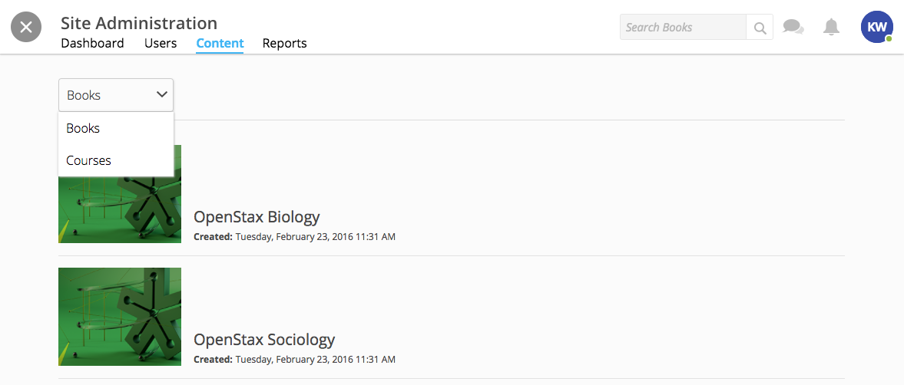

.. note:: Not all sites have access to books. If you have a book, it will display on the homepage under "Books."

Redesign of course reports tab
^^^^^^^^^^^^^^^^^^^^^^^^^^^^^^

Reports are now centrally located under the "Report" tab within the Course Info View. In addition to the Course Summary Report and the Self Assessment Summary Report, the Course Roster Report and Assignment Reports can now also be found here. 

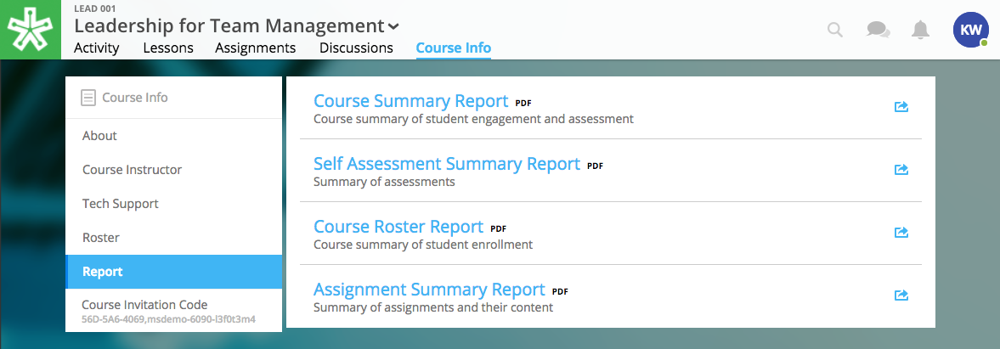

Can set a course start time and end time
^^^^^^^^^^^^^^^^^^^^^^^^^^^^^^^^^^^^^^^^^^

A specific start and end time can be set in the Course Info View. Click “Edit” next to either “Start Date” or “End Date.” Then, click the dropdown to select a date and set a time. 

.. image:: images/coursestarttime.png

.. note:: You can use the start date and time to define when the course becomes available for users.

Options for opening a course
^^^^^^^^^^^^^^^^^^^^^^^^^^^^^^

There are three options for site admins when opening course content to users. These options are available when creating a course, or you can return to this view by hovering over a course on the homepage and clicking the gear icon that appears. Then, select "Edit Course Information" and "Course Settings."

- **Preview Mode On:**
  This option sets the course to course preview mode, meaning that users can only view Course Info but cannot view course content.
  
- **Preview Mode Off:**
  This option allows the course to be fully available to users.
  
- **Based on Start Date:**
  This option sets the course to be in course preview mode until the defined start date and time, at which time it will then become fully available to users.
  
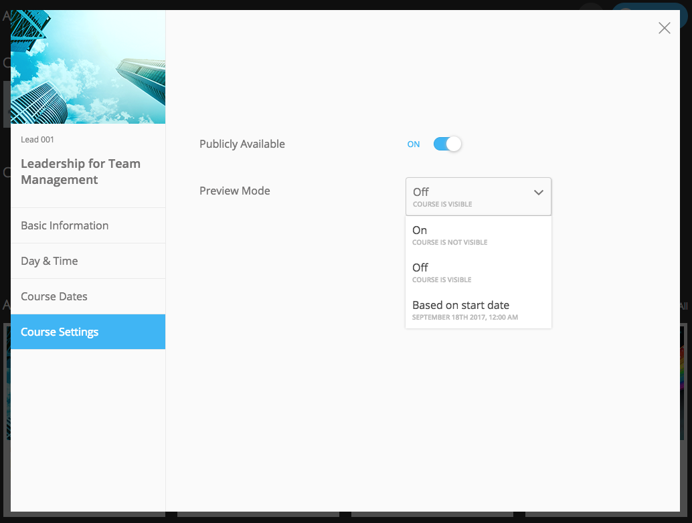

..  note:: By default the course will be in **Preview Mode On** and will need to be either switched to **Preview Mode Off** or **Based on Start Date** for users to begin the course. 

New Enrollment Report in admin tools
^^^^^^^^^^^^^^^^^^^^^^^^^^^^^^^^^^^^^

In the admin tool Reports tab, the “User Enrollment Report” is now available. This report provides a list of all courses the user is enrolled in and when they enrolled.

New Course Roster Report
^^^^^^^^^^^^^^^^^^^^^^^^^^

The "Course Roster Report" is available at both the course level (under Course Info View > Reports) and in the admin tools (under Reports). This report displays the users enrolled in the course along with their enrollment and last access time.

Site admins can manage site admins
^^^^^^^^^^^^^^^^^^^^^^^^^^^^^^^^^^^^

Site admins can now manage (add or remove) site admins. When viewing admin tools, click on the “Users” tab. Search for users in the upper right-hand corner, check the box beside their name, and click on the gear icon above. Select “Set as Admin” and a confirmation window will appear to confirm your selection.

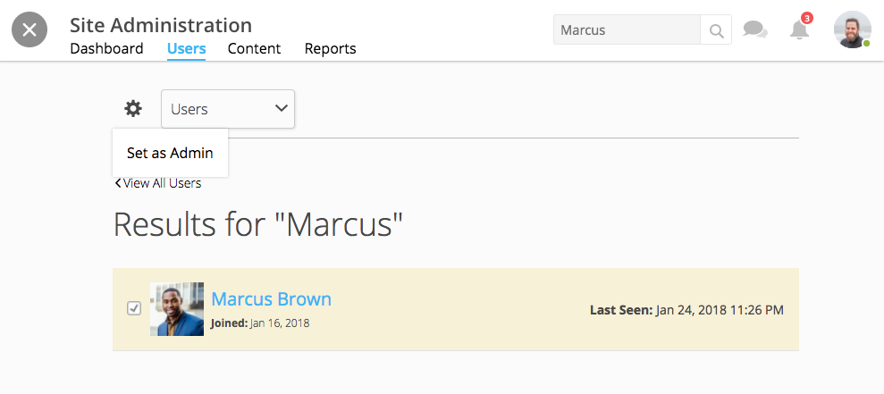

.. note:: In this window, you can toggle between viewing “Users” or “Site Admins” with the dropdown menu.

January 11, 2018
-----------------

Top Learners widget added to admin tools
^^^^^^^^^^^^^^^^^^^^^^^^^^^^^^^^^^^^^^^^

While viewing the admin tools dashboard, Top Learners now displays at the top right-hand corner.

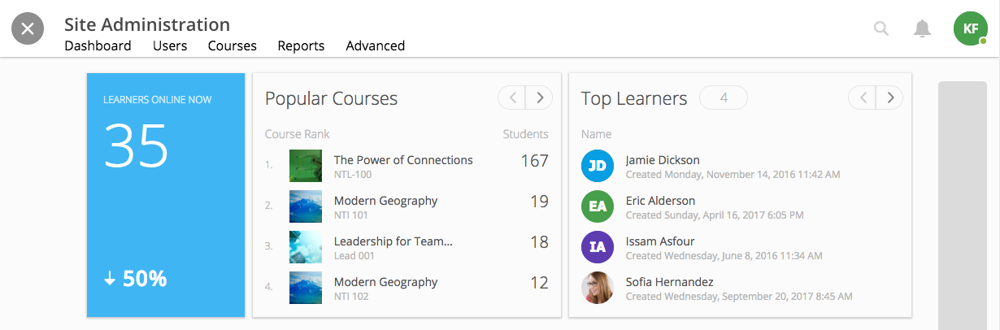

All images are expandable
^^^^^^^^^^^^^^^^^^^^^^^^^^

All images in readings are now clickable. Clicking on an image expands it in a new popup window.

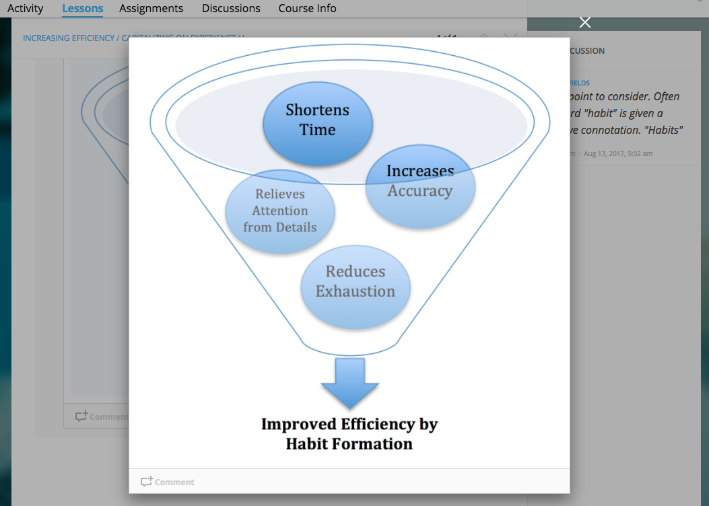

December 21, 2017
-----------------

Course reports available in admin tools
^^^^^^^^^^^^^^^^^^^^^^^^^^^^^^^^^^^^^^^^

Now, course reports can be centrally found in the admin tools. Using a site admin account, navigate to the admin toolbar. Select “Courses” and select a course. Now, click on “Reports.” 

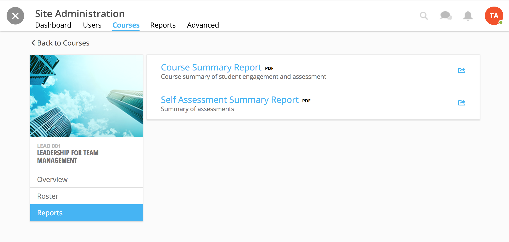

Add code blocks in assignments 
^^^^^^^^^^^^^^^^^^^^^^^^^^^^^^

Now, an editor and instructor are able to add code block within assignments. Add code to assignment descriptions, or within the question text itself.

While in the description field or question text field, click on the brackets at the bottom of the window to initiate a code block. Click in the code block and begin typing.

When editing:

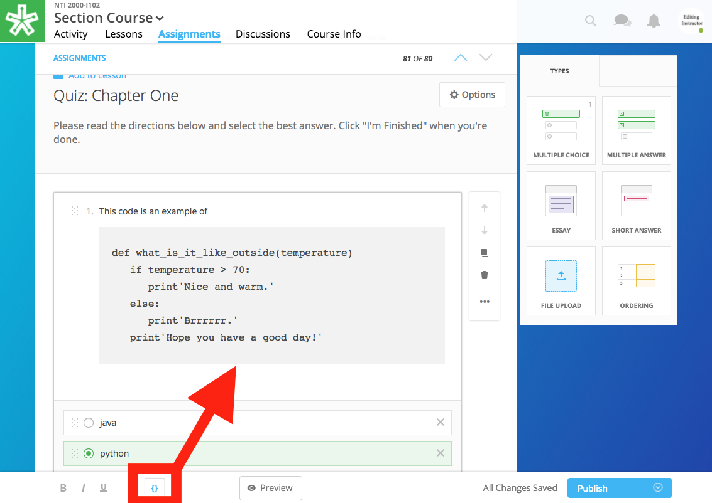

When published:

.. image:: images/codeblockpub.png

December 7, 2017
----------------

Admin tools for site management
^^^^^^^^^^^^^^^^^^^^^^^^^^^^^^^^

NextThought offers a new role, the site admin, alongside a suite of new tools and reports to create and manage courses, view site-wide analytics, mangage users, and view user analytics. For site admin accounts, the toolbar is located in the upper right-hand corner of the homepage.

Please see the new Site Admin Guide to learn more! (Coming soon.)

New course catalog
^^^^^^^^^^^^^^^^^^

The new course catalog retains the same purpose, but offers new visualizations, better navigation, a search field, and course categorization. The new course catalog displays a featured courses banner, and all public courses display below. Courses can be organized into categories based on course tagging. A new tab, the "History" tab, allows users to review their enrolled courses.

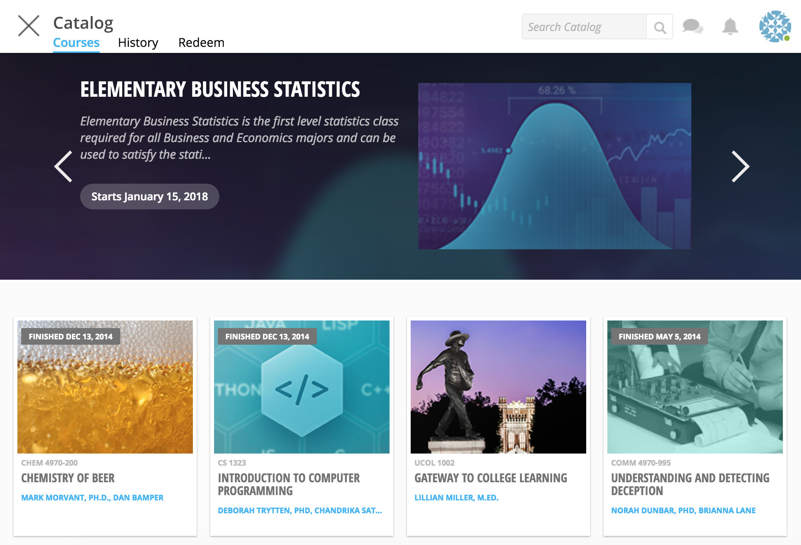

Help site link on account dropdown
^^^^^^^^^^^^^^^^^^^^^^^^^^^^^^^^^^^

A link to the NextThought Help Site is now available in the account dropdown menu. When selected, it opens the Help Site in a new tab.

Add code blocks to a reading
^^^^^^^^^^^^^^^^^^^^^^^^^^^^

An editor or instructor can now select a code block while creating a reading. When selected, the code block editor will display within the reading. Select the code you are using in the upper right-hand corner dropdown and add your code. 

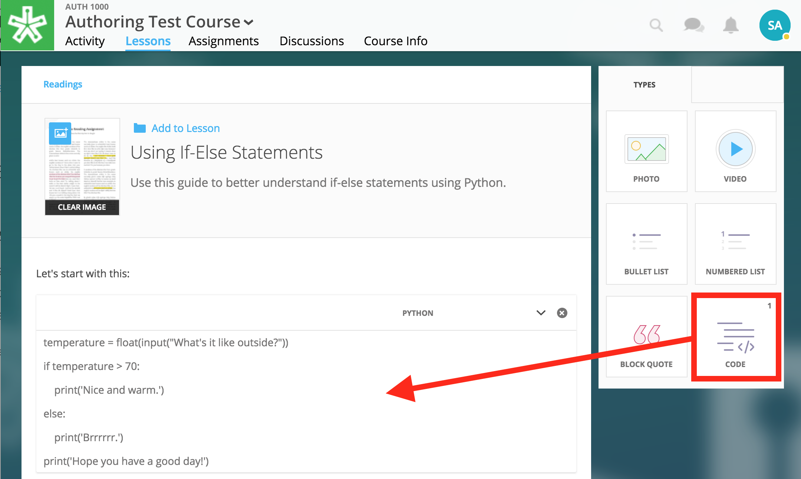

Once published, it will render according to the code selected.

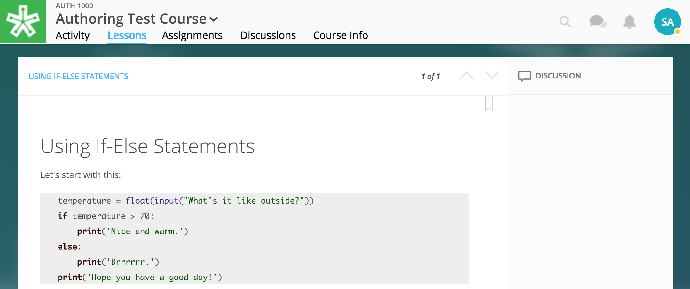

November 16, 2017
------------------

New Roles Defined
^^^^^^^^^^^^^^^^^^

With additional new course facilitation features, we have redefined and added roles to our platform. The current roles are as follows:

- **Course Facilitator:** The term for course roles: instructor, assistant, and editor

- **Course Instructor:** Instructor and editor 

- **Course Assistant:** Instructor role only (no editor capabilities)

- **Course Editor:** Editing only (no instructor capabilities)

- **Site Admin:** Can view site-wide admin tools and create and edit all courses on the site

.. note:: Course facilitator roles can be assigned by other course facilitators. Admin roles are assigned to users by NextThought.

Edit course information
^^^^^^^^^^^^^^^^^^^^^^^^^^^^

Instructors and editors can now edit course information within the Course Info tab. (Site admin can do so from the site admin tools.)

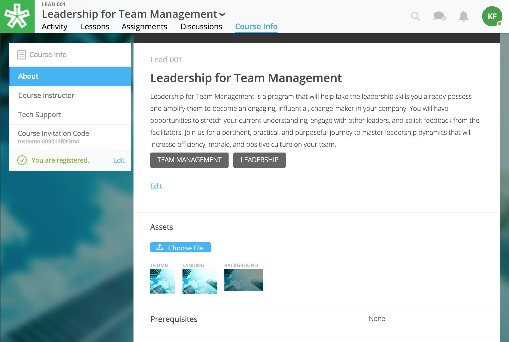

Fields that can be edited include:

- Course Video
- Course Name
- Course Description
- Course Tags
- Course Assets (Thumbnail, Landing, Background)
- Start and End Date
- Meeting Times
- Facilitators 

Course Tagging
^^^^^^^^^^^^^^^

Courses can now be tagged with one or multiple tags (e.g., “English Literature”). This is the first step in allowing users to navigate the course catalog by tags. 

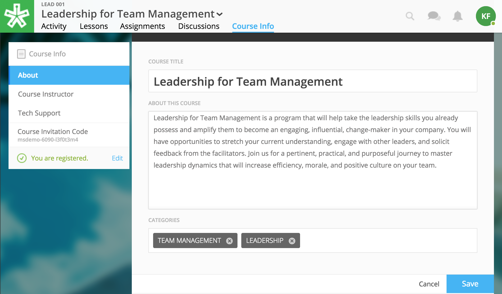

Manage Course Facilitators
^^^^^^^^^^^^^^^^^^^^^^^^^^^

The Course Info tab now allows an editor/instructor/admin to add new course roles and toggle visible and hidden facilitators.

.. image:: images/coursefacilitator1.png

1. Click on the Course Info tab
2. Scroll to the Facilitator section
3. Click “Edit”
4. Add new facilitator:

   .. image:: images/coursefacilitator.png
   
   - Click “Add a Facilitator”
   - Search user(s) by name
   - Assign a role (Instructor, Assistant, or Editor)
   - Click “Visible to Learners” if you’d like this facilitator to show on the Course Info page and homepage 
   
5. Edit current facilitator:

   - Locate facilitator on list
   - Toggle “visible” or “hidden” via the dropdown 
   - Toggle role using the role dropdown
   - Remove a facilitator by clicking the “x”
   
6. Click "Save" within the course facilitator section to save your changes.
   
Add block quotes to a reading
^^^^^^^^^^^^^^^^^^^^^^^^^^^^^

The block quote feature is now available within a reading. To create a block quote, first click “Block Quote” under “Types” in the editor. Then, either type or paste text.

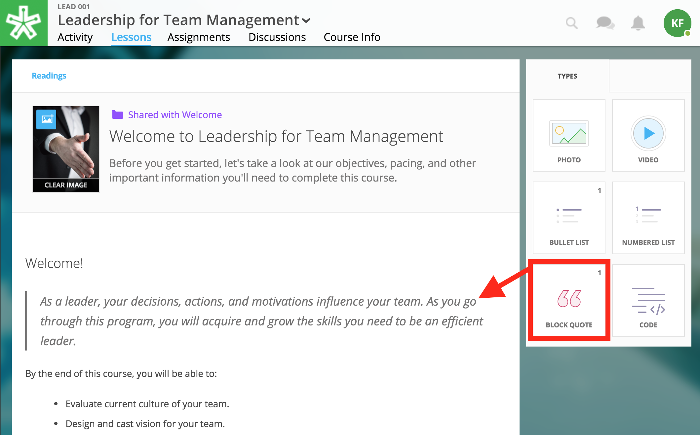

September 21, 2017
-------------------

Editors can create discussion assignments through Lessons View
^^^^^^^^^^^^^^^^^^^^^^^^^^^^^^^^^^^^^^^^^^^^^^^^^^^^^^^^^^^^^^^

Editors can now create discussion assignments while creating their lesson in Lessons View.

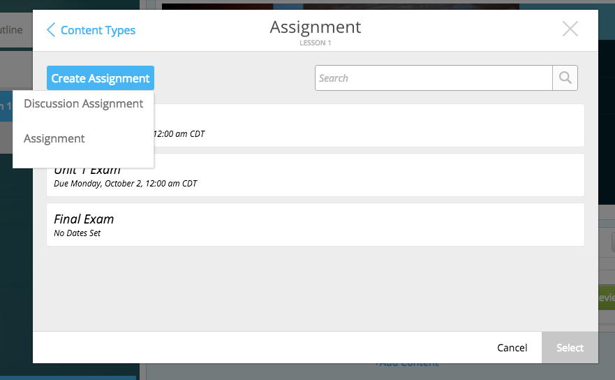

Add transcripts to videos in readings
^^^^^^^^^^^^^^^^^^^^^^^^^^^^^^^^^^^^^

An editor can now add transcripts to videos within a reading.

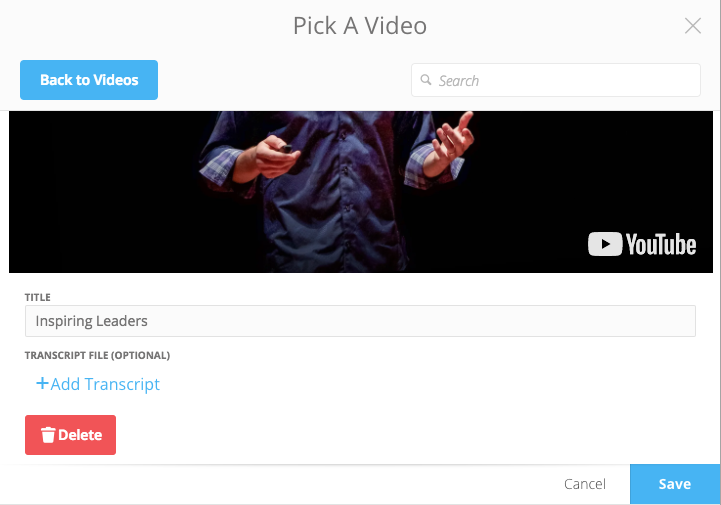

Delete videos from course files
^^^^^^^^^^^^^^^^^^^^^^^^^^^^^^^^

An editor can now delete videos within their course files.

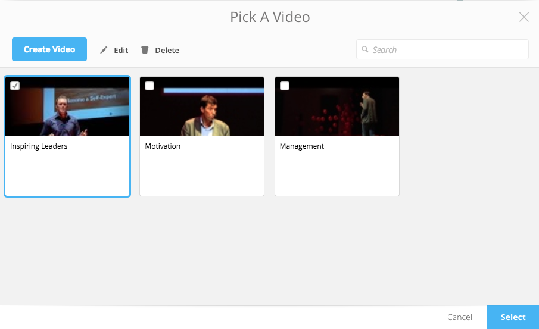

August 31, 2017
---------

Navigation bar remains in view on scroll
^^^^^^^^^^^^^^^^^^^^^^^^^^^^^^^^^^^^^^^^^

The navigational bar at the top of a reading or within a book remains in place as you scroll, allowing you access to the navigational tools no matter where you are in the reading.

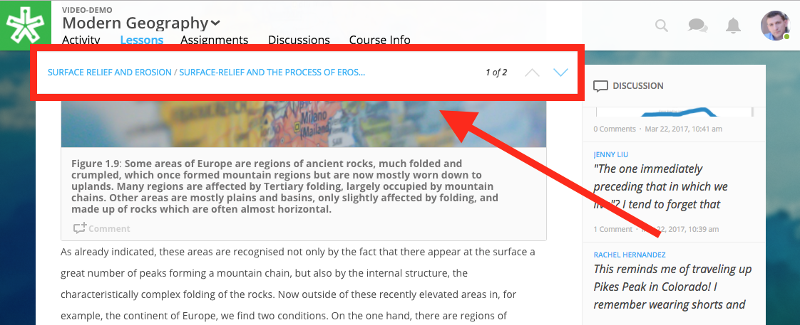

