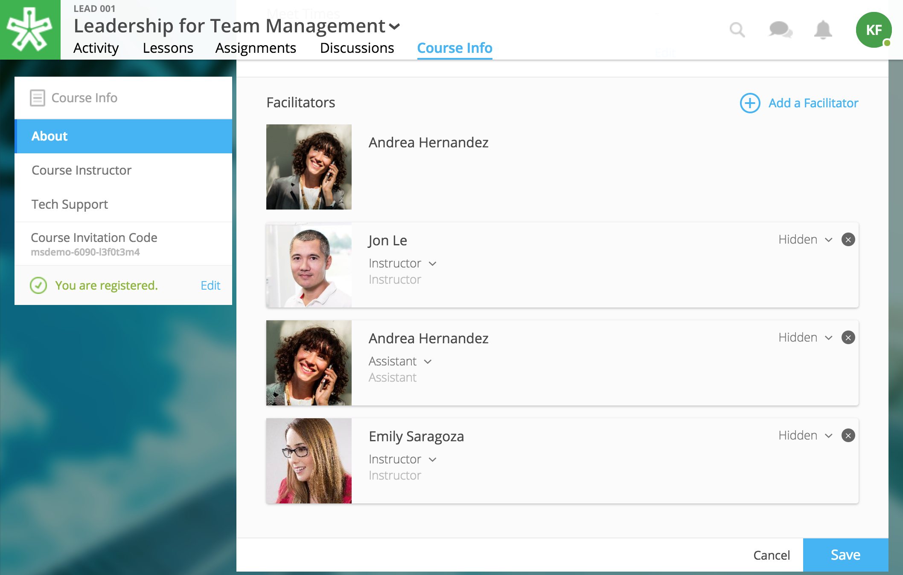

=============
Release Notes
=============

December 7, 2017
----------------

Admin tools for site management
^^^^^^^^^^^^^^^^^^^^^^^^^^^^^^^^

NextThought offers a new role, the site admin, alongside a suite of new tools and reports to create and manage courses, view site-wide analytics, mangage users, and view user analytics. For site admin accounts, the toolbar is located in the upper right-hand corner of the homepage.

Please see the new Site Admin Guide to learn more! (Coming soon.)

New course catalog
^^^^^^^^^^^^^^^^^^

The new course catalog retains the same purpose, but offers new visualizations, better navigation, a search field, and course categorization. The new course catalog displays a featured courses banner, and all public courses display below. Courses can be organized into categories based on course tagging. A new tab, the "History" tab, allows users to review their enrolled courses.

.. images:: images/newcoursecatalog2.png

Help site link on account dropdown
^^^^^^^^^^^^^^^^^^^^^^^^^^^^^^^^^^^

A link to the NextThought Help Site is now available in the account dropdown menu. When selected, it opens the Help Site in a new tab.

Add code blocks to a reading
^^^^^^^^^^^^^^^^^^^^^^^^^^^^

An editor or instructor can now select a code block while creating a reading. When selected, the code block editor will display within the reading. Select the code you are using in the upper right-hand corner dropdown and add your code. 

.. image:: images/codeblock.png

Once published, it will render according to the code selected.

.. image:: images/codeblockreading.png

November 16, 2017
------------------

New Roles Defined
^^^^^^^^^^^^^^^^^^

With additional new course facilitation features, we have redefined and added roles to our platform. The current roles are as follows:

- **Course Facilitator:** The term for course roles: instructor, assistant, and editor

- **Course Instructor:** Instructor and editor 

- **Course Assistant:** Instructor role only (no editor capabilities)

- **Course Editor:** Editing only (no instructor capabilities)

- **Site Admin:** Can view site-wide admin tools and create and edit all courses on the site

.. note:: Course facilitator roles can be assigned by other course facilitators. Admin roles are assigned to users by NextThought.

Edit course information
^^^^^^^^^^^^^^^^^^^^^^^^^^^^

Instructors and editors can now edit course information within the Course Info tab. (Site admin can do so from the site admin tools.)

.. image:: images/courseinfoedit.png

Fields that can be edited include:

- Course Video
- Course Name
- Course Description
- Course Tags
- Course Assets (Thumbnail, Landing, Background)
- Start and End Date
- Meeting Times
- Facilitators 

Course Tagging
^^^^^^^^^^^^^^^

Courses can now be tagged with one or multiple tags (e.g., “English Literature”). This is the first step in allowing users to navigate the course catalog by tags. 

.. image:: images/coursetagging.png

Manage Course Facilitators
^^^^^^^^^^^^^^^^^^^^^^^^^^^

The Course Info tab now allows an editor/instructor/admin to add new course roles and toggle visible and hidden facilitators.

1. Click on the Course Info tab
2. Scroll to the Facilitator section
3. Click “Edit”
4. Add new facilitator:

   .. image:: images/coursefacilitator.png
   
   - Click “Add a Facilitator”
   - Search user(s) by name
   - Assign a role (Instructor, Assistant, or Editor)
   - Click “Visible to Learners” if you’d like this facilitator to show on the Course Info page and homepage 
   
5. Edit current facilitator:

   - Locate facilitator on list
   - Toggle “visible” or “hidden” via the dropdown 
   - Toggle role using the role dropdown
   - Remove a facilitator by clicking the “x”
   
6. Click "Save" within the course facilitator section to save your changes.
   
Add block quotes to a reading
^^^^^^^^^^^^^^^^^^^^^^^^^^^^^

The block quote feature is now available within a reading. To create a block quote, first click “Block Quote” under “Types” in the editor. Then, either type or paste text.

.. image:: images/blockquote.png 

September 21, 2017
-------------------

Editors can create discussion assignments through Lessons View
^^^^^^^^^^^^^^^^^^^^^^^^^^^^^^^^^^^^^^^^^^^^^^^^^^^^^^^^^^^^^^^

Editors can now create discussion assignments while creating their lesson in Lessons View.

.. image:: images/DiscussionAssignment.png

Add transcripts to videos in readings
^^^^^^^^^^^^^^^^^^^^^^^^^^^^^^^^^^^^^

An editor can now add transcripts to videos within a reading.

.. image:: images/AddTranscriptVideo.png

Delete videos from course files
^^^^^^^^^^^^^^^^^^^^^^^^^^^^^^^^

An editor can now delete videos within their course files.

.. image:: images/EditDeleteVideo.png

August 31, 2017
---------

Navigation bar remains in view on scroll
^^^^^^^^^^^^^^^^^^^^^^^^^^^^^^^^^^^^^^^^^

The navigational bar at the top of a reading or within a book remains in place as you scroll, allowing you access to the navigational tools no matter where you are in the reading.

.. image:: images/releasenavigation.png

