====================
 2018 Release Notes
====================

December 14th, 2018
===================

Calendar and Events
-------------------

NextThought now supports calendar events.

Site users can track events in the right-hand side bar. Course events,
webinars, and assignments will display within the calendar feed.

Course facilitators (Editor and Instructor only) and site admin can
create events tied to a course and place them within a lesson.

**To view events:**

1. Open the right-hand side bar.
2. Click on the “Event” icon. 
   
   .. image:: images/calendar.png
   
3. Note that the events open on “Today.” Scroll up to see past events, and down to see future events.

   .. image:: images/calendaropen.png
   
4. Click on the event to navigate to it within the lesson or assignment or to view more details.

**To create events (Instructor, Editor, & Admin):**

1. View the course in Edit Mode.
2. Click “Add Content” in a section.
3. Click on “Events.”

   .. image:: images/eventicon.png

4. Click “Create an Event” (if you don’t have any events) or the blue +

   .. image:: images/createevent.png

5. Add information.

   .. image:: images/eventdetails.png

6. Click “Add to Lesson.”

Hyperlinks in Assignments
-------------------------

Admin, Instructors, and Editors can now add hyperlinked text into
assignments. Highlight the text, and select the hyperlink icon
below. Add the URL and click “Save.”

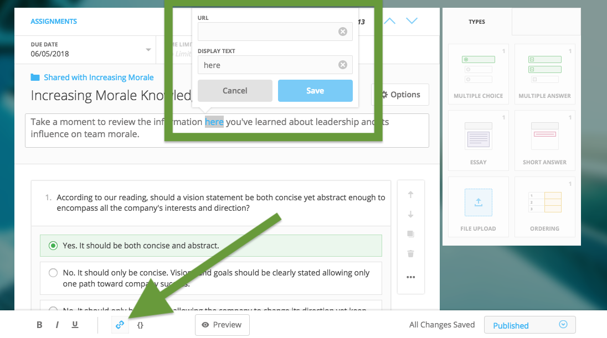

Ability to Iframe Content into Readings
---------------------------------------

Admin, Instructors, and Editors now have the ability to Iframe content
into the readings using an iframe embed link.

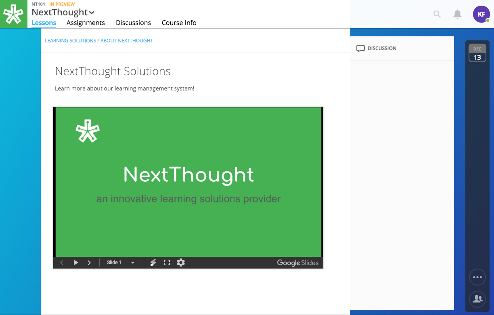

**To add an iframe to a reading:**

1. Create a reading.
2. Select “IFRAME” option to the right.

   .. image:: images/iframe.png

3. Enter iframe link, and click "Done."

   .. image:: images/iframelink.png
   
4. Adjust settings and click "Done."

   .. image:: images/iframesettings.png
   .. image:: images/iframeditview.png

Admins Can Enroll and Drop Learners from Courses
------------------------------------------------

Now, admins are able to enroll and drop learners from courses. 

**Enroll/Drop by Course:**

1. Sign in with your admin account.
2. Navigate to your Admin Tools.
3. Click on the “Content” tab.
4. Click on a Course.
5. Click "Roster."
6. Click “Manage Roster.”

   .. image:: images/contentroster.png

7. Select the individual you’d like to either enroll/drop.

   .. image:: images/manageroster.png

8. Select “Enroll User” or “Remove User.”

   .. image:: images/dropuser.png

9. Click “Done.”

**Enroll/Drop by Learner:**

1. Sign in with your admin account.
2. Navigate to your Admin Tools.
3. Click on the “People” tab.
4. Select a learner.
5. Select the “Courses” tab.

   .. image:: images/peopletabview.png

6. Select “Manage Courses.”

   .. image:: images/peoplecoursestab.png

7. Select the course you’d like to either enroll/drop the user.

8. Select “Enroll User” or “Remove User.”

   .. image:: images/enrolldropuser.png

9. Click “Done.”

November 15th, 2018
===================

Invalid Email Alert in Course Invite
------------------------------------

The platform will now specify which email address is erroneous by
highlighting the email in red.

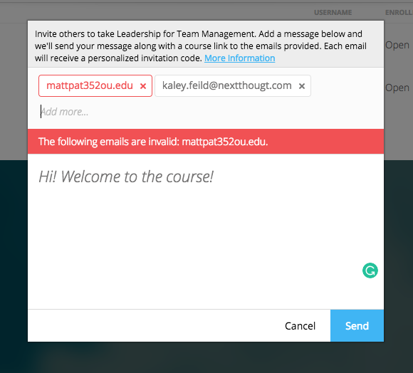

Added Description of Course Invite
----------------------------------

There is now a short description in the “Invite” window when inviting
users to the course.

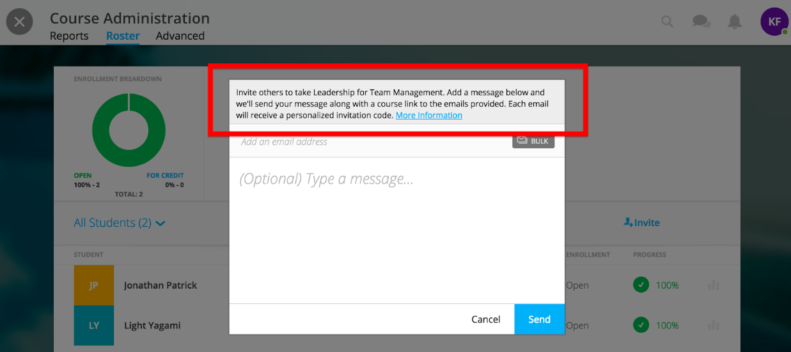

Award Custom Credit to Multiple Users
-------------------------------------

NextThought can now award custom credit to multiple users with the new
bulk transcripts feature. This allows for many users to receive credit
at one time. Admins can upload their csv files by following these
steps:

1. From the home page, click on the admin menu button.
2. Then click on the “Advanced” tab.
3. On the “Transcripts” section, navigate to the bottom of the page to
   find the “Bulk Import Transcripts Credit” box.
4. Drag and drop the .csv file into the box, or “Choose a File.”

The csv file must be formatted correctly in order to award
credit. Please note the “Show Details” dropdown which specifies the
columns. Users can download a sample template file.

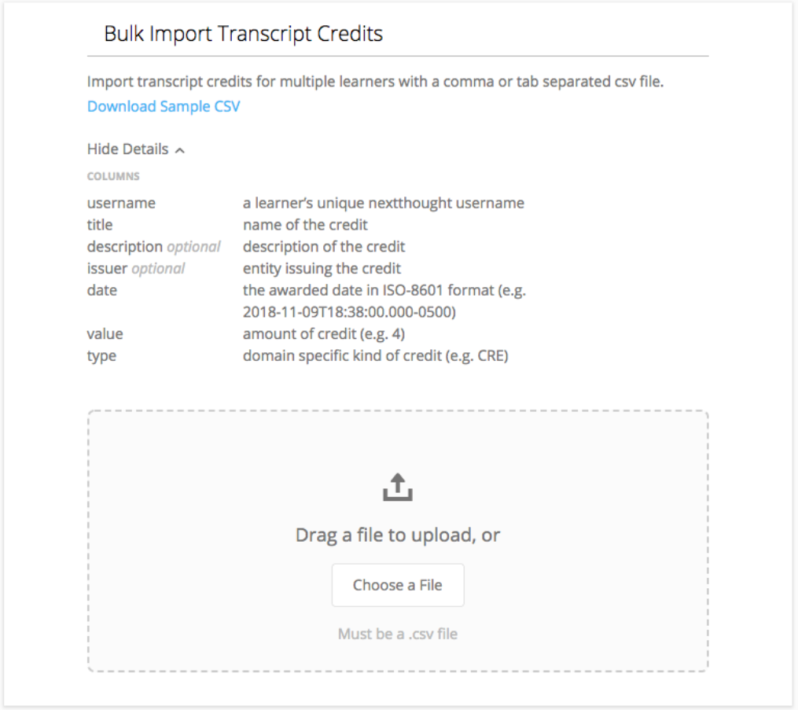

October 19th, 2018
==================

Student Participation Report File Name Change
---------------------------------------------

When downloaded, the Student Participation Report now has the file
name FirstNameLastName_CourseID_StudentParticipationReport.pdf

Student Participation Report now Includes Video Duration
--------------------------------------------------------

Student Participation Reports now display the duration of each video
within course lessons along with view sessions, total watch time,
average time/session, finished.

Use CSV File to Invite People to the Platform
---------------------------------------------

Previously, a site admin would have to invite people to join the site
by typing their emails. Now, a site admin can upload a CSV file with
listed email addresses to invite users to the platform.

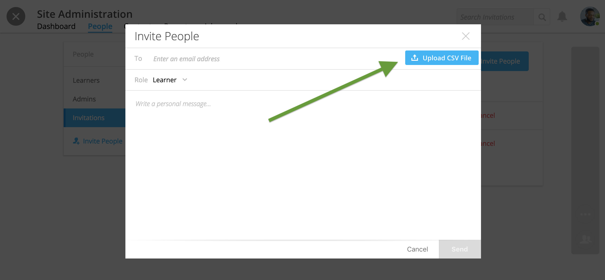

The CSV must follow this format:

- The first column must be only emails, a single email per row.
- The second column must contain names.

Easier Path to Upload New Course Assets
---------------------------------------

The text “Upload a New Course Image” is now selectable and allows the
facilitator to upload new course assets.

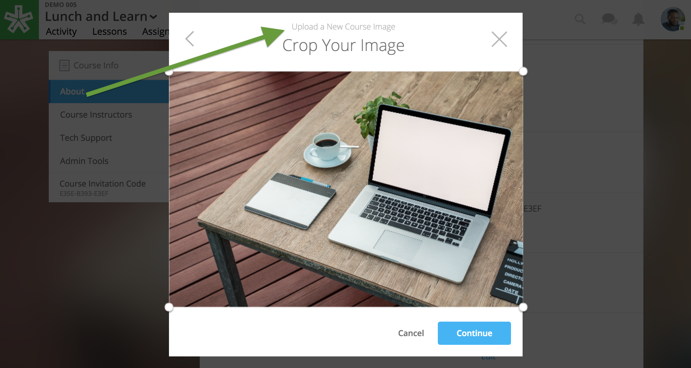

Shortcut to Visibility and Course Settings
------------------------------------------

Course instructors and edits now have “Edit Course Information” and
“Course Visibility” shortcut in the course dropdown menu.

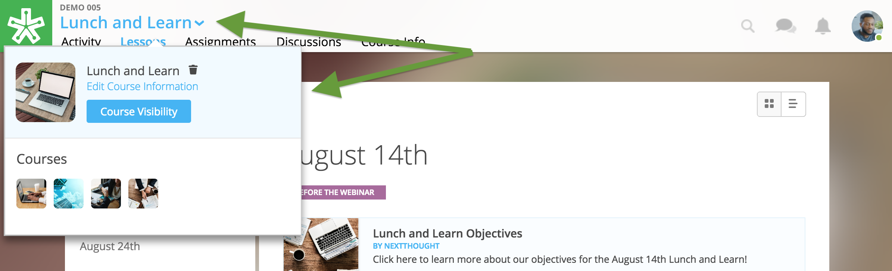

September 27th, 2018
====================

Performance and Stability Improvements
--------------------------------------

General performance and stability improvements.

Forum Titles are Editable
-------------------------

Previously, admin and course facilitators could not change the title
of a forum. Now, admin and course facilitators can edit the title of a
forum.

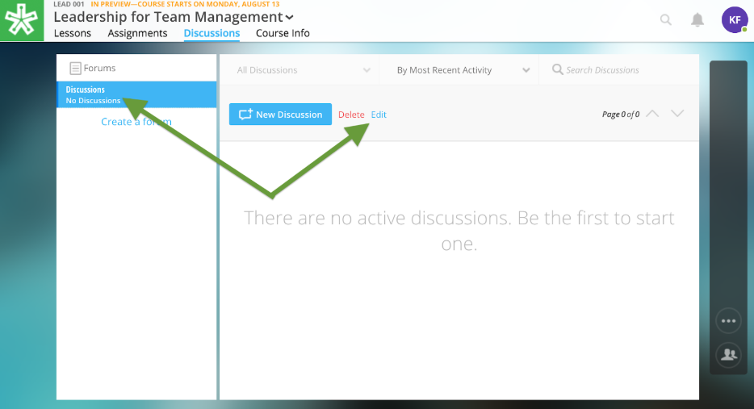

Option to Automatically Require a Certain Content Type for Course Completion
----------------------------------------------------------------------------

Previously, an admin, editor, or instructor had to require content
items one-by-one on the Lessons page.

Now, an admin, editor, or instructor can choose to automatically
require certain content types (e.g., Assignments). When that type is
added to a lesson, it will automatically display as “Required.” You
can still choose to manually require (or mark as optional) content
one-by-one regardless of the chosen setting.

1. Navigate to the Course Info tab.
2. Click “View Now” under the Advanced tools.
3. View the “Completion” tab.
4. Toggle defaults on or off.

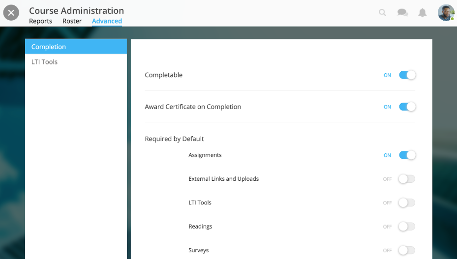

Assignments Automatically Required for Completion as Course Default
-------------------------------------------------------------------

Previously, when a new course was created, all content types added to
a lesson would be “optional” for course completion by default.

Now, a new course will mark assignments as "Required" by
default. These settings can be changed by navigating to the Course
Info > Advanced tab and changing the default toggles.

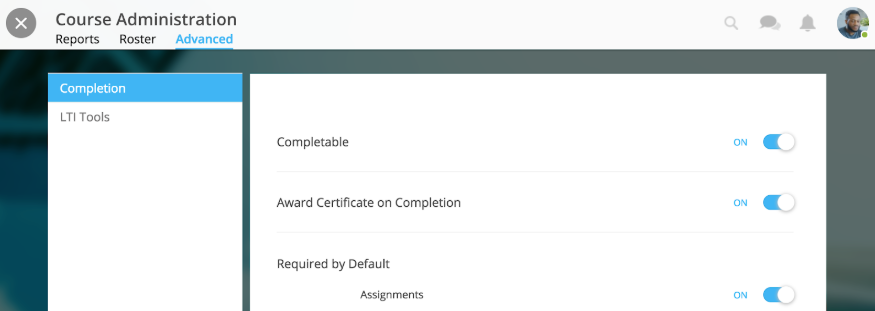

Admin Tab Content Filtering and Sorting
---------------------------------------

Now, the titles of each column in the Admin Tools > Content tab will
filter and sort the courses and books by the respective field when
selected. (e.g., If you click on “Start Date” then the courses will be
ordered according to start date.)

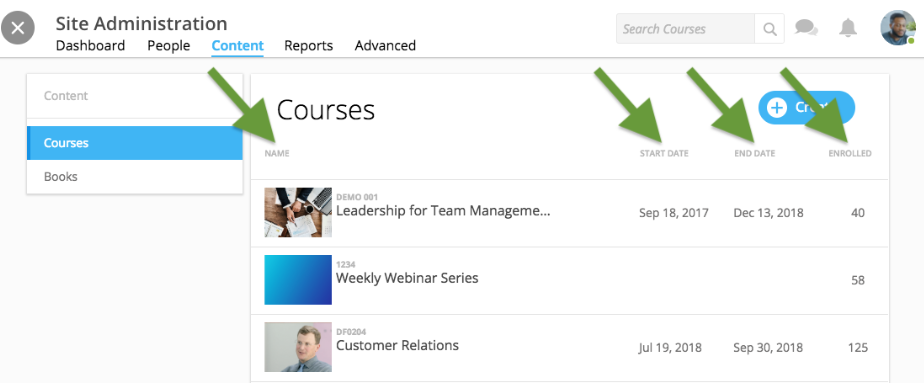

Library Filtering and Search
----------------------------

Previously, the course library (or homepage) was not searchable or
filterable. Now, you can use the search bar at the top of the window
to filter a course by course name or ID. To search, type into the
search bar. (Do not press the enter key.)

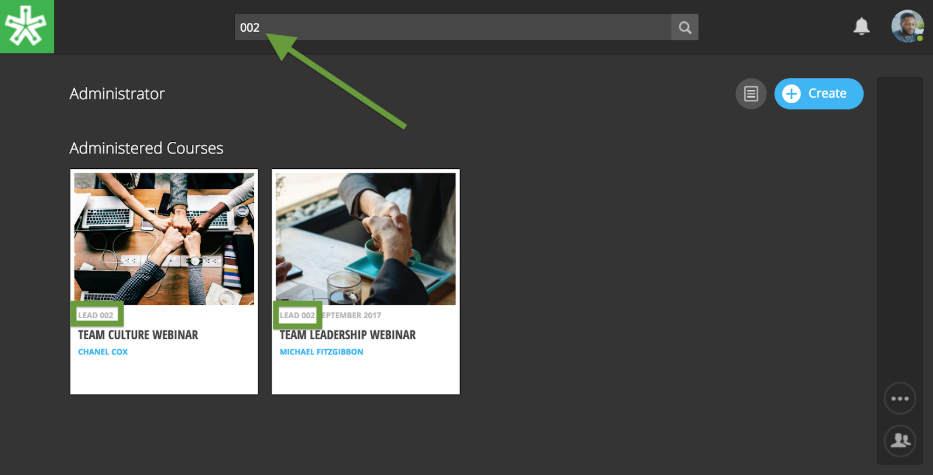

Course Navigation Opens by Default when First Visiting Platform on Mobile Device
--------------------------------------------------------------------------------

To draw attention to the course navigation tabs, the first time a user
opens a course in the platform on a mobile device, the course
navigational tabs will be open.

.. image:: images/coursenavmobile.png

August 28th, 2018
=================

Open Courses from Catalog
-------------------------

An “Open” button now appears in the course catalog so that courses can
be immediately accessed and opened once enrolled. The “Remove” button
that once was in its place has been moved above it to the left.

.. image:: images/open.png

Invite Users to Join the Platform
---------------------------------

Site admin can now invite people by email to join the learning
platform (site) from the Admin Tools. Your invitations will be tracked
on the People tab, which will display pending invitations.

1. Navigate to your Admin Tools
2. Click on the “People” tab.
3. Click on “Invitations” subtab.
4. Click “Invite People.”
5. Type in an email address, select role, and add a message.
6. Click “Save” to send your message.

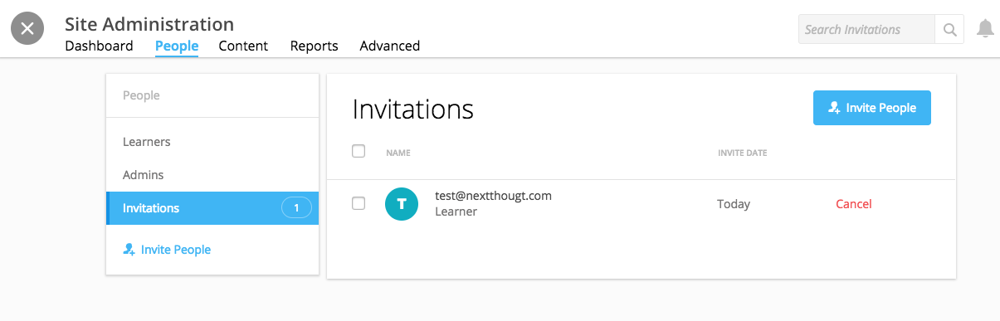

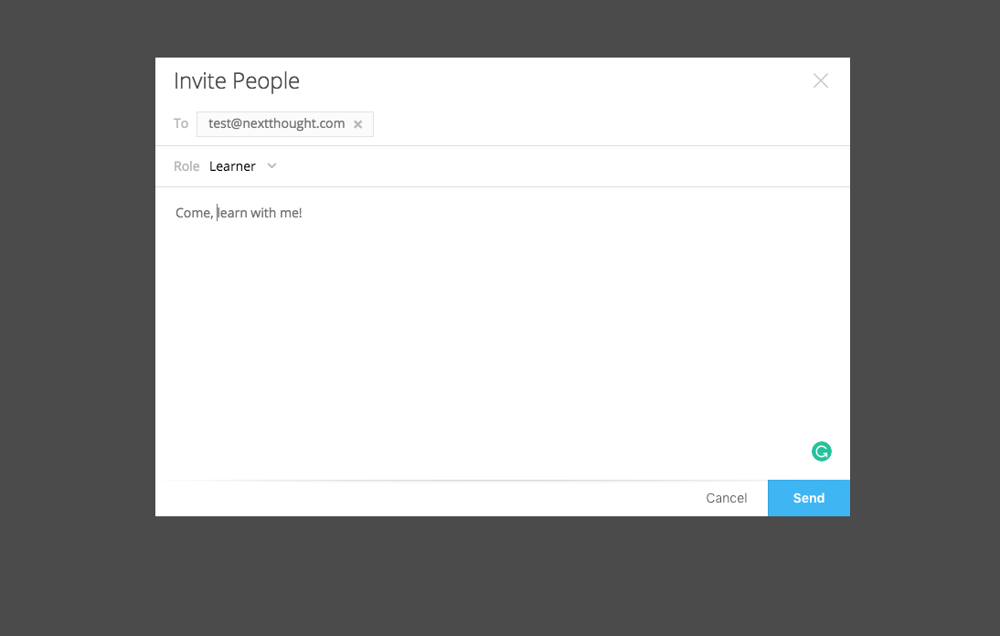

Once a learner clicks accept in the email invite, they will be
navigated to the login page to create an account.

**To cancel an invite:**

Select the red “cancel” button to the right of the user’s invitation
on the Invitations subtab.

New Design for Site Admin “Users” Tab
-------------------------------------

The “Users” tab has now been redesigned and renamed “People.” This new
design allows for easier use and simplicity, and contains a new
feature to invite users to the platform.

Here’s an overview of the new design:

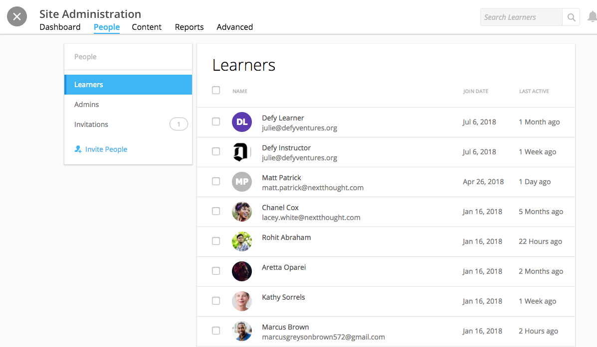

**New Sidebar**

Filtering users by role is now available in the sidebar and segregates
the users’ roles into two new tabs, “Learners” and “Admins.”

**User Information**

Now, join date and last active date appears to the right of the user’s
name and email. Clicking on the user still takes you to a detailed
user view.

**Change Role Relocation**

Now a “Change Role” button appears at the top right-hand side of the
People tab. When selected, a new flyout will appear prompting you to
change the role of the selected user. Click “Save” to change the role.

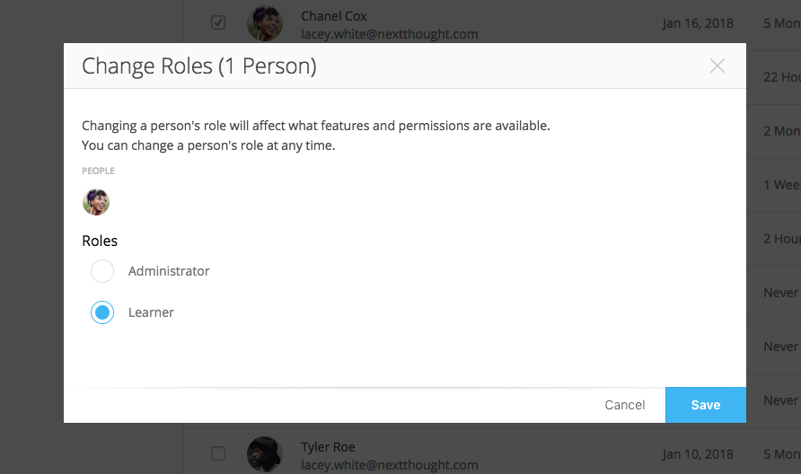

**Invitations**

You can now invite people to join the platform.

Autofill Webinar Registration
-----------------------------

Now, when learners click to register for a webinar, information
already offered by the user on the platform (name, email, etc.) will
autofill in the registration form.

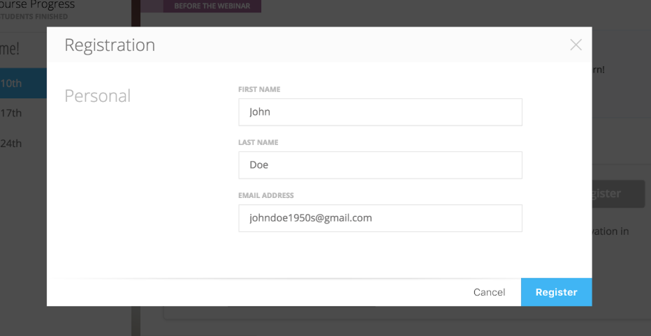

August 16th, 2018
=================

Instant Email Notification for Replies to Post
----------------------------------------------

When someone replies to
your post, you'll now receive both an instant email regarding this
notification as well as an in-app notification. Daily or weekly
notification emails are still sent out, and will still include items
in one-off notification emails.

August 9th, 2018
================

Short Answer Question Type can be Objective or Subjective
---------------------------------------------------------

Previously, the short answer question type was an objective type that
was auto-assessed for correctness. Instructors were required to define
the correct response(s) for short answer questions. Now, instructors
have the option to provide a solution or offer no solution. If no
solution is provided, the question is assumed to be subjective and is
no longer auto-assessed for correctness.

August 6th, 2018
================

GoToWebinar Support
-------------------

NextThought now integrates with GoToWebinar to allow learners to view,
register, and join webinars from their Lessons page. Admin can
integrate their site with their GoToWebinar account and
admin/instructors/editors can add a webinar to their Lessons page.

**Integrating with GoToWebinar:**

Before attempting to integrate with GoToWebinar, please make sure you
have a GoToWebinar account.

1. While logged in with an admin account, navigate to your Site Admin
   Tools from the homescreen.
2. Click on the “Advanced” tab.
3. Click on the “Integrations” section.
4. Click on the blue “Connect” link next to GoToWebinar.

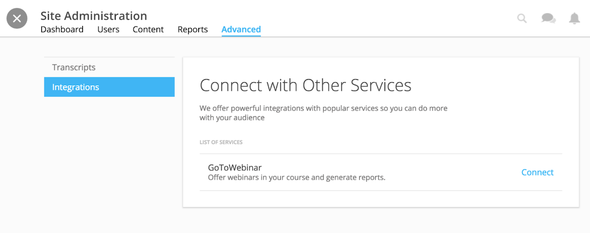

5. You will then be asked to log into GoToWebinar, or, if already
   logged in, you will be asked “Allow Access” to NextThought.

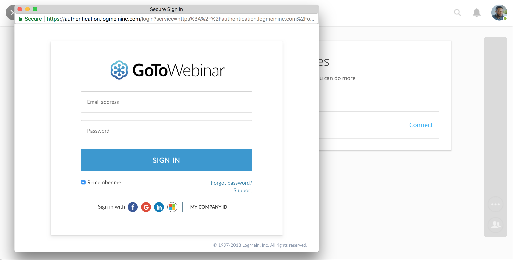

6. Once you are connected your GoToWebinar name will display where the
   blue connect button used to be. You have now successfully linked
   your site to the GoToWebinar account.

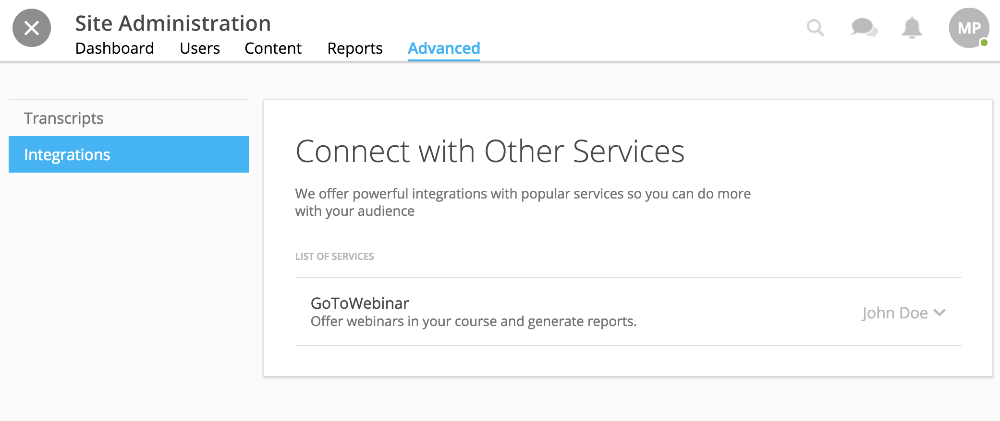

.. note:: You can also link your account when adding a webinar from
          the new content window if you haven’t already.

**Adding Webinars to Course:**

Before adding a webinar to a Lesson, you must first have created the
webinar on your GoToWebinar account.

.. note:: Please note, if you choose a reoccurring webinar, please
          select the option "Participants register for individual
          sessions that they’ll attend." for best data integration.

1. In Edit Mode, click “Add Content” in a section.

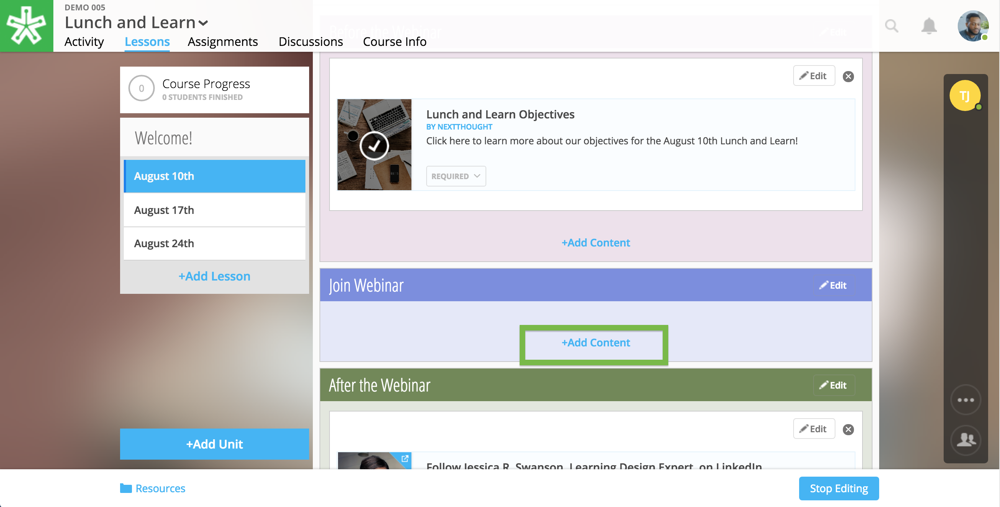

2. Click “Webinars.”  

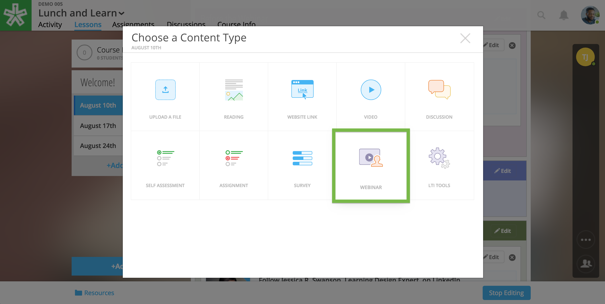

3. Select the webinar you wish to display, or paste a link to the
   webinar by selecting “Paste Link.”

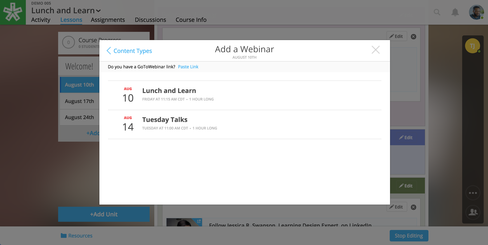

4. Click on the “Add to Lesson” button.

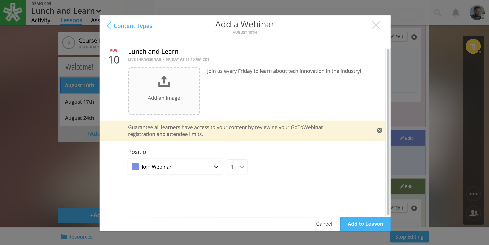

Your webinar is now added to the Lesson. Learners can register and
join the webinar from the NextThought application. Instructors will
need to launch the webinar from GoToWebinar. GoToWebinar will track
all of the participants that register through the NextThought
application in your Registrant list. Notifications and reminders can
be set up on GoToWebinar.

**Learner View and Registration:**

1. Before a learner can join a webinar, they must first follow the
   “Register” prompt on the Lessons page to register for the webinar.

.. image:: images/learnerregister.png

2. After selecting “Register,” they will be prompted to provide the
   information you've required of them from the GoToWebinar settings.

.. image:: images/learnerinfo.png

3. The button that previously said “Register” will now say “Join” but
   will not be active until the organizer has launched the webinar.

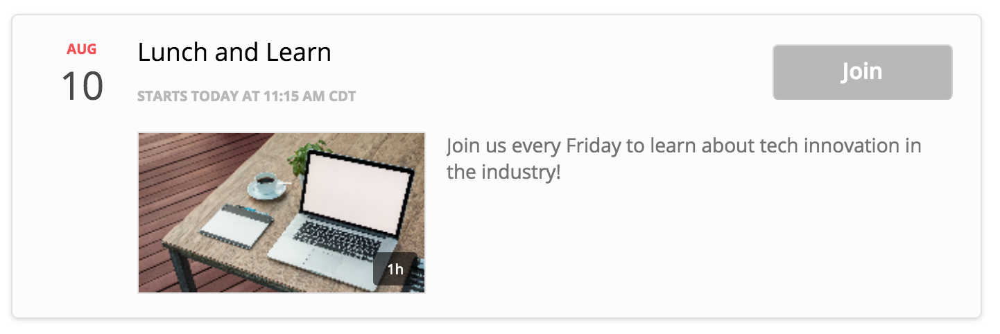

4. When a webinar is in session, a timer will appear on the “Join”
   button displaying how long is left in the webinar.

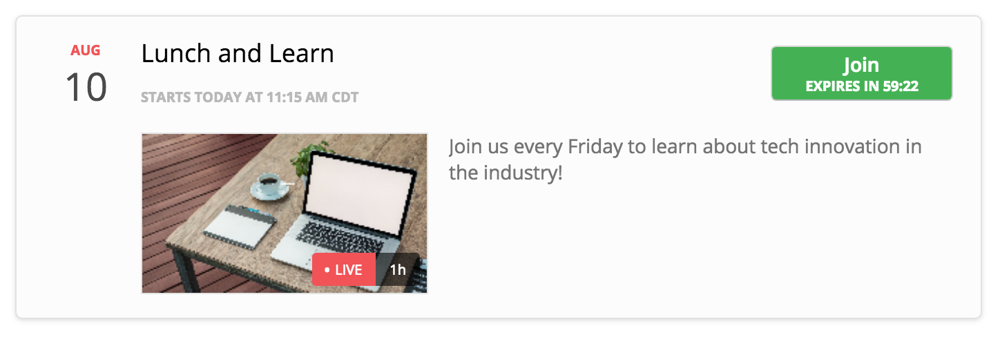

5. Selecting “Join” will launch the webinar.

.. note:: Webinars can be “required” resources on the NextThought
          app. In order to be marked as “completed” learners must join
          and attend the webinar.

Course Progression on Course Card
---------------------------------

In learner view, course progress will now display on the bottom of the
course card. It will show as a green bar that will progress as the
learner does through the course. If the course is completed, the bar
will be filled across the bottom and a green banner will appear
marking its status as complete.

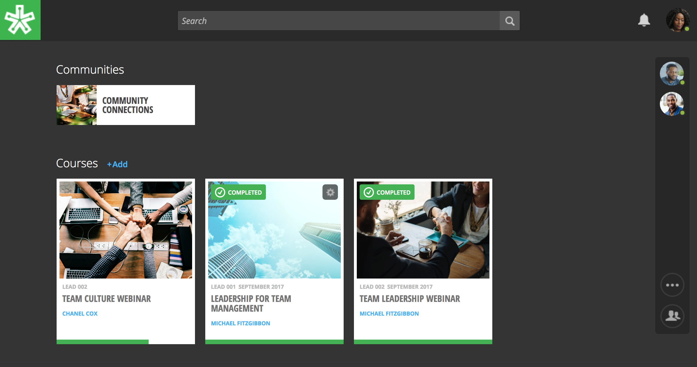

July 20, 2018
=============

LTI Tool Support
----------------

NextThought's courses now support LTI tools. LTI tools allow
integration of outside LMS applications into the lessons and
courses. Once LTI tools are set up, they can be placed into the
lesson.

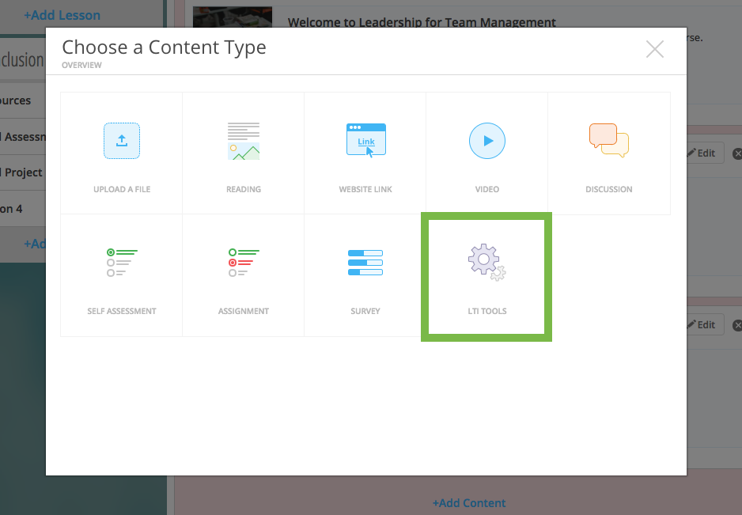

These external widgets have to first be added to a course by an
Instructor, Editor, or Admin account.

**To add LTI options to a course:**

1. In the course, click on the “Course Info” tab.
2. In the sidebar, click “Admin Tools.”
3. Under “Admin Tools” find the “Advanced” option and click “View Now.”
4. Click the option “LTI Tools.”

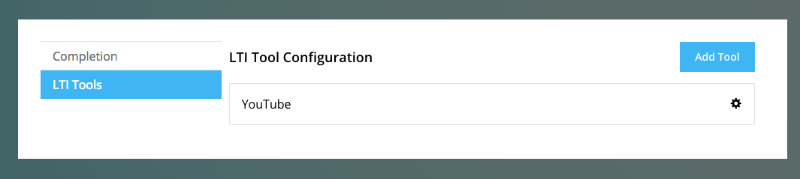

To add new LTI Tools click the “Add Tool” button. Now, choose whether
to add the tools through a manual entry, by URL, or by copying and
pasting a XML code. These can be found at the LTI tools' source.

For a manual entry, you will need:

- Consumer Key (if needed)
- Shared Secret (if needed)
- The Title
- The Description
- The Launch URL or Secure Launch URL

For URL, you will need:

- Consumer Key (if needed)
- Shared Secret (if needed)
- The Tool Configuration URL

By XML, you will need:

- Consumer Key (if needed)
- Shared Secret (if needed)
- The XML Code

**To add an LTI Tool to a lesson:**

1. Navigate to the “Lessons” tab.
2. Click “Start Editing” in the bottom right-hand corner.
3. Click “+Add Content” within a section.
4. Click the LTI Tool and click the “Select” button.
5. Follow any LTI prompts.
6. Modify the title, author, and description.
7. Click "Add to lesson."

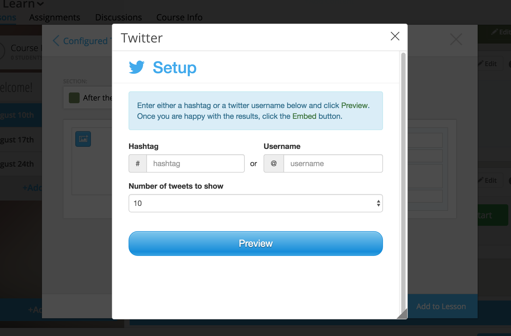

June 28, 2018
=============

Restrict Assignment Submissions Based on Due Date
-------------------------------------------------

Course Instructors now have the ability to restrict submissions to an
assignment by due date and offer a grace period or timeframe for their
assignments. A grace period grants an extended submission timeframe to
an assignment beyond the due date.

After the due date, the learner can still view the assignment, but the
assignment will not allow submissions.

**To restrict submissions or add a grace period:**

1. While creating/editing assignment, add a due date.
2. Select the “Options” button.
3. Navigate down to the bottom section labeled “Late Submissions.”
4. Select the dropdown.

   - **To Restrict Access Based on Due Date:** Select "Never Allow" to
     restrict submissions to only before due date.
   - **To Restrict Access with Grace Period:** Select the "Allow
     within Grace Period" to allow submissions only past the due date
     by a defined amount of time. Then, define the amount of time
     you'd like to allow.

5. Click the “Done” button to save your changes.

.. image:: images/restrictedsub.png

The grace period is not disclosed to the learner. If the learner tries
to submit the assignment after the due date or grace period, a warning
window will appear stating that the assignment is past due and cannot
be submitted.

Allow Instructors/Editors to Create Forums
------------------------------------------

Upon creation of a new course, the default view for the Discussion
course tab will be empty. An “Add a Forum” button has been added to
create new forums. Once a forum is created it can also be deleted by
selecting the forum and clicking “Delete.”

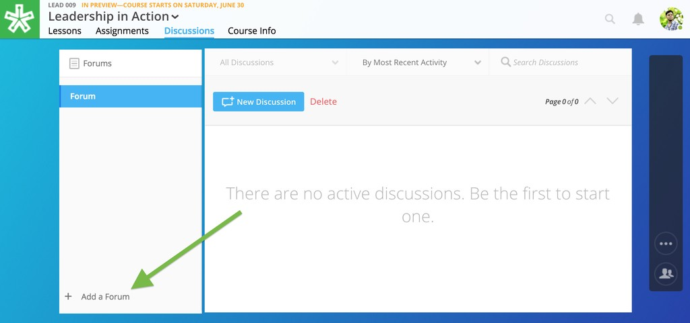

New Call-Outs in Native Readings
--------------------------------

You can now add call-outs (gray box) to native readings. Currently
only text is allowed within the call-out.

**Editing View:**

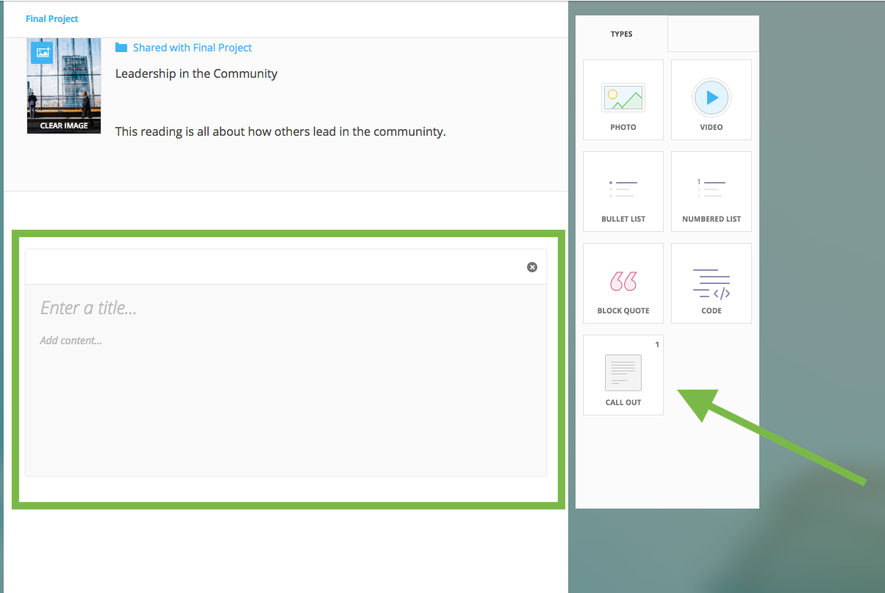

**Published View:**	

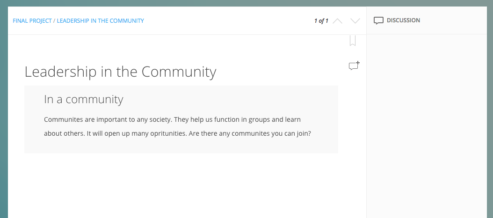

Manage Redemption Codes
-----------------------

You now have the option to add and delete redemption codes. Codes are
automatically generated when you select the "Create Code" text.

Redemption codes can be found on the Course Info page.

**To generate a code:**

1. Click on the “Edit” text.
2. Click “Create Code.”

A code will then be automatically generated. Users on the site can use
this new code to enroll in the course. Codes can also be deleted by
clicking on the trashcan icon next to the code in edit mode. Once a
code is deleted, learners can no longer use it to enroll in the
course. Deleting the code will not affect current learner enrollment.

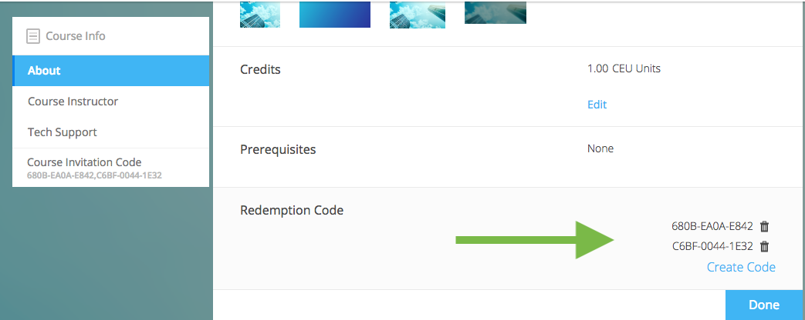

Draft Label for Unpublished Readings
------------------------------------

There is now a draft label on any reading that is not published. This
can only be seen in Edit mode.

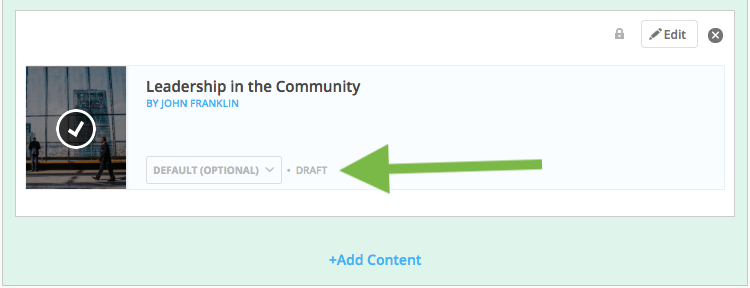

New Content Type Selection Design
---------------------------------

The visual design for selecting course materials has been updated.

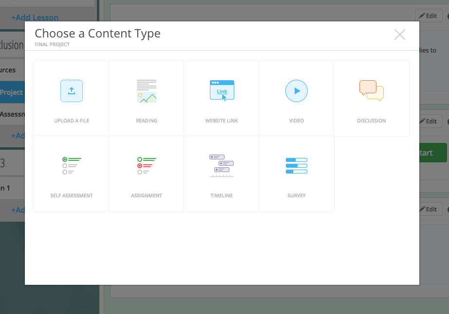

Remove Step for Course Creation
-------------------------------

Previously, to create a new course, Admins would select the “Create”
button, select “Course” in the dropdown, and select the course type
(Blank, Import, Scorm) in a new window.

Now, when selecting the “Create” button, the dropdown underneath has
the three types listed.

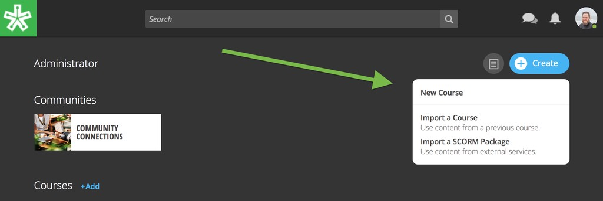

June 7, 2018
============

Contacts page redesign
----------------------

The Contacts page now incorporates design familiar to the rest of the site look and navigation.

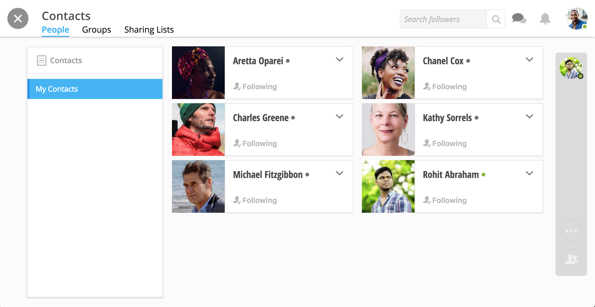

**People Tab [Previously “Contacts”]**

Search for learners on the platform using the upper left-hand corner search bar.

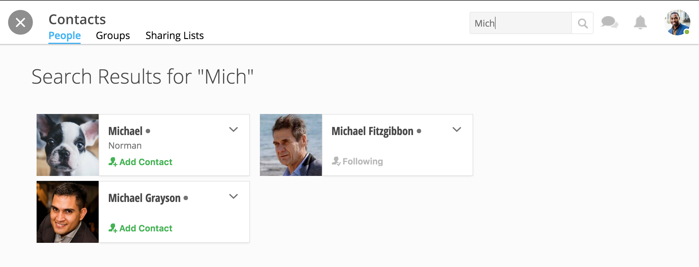

To view options for a person you are following,

1. Locate the person in the People tab.
2. Select the dropdown menu in the upper right-hand corner of the contact tile.

You can now “View Profile,” “Chat,"" “Add to a Sharing List,” or “Unfollow.”

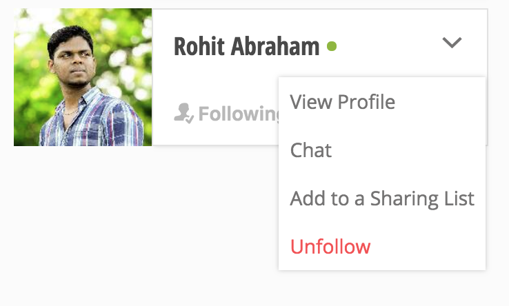

To add a contact to a sharing list,
 
1. Locate the contact in the People tab.
2. Select the dropdown menu in the upper right-hand corner of the contact tile.
3. Click on the the “Add to a Sharing List” option.
4. Add your contact to a current Sharing List or create a new one.
5. To add your contact to an existing list, select the list(s).
6. To create a new Sharing List, click on the the “Create a new List”
   option, and type in the name of the new list you wish to create.
7. Click “Done.”

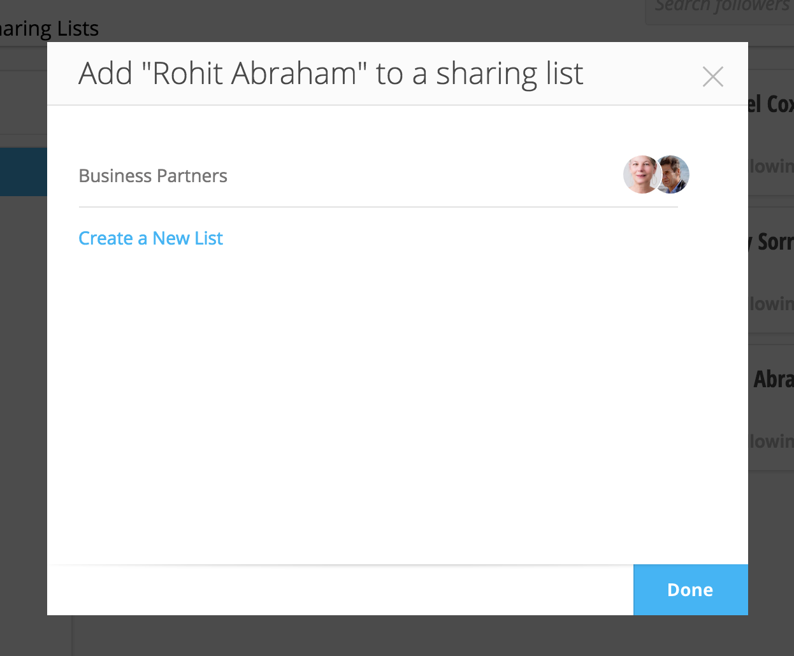

**Groups Tab**

Within the Group tab, the “Join Group” and “Create a Group” buttons
have moved from the bottom left-hand corner to the upper right-hand
corner. Groups you are a member of display across the page in rows and
columns.

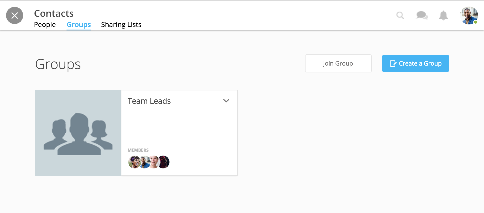

To create a group,

1. Select the blue “Create a Group” button.
2. Now, type in the group name.
3. Select "Create."

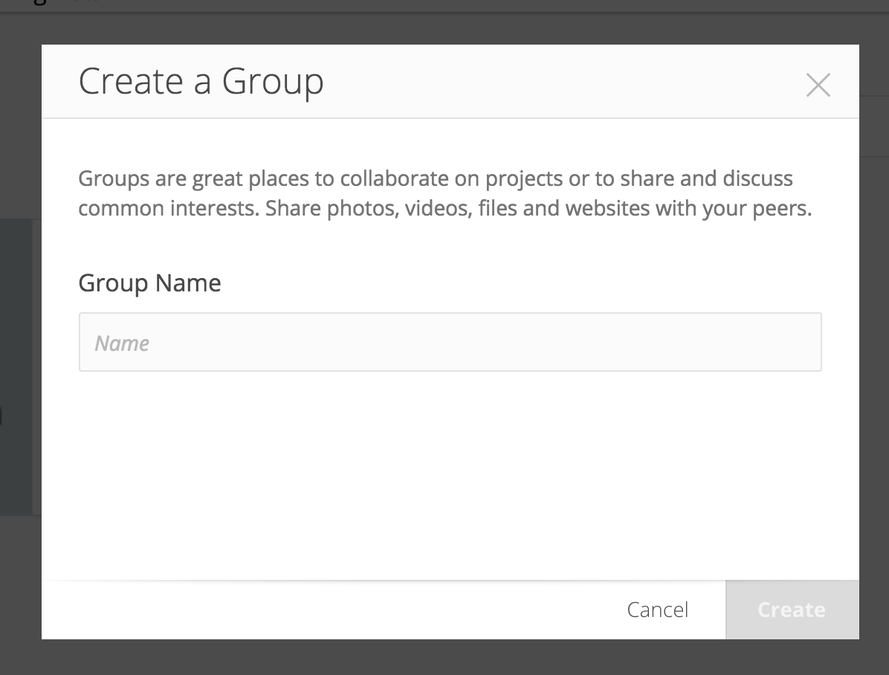

The group will now display within your Groups tab.

To join a group,

1. Select the “Join Group” button.
2. Enter the group code.
3. Click “Join.”

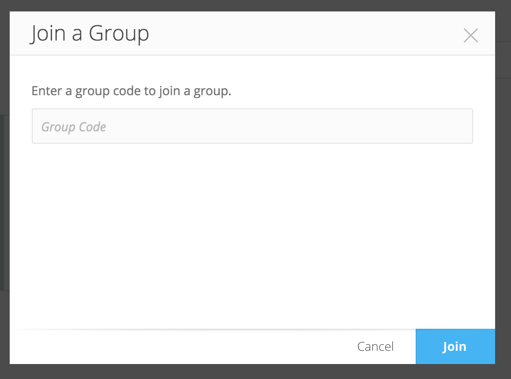

The group will now display in your Groups tab.

To view group options,

1. Locate the group in the Group tab.
2. Select the dropdown menu in the upper right-hand corner of the group tile.

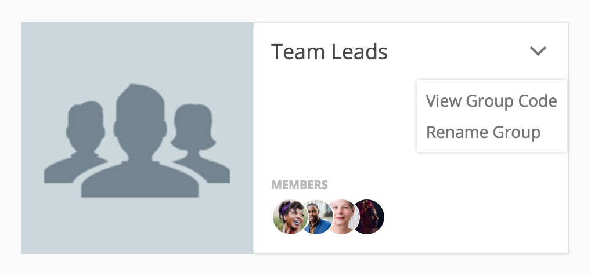

You can now “View Group Code” or “Rename Group.”

Click on the group to navigate to the group page.

**Sharing Lists [Previously “Distribution Lists”]**

Creating a list and adding contacts to your list is more streamlined. 

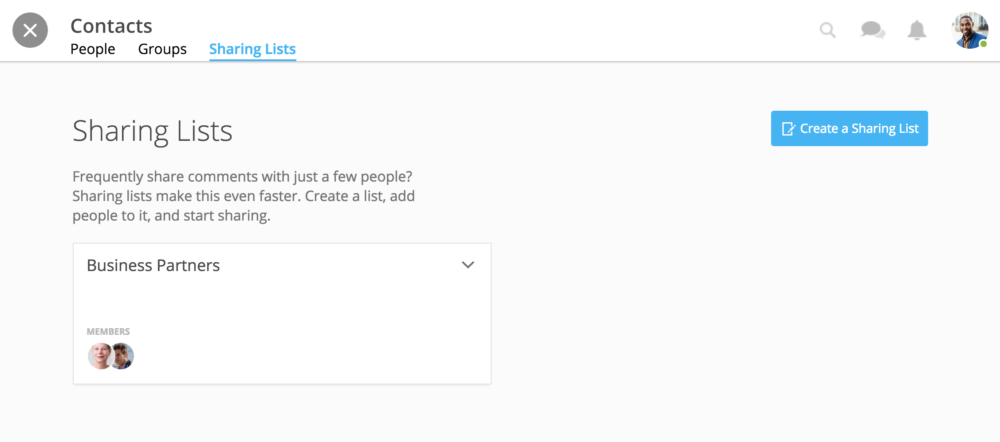

To create a new list,

1. Select the “Create a Sharing List” in the upper right-hand corner.
2. Fill out the list name.
3. Search for people on the site to add to your list.
4. Select a search result to add them as a “member.” They will
   immediately appear in the “Members” section below.
5. Once you’ve added all members, click “Create.”

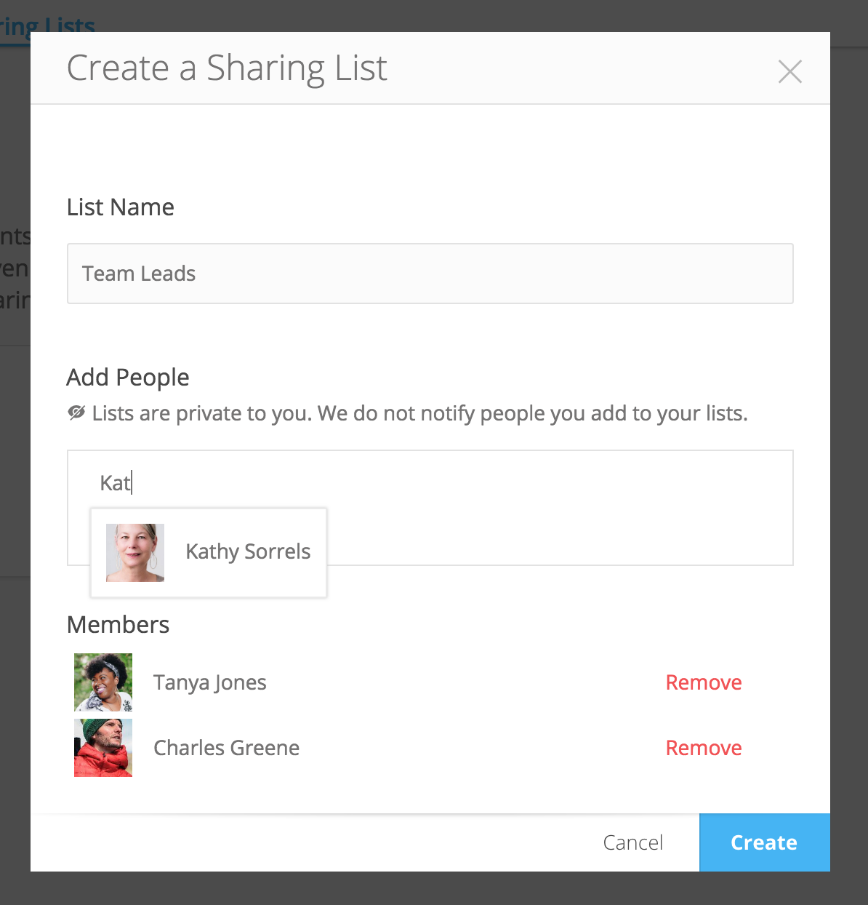

The list will now display in your Lists tab.

To view list options,

1. Locate the list in the Sharing Lists tab.
2. Select the dropdown menu in the upper right-hand corner of the list tile.

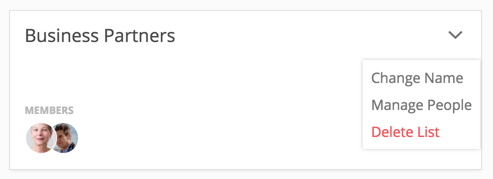

You can now “Change Name,” “Manage People,” “Delete List.”

Clicking on a list in your Sharing Lists tab allows you to view,
remove, and add members.

Download All Assignment Submissions
-----------------------------------

Now, download all submitted assignments in a course.

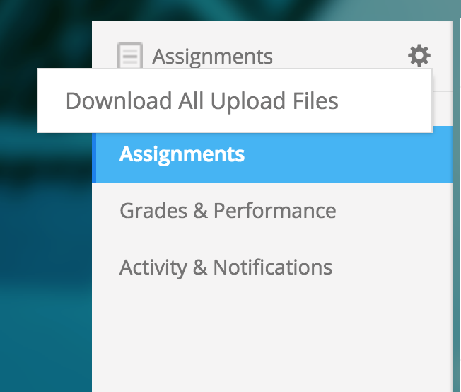

To download this .zip file,

1. In the “Assignments” tab of a course, click on the “Settings”
   button (the small gear icon).
2. Click on the “Download All Upload Files” option.

A download of the file should start immediately.

Three more reports added to course reports list
-----------------------------------------------

The Course Info Reports tab now includes the “Self Assessment
Completion Report,” the “Forum Participation Report,” and the "Topic
Participation Report."

.. image:: images/reportscoursenew.png

In an instructor account, 

1. Navigate to your “Course Info” page.
2. Scroll to the “Admin Tools” section.
3. Click “View Now” under Reports.

Display local timezone on reports
---------------------------------

Previously, reports displayed a CST timestamp according to when the
report was downloaded/accessed. Now, timestamps display the local
timezone.

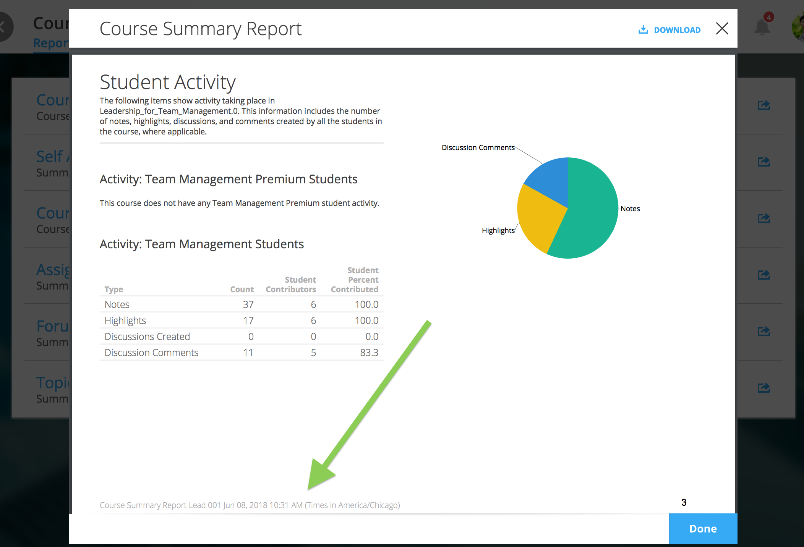

May 17, 2018
============

Create and award credit
-----------------------

Now, courses can award credit to learners who complete the
course. Admin can also manually award credit to learners. Admin and
instructors create and define credit types and units.

**Credit is made up of three components: “Amount,” “Type,” “Units.”**
 For example, an association course could award “3 [Amount] CE [Type]
 hours [Units].”

**Admin Only:**

To create site-wide course credit options,

1. Click on the admin tools in the upper right-hand corner.
2. Click on the “Advanced” tab.
3. Click on the “Transcripts” tab.

   - **NEW:** Click “Add New Type” to define credit for the site. Type
     in type and units. This is now selectable for instructors to add
     to courses.
   - **EDIT:** You can remove a credit type by selecting the “x”
     button or you can select a current type and edit it.

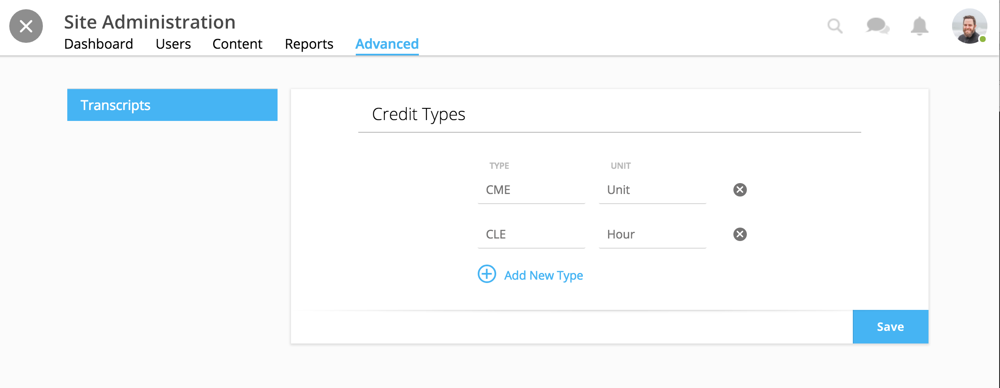

To manually award a learner with credit,

1. Click on the admin tools in the upper right-hand corner.
2. Click on the “Users” tab.
3. Select a user.
4. Click the “Transcript” tab.
5. Click “Add Credit.”
6. Fill in information and click “Save.”

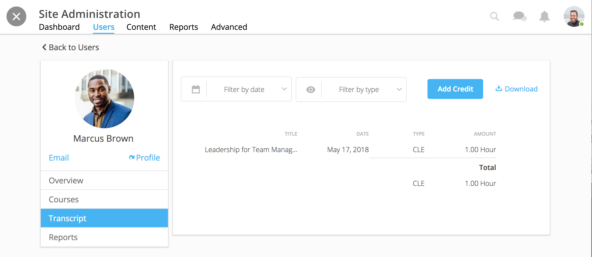
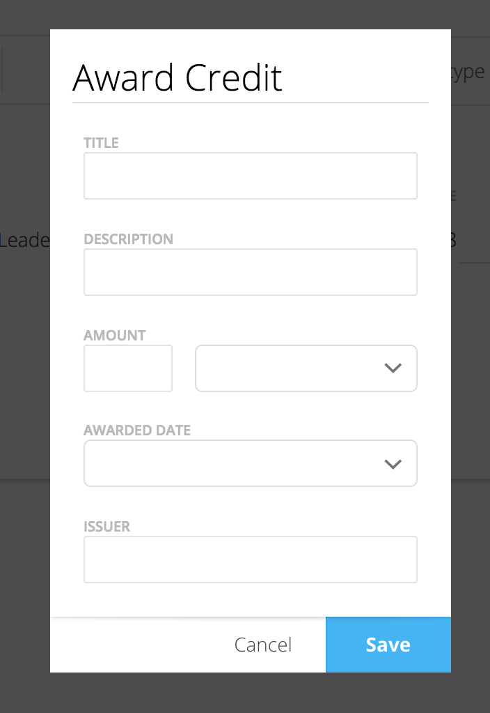

**Instructor and/or Admin:**

To assign a credit type to a course,

1. Click into your course.
2. Navigate to the “Course Info” page.
3. Scroll to the “Credits” section.
4. Click “Edit.”
5. Use the dropdown to select an existing credit type and unit, or
   "Add Credit."
6. Define the amount of credit.

.. image:: images/coursecred.png

Credit will be awarded when the user has completed the course as
defined by completion of required materials. Upon course completion,
the user can “View Certificate” to view their completion certificate
and credit. They can also view their certificates within their
profile.

Progress and completion certificates now available in profile Achievements tab
------------------------------------------------------------------------------

Learners can now view their course progress and completion
certificates within the profile “Achievements” tab.

1. Click on your profile image in the upper right-hand corner.
2. Click “View Profile.”
3. Click the “Achievements” tab.

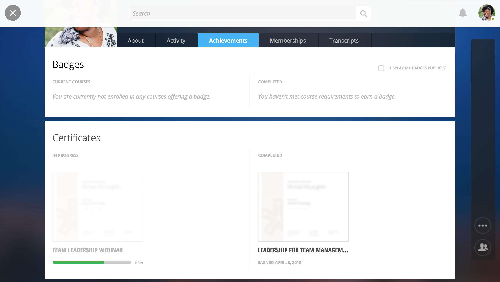

The Achievements tab contains two sections, “Badges” and
“Certificates.”

Within the certificates section, the left column “In Progress”
displays all completable (certificates enabled) courses that the
learner is enrolled in, and the learner’s progress within each
course. The right column “Completed” displays courses completed and
certificates. Clicking on a certificate allows the learner to view, download, and/or print the certificate.

New Transcripts tab in user profile
-----------------------------------

Now, the learner can view their awarded credit and transcript through
their profile.

1. Click on your profile image in the upper right-hand corner.
2. Click “View Profile.”
3. Click the “Transcripts” tab.

.. image:: images/transprofile.png

The transcripts tab displays four columns, “Title,” “Date,” “Type,”
and “Amount.” Click on a column to sort by that field. Use the search
filters to filter by date or type. Total credit displays at the end of
the list.

A transcript can be downloaded as a CSV or PDF. Downloaded transcripts
will only show credit for the current filtered view. To view all
credit in downloaded reports, make sure no filter is selected. (Admin
can download learner transcripts from the admin tools. Click on the "Users" tab, select a user, and click on the "Transcript" tab.)

April 26, 2018
==============

Performance Improvements
------------------------

Home screen loading and navigation has been optimized and should
perform 2 to 3 times faster, especially for users with a large number
of course enrollments. General course navigation should have also
improved.

New All Course Roster Report
----------------------------

New site-wide report available that includes information for each
course including: course name, start date, instructor names, learner
names, username, email, date enrolled, last seen, and percent
complete.

Course progress displays in the Admin Tools
-------------------------------------------

Course progress now displays within the admin tools. 

**Course View:** (Content tab > Select a course)

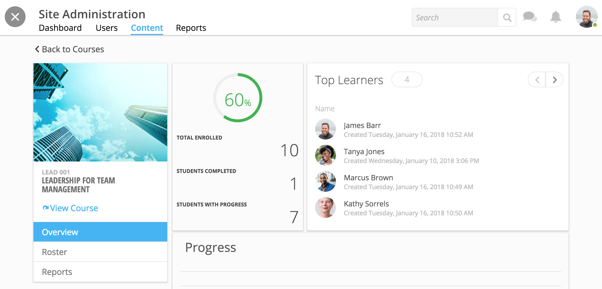

**Roster View:** (Content tab > Select a course > Select Roster)

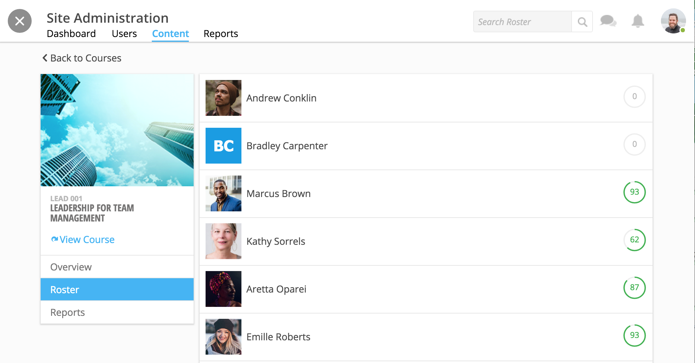

**Course's Learner View:** (Content tab > Select a course > Select Roster > Select a learner)

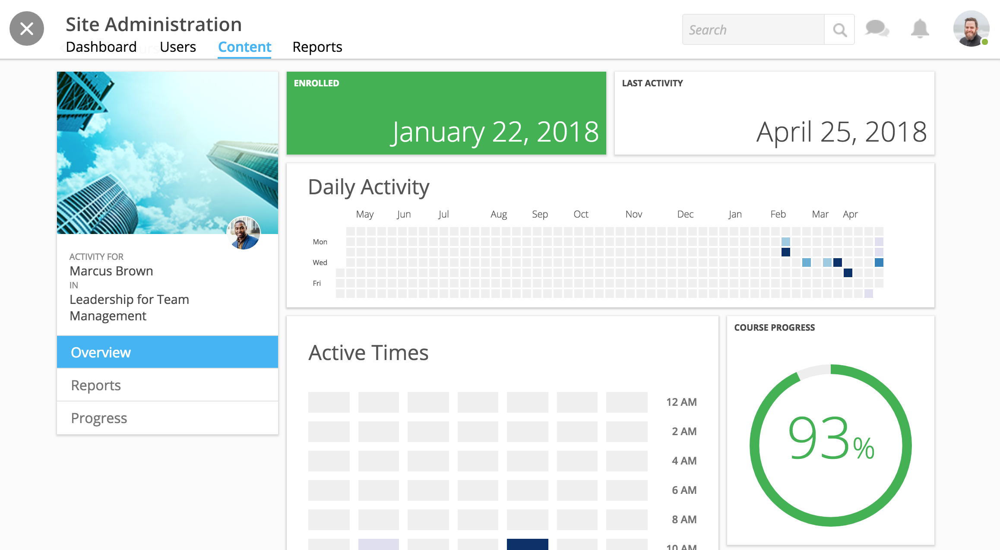

**User's Learner View:** (Users tab > Select a user > Select Transcript tab)

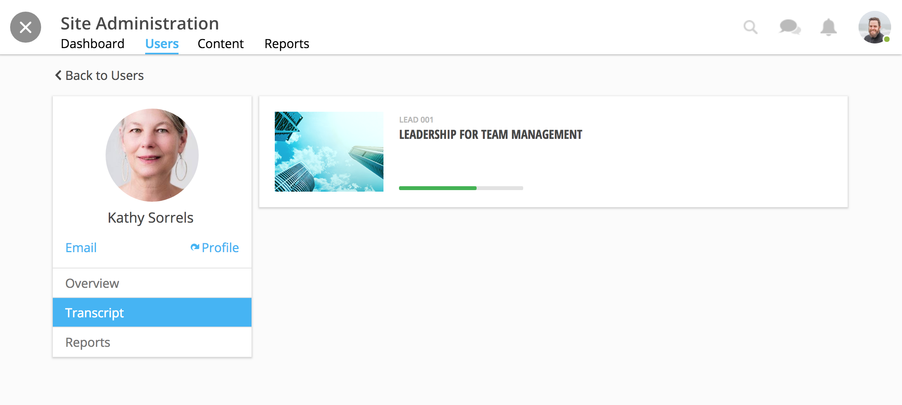

Completion certificate available
--------------------------------

Once a learner “completes” the course as defined by the course
progress, the learner will be able to access the “View Certificate”
text in the upper left-hand corner of the Lessons page under “Course
Progress.”

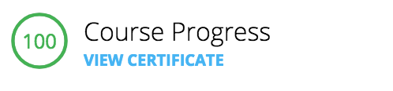

Clicking on this text will create a certificate for the course.

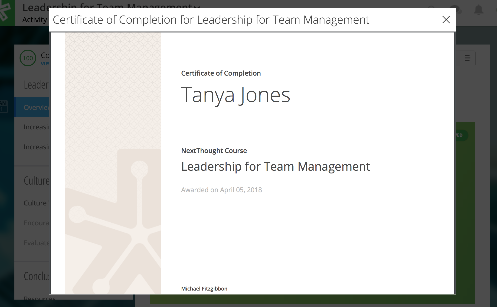

March 30, 2018
==============

Lessons List View
-----------------

Two views are now available on the Lessons page, a grid view and list
view. These options are available in the upper right-hand corner of a
lesson.

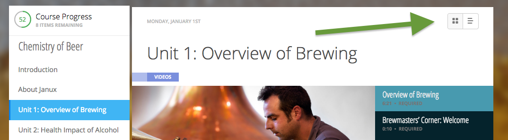

Grid view, the default view, displays course content as previously
recognized. List view displays all resources in a linear, uniform
fashion. In list view, select “Only Required” to display only required
resources. Learn more about required resource below. As with the grid
view, click on a resource to begin.

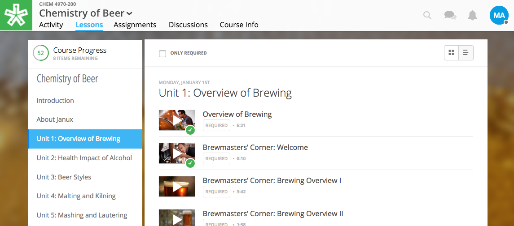

Required Resources
------------------

By default, when content is placed in a lesson, it is “optional.”
While in Edit Mode, instructors, editors, and assistants can mark
certain course materials as “Required.”

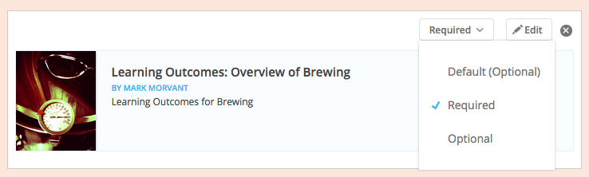

When a resource is marked as “Required,” a label will appear next to
the content on the Lessons page.

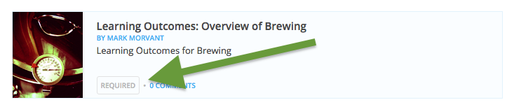

Course Completion and Progress
------------------------------

Assessing course progress has become much more streamlined, visual,
and comprehensive in this feature release.

**Progress is defined by a learner completing required materials.** In
 order for a learner to complete required materials, materials must be
 viewed (video, PDF, readings, etc.) or submitted (survey,
 self-assessment, assignments).

Progress can be viewed by instructor, assistant, admin, and learner
accounts.

**Learner View**

Users can view their course progress on the Lessons page in the upper
left-hand corner.

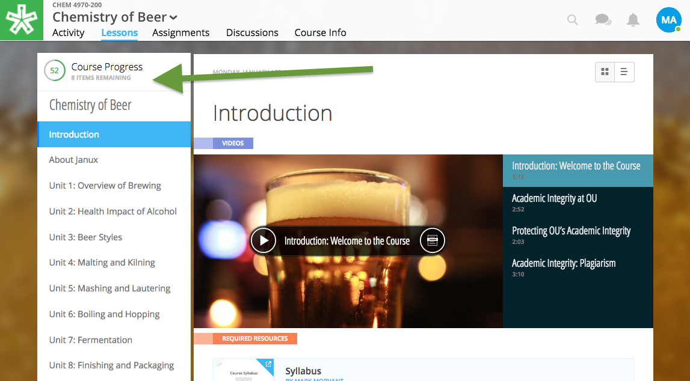

Learner “Progress” displays

- the number of items remaining (i.e,. the number of required items
  not viewed/submitted), and
- the percent of the course completed (i.e., items remaining divided
  by total required items).

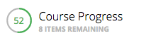

**Facilitator View**

Similar to the learner, facilitators and admin will also see the
progress icon in the upper left-hand corner on the Lessons page.

Facilitator/Admin “Progress” displays

- the number of learners who have completed the course (i.e., the
  number of learners who have viewed/submitted all required material),
  and
- average class completion (all learner completion percentages added
  and divided by the number of learners).

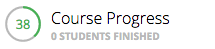

Instructors, assistants, and admin have an additional, more detailed
view of progress per learner. Navigate to your “Course Info” page and
click on the Roster.

In the roster, the progress of each learner is presented.

Click on the progress icon to view a detailed report. The report
presents a closer look at how the learner is progressing through the
course item by item. The top of the report presents how the learner is
performing compared to his/her colleagues. Learners are sorted into 1
of 5 categories depending on their progress. All required items are
listed, and if a learner has completed that item, it is marked as
completed with the date.

March 8, 2018
=============

Initial SCORM Support
---------------------

NextThought now supports importing and launching SCORM courses on the
platform.

Edit Course ID
--------------

Admin, editor, and instructor accounts can now edit the unique course
ID from the Course Info page.

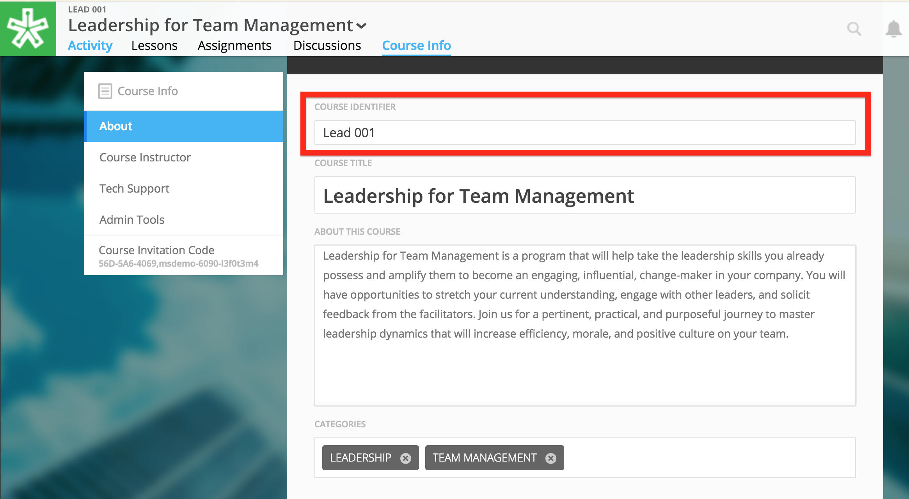

Download the Course Roster Report as a CSV
------------------------------------------

The Course Roster Report now allows the option to download a PDF or
CSV file. Open the report from the Course Info > Reports page, or from
your admin tools. Click on the "Download" button in the upper
right-hand corner. Now, select CSV to download the file in CSV format.

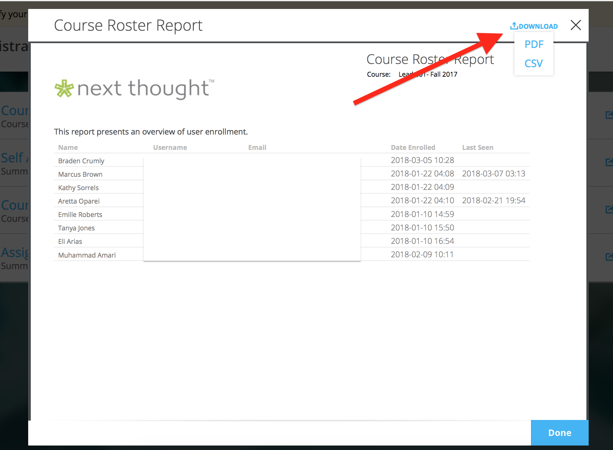

February 15, 2018
=================

Admin tools now available on Course Info View
---------------------------------------------

For site admins, new admin tools are available on the Course Info
pages. Select the "Admin Tools" tab to view course reports or to view
the course roster.

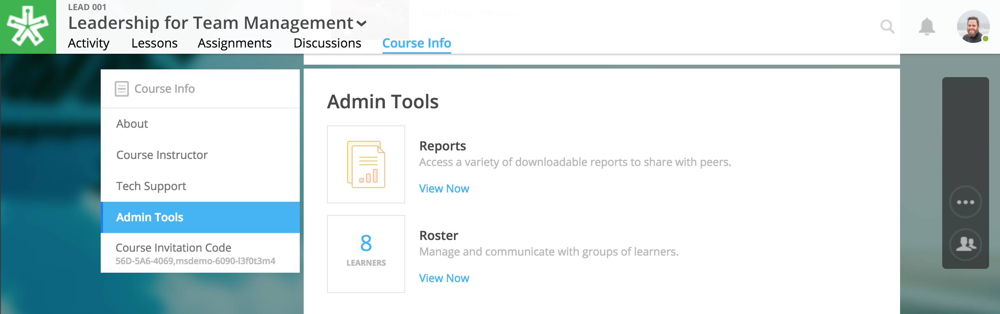

New course visibility tools
---------------------------

Previously, only site admin could edit course visibility. Now,
instructors and editors can edit course visibility from the Course
Info View.

Locate the "Make Changes" button on the Course Info page.

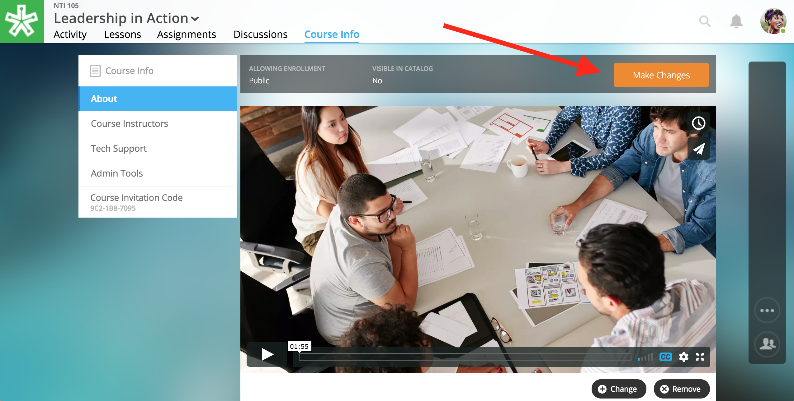

In the new window, make desired changes. You can choose whether the
course is public or private with the "Visible in Catalog" toggle. You
can also set the Preview Mode:

- **Preview Mode On:** This option sets the course to course preview
  mode, meaning that users can only view Course Info but cannot view
  course content.
  
- **Preview Mode Off:** This option allows the course to be fully
  available to users.
  
- **Based on Start Date:** This option sets the course to be in course
  preview mode until the defined start date and time, at which time it
  will then become fully available to users.

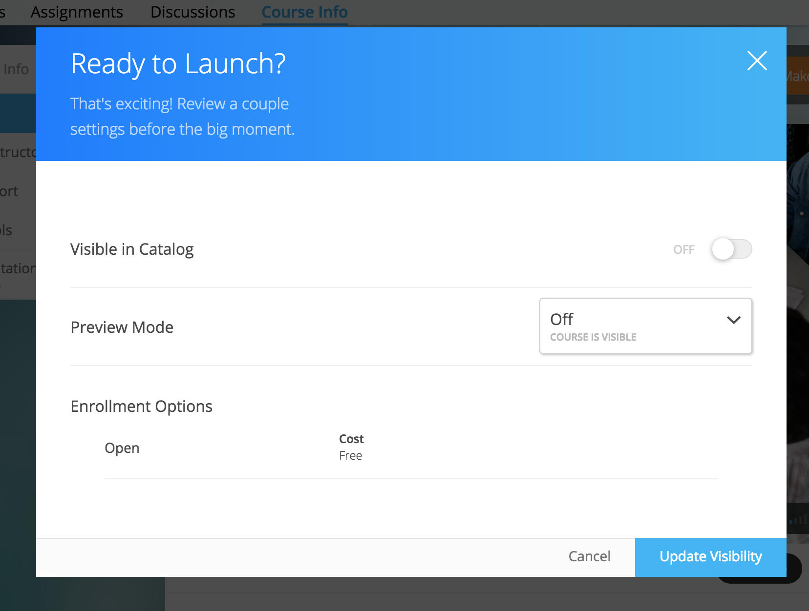

Create course assets
--------------------

Add your course image within the Course Info View.

1. Click on the "Edit" button next to "Assets."

   .. image:: images/assetsstep1.png
   
2. Upload the desired image.

   .. image:: images/assetsstep2.png
   
3. Crop your image.

   .. image:: images/assetsstep3.png
   
4. Click "Continue."

5. Preview and adjust the size of each asset.

   .. image:: images/assetsstep4.png
   
6. Click "Apply Image" after all adjustments have been made.

7. Click "Done."

User search
-----------

Use the global search bar to search for users in your learning
environment and navigate to their profile.

.. image:: images/globalusersearch.png

January 25, 2018
================

Book analytics
--------------

Now, analytics are available for both courses and books.

In the admin tools, select “Content” and use the dropdown menu to
select “Books.” You will see a list of books and basic analytics for
each. Click on a book for greater detail and to view widgets for Top
Learners, Daily Activity, Active Times, and Most Popular Time.

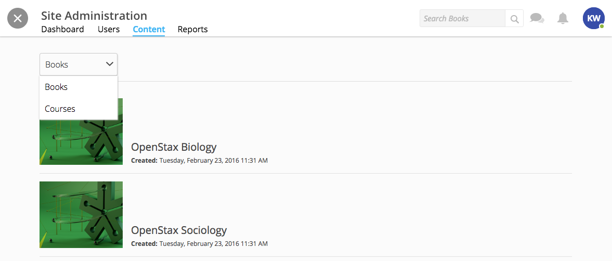

.. note:: Not all sites have access to books. If you have a book, it will display on the homepage under "Books."

Redesign of course reports tab
------------------------------

Reports are now centrally located under the "Report" tab within the
Course Info View. In addition to the Course Summary Report and the
Self Assessment Summary Report, the Course Roster Report and
Assignment Reports can now also be found here.

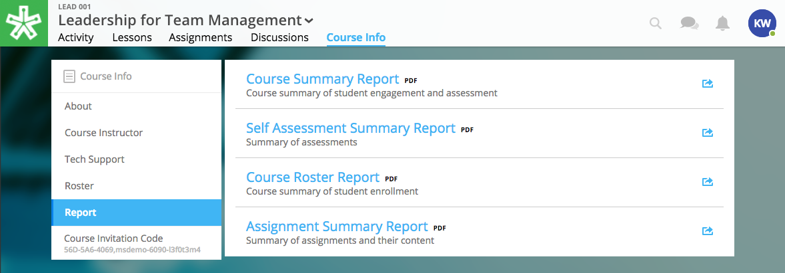

Can set a course start time and end time
----------------------------------------

A specific start and end time can be set in the Course Info
View. Click “Edit” next to either “Start Date” or “End Date.” Then,
click the dropdown to select a date and set a time.

.. image:: images/coursestarttime.png

.. note:: You can use the start date and time to define when the
          course becomes available for users.

Options for opening a course
----------------------------

There are three options for site admins when opening course content to
users. These options are available when creating a course, or you can
return to this view by hovering over a course on the homepage and
clicking the gear icon that appears. Then, select "Edit Course
Information" and "Course Settings."

- **Preview Mode On:** This option sets the course to course preview
  mode, meaning that users can only view Course Info but cannot view
  course content.
  
- **Preview Mode Off:** This option allows the course to be fully
  available to users.
  
- **Based on Start Date:** This option sets the course to be in course
  preview mode until the defined start date and time, at which time it
  will then become fully available to users.
  
.. image:: images/coursepreviewmode.png

..  note:: By default the course will be in **Preview ModeOn** and
           will need to be either switched to **Preview Mode Off** or
           **Based on Start Date** for users to begin the course.

New Enrollment Report in admin tools
------------------------------------

In the admin tool Reports tab, the “User Enrollment Report” is now
available. This report provides a list of all courses the user is
enrolled in and when they enrolled.

New Course Roster Report
------------------------

The "Course Roster Report" is available at both the course level
(under Course Info View > Reports) and in the admin tools (under
Reports). This report displays the users enrolled in the course along
with their enrollment and last access time.

Site admins can manage site admins
----------------------------------

Site admins can now manage (add or remove) site admins. When viewing
admin tools, click on the “Users” tab. Search for users in the upper
right-hand corner, check the box beside their name, and click on the
gear icon above. Select “Set as Admin” and a confirmation window will
appear to confirm your selection.

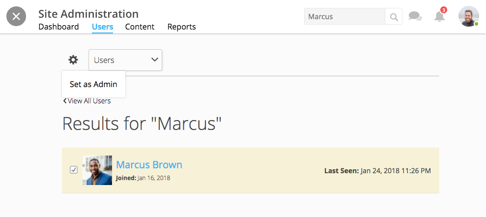

.. note:: In this window, you can toggle between viewing “Users” or
          “Site Admins” with the dropdown menu.

January 11, 2018
================

Top Learners widget added to admin tools
----------------------------------------

While viewing the admin tools dashboard, Top Learners now displays at
the top right-hand corner.

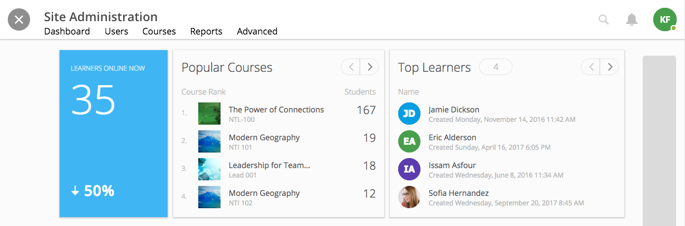

All images are expandable
-------------------------

All images in readings are now clickable. Clicking on an image expands
it in a new popup window.

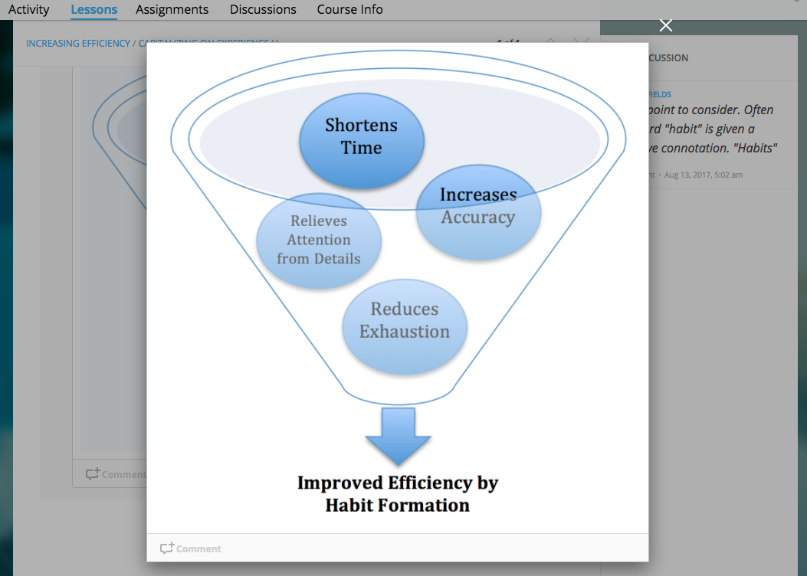
