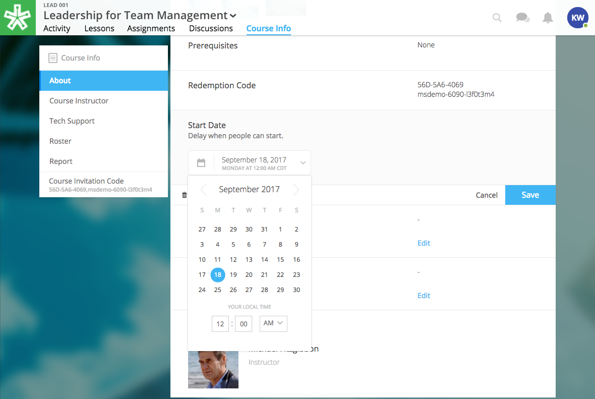
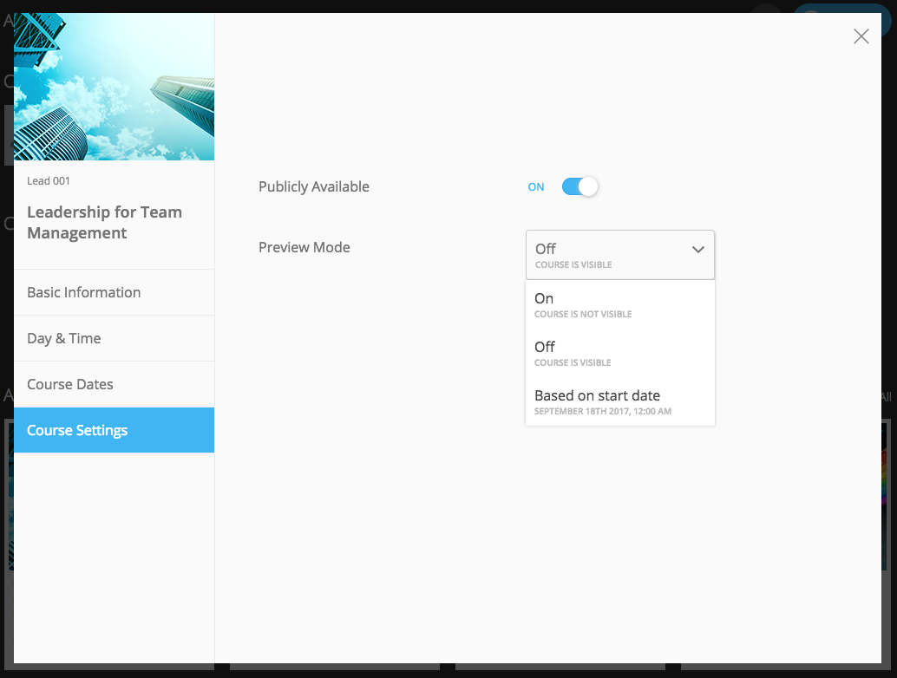

===================
2018 Release Notes
===================

May 17, 2018
-------------

Create and award credit
^^^^^^^^^^^^^^^^^^^^^^^^^

Now courses can offer course credit for learners who complete the course. Admin can also manually award credit to learners.

**Course credit is made up of three components: “Amount,” “Type,” “Units.”**

For example, an association course could award “3 [Amount] CE [Type] hours [Units].” 

Admins can create credit, assign credit to a course, and also “manually” award a user with credit. Instructors can create and assign a course credit. See below for more detail:

**Admin Only:**

To create site-wide course credit options,

1. Click on the admin tools in the upper right-hand corner.
2. Click on the “Advanced” tab.
3. Click on the “Transcripts” tab.
   **NEW:** Click “Add New Type” to define credit for the site. Type in type and units. This is now selectable for instructors to add to courses.
   **EDIT:** You can remove a credit type by selecting the “x” button or you can select a current type and edit it.

To manually award a learner with credit,

1. Click on the admin tools in the upper right-hand corner.
2. Click on the “Users” tab.
3. Select a user.
4. Click into “Transcript.”
5. Click “Add Credit.”
6. Fill in information and click “Save”

**Instructor or Admin:**

To assign a credit type to a course,

1. Click into your course.
2. Navigate to the “Course Info” page.
3. Scroll to the “Credit” section.
4. Click “Edit.”
5. Use the dropdown to select an existing credit type and units, or add new.
6. Define the “amount” of credit.

Credit will be awarded when the user has completed the course as defined by completion of required materials. Upon course completion, the user can “View Certificate” to view their completion certificate and credit. They can also view their certificates within their profile

Progress and completion certificates now available in profile Achievements tab
^^^^^^^^^^^^^^^^^^^^^^^^^^^^^^^^^^^^^^^^^^^^^^^^^^^^^^^^^^^^^^^^^^^^^^^^^^^^^^^^^
Learners can now view their course progress and completion certificates within the profile “Achievements” tab.

1. Click on your profile image in the upper right-hand corner.
2. Click “View Profile”
3. Click the “Achievements” tab.

This tab contains two sections, “Badges” and “Certificates.” 

Certificates: The left column “In Progress” displays all completable (certificates enabled) courses that the learner is enrolled in, and the learner’s progress within each. The right column “Completed” displays courses completed and their certificates. Clicking on a certificate allows the learner to view, download, and/or print the certificate.

New Transcripts tab in user profile
^^^^^^^^^^^^^^^^^^^^^^^^^^^^^^^^^^^^^

Now, the learner can also view their awarded credit and transcripts through their profile. 

1. Click on your profile image in the upper right-hand corner.
2. Click “View Profile”
3. Click the “Transcripts” tab.

The transcripts tab displays four columns, “Title,” “Date,” “Type,” and “Amount.” Use the search filters to filter by date or type. Click on a column to sort by that field. Total credit displays at the end of the list.

Transcripts can be downloaded as a CSV or PDF. Downloaded transcripts will only show credit for the current filtered view. To view all credit in downloaded reports, make sure no filter is selected.

April 26, 2018
--------------

Performance Improvements 
^^^^^^^^^^^^^^^^^^^^^^^^^^^^^^^

Home screen loading and navigation has been optimized and should perform 2 to 3 times faster, especially for users with a large number of course enrollments. General course navigation should have also improved. 

New All Course Roster Report
^^^^^^^^^^^^^^^^^^^^^^^^^^^^^^^

New site-wide report available that includes information for each course including: course name, start date, instructor names, learner names, username, email, date enrolled, last seen, and percent complete.

Course progress displays in the Admin Tools
^^^^^^^^^^^^^^^^^^^^^^^^^^^^^^^^^^^^^^^^^^^^^

Course progress now displays within the admin tools. 

**Course View:** (Content tab > Select a course)

.. image:: images/contentcourseprog.png

**Roster View:** (Content tab > Select a course > Select Roster)

**Course's Learner View:** (Content tab > Select a course > Select Roster > Select a learner)

**User's Learner View:** (Users tab > Select a user > Select Transcript tab)

.. image:: images/usersprogress.png

Completion certificate available
^^^^^^^^^^^^^^^^^^^^^^^^^^^^^^^^^^

Once a learner “completes” the course as defined by the course progress, the learner will be able to access the “View Certificate” text in the upper left-hand corner of the Lessons page under “Course Progress.” 

.. image:: images/viewcert.png
   :scale: 50

Clicking on this text will create a certificate for the course.

March 30, 2018
---------------

Lessons List View
^^^^^^^^^^^^^^^^^^^^^^

Two views are now available on the Lessons page, a grid view and list view. These options are available in the upper right-hand corner of a lesson.

.. image:: images/learnerviews.png

Grid view, the default view, displays course content as previously recognized. List view displays all resources in a linear, uniform fashion. In list view, select “Only Required” to display only required resources. Learn more about required resource below. As with the grid view, click on a resource to begin.

.. image:: images/learnerlistview.png

Required Resources
^^^^^^^^^^^^^^^^^^^^

By default, when content is placed in a lesson, it is “optional.” While in Edit Mode, instructors, editors, and assistants can mark certain course materials as “Required.”

When a resource is marked as “Required,” a label will appear next to the content on the Lessons page.

Course Completion and Progress
^^^^^^^^^^^^^^^^^^^^^^^^^^^^^^^

Assessing course progress has become much more streamlined, visual, and comprehensive in this feature release. 

**Progress is defined by a learner completing required materials.** In order for a learner to complete required materials, materials must be viewed (video, PDF, readings, etc.) or submitted (survey, self-assessment, assignments).

Progress can be viewed by instructor, assistant, admin, and learner accounts.

**Learner View**

Users can view their course progress on the Lessons page in the upper left-hand corner. 

Learner “Progress” displays

- the number of items remaining (i.e,. the number of required items not viewed/submitted), and 
- the percent of the course completed (i.e., items remaining divided by total required items).

**Facilitator View**

Similar to the learner, facilitators and admin will also see the progress icon in the upper left-hand corner on the Lessons page. 

Facilitator/Admin “Progress” displays

- the number of learners who have completed the course (i.e., the number of learners who have viewed/submitted all required material), and
- average class completion (all learner completion percentages added and divided by the number of learners).

.. image:: images/facprogress.png

Instructors, assistants, and admin have an additional, more detailed view of progress per learner. Navigate to your “Course Info” page and click on the Roster. 

In the roster, the progress of each learner is presented. 

.. image::

Click on the progress icon to view a detailed report. The report presents a closer look at how the learner is progressing through the course item by item. The top of the report presents how the learner is performing compared to his/her colleagues. Learners are sorted into 1 of 5 categories depending on their progress. All required items are listed, and if a learner has completed that item, it is marked as completed with the date.

.. image::

March 8, 2018
--------------

Initial SCORM Support
^^^^^^^^^^^^^^^^^^^^^^^

NextThought now supports importing and launching SCORM courses on the platform.

Edit Course ID
^^^^^^^^^^^^^^^

Admin, editor, and instructor accounts can now edit the unique course ID from the Course Info page.

Download the Course Roster Report as a CSV
^^^^^^^^^^^^^^^^^^^^^^^^^^^^^^^^^^^^^^^^^^^^^^^^^^^^^^

The Course Roster Report now allows the option to download a PDF or CSV file. Open the report from the Course Info > Reports page, or from your admin tools. Click on the "Download" button in the upper right-hand corner. Now, select CSV to download the file in CSV format.

.. image:: images/Courserosterdownload.png

February 15, 2018
------------------

Admin tools now available on Course Info View
^^^^^^^^^^^^^^^^^^^^^^^^^^^^^^^^^^^^^^^^^^^^^^^

For site admins, new admin tools are available on the Course Info pages. Select the "Admin Tools" tab to view course reports or to view the course roster.

.. image:: images/admintoolscourse.png

New course visibility tools
^^^^^^^^^^^^^^^^^^^^^^^^^^^^

Previously, only site admin could edit course visibility. Now, instructors and editors can edit course visibility from the Course Info View.

Locate the "Make Changes" button on the Course Info page.

.. image:: images/makechanges.png

In the new window, make desired changes. You can choose whether the course is public or private with the "Visible in Catalog" toggle. You can also set the Preview Mode: 

- **Preview Mode On:**
  This option sets the course to course preview mode, meaning that users can only view Course Info but cannot view course content.
  
- **Preview Mode Off:**
  This option allows the course to be fully available to users.
  
- **Based on Start Date:**
  This option sets the course to be in course preview mode until the defined start date and time, at which time it will then become fully available to users.

Create course assets
^^^^^^^^^^^^^^^^^^^^^

Add your course image within the Course Info View.

1. Click on the "Edit" button next to "Assets."

   .. image:: images/assetsstep1.png
   
2. Upload the desired image.

   .. image:: images/assetsstep2.png
   
3. Crop your image.

   .. image:: images/assetsstep3.png
   
4. Click "Continue."

5. Preview and adjust the size of each asset.

   .. image:: images/assetsstep4.png
   
6. Click "Apply Image" after all adjustments have been made.

7. Click "Done."

User search
^^^^^^^^^^^^^

Use the global search bar to search for users in your learning environment and navigate to their profile.

.. image:: images/globalusersearch.png

January 25, 2018
-----------------

Book analytics 
^^^^^^^^^^^^^^^

Now, analytics are available for both courses and books.

In the admin tools, select “Content” and use the dropdown menu to select “Books.” You will see a list of books and basic analytics for each. Click on a book for greater detail and to view widgets for Top Learners, Daily Activity, Active Times, and Most Popular Time.

.. image:: images/bookanalytics.png

.. note:: Not all sites have access to books. If you have a book, it will display on the homepage under "Books."

Redesign of course reports tab
^^^^^^^^^^^^^^^^^^^^^^^^^^^^^^

Reports are now centrally located under the "Report" tab within the Course Info View. In addition to the Course Summary Report and the Self Assessment Summary Report, the Course Roster Report and Assignment Reports can now also be found here. 

.. image:: images/courseinforeport.png

Can set a course start time and end time
^^^^^^^^^^^^^^^^^^^^^^^^^^^^^^^^^^^^^^^^^^

A specific start and end time can be set in the Course Info View. Click “Edit” next to either “Start Date” or “End Date.” Then, click the dropdown to select a date and set a time. 

.. note:: You can use the start date and time to define when the course becomes available for users.

Options for opening a course
^^^^^^^^^^^^^^^^^^^^^^^^^^^^^^

There are three options for site admins when opening course content to users. These options are available when creating a course, or you can return to this view by hovering over a course on the homepage and clicking the gear icon that appears. Then, select "Edit Course Information" and "Course Settings."

- **Preview Mode On:**
  This option sets the course to course preview mode, meaning that users can only view Course Info but cannot view course content.
  
- **Preview Mode Off:**
  This option allows the course to be fully available to users.
  
- **Based on Start Date:**
  This option sets the course to be in course preview mode until the defined start date and time, at which time it will then become fully available to users.
  

..  note:: By default the course will be in **Preview Mode On** and will need to be either switched to **Preview Mode Off** or **Based on Start Date** for users to begin the course. 

New Enrollment Report in admin tools
^^^^^^^^^^^^^^^^^^^^^^^^^^^^^^^^^^^^^

In the admin tool Reports tab, the “User Enrollment Report” is now available. This report provides a list of all courses the user is enrolled in and when they enrolled.

New Course Roster Report
^^^^^^^^^^^^^^^^^^^^^^^^^^

The "Course Roster Report" is available at both the course level (under Course Info View > Reports) and in the admin tools (under Reports). This report displays the users enrolled in the course along with their enrollment and last access time.

Site admins can manage site admins
^^^^^^^^^^^^^^^^^^^^^^^^^^^^^^^^^^^^

Site admins can now manage (add or remove) site admins. When viewing admin tools, click on the “Users” tab. Search for users in the upper right-hand corner, check the box beside their name, and click on the gear icon above. Select “Set as Admin” and a confirmation window will appear to confirm your selection.

.. note:: In this window, you can toggle between viewing “Users” or “Site Admins” with the dropdown menu.

January 11, 2018
-----------------

Top Learners widget added to admin tools
^^^^^^^^^^^^^^^^^^^^^^^^^^^^^^^^^^^^^^^^

While viewing the admin tools dashboard, Top Learners now displays at the top right-hand corner.

All images are expandable
^^^^^^^^^^^^^^^^^^^^^^^^^^

All images in readings are now clickable. Clicking on an image expands it in a new popup window.

.. image:: images/imageexpand.png