===================
2019 Release Notes
===================

July 18th, 2019
------------------

Performance Improvements
^^^^^^^^^^^^^^^^^^^^^^^^^^^^^^^^^^^^^^^^^^^^^^^^^^^^^^^^^

General performance related improvements.

Clickable links within Events
^^^^^^^^^^^^^^^^^^^^^^^^^^^^^^^^^^^^^^^^^^^^^^^^^^^^^^^^^

Now, the “Events” content type allows clickable URLs that open into a new browsing tab. Pasting a URL into either the event title, description, or location will allow clickable links.

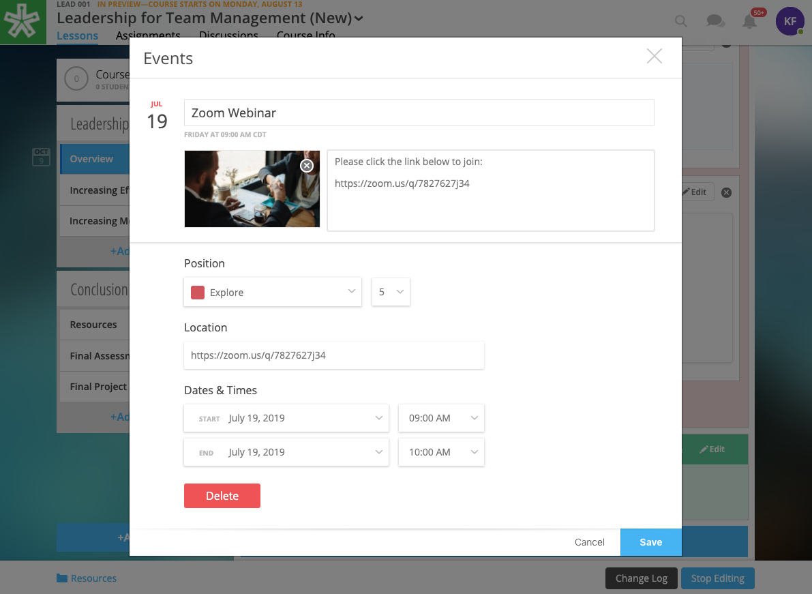

Please note: You must first open the content before using the link to navigate to a new tab.

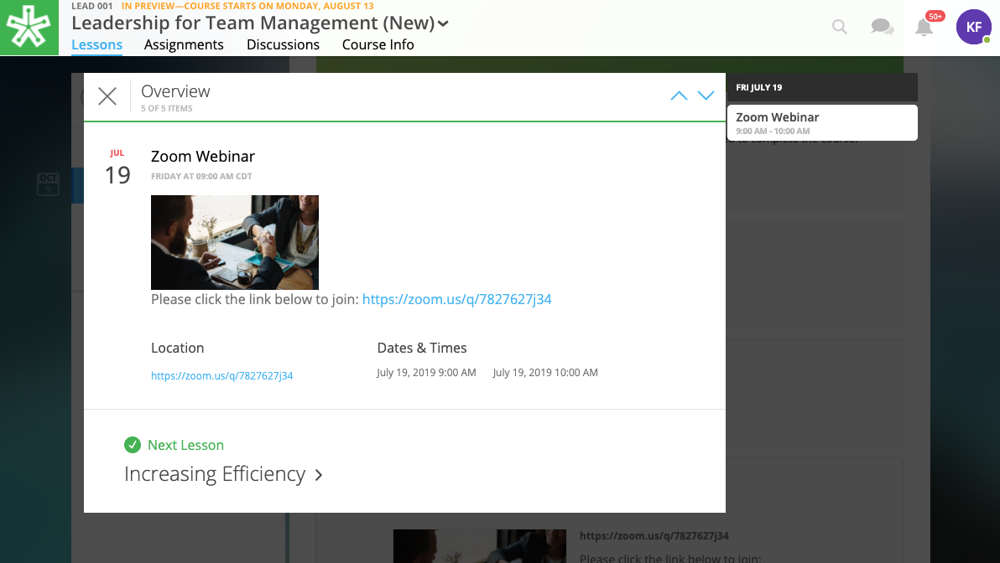

June 27th, 2019
-------------------

Add SCORM Packages as a Lesson Activity 
^^^^^^^^^^^^^^^^^^^^^^^^^^^^^^^^^^^^^^^^^^^^^^^^^^^^^^^^^
SCORM packages can now be added as a single content piece within a lesson. Other lesson content can be built around it, contextualizing the SCORM content within a larger offering. SCORM content can be required and count toward course completion. The SCORM package defines what counts as completion, and NextThought will display if the learner has met the requirements for completion or not.

**To add SCORM packages/content to a lesson:**

1. Click on “+Add Content.”

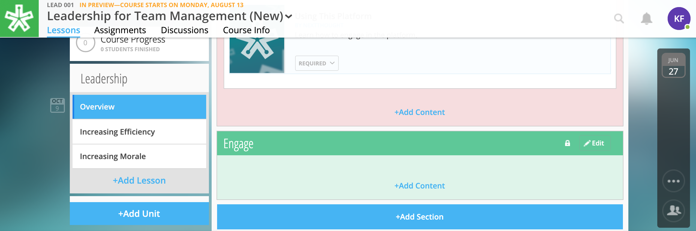

2. Click on “SCORM Package.”

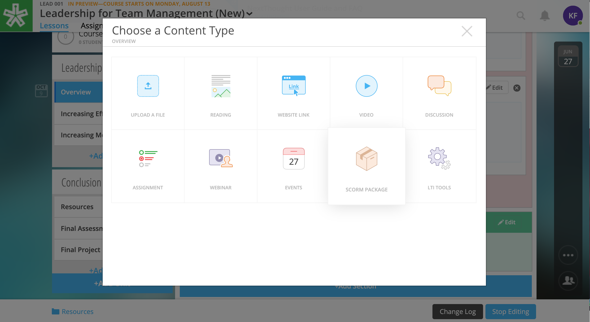

3. Drag and drop a SCORM package file, or select “Upload a SCORM Package.”

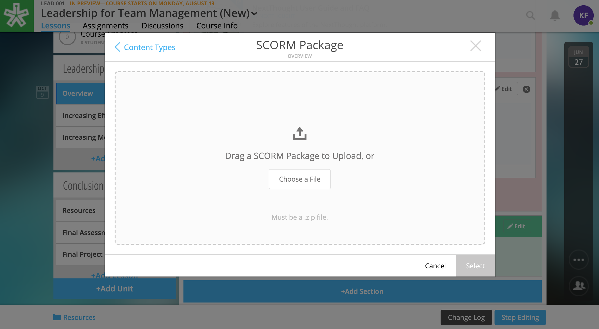

4. Select a SCORM package from your computer.
5. Select the SCORM package you’d like to add to a lesson.

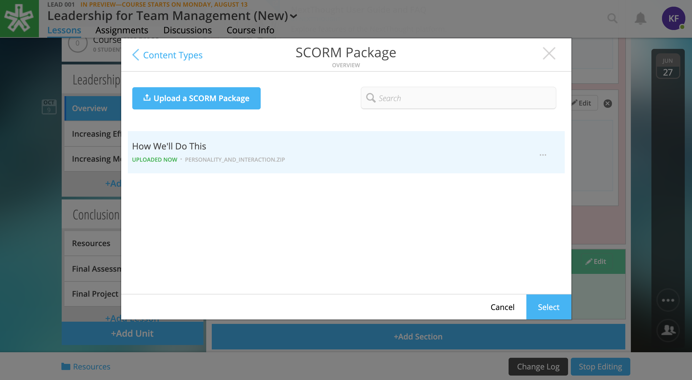

6. Add a title, description, and thumbnail, and click “Add to Lesson.”

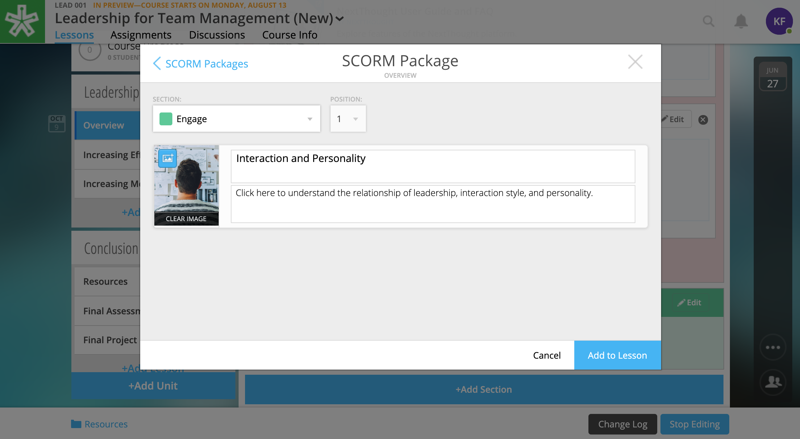

**Viewing SCORM packages/content within a lesson:**

1. Click on “Open” on the Lessons page.

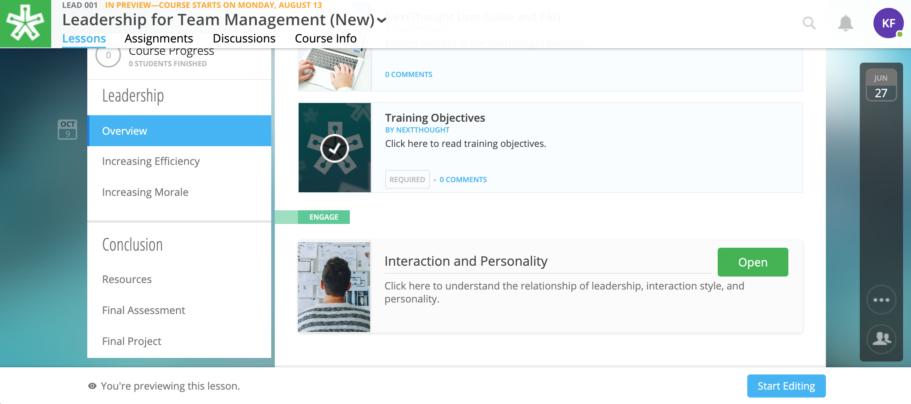

2. Click on the right-hand side button of the viewer window to open the SCORM content.

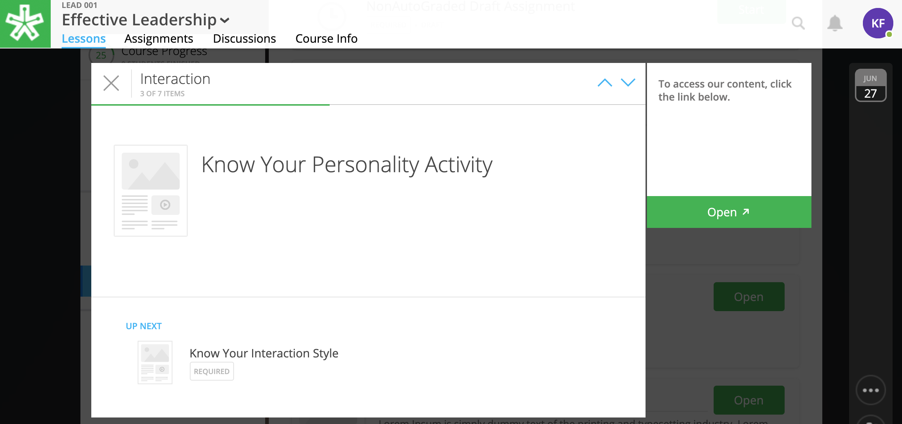

Add an LTI Tool from within the Content Selector Window
^^^^^^^^^^^^^^^^^^^^^^^^^^^^^^^^^^^^^^^^^^^^^^^^^^^^^^^^^

Previously an LTI tool could only be added through the Course Info > Advanced admin tools. Now, the button to add an LTI tool also appears in the content selector while adding content to a lesson.

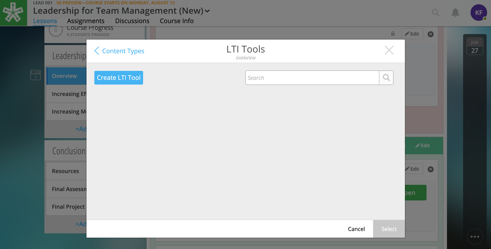

Redemption Code Explanation Text added on Course Info Page
^^^^^^^^^^^^^^^^^^^^^^^^^^^^^^^^^^^^^^^^^^^^^^^^^^^^^^^^^^^

Text was added to clarify that learners will not be able to view the redemption code.

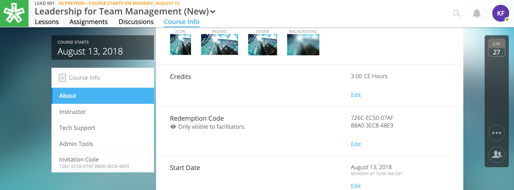

May 30, 2019
-----------------

Course Info Page Facilitator Changes
^^^^^^^^^^^^^^^^^^^^^^^^^^^^^^^^^^^^
Now, role selection reads "Full Access," "Editing Access," and "Grading Access." These descriptive titles map to Instructor, Editor, and Assistant respectively. 

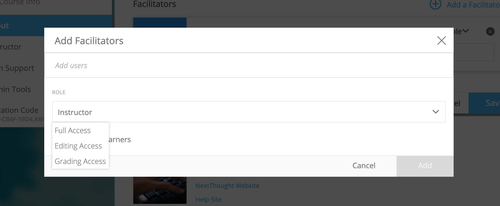

Hidden facilitators will now display to admin and facilitators while viewing the Course Info page. They will remain hidden for learners.

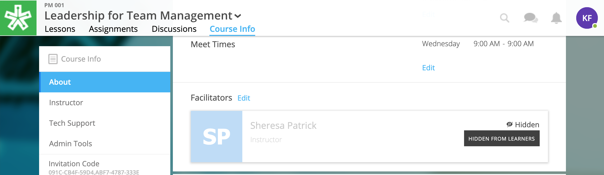

The visible title of facilitators is now editable. (By default, their title is the role selected: Instructor, Editor, or Assistant.)

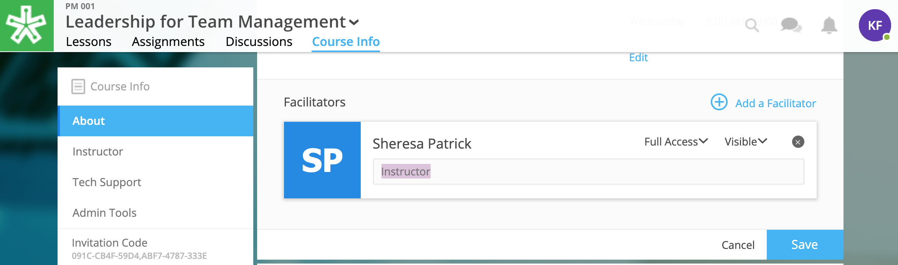

Course Category Suggestions 
^^^^^^^^^^^^^^^^^^^^^^^^^^^^^
Now when a facilitator or admin clicks into the Course Category field, suggestions will appear based on existing course categories on the site. As text is entered, the suggestions will filter. If a category that doesn't exist is entered, it will prompt to create a new tag. This will reduce typo errors that prevent courses from being categorized together.

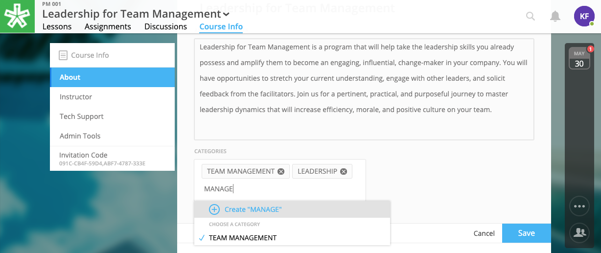

Removed Activity Page from Courses
^^^^^^^^^^^^^^^^^^^^^^^^^^^^^^^^^^^^^^^^^^^^^^^^^^^^^^^^^
The Activity Page, the first tab within a course, has been removed.

Hide Non-Authorable Content Types from Authoring Window
^^^^^^^^^^^^^^^^^^^^^^^^^^^^^^^^^^^^^^^^^^^^^^^^^^^^^^^^^
Now, the "Choose a Content Type" authoring window only features the content types that are authorable for the user, unless content has been created by NextThought and is ready for placement. 

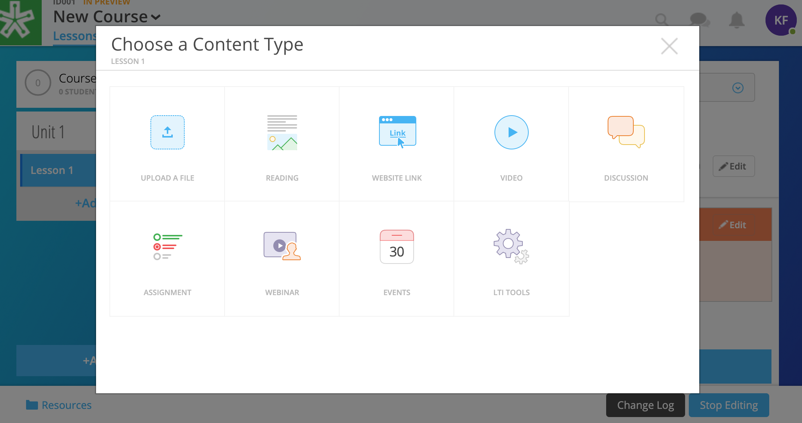

Improved Section Deletion Alert
^^^^^^^^^^^^^^^^^^^^^^^^^^^^^^^^
When a user selects to delete a section, the wording is more descriptive of the action that will take place and includes the number of content items that will be deleted.

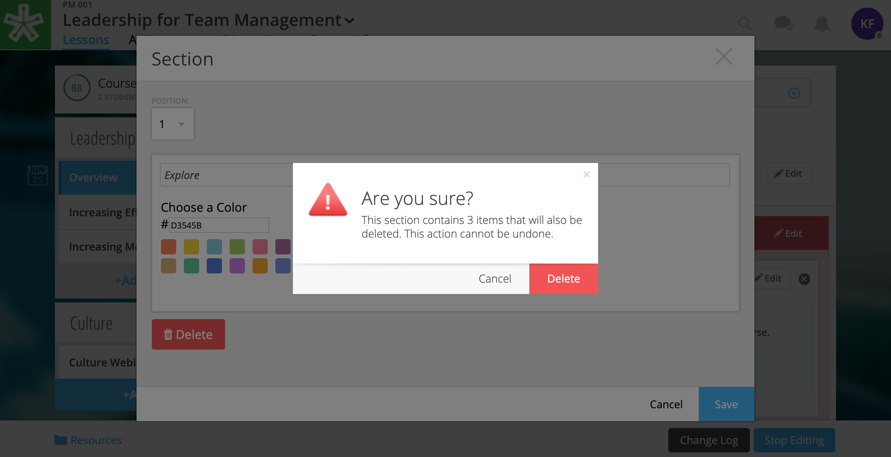

May 9th, 2019
-----------------

Updated Mobile Navigation
^^^^^^^^^^^^^^^^^^^^^^^^^^^
The mobile version of the platform now has updated navigation. The up arrow and down arrow from the previous update has been added into the content view. As well as the “Up Next” near the bottom of the content window.

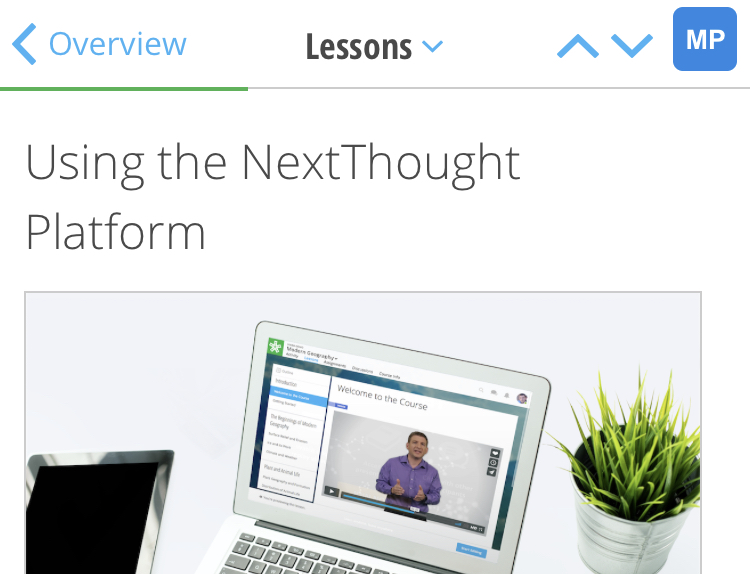

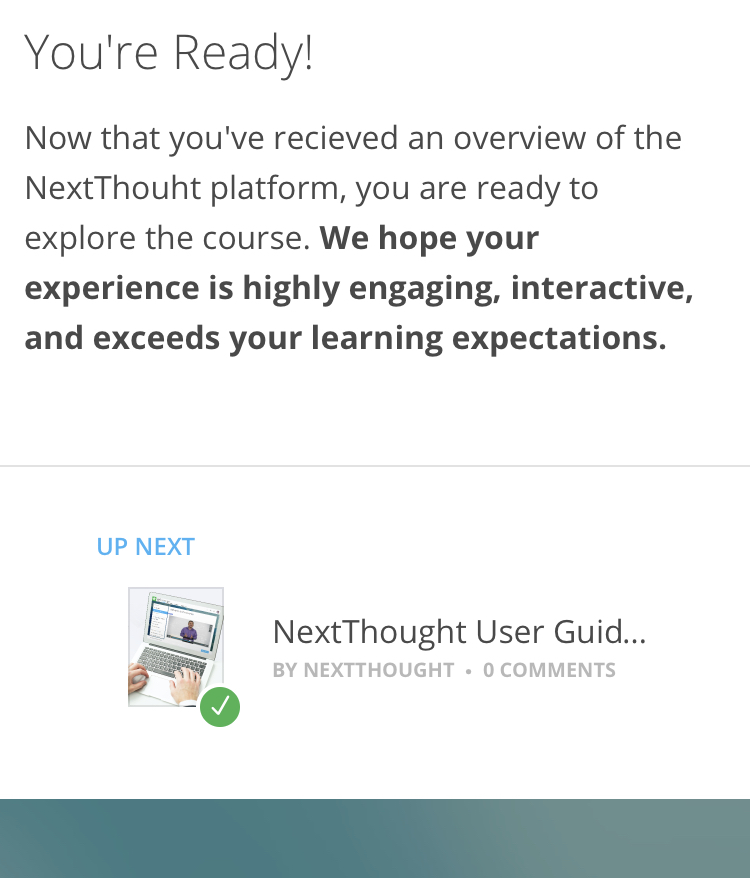

April 19, 2019
----------------

Updated Course Navigation and Content Windows
^^^^^^^^^^^^^^^^^^^^^^^^^^^^^^^^^^^^^^^^^^^^^^^^^
Previously, when clicking on any of the course content, it would redirect the user to a new page, aside from a few exceptions. The only way to continue to go through the course would be to go back to the course view and click on a new piece of content.

With this update, the entire course navigation has been overhauled. When clicking on a piece of content, a content window will appear with the content inside. There are several different parts to the interface: 

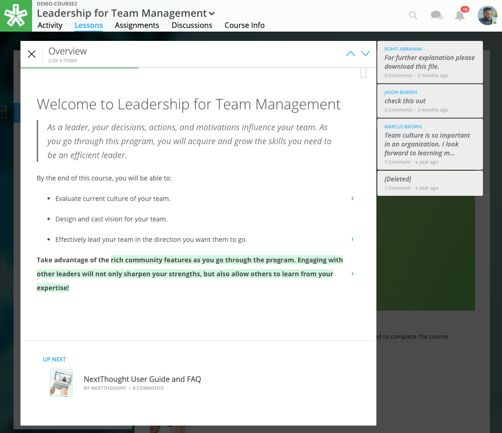

**Exit Button**

In the top right corner of the window is a button with an “X” on it. Clicking on this will return the user back to the current lesson they are on.

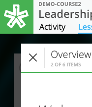

.. note::  If the user had progressed or went back to other lessons using the Navigation arrows, the button will exit them to that lesson they are currently on. 

**Navigation Bar**

Next to the navigation arrows is the Navigation bar. The Navigation bar will fill up the length of the window as a user progresses through a lesson. It will show the user the percentage of content they are into the lesson, as well as how many items are in the lesson and how far deep into the lesson they are. 

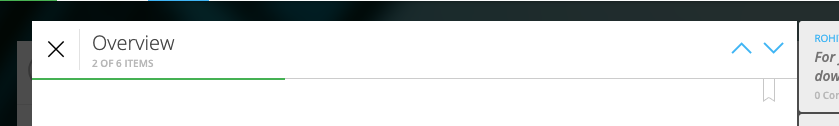

.. note:: This does not show the completion of the lesson, just where a user is in a lesson.

**Navigation Arrows**

The two arrows at the top of the content window. The one pointing up will direct the user to the previous content, while the one pointing down will direct the user to the next content

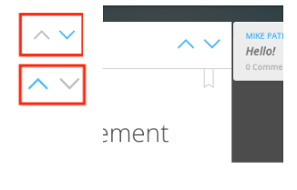

If it is the first piece of content in a course, the “Up” arrow will be grayed out, implying that there is no more content to view in this direction. If it the last piece of content in a course, then the “Down” arrow will be grayed out. 

.. note:: The arrow buttons will still work to cross through different lessons.

**Up Next Section**

At the bottom of the content window is a section displaying the next piece of content in a lesson or the next lesson if the user is at the end of a lesson. Activating it will move the user to the next content window. This has the same effect as activating the “Down” arrow.

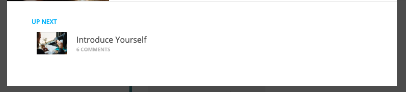
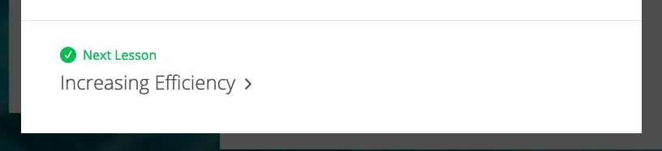

**Discussions and Instructions**

Discussions and instructions now appear as boxes outside of content window. Their functions are still the same.

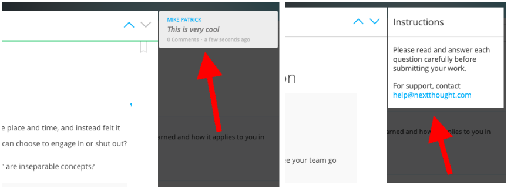

**Video**

Activating a video will now open a video content window. The video title will appear below the video along with its run time. With this redesign,the transcript appears below the video. 

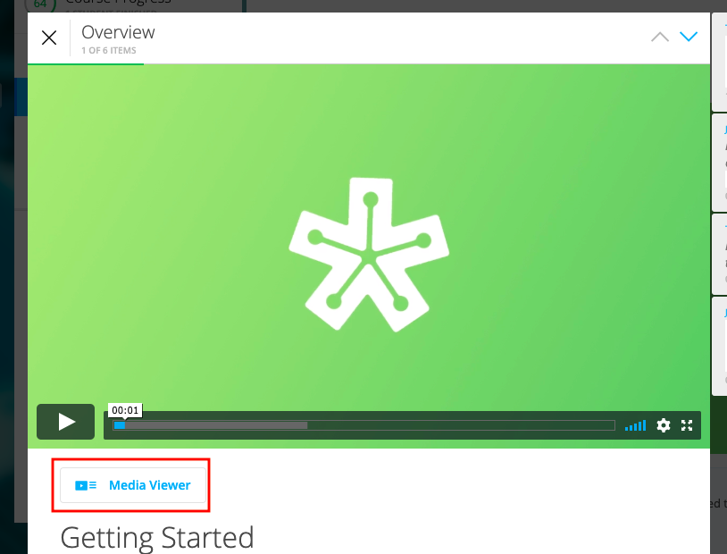

Clicking on the transcript wording will allow for the video to skip to the part of the video. If the transcript is long enough to scroll down, the video will shrink and follow the user in their window. If a user desires to see the default Media Viewer, the option to view the video in this mode is right below the video.

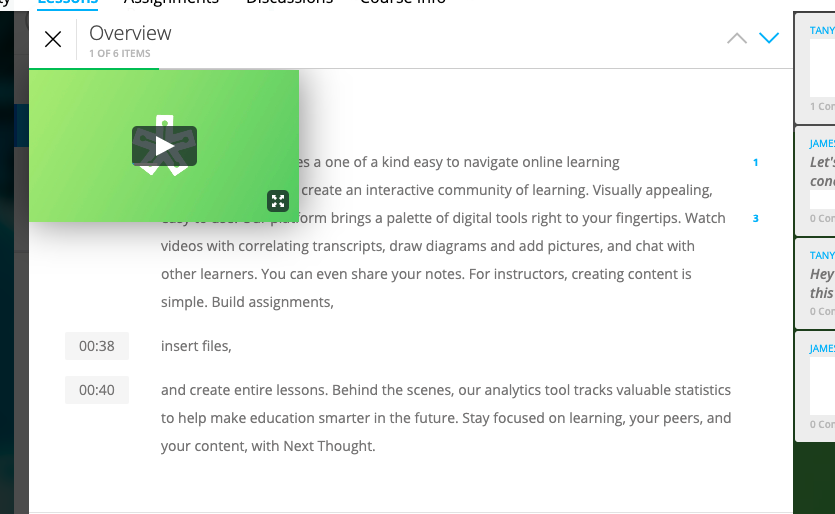

Display Learners in Sidebar on Discussions
^^^^^^^^^^^^^^^^^^^^^^^^^^^^^^^^^^^^^^^^^^^^^^^^

Learners who have commented in a discussion now display on the right-hand sidebar while viewing the discussion.

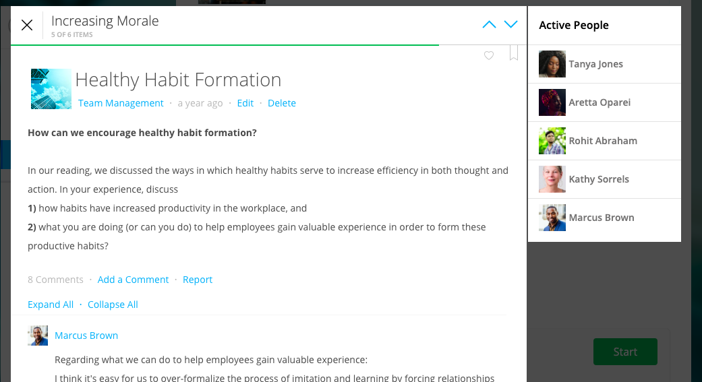

Februrary 21, 2019
------------------

Allow Multiple Attempts on Assignments
^^^^^^^^^^^^^^^^^^^^^^^^^^^^^^^^^^^^^^^^^^^^^^^^^^^

**Add Multiple Attempts:**

Instructors and Admins can now set the number of attempts a learner can take on an assignment. 

To set the number of attempts, select the “Options” button while editing an assignment, and scroll down.

.. note:: Both a value and passing score must be defined in order to add multiple attempts.

Choose between one attempt, multiple attempts, or unlimited attempts.

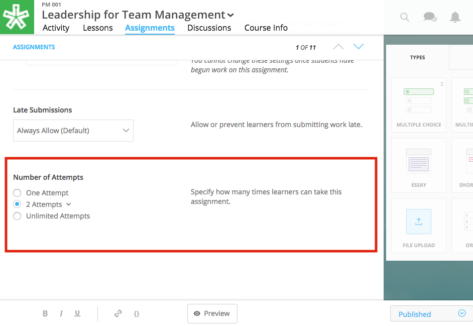

To select a range between two and twenty attempts, select the middle dropdown option.

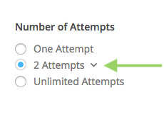

Select a value to set the desired number of attempts. 

.. image:: images/MultiSubs3.png

**Assignment Completion:**

Successful completion of an assignment can be defined as:

- **Submission Only** (Once the learner submits the assignment, the assignment is marked as complete.)
- **Passing Score** (The learner must gain a passing score.)
- **Excused** (If the facilitator excuses the assignment, the assignment will be marked as complete despite any other parameters.)
- **No Submit Grade** (A no submit assignment type cannot have multiple attempts. For no submit assignments, adding a grade will act as a “submission.”)

Multiple attempts can be added in order to allow the learner multiple attempts to gain a passing score, and thus multiple attempts for successful completion of the assignment. The displayed score on the assignment will be the highest score achieved of all attempts. Once the learner achieves the passing score or above, no more attempts will be allowed. 

To learn more about this feature, click here!
https://help.nextthought.com/editorguide/assignment.html#adding-multiple-attempts

Enrollment Management in Course Roster
^^^^^^^^^^^^^^^^^^^^^^^^^^^^^^^^^^^^^^^^^^^

The course roster now has an option for site admins to enroll or drop users from the Course’s Admin Tools > Course Roster.

Selecting ”Manage Enrollment” will open a window displaying all site users and a search bar. Search for learners within the search bar and select a learner.

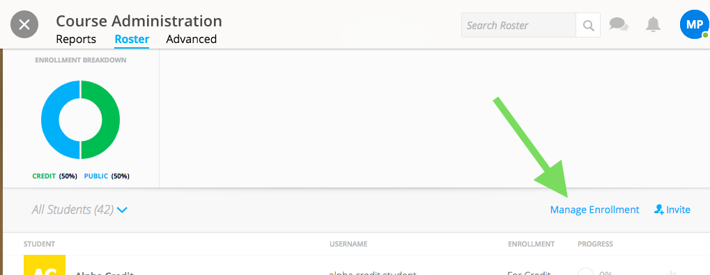

After selecting a learner, the learner’s current course enrollment status will display. If they are not enrolled, you can select “Enroll User” to add them to the course.

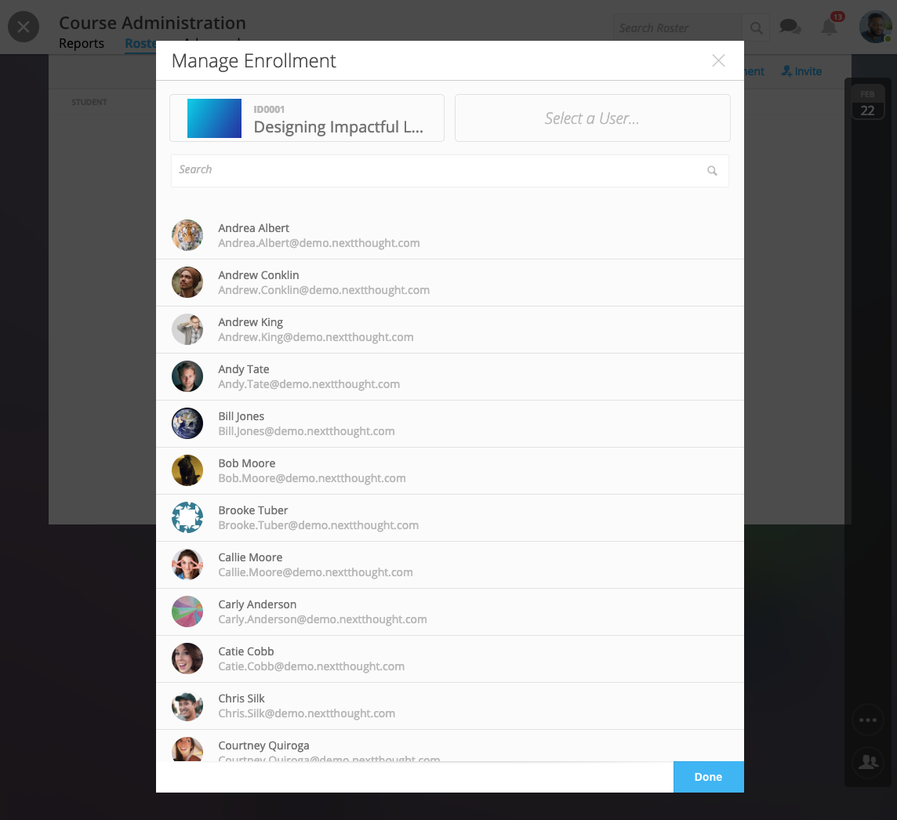

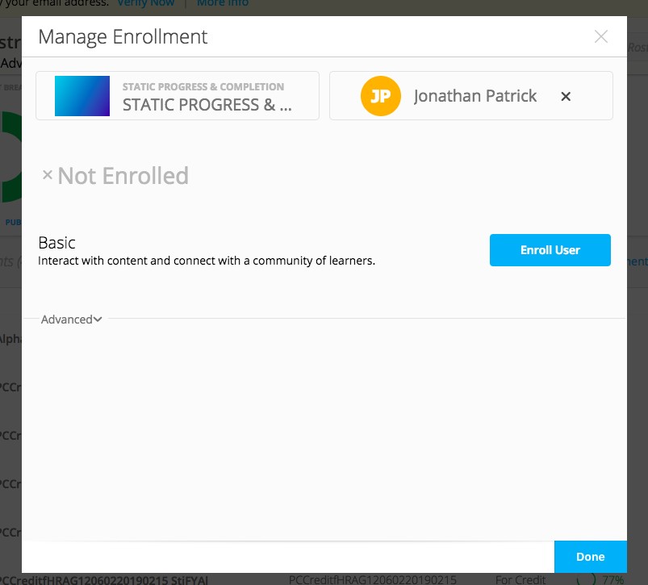

If the learner is enrolled, the “Enrolled” text and course information will display. The enrolled user can be removed from the course by selecting the “Remove User” button.

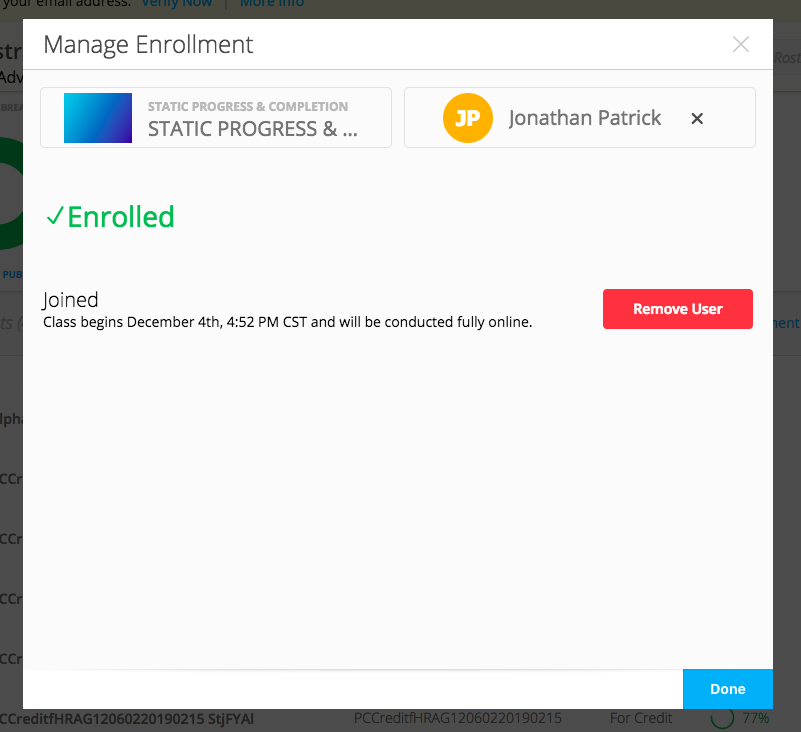

**Advanced Enrollment Options**

Each site will have a defined set of user enrollment scopes. The “Advanced” dropdown will allow admins to enroll a learner into a specific scope.

For example, a university site may have two defined scopes: “enrolled” and “open.” By default learners may be enrolled into the “open” scope; however, using the advanced dropdown, and knowing the scopes allowed on the site, you can define the user as “enrolled” to enroll them in that scope.

.. note:: Please ask your project manager if you’d like to enroll a learner into a specific scope.

Add and Remove Group Members
^^^^^^^^^^^^^^^^^^^^^^^^^

Site admins have the ability to add site users to a group.

After selecting “Create a Group,” you will be presented with a window to type a group name, and automatically add group members across the site. Select “Create” to create the group.

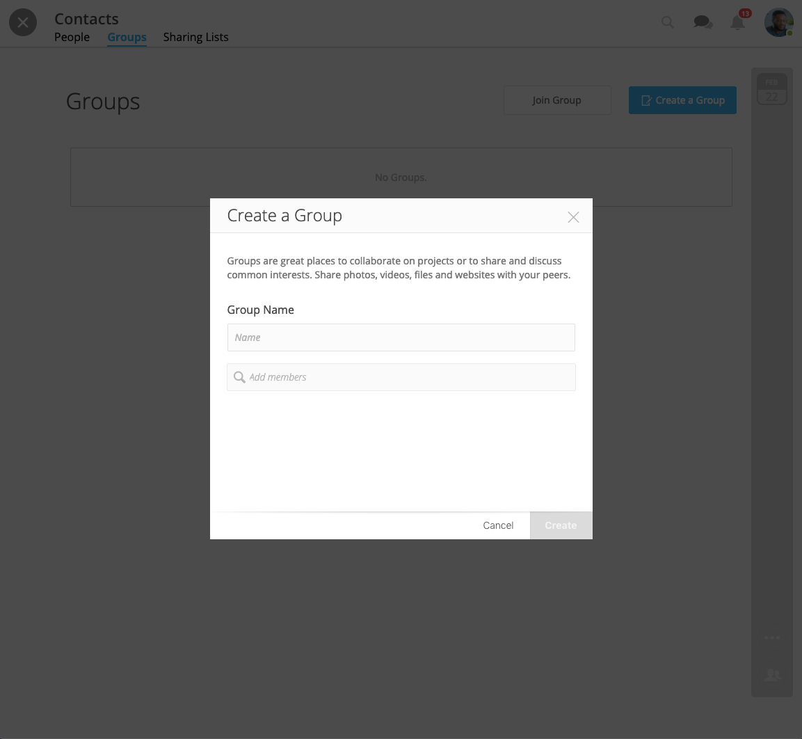

You can also choose to edit a group, and add or remove group members. Click “Save” to save your changes.

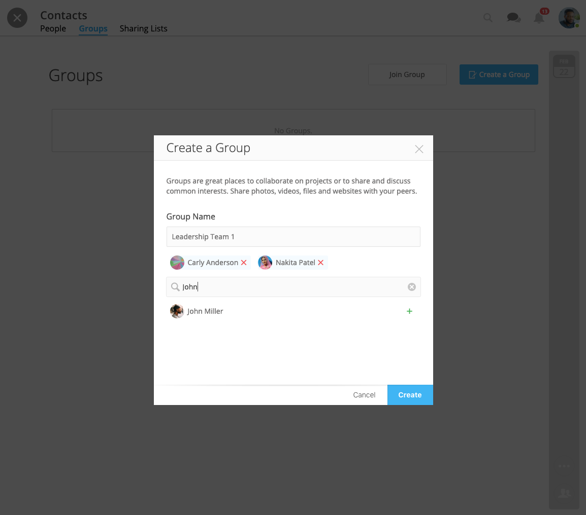

January 31, 2019
-----------------

Calendar Notifications
^^^^^^^^^^^^^^^^^^^^^^^^^^^^^^^^^^^^^^^^^

Calendars will now notify the user when events are created or modified and are directly related to the user. The notifications will be sent on the platforms as well as by email. 

Passing and Failing Assignments Based on Scores
^^^^^^^^^^^^^^^^^^^^^^^^^^^^^^^^^^^^^^^^^^^^^^^^^^^

Assignments can now be set to pass or fail based on grade. The grade will be determined by the percentage of points earned in the assignment. 

To activate this feature on an assignment, open an assignment in edit mode. At the top of of the screen click on the “PASSING SCORE” field and click the checkbox labeled “Passing Score”. Enter the desired passing percentage to set the passing score. 

.. image:: images/passfail.png

.. note:: Please note, you must have the value field set for this feature to activate. If you do not, a prompt will direct you to set a value. 

Once you have saved and published the assignment, the learner can view the passing score requirement by opening up the assignment and viewing the top of the assignment for the newly designed field. The learner will now have to not only complete the assignment, but have a passing score in order to complete assignment and, thus, the course.

.. image:: images/studentpassfail.png

Course Switcher
^^^^^^^^^^^^^^^^^^^^^^^^^^^^^^^^^^^^^^^^^^^^^^^

Site administrators can switch between different sections of a course by using this new feature. To use the Course Switcher, the admin should navigate to the desired course and then click the arrow beside the course name. The drop down menu will contain all other sections as well as other options such as a course visibility option, a delete button to delete the course and a link to edit the course information.

.. image:: images/courseswitcher.png

January 10, 2019
-----------------

Calendar URL
^^^^^^^^^^^^^^^^^^^^^^^^^^^^^^^^^^^^^^^^

You can now export and sync the NextThought Calendar to your personal calendar using the provided URL within the calendar feature. Click the ellipsis icon to reveal the dropdown.

.. image:: images/calendarurl.png
