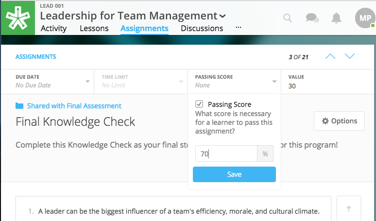
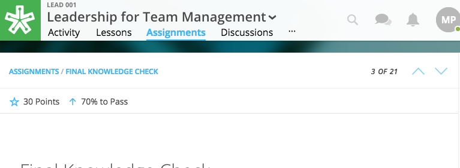
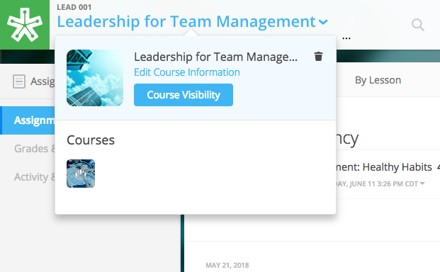
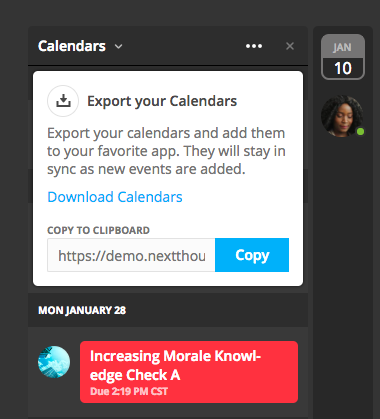

===================
2019 Release Notes
===================

January 31, 2019
-----------------

Calendar Notifications
^^^^^^^^^^^^^^^^^^^^^^^^^^^^^^^^^^^^^^^^^

Calendars will now notify the user when events are created or modified and are directly related to the user. The notifications will be sent on the platforms as well as by email. 

Passing and Failing Assignments
^^^^^^^^^^^^^^^^^^^^^^^^^^^^^^^^^^^^^^^^^

Assignments can now be set to pass or fail based on grade. The grade will be determined by the percentage of points earned in the assignment. 

To activate this feature on a assignment, open a assignment in edit mode. At the top of of the screen click on the “PASSING SCORE” field and click the checkbox labeled “Passing Score”. Enter the desired passing percentage to set the passing score. 

.. note:: Please note, you must have the value field set for this feature to activate. If you do not, a prompt will direct you to set a value. 

Once you have saved and published the assignment, the learner can view the passing score requirement by opening up the assignment and viewing the top of the assignment for the newly designed field. 

Course Switcher
^^^^^^^^^^^^^^^^^^^^^^^^^^^^^^^^^^^^^^^^^^^^^^^

Site administrators can switch between different sections of a course by using this new feature. To use the Course Switcher, the admin should click the into the desired course and then click the arrow beside the course name. The drop down menu will contain all other sections as well as other options such as a course visibility option, a delete button to delete the course and a link to edit the course information.

January 10, 2019
-----------------

Calendar URL
^^^^^^^^^^^^^^^^^^^^^^^^^^^^^^^^^^^^^^^^

You can now export and sync the NextThought Calendar to your personal calendar using the provided URL within the calendar feature. Click the ellipsis icon to reveal the dropdown.

