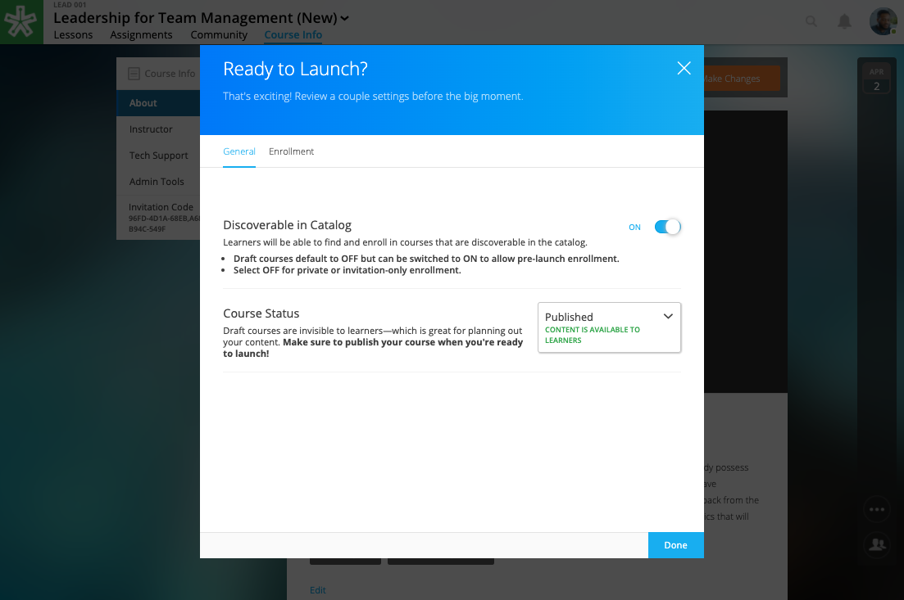
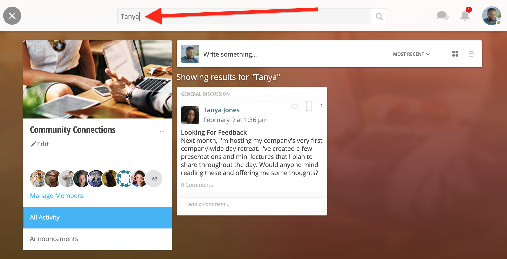
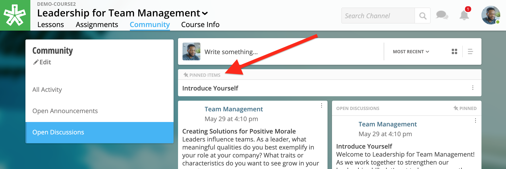
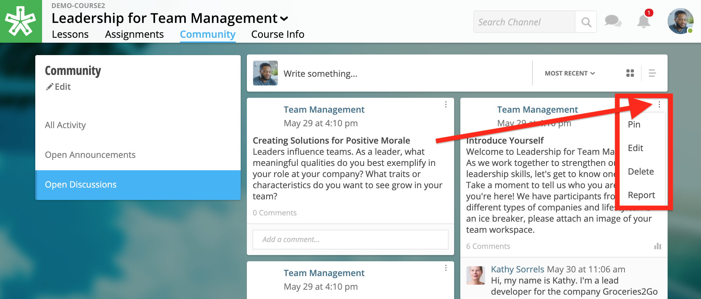

====================
 2020 Release Notes
====================

March 11, 2020
================

Improvements to “Make Changes” Ready to Launch Menu
----------------------------------------------------

Now, the “Visible in Catalog” section is titled “Discoverable in Catalog” with an on/off toggle. The “Preview Mode” section is renamed “Course Status” with the options of “Draft,” “Published,” and “Publish on Start Date.”

Further explanation has been added to provide additional clarification.

March 6, 2020
====================

Search Communities by User Name
---------------------------------------

You can now filter posts by name by typing a name into the community search bar.

Pin Posts Within a Community
---------------------------------------

Now, you can select discussions to pin to the top of community channels. Site admins can pin discussions both within site communities as well as course communities. In addition, facilitators can also pin discussions to the top of a channel within the course they are instructing.

To pin a post, navigate to the channel the discussion was created, or simply create a new post. While viewing the channel, select post options in the right-hand corner. Select “Pin” to keep the discussion at the top of the channel for higher visibility. You can also unpin posts by clicking the options menu on a pinned post and selecting “unpin.”

.. warning:: Please note, all channel discussions will display within the All Activity channel. Due to this, some posts will not display the option to pin. This is an indication that the post was created within a different channel than the “All Activity” channel. As a reminder, you can only pin posts within the channel they were created in.

January 9, 2020
====================

Notification for Dropping IE Support
---------------------------------------

Users logged into NextThought using Internet Explorer will begin to receive an unsupported browser notification, reminding them to switch to supported browser.

Effective March 31, 2020, the NextThought LMS will no longer support Internet Explorer (IE).

The NextThought LMS will continue to support all modern browsers, such as Chrome, Firefox, Safari, and Edge. Anyone trying to access the NextThought LMS from IE after March 31, 2020, will be prompted to switch browsers.

The decision to drop IE support comes after Microsoft announced it would no longer support older versions of the browser. Other services are phasing out IE for many of the same reasons we are. Considering the security risks, development costs, compatibility issues, and the small number of people using IE, we are confident this is the right time to drop IE support.

There are many reasons we will no longer support IE, including:

- A very small percentage of users are still using IE. Furthermore, usage of IE continues to trend down, while usage of Edge, Microsoft’s modern web browser, continues to trend up.
- We are not confident that IE 11 is a secure browser. Microsoft is diverting resources to focus on Edge, and fewer developers are testing for it. More bugs and vulnerabilities are inevitable.
- IE is slow and lacks the functionality found in modern browsers.
- We have an ambitious roadmap of upcoming features and product enhancements. Dropping support for IE allows us to focus development efforts on improving the NextThought LMS and supporting the modern browsers in use by the vast majority of users.
- If you prefer to or you are required to continue using a Microsoft Browser, you can use Edge.

Supporting Wistia Videos
---------------------------------------
NextThought now supports Wistia videos on the learning platform. Add Wistia videos to your lessons, discussions, readings, and more.
