====================
 2020 Release Notes
====================

July 3, 2020
=============

Mentions
---------

Mentions allow users to notify an individual, list, or group within a discussion (resource, course community, site community). It replaces the previous style of sharing notes within a sharing field, and expands mentions to replies.

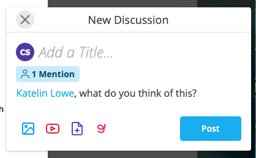

**To notify, share, or mention an individual, list, or group,**

1. Start a new discussion within a resource or community

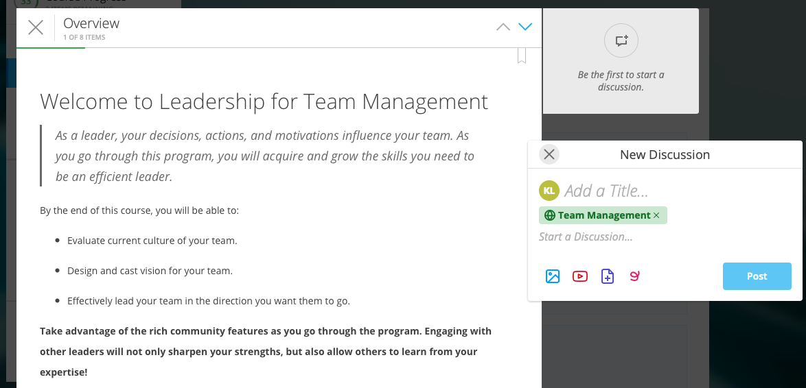

2. Keep or remove any default sharing scope by hovering the mouse over the scope and clicking on the “x”
3. Type the “@” symbol and begin typing in the name/title to search

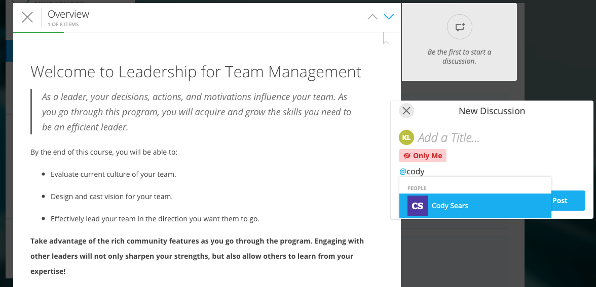

4. Select the individual, list, or group with whom you’d like to mention, share, and notify

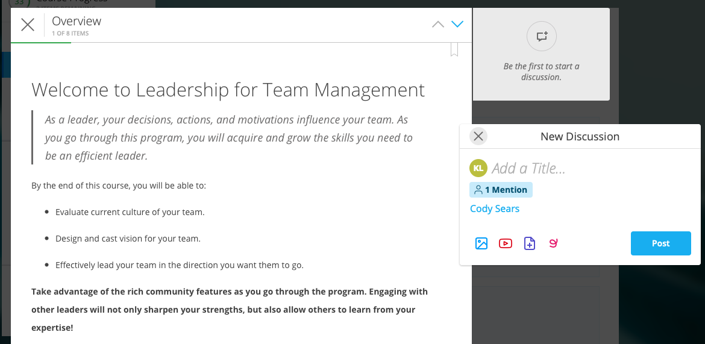

5. Click “Post” once you’ve added your comment

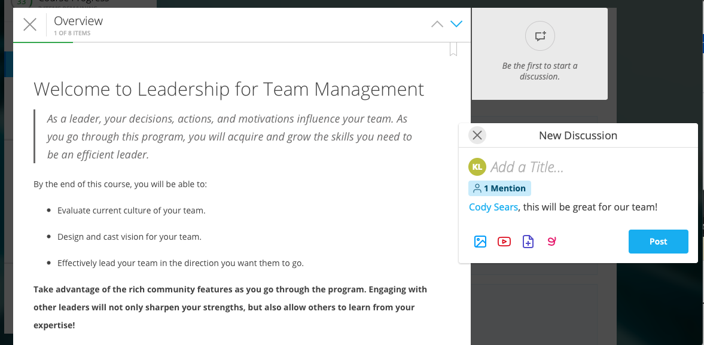

**Sharing and Mentions**

Mentions replace the previous concept of sharing discussions on the platform. 

To share publicly with your course, leave the default share option.

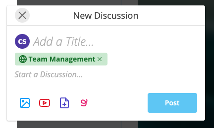

To keep the note private, remove the default sharing option.

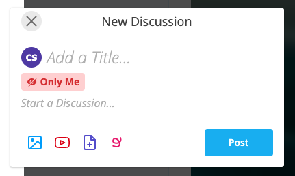

To keep the note public, but also notify certain individuals, keep the defaulting sharing option AND mention specific people, lists, or groups.

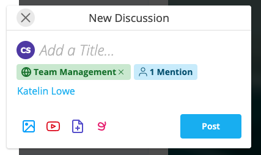

To keep the note private and only shared with specific individuals, remove the default sharing option and mention specific people, lists, or groups.

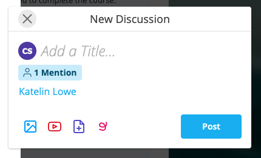

**Notifications**

Individuals will be notified when they are mentioned within a note or as a part of a list. Users are notified by the bell icon in the upper right-hand corner. 

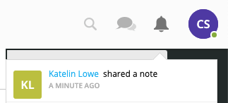

If not online, users will get an email notification alerting them to the mention as well as an in-platform notification.

New Layout for Course Information Page
---------------------------------------

Previously, the admin tools, roster, and advanced options were located below general course information.

Now, navigate to admin tools, roster, and advanced options on the course Information page by clicking on the left-hand column headers.

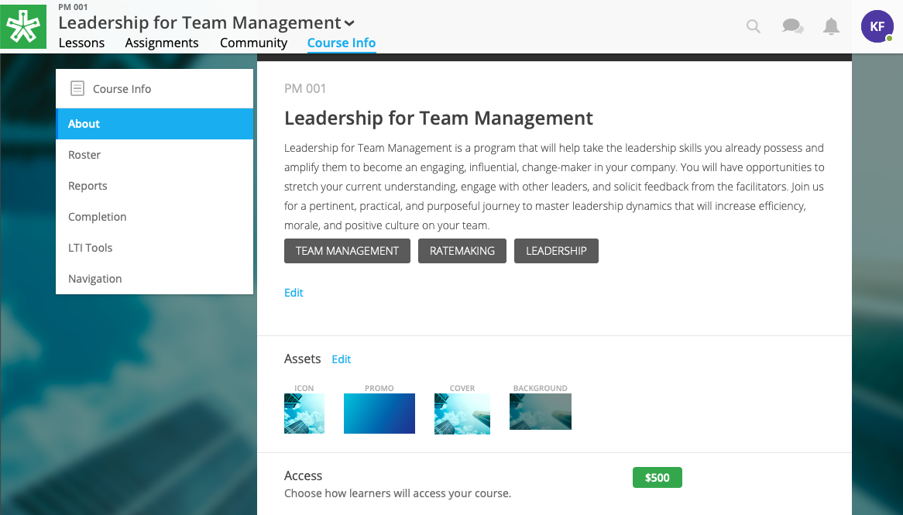

New Design for Discussions
--------------------------------------------

**During Editing:**

- Mentions instead of sharing field
- New icons for text styles, attachments, and whiteboard

**While Viewing:**

- Reply has been changed to “Add a Comment”
- Location of discussion in header
- Sharing scope and mentions are more prominent
- Options to edit, delete, report moved to upper right-hand corner

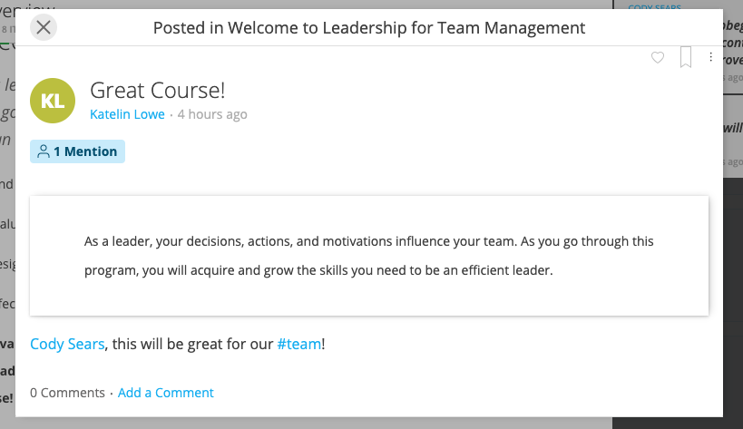

Topic Tags
------------

Now, you can add tags to posts. Tags allow users to categorize and search by topics using hashtags.

**To add a tag,**

1. Type the “#” key.
2. Add your topic/tag.

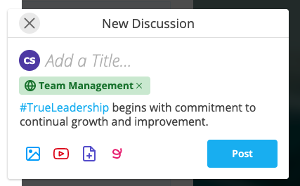

**To search by a tag,**

1. Click into the search field.

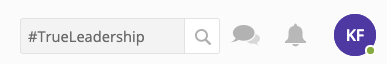

2. Type the “#” key and your topic.
3. Click “Enter.”

.. image:: images/topicssearchresult.png

May 15, 2020
=============

Customize Course Completion Certificate
----------------------------------------

Custom certificate branding is now available through the Admin Panel for Site Admins.

To customize the certificate, 

1. Click on your Admin Panel
2. Click on the Configuration tab.
3. Click on the “Certificates, Transcripts, and Course Credit” subtab to the left.

Here you can choose the background/gradient color or add a background image, as well as add your brand logo.

You can also change the label name of the certificate.

.. note:: The “Site Name” will appear before the label. You can change the “Site Name” under the Site Branding subtab to the left.

.. note:: If your site already has a custom branded certificate, you will be able to view the certificate, but be unable to change it. Please contact Support or your Project Manager if changes need to be made.

April 24, 2020
===============

Stripe Integration
-------------------

NextThought Site Admins can now integrate their site with Stripe, a payment processing software, to add purchasing options to courses. 

**To Integrate Your NextThought Site with Stripe:**

1. Create a Stripe Account at https://stripe.com/.
2. Log into NextThought with your Site Admin account.
3. Navigate to the Admin Panel, Configuration subtab, Integrations.

.. image:: images/3Stripe.png

4. Click the Stripe service to begin integration. You will be redirected to Stripe.

.. image:: images/4Stripe.png

5. Sign in to your Stripe account.

6. Follow any prompts or further directions to integrate with NextThought. Once successfully integrated, you will be redirected back to NextThought.

**To Add a Purchasing Price to a Course:**

1. Sign into your Site Admin or Facilitator account. 
2. Navigate to the course and select the Course Info tab.
3. Scroll down to the “Pricing” section, and click “Edit.”

.. image:: images/3Price.png

4. Select “One-Time Purchase.”

.. image:: images/4Price.png

5. Type in the price of the course.
6. Click “Save.”

.. note:: The course must be available in the course catalog for learners to click on the course in the catalog and purchase.

**Learner Purchasing View:**

1. Sign into your NextThought learner account.
2. Click on the “+Add” button to navigate to the Catalog.
3. Click on the course in the catalog. The price will be listed.
4. Click on the Buy button.

5. Follow the steps to purchase by filling out the form. Once the purchase is complete, learners will have immediate access to the course.

March 11, 2020
================

Improvements to “Make Changes” Ready to Launch Menu
----------------------------------------------------

Now, the “Visible in Catalog” section is titled “Discoverable in Catalog” with an on/off toggle. The “Preview Mode” section is renamed “Course Status” with the options of “Draft,” “Published,” and “Publish on Start Date.”

Further explanation has been added to provide additional clarification.

March 6, 2020
====================

Search Communities by User Name
---------------------------------------

You can now filter posts by name by typing a name into the community search bar.

Pin Posts Within a Community
---------------------------------------

Now, you can select discussions to pin to the top of community channels. Site admins can pin discussions both within site communities as well as course communities. In addition, facilitators can also pin discussions to the top of a channel within the course they are instructing.

.. image:: images/pinpostcourse.png

To pin a post, navigate to the channel the discussion was created, or simply create a new post. While viewing the channel, select post options in the right-hand corner. Select “Pin” to keep the discussion at the top of the channel for higher visibility. You can also unpin posts by clicking the options menu on a pinned post and selecting “unpin.”

.. warning:: Please note, all channel discussions will display within the All Activity channel. Due to this, some posts will not display the option to pin. This is an indication that the post was created within a different channel than the “All Activity” channel. As a reminder, you can only pin posts within the channel they were created in.

January 9, 2020
====================

Notification for Dropping IE Support
---------------------------------------

Users logged into NextThought using Internet Explorer will begin to receive an unsupported browser notification, reminding them to switch to supported browser.

Effective March 31, 2020, the NextThought LMS will no longer support Internet Explorer (IE).

The NextThought LMS will continue to support all modern browsers, such as Chrome, Firefox, Safari, and Edge. Anyone trying to access the NextThought LMS from IE after March 31, 2020, will be prompted to switch browsers.

The decision to drop IE support comes after Microsoft announced it would no longer support older versions of the browser. Other services are phasing out IE for many of the same reasons we are. Considering the security risks, development costs, compatibility issues, and the small number of people using IE, we are confident this is the right time to drop IE support.

There are many reasons we will no longer support IE, including:

- A very small percentage of users are still using IE. Furthermore, usage of IE continues to trend down, while usage of Edge, Microsoft’s modern web browser, continues to trend up.
- We are not confident that IE 11 is a secure browser. Microsoft is diverting resources to focus on Edge, and fewer developers are testing for it. More bugs and vulnerabilities are inevitable.
- IE is slow and lacks the functionality found in modern browsers.
- We have an ambitious roadmap of upcoming features and product enhancements. Dropping support for IE allows us to focus development efforts on improving the NextThought LMS and supporting the modern browsers in use by the vast majority of users.
- If you prefer to or you are required to continue using a Microsoft Browser, you can use Edge.

Supporting Wistia Videos
---------------------------------------
NextThought now supports Wistia videos on the learning platform. Add Wistia videos to your lessons, discussions, readings, and more.
